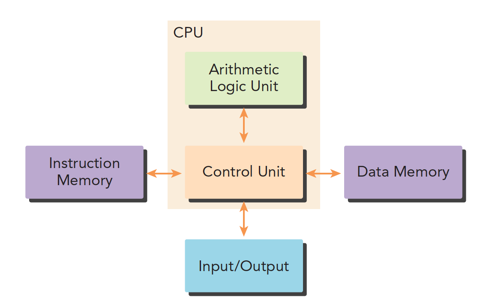
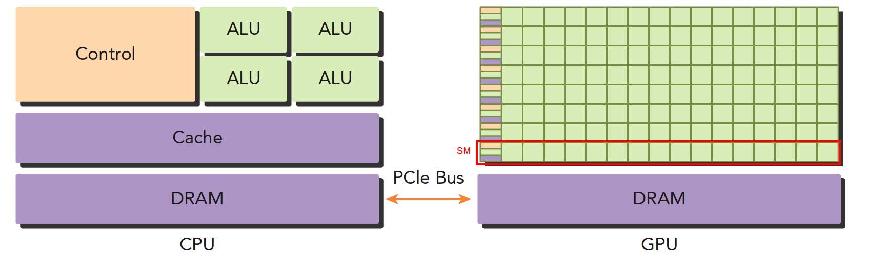
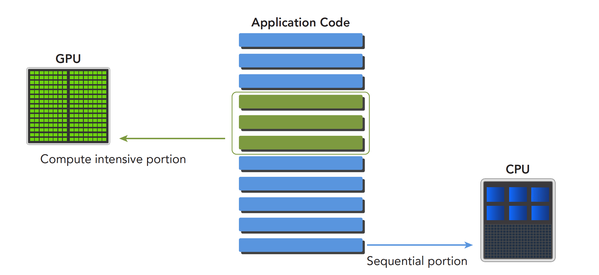
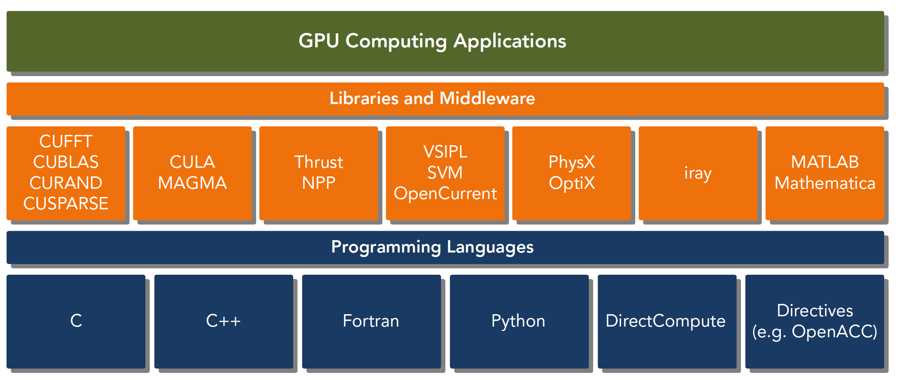
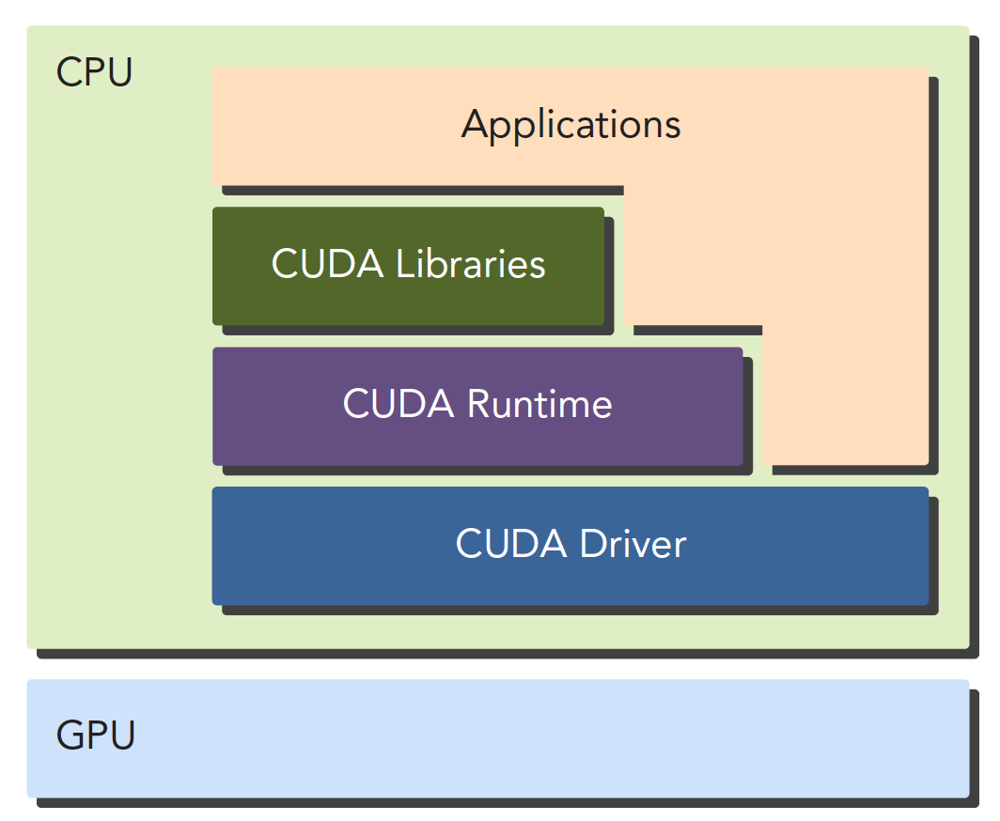

# 第 1 章 CUDA 与异构计算入门

> [返回目录](../README.md) | [下一章：编程模型 →](../02_programming_model/README.md)

如果你是第一次接触 GPU 编程，欢迎——这一章就是为你写的。读完本章，你将建立并行计算的基本观念，理解 GPU 与 CPU 到底差在哪、它们如何协同工作（异构计算）、CUDA 是什么，并亲手搭好环境、跑通第一个 CUDA 程序。

本章不要求任何 GPU 基础，只假设你会一点 C/C++。全章按"**为什么（Why）→ 是什么（What）→ 怎么做（How）**"三步展开，每一节都会先讲清"为什么需要它"，再讲"它是什么"：

```text
┌─ 为什么 ─────────────────────────────────────────────────┐
│  为什么需要并行？ → 为什么是 GPU？                          │
│       1.1               1.2                              │
└──────────────────────────┬───────────────────────────────┘
┌─ 是什么 ──────────────────▼───────────────────────────────┐
│  CPU 和 GPU 如何协同（异构计算）？ → CUDA 是什么？           │
│       1.3                            1.4                 │
│  CUDA 靠什么"一份代码、任意规模 GPU 都能跑"？（编程模型）      │
│       1.5                → 术语速查表 1.6                  │
└──────────────────────────┬───────────────────────────────┘
┌─ 怎么做 ──────────────────▼───────────────────────────────┐
│  装环境 → 会编译 → Hello World → 典型流程 → 向量加法         │
│   1.7      1.8      1.9          1.10        1.11        │
└──────────────────────────────────────────────────────────┘
```

## 本章目录

- [1.1 并行计算：一切的起点](#11-并行计算一切的起点)
- [1.2 GPU：为吞吐而生的处理器](#12-gpu为吞吐而生的处理器)
- [1.3 异构计算：CPU 与 GPU 的协同](#13-异构计算cpu-与-gpu-的协同)
- [1.4 CUDA：GPU 计算的平台与编程模型](#14-cudagpu-计算的平台与编程模型)
- [1.5 CUDA 编程模型概览：三大抽象与自动可扩展](#15-cuda-编程模型概览三大抽象与自动可扩展)
- [1.6 核心术语速查表](#16-核心术语速查表)
- [1.7 环境搭建与验证](#17-环境搭建与验证)
- [1.8 nvcc 编译流程：PTX、cubin 与 fatbin](#18-nvcc-编译流程ptxcubin-与-fatbin)
- [1.9 第一个 CUDA 程序：Hello World](#19-第一个-cuda-程序hello-world)
- [1.10 CUDA 程序的典型流程](#110-cuda-程序的典型流程)
- [1.11 完整示例：向量加法](#111-完整示例向量加法)
- [1.12 本章小结](#112-本章小结)
- [1.13 动手练习](#113-动手练习)

---

## 1.1 并行计算：一切的起点

为什么学 CUDA 要先谈并行计算？因为 **GPU 编程的本质就是并行编程**——CUDA 只是工具，"如何把一个问题拆给成千上万个线程同时做"才是内功。这一节我们把地基打好：先看计算机是怎么执行程序的，再看为什么"串行执行"在今天不够用了，最后看"并行"到底并行的是什么、数据该怎么分给线程。

### 1.1.1 计算机的基本结构：程序 = 指令 + 数据

先从计算机的基本结构说起。

传统的计算机结构一般是哈佛体系结构（后来演变出冯·诺依曼结构），主要分成三部分：

- 内存（指令内存、数据内存）；
- 中央处理单元（控制单元和算术逻辑单元）；
- 输入、输出接口。



在这种结构下，程序的本质就是**指令和数据的组合**：处理器不断地取指令、取数据、执行、写回。最朴素的执行方式是**串行**——一条指令接一条指令地执行。

举个最小的例子：计算 `c = a + b`，处理器要做的事大致是"取出加法指令 → 从内存读入 `a` 和 `b` → 执行加法 → 把结果写回 `c`"。一个程序就是几百万、几亿条这样的操作排成一队，处理器一条一条地消化。想让程序更快，无非两条路：**让每条指令执行得更快**（提高频率），或者**同时执行多条指令/处理多份数据**（并行）。在很长一段时间里，大家走的都是第一条路——直到它走不通了。

### 1.1.2 功耗墙：免费午餐的终结

从上世纪 80 年代到 2005 年前后，让程序变快最简单的办法是"等下一代 CPU"——主频每年都在涨，什么都不用改，老程序自动变快，软件工程师吃了二十年的"免费午餐"。

但 2005 年前后，处理器主频撞上了**功耗墙（Power Wall）**：芯片功耗大致与频率的三次方成正比，频率再往上提，发热和耗电会以无法接受的速度飙升——这就是为什么今天的 CPU 主频依然徘徊在 3~5 GHz，和二十年前相差无几。2005 年，微软工程师 Herb Sutter 写下了那篇著名的文章《The Free Lunch Is Over（免费午餐结束了）》，宣告了这个时代的终结。

芯片厂商转向了另一条路：**单核做不快，就多放几个核**。你手里的笔记本是多核的，手机芯片也是多核的。从此软件性能的提升不再免费——程序必须显式地写成并行的，才能吃到硬件的红利。这就是我们要学习并行编程的根本原因。

而 GPU，正是把"多放几个核"这条路走到极致的产物：一块 NVIDIA A100 上有 **6912 个** FP32 计算核心，消费级的 RTX 4090 更是有 **16384 个**。怎么喂饱这么多核心？这就是接下来要回答的问题。

### 1.1.3 并行性的两种形式：任务并行与数据并行

写并行程序的核心工作是**分解任务**——但"分解"有两种截然不同的思路。用做饭打个比方：

- 你负责炒菜、家人负责煮饭、孩子负责摆碗筷——**不同的人干不同的活**，这是**任务并行**；
- 过年包饺子，十个人围着桌子，**每个人干同样的活（包饺子），只是各包各的**——这是**数据并行**。

对应到计算机上（回想 1.1.1 节：程序 = 指令 + 数据）：

- **任务并行（指令并行）**：同时执行多条不同的指令/多个不同的任务，如 CPU 的超标量、流水线，或多线程各干各的活；
- **数据并行**：**同一操作**同时施加到**大量数据**上，如对一亿个数字同时加一。

**CUDA 非常适合数据并行**——GPU 上数千个核心执行相同的代码、处理不同的数据，正是"十个人一起包饺子"的硬件形态，只不过人数是几千上万。深度学习里的矩阵乘法、图像处理里的逐像素操作，本质上都是数据并行问题，这也是 GPU 能统治这些领域的根本原因。

### 1.1.4 数据并行的第一步：数据划分

确定了走数据并行这条路，第一个要回答的问题就是：**这么多数据，怎么分给这么多线程？** 好比 15 道习题要分给 5 个学生做，可以每人连续做 3 道，也可以按学号轮流认领。对应到程序设计上，常见两种划分方式：

- **块划分（block partitioning）**：把一整块数据切成小块，每个小块分给一个线程处理，每个块的执行顺序不定（相当于"每人连续做 3 道"）：

  | thread | 1 | 2 | 3 | 4 | 5 |
  |--------|---|---|---|---|---|
  | block  | 1 2 3 | 4 5 6 | 7 8 9 | 10 11 12 | 13 14 15 |

- **周期划分（cyclic partitioning）**：线程按照顺序处理相邻的数据块，每个线程处理多个数据块。比如有五个线程：线程 1 执行块 1，线程 2 执行块 2……线程 5 执行块 5，然后线程 1 继续执行块 6（相当于"按学号轮流认领"）：

  | thread | 1 | 2 | 3 | 4 | 5 | 1 | 2 | 3 | 4 | 5 | 1 | 2 | 3 | 4 | 5 |
  |--------|---|---|---|---|---|---|---|---|---|---|---|---|---|---|---|
  | block  | 1 | 2 | 3 | 4 | 5 | 6 | 7 | 8 | 9 | 10 | 11 | 12 | 13 | 14 | 15 |

两种方式看起来只是分法不同，但**会严重影响程序性能**——因为不同的划分决定了每个线程访问内存的位置和顺序，而内存访问模式恰恰是 GPU 性能的命门（第 5 章的主题）。针对不同的问题和不同的计算机结构，要通过理论和实验共同决定最优的数据划分。

> [!NOTE]
> 现在不必纠结哪种更好，先混个脸熟即可。这两种划分方式会在第 2 章以具体代码的形式重逢：向量加法"一个线程算一个元素"就是最细粒度的块划分；[grid-stride loop](../02_programming_model/README.md#25-grid-stride-loop让固定线程数处理任意规模数据) 则是典型的周期划分。

**小结与承上启下**：性能的出路在并行，而数据并行需要海量核心的硬件来施展。那么，为什么这个硬件是 GPU，而不是继续堆 CPU 的核心数？这就要看 GPU 和 CPU 在设计哲学上的根本分歧了。

## 1.2 GPU：为吞吐而生的处理器

### 1.2.1 GPU 简史：从图形加速到通用计算

GPU（Graphics Processing Unit，图形处理单元）诞生之初和"科学计算"毫无关系——它是 3D 游戏的专用处理器，一块固定功能的硬件，用于加速实时 3D 渲染中的并行操作。想想看：一个 1080p 的画面有 200 多万个像素，每个像素的颜色计算彼此独立、公式相同——这不就是天然的数据并行吗？GPU 从出生起就是为数据并行设计的。

随着一代代演进，GPU 变得越来越可编程：

- **2003 年前后**：图形管线的部分阶段变得完全可编程，可以针对 3D 场景/图像的每个元素并行运行自定义代码。一些研究者敏锐地意识到"像素计算"可以偷梁换柱：把科学数据伪装成纹理贴图、把计算公式伪装成着色器，"借用"图形 API 做通用计算（GPGPU）——能跑，但既别扭又受限，你得先精通 OpenGL 才能算个矩阵乘法；
- **2006 年**：NVIDIA 推出 **CUDA（Compute Unified Device Architecture）**，让任何计算任务都可以直接使用 GPU 的吞吐能力，**不再依赖图形 API**——从此用类似 C 的语言就能直接编程 GPU。

从那时起，CUDA 与 GPU 计算被用于加速几乎所有类型的计算任务：从流体力学、能量输运等科学模拟，到数据库与分析等商业应用；GPU 的算力与可编程性更是催生了从图像分类到生成式 AI（扩散模型、大语言模型）的一系列新算法与新技术。可以说，没有 GPU 计算，就没有今天的深度学习浪潮。

### 1.2.2 CPU 与 GPU 的设计哲学

按官方文档的概括：**在相近的价格和功耗范围内，GPU 能提供比 CPU 高得多的指令吞吐量和内存带宽**。感受一下量级差距：

| 指标（2024 年前后的典型产品） | 桌面旗舰 CPU（如 i9） | 消费旗舰 GPU（RTX 4090） | 数据中心 GPU（A100） |
|------|------|------|------|
| 计算核心数 | 24 个 | 16384 个 | 6912 个 |
| 内存带宽 | 约 90 GB/s | 约 1000 GB/s | 约 2000 GB/s |

（说明：CPU 核心与 CUDA Core 的"核"不是同一口径——前者是功能完整的独立核心，后者只是执行单元，不能直接对等换算；这张表只为感受量级差距。）

这不是魔法，而是**设计目标不同带来的取舍**。打个比方：CPU 是一辆跑车，GPU 是一辆大巴——跑车送一个人风驰电掣（**延迟低**），大巴一趟能拉 50 个人（**吞吐大**）；要把一千个人从 A 送到 B，大巴车队完胜跑车。官方文档这样描述两者的设计目标：

- **CPU** 的设计目标是把**一串操作（一个线程）执行得尽可能快**，且只能并行执行几十个这样的线程；
- **GPU** 的设计目标是**并行执行数千个线程**，用摊薄单线程性能来换取更大的总吞吐量。

这个目标差异体现在设计的方方面面：

| 维度 | CPU | GPU |
|------|-----|-----|
| 设计目标 | **低延迟**：单个任务尽快完成 | **高吞吐**：单位时间完成尽可能多的任务 |
| 核心数量 | 少（几个~几十个），每个核心很强 | 极多（数千个 CUDA Core），每个核心较弱 |
| 晶体管分配 | 大量晶体管给缓存、分支预测、乱序执行等控制逻辑 | 大量晶体管给数据处理单元（ALU/FPU） |
| 缓存 | 大（每核心 MB 级） | 小（每 SM 数十~百 KB 级） |
| 线程切换 | 开销大（需保存/恢复上下文） | **零开销**（海量线程状态常驻寄存器文件） |
| 隐藏延迟的方式 | 靠大缓存和预测执行 | 靠海量线程的快速切换 |
| 擅长 | 复杂逻辑控制、串行任务、低延迟响应 | 大规模、同质化的数据并行计算 |

另一个形象的类比：**CPU 像几位教授，能解决各种复杂问题；GPU 像几千名小学生，虽然每个人只会算简单算术，但一起算一万道加法题远比教授快**。

表中"线程切换"和"隐藏延迟"两行值得多说一句，因为这是新人最容易忽略、却最能体现 GPU 精髓的地方：访问显存需要几百个时钟周期，这段时间计算单元难道干等吗？CPU 的答案是"用大缓存尽量避免等"；GPU 的答案是"等就等，我换一批线程先算着"——某组线程在等数据时，调度器零开销地切换到另一组就绪的线程继续计算。**只要线程足够多，计算单元就永远有活干**。这就是 GPU 敢把缓存做小、把省下的晶体管全部投给计算单元的底气（第 4 章会深入这个机制）。

### 1.2.3 从芯片架构看差异

上面讲的设计哲学，直接画在了芯片的"平面图"上：



上面这张图能大致反映 CPU 和 GPU 的架构差异：

- **左图（CPU）**：一个四核 CPU 一般有四个 ALU。ALU 是完成逻辑计算的核心，也是我们平时说"四核八核"的核；控制单元、缓存也在片上；DRAM 是内存，一般不在片上，CPU 通过总线访问内存。
- **右图（GPU）**：绿色小方块是 ALU。注意红色框内的部分 **SM（流多处理器）**——这一组 ALU 共用一个 Control 单元和 Cache，这个部分相当于一个完整的多核 CPU。不同的是 ALU 多了、Control 部分变小了：**计算能力提升了，控制能力减弱了**。所以对于控制（逻辑）复杂的程序，一个 GPU 的 SM 没办法和 CPU 比较；但对于逻辑简单、数据量大的任务，GPU 更高效。并且注意，一个 GPU 有很多个 SM，而且越来越多。

这张图背后的官方结论值得背下来：**GPU 把更多晶体管用于数据处理，而 CPU 把更多晶体管用于数据缓存和流程控制**。GPU 通过"计算隐藏访存延迟"（海量线程轮转，见第 4 章）而不是靠大缓存来保持流水线繁忙，因此省下来的晶体管都可以投入计算单元。

### 1.2.4 什么样的任务适合 GPU

看到这里你可能会问：**是不是把程序扔上 GPU 就一定变快？** 并不是——GPU 是"偏科生"，用对了地方是神器，用错了地方比 CPU 还慢。判断一个任务适不适合放到 GPU 上，看两个指标：

1. **数据规模够大**：要有成千上万个可以独立处理的数据元素，才能喂饱数千个核心。别忘了 GPU 靠"海量线程轮转"隐藏延迟——如果只有几百个线程，大部分计算单元只能围观，还不如 CPU 直接算；
2. **控制逻辑简单、计算同质化**：每个元素执行相同或相似的操作，分支少。回想 1.2.3 节：SM 的控制单元是一组核心共用的，复杂分支会让"小学生们"步调不一，效率大打折扣。

对照这两个指标看几个例子：

| 任务 | 适合 GPU？ | 原因 |
|------|-----------|------|
| 两个千万级向量相加 | ✅ | 千万个独立元素、每个元素做同一个加法 |
| 深度学习训练/推理 | ✅ | 本质是海量矩阵运算，数据大、操作同质 |
| 图像/视频处理 | ✅ | 逐像素操作，天然数据并行 |
| 解析一个复杂的配置文件 | ❌ | 数据量小、逻辑分支多、前后依赖强 |
| 遍历一棵充满分支判断的决策树 | ❌ | 控制流复杂，线程步调无法一致 |

**小结与承上启下**：GPU 是数据并行的利器，但它是"偏科生"——不适合的活还得 CPU 干。所以真实的系统从来不是"GPU 取代 CPU"，而是两者搭档，这就是下一节的主题：异构计算。

## 1.3 异构计算：CPU 与 GPU 的协同

### 1.3.1 异构系统的硬件组成

单独的 GPU 并不能构成完整的计算机——它没有操作系统，不能运行你的浏览器，也不擅长逻辑控制。实际系统采用**异构（Heterogeneous）架构**：系统中同时包含 CPU 和 GPU，各司其职。打个比方：**CPU 是公司的总经理**，负责接单、决策、安排生产；**GPU 是有几千名工人的车间**，负责真正的大批量干活。

"异构"这个词听起来吓人，其实你的游戏本就是一台异构计算机。CUDA 编程模型正是以这样的系统为前提设计的，并引入了两个贯穿全书的称呼：

- **主机（Host）**：指 CPU 及与其直连的内存（**主机内存**，即通常说的"内存条"）；
- **设备（Device）**：指 GPU 及与其直连的显存（**设备内存**，现代高端 GPU 多为 HBM 高带宽显存）。

以后凡是看到 host/device 字样（比如 API 参数里的 `cudaMemcpyHostToDevice`），指的就是这两边。CPU 和 GPU 之间通过 **PCIe 或 NVLink** 等互连总线连接，用于传递指令和数据。注意一个关键数字：PCIe 4.0 x16 的带宽约 32 GB/s，而 1.2.2 节刚提过显存带宽是 1000~2000 GB/s——**中间这条"公路"比两端的"城市道路"窄了 1~2 个数量级**，这是后面章节要反复讨论的性能瓶颈之一。

> [!NOTE]
> 异构系统的形态很多样：在一些片上系统（SoC，如 NVIDIA Jetson）中，CPU 和 GPU 封装在同一芯片上、共享物理内存；在大型服务器中，则可能有多个 CPU 和多个 GPU（每个 GPU 都有自己独立的显存）。本书默认讨论最常见的"独立显卡 + PCIe"形态。

### 1.3.2 异构程序的运行方式：主机代码与设备代码

硬件分了两边，代码自然也分成两部分：

- **主机代码（Host Code）**：在 CPU 上运行，负责逻辑控制、任务调度；
- **设备代码（Device Code）**：在 GPU 上运行，负责大规模并行计算。

其中在 GPU 上执行的函数有个历史沿袭下来的名字——**内核（Kernel）**（和操作系统内核没有关系，只是重名）；启动内核运行的动作称为**启动（Launch）内核**。**一次内核启动可以理解为：在 GPU 上同时启动成千上万个线程，并行地执行同一份内核代码**——还记得"十个人一起包饺子"吗？内核就是"包饺子的动作说明书"，launch 就是一声令下让所有人开工。

官方文档对异构程序的运行方式有一段精确的描述，值得完整理解：

1. **应用总是从 CPU 上开始执行**——GPU 是协处理器，不能独立启动程序，你的 `main` 函数永远跑在 CPU 上；
2. 主机代码通过 CUDA API 完成三类核心操作：**在主机内存与设备内存之间拷贝数据**、**启动内核**、**等待拷贝或内核完成**；
3. **CPU 和 GPU 可以同时执行各自的代码**——最佳性能通常来自让两者都保持忙碌，而不是 CPU 干等 GPU（第 6 章"流与并发"会专门讲如何做到）。

串起来看，一个异构程序的一生就是：CPU 上开始 → 准备数据 → 把数据发给 GPU → 命令 GPU 开工（launch kernel）→ 取回结果 → CPU 上结束。所以一个程序可以按串行部分和并行部分进行如下分解——串行部分（以及不值得搬上 GPU 的少量并行部分）留在 CPU，计算密集的并行部分交给 GPU：



### 1.3.3 加速的上限：Amdahl 定律

看着上面这张图，一个自然的问题是：把并行部分搬上 GPU，整个程序能快多少倍？直觉可能是"GPU 快 100 倍，程序就快 100 倍"——错了，而且错得很典型。**Amdahl 定律**给出了真正的答案：设程序中可并行部分的耗时占比为 $p$，并行部分获得 $s$ 倍加速，则整体加速比为

$$\text{Speedup} = \frac{1}{(1-p) + \dfrac{p}{s}}$$

道理很朴素：**并行部分再快，串行部分一秒都不会少**。即使 GPU 把并行部分加速到近乎免费（$s \to \infty$），整体加速也不会超过 $\frac{1}{1-p}$。感受一下这个上限有多"残酷"：

| 可并行占比 $p$ | 50% | 80% | 95% | 99% |
|---------------|-----|-----|-----|-----|
| 理论加速上限（$s \to \infty$） | 2 倍 | 5 倍 | 20 倍 | 100 倍 |

程序哪怕有 80% 都能并行，无论买多强的 GPU，最多也只能加速 5 倍——瓶颈在剩下那 20% 的串行部分。

> [!IMPORTANT]
> 两个实践推论：① 优化前先分析**热点**（并行部分占比越大越值得搬上 GPU）；② 上了 GPU 之后，"剩下的串行部分 + CPU/GPU 之间的数据传输"往往成为新的瓶颈——结合 1.3.1 节那条"窄公路"，这解释了后续章节"能不传就不传、数据尽量留在 GPU 上"的黄金法则。

**小结与承上启下**：至此，"为什么"的部分讲完了——性能靠并行，数据并行靠 GPU，GPU 要和 CPU 搭档干活。接下来的问题是：具体用什么工具来指挥这套异构系统？答案就是 CUDA。

## 1.4 CUDA：GPU 计算的平台与编程模型

### 1.4.1 CUDA 是什么

CUDA（Compute Unified Device Architecture）是 NVIDIA 推出的**并行计算平台和编程模型**。它允许开发者使用 C/C++（以及 Fortran、Python 等语言绑定）编写在 GPU 上运行的程序，充分利用 GPU 上数以千计的计算核心进行大规模并行计算，被广泛用于深度学习、科学计算和高性能计算（HPC）等领域。

注意官方定义里的两个关键词，它们分别对应 CUDA 的两面：

- **平台（Platform）**：硬件 + 驱动 + 编译器 + 运行时 + 库的完整软件栈——好比"安卓生态"，涵盖从底层系统到应用商店的一切（见 1.4.2）；
- **编程模型（Programming Model）**：一套描述"如何组织海量线程去解决问题"的抽象与规则——好比"安卓应用的开发规范"，告诉你程序应该怎么写（见 1.5）。

**CUDA 不单单指软件或者硬件，而是建立在 NVIDIA GPU 上的一整套平台，并扩展出多语言支持。** 对新人来说，一个直观的理解就够了：**可以把 CUDA 当成是一种实现并行执行的工具手段**——你用接近 C++ 的语法描述"每个线程做什么"，CUDA 负责把它铺开到成千上万个线程上并行执行。

### 1.4.2 CUDA 平台的分层结构

从底层到上层，CUDA 生态由这几层组成：



自底向上依次是：

- **GPU 硬件**：物理算力的来源；
- **NVIDIA 驱动（NVIDIA Driver）**：官方文档形容它是"**GPU 的操作系统**"——一切使用 GPU 的方式（CUDA、Vulkan、Direct3D、显示输出）都建立在驱动之上；
- **CUDA Toolkit**：一套用于编写、构建、分析 GPU 软件的库、头文件和工具（`nvcc` 编译器、调试器、profiler 等），它与驱动是**两个独立安装的软件产品**；
- **CUDA 运行时与各类库**：`cudart` 运行时提供内存分配、数据拷贝、内核启动等常用功能；其上还有 cuBLAS、cuDNN 等高度优化的领域库；
- **应用程序**：你的代码，或 PyTorch/TensorFlow 这类框架。

对照这张图理解你熟悉的场景：当你在 PyTorch 里写下 `tensor.cuda()` 时，调用链是"PyTorch → cuDNN/cuBLAS 等库 → CUDA 运行时 → 驱动 → GPU 硬件"——我们这本指南要学的，正是中间"运行时"这一层的直接编程。

> [!NOTE]
> 两点官方补充：① 驱动有自己独立的版本号（形如 r580），与 CUDA Toolkit 版本是两套体系（见 1.7 节的验证方法）；② CUDA 运行时（`cudart`）是 Toolkit 提供的库中特殊的一个——它除了 API 之外还配套了 `<<<...>>>` 等语言扩展。

### 1.4.3 使用 GPU 算力的多种途径

看到"要学一门新的编程方式"，你可能有点打退堂鼓。这里有个好消息：**写 CUDA C++ 内核并不是使用 GPU 的唯一方式**。官方文档总结了一个"由省事到灵活"的光谱：

| 途径 | 例子 | 特点 |
|------|------|------|
| **GPU 加速库** | cuBLAS（线性代数）、cuFFT（傅里叶变换）、cuDNN（深度学习原语）、CUTLASS、Thrust、CUB | 现成算法的最优实现，**能用库就优先用库**——通常比自己从头实现更快、更省事，且针对每代架构持续优化，兼顾生产力、性能与可移植性 |
| **框架** | PyTorch、TensorFlow、JAX | AI 领域的主流方式，底层正是调用上述加速库 |
| **领域特定语言（DSL）** | OpenAI Triton、NVIDIA Warp | 用 Python 风格代码编译到 CUDA 平台，比 C++ 更高层 |
| **CUDA C++ / Python** | 本指南的主角 | 灵活性和控制力最强，理解它也是用好上面三层的基础 |

那为什么还要学最底下这层？两个理由：其一，当库和框架覆盖不到你的需求（新算子、极致性能）时，CUDA C++ 是唯一的出路；其二也是更重要的——即使你日常主要使用框架或库，**理解 CUDA 编程模型和 GPU 的执行方式，也能让你明白抽象层之下发生了什么**：为什么这个操作慢、为什么那样改就快了。这正是本指南的价值（官方文档也是这样定位它的第一部分的）。

> [!TIP]
> 更多官方学习资源（示例、教程、笔记本）可见 [NVIDIA Accelerated Computing Hub](https://github.com/NVIDIA/accelerated-computing-hub)。

### 1.4.4 两层 API：Runtime API 与 Driver API

写 CUDA 程序时你会和一堆 API 打交道。对于 API 也有两个不同的层次，一种相对高层，一种相对底层：

- **CUDA 运行时 API（CUDA Runtime API）**：高层封装，简单易用（`cudaMalloc` 等 `cuda*` 开头函数），参考 [CUDA Runtime API 文档](https://docs.nvidia.com/cuda/cuda-runtime-api/index.html)；
- **CUDA 驱动 API（CUDA Driver API）**：由驱动直接暴露的底层接口（`cuMemAlloc` 等 `cu*` 开头函数），控制更细，参考 [CUDA Driver API 文档](https://docs.nvidia.com/cuda/cuda-driver-api/index.html)。



一个好记的规律：看函数前缀就能分辨——`cuda` 开头的是 Runtime API，`cu` 开头的是 Driver API。

> [!NOTE]
> Runtime API 实现在 Driver API 之上，同样的功能用 Driver API 都能实现（个别高级特性只有 Driver API 提供）。两者可以混用，**新人从 Runtime API 学起即可**，本指南也以 Runtime API 为主。

### 1.4.5 计算能力（Compute Capability）与 GPU 架构

买显卡或看论文时，你一定听过 Ampere、Hopper 这些架构代号。在 CUDA 的世界里，它们对应一个更精确的概念：每一代 NVIDIA GPU 都有一个 **计算能力（Compute Capability，CC）** 版本号，格式为 `X.Y`（主版本.次版本），标识该 GPU 支持哪些特性以及若干硬件参数（每 SM 寄存器数、共享内存大小、支持的指令等）。

> [!WARNING]
> 别被名字骗了：计算能力是**特性版本号**，不代表性能高低——CC 8.6 的 RTX 3090 并不比 CC 8.0 的 A100 更强。

计算能力与 **SM 版本号**直接对应——如 CC 8.0 的 GPU，其 SM 版本为 `sm_80`，编译时就用这个代号指定目标架构（见 1.8 节），也用它来标记生成的二进制。常见架构对应关系：

| 架构 | 计算能力 | 代表 GPU |
|------|---------|---------|
| Maxwell | 5.x | GTX 900 系列 |
| Pascal | 6.x | GTX 10 系列、P100 |
| Volta | 7.0 | V100 |
| Turing | 7.5 | RTX 20 系列、T4 |
| Ampere | 8.0 / 8.6 | A100 / RTX 30 系列 |
| Ada Lovelace | 8.9 | RTX 40 系列、L40 |
| Hopper | 9.0 | H100 / H200 |
| Blackwell | 10.0 / 12.0 | B200 / RTX 50 系列 |

> [!NOTE]
> 想知道自己 GPU 的计算能力？三个办法：① 查官方 [CUDA GPU Compute Capability](https://developer.nvidia.com/cuda-gpus) 对照表；② 对照上表从显卡型号推断；③ 在代码里调用 `cudaGetDeviceProperties` 查询（第 3 章的 `device_query.cu` 示例会演示）。

**小结与承上启下**：现在你知道了 CUDA 平台的全貌。但 1.4.1 节说 CUDA 还有另一面——"编程模型"。这一面回答的是整个 CUDA 设计中最精妙的问题，也是官方文档第一部分最核心的思想。

## 1.5 CUDA 编程模型概览：三大抽象与自动可扩展

先抛出一个核心问题：GPU 的型号五花八门——入门卡只有几个 SM，旗舰卡有一百多个 SM，**为什么同一份 CUDA 程序不用修改就能在所有这些 GPU 上正确运行、并自动利用更多的硬件？** 想象一下，如果每换一块显卡都要重写程序，CUDA 生态根本不可能繁荣。要理解这个"魔法"，先要认识编程模型眼中的 GPU 硬件长什么样。

### 1.5.1 先认识硬件：SM——GPU 的基本计算单元

1.2.3 节的架构图里已经见过 SM（流多处理器）了，这里把它正式请到台前。CUDA 编程模型建立在一个概念化的硬件模型之上：**GPU 是一组 SM 的集合**——把 SM 想象成一个独立的"生产车间"，整个 GPU 就是由几十上百个相同车间组成的工厂。每个 SM（车间）内部包含：

- **寄存器文件（Register File）**：存放线程的局部变量，由编译器分配，访问速度最快——相当于每个工人手边的工具台；
- **统一数据缓存（Unified Data Cache）**：为 **共享内存（Shared Memory）** 和 **L1 缓存** 提供物理资源，两者的容量比例可在运行时配置——相当于车间内部的公共物料架；
- **若干功能单元（Functional Units）**：执行实际计算的 ALU/FPU/Tensor Core 等——真正干活的工人。

若干个 SM 进一步组成 **GPC（Graphics Processing Cluster）**；所有 SM 共享一个更大的 **L2 缓存**，再往外就是 GPU 显存（全局内存）。感受一下真实的规模：A100 有 108 个 SM，每个 SM 有 64 个 FP32 单元——64 × 108 = 6912 个核心就是这么来的。

不同架构的 GPU，其 SM 数量、每 SM 的内存大小和功能单元数量各不相同——但正如官方文档强调的：**实际硬件布局的差异不影响按 CUDA 编程模型编写的软件的正确性**。这正是编程模型作为抽象层的意义：你面向"模型"编程，而不是面向某块具体的显卡。

### 1.5.2 三个核心抽象

面对几千个核心，如果让程序员直接管理"哪个核心执行什么"，那将是一场灾难。CUDA 编程模型的答案是只向程序员暴露**三个最小化的核心抽象**（以少量语言扩展的形式呈现）：

1. **线程组的层次结构**（hierarchy of thread groups）：线程组织成"块"（Thread Block），块组织成"网格"（Grid）（第 2 章）；
2. **共享内存**（shared memories）：块内线程可通过片上共享内存协作（第 5 章）；
3. **栅栏同步**（barrier synchronization）：块内线程可用 `__syncthreads()` 同步（第 3 章）。

只有三样东西：**怎么组织线程、线程之间怎么共享数据、线程之间怎么对齐进度**。学 CUDA 学到最后你会发现，翻来覆去就是在玩这三个抽象。

关于第一个抽象（线程层次），先记住官方描述中的几个要点，第 2 章会展开细讲：

- 一次内核启动会创建大量线程（常常是百万级），线程组成**块**、块组成**网格**；块和网格都可以是 **1、2 或 3 维**的，方便把线程直接映射到向量/矩阵/体数据上；
- 启动内核时通过**执行配置**（`<<<grid, block>>>`）指定网格和块的维度；
- 每个线程通过**内建变量**（`threadIdx`、`blockIdx` 等）知道自己在块内、块在网格内的位置，从而获得**全局唯一的身份**——这个身份决定了它负责哪份数据；
- **一个块的所有线程保证在同一个 SM 上执行**，因此可以用共享内存高效交换数据、用栅栏高效同步；而块与块之间没有这种保证。

### 1.5.3 两级问题分解

这三个抽象不是随便设计的——它们引导程序员把问题做**两级切分**：

- 先把大问题切成若干**可以独立求解**的粗粒度子问题——由**线程块**并行处理；
- 再把每个子问题切成更细的片段——由块内线程**协作**求解（共享内存 + 同步）。

用一个具体例子体会：给一张 4K 图片做模糊滤镜。第一级，把图片切成许多 16×16 的小方格，格子之间互不依赖，每个格子交给一个**线程块**；第二级，格子里的 256 个像素交给块内的 256 个**线程**，每人算一个像素——由于模糊需要读邻居像素，块内线程可以先协作把这一格的数据搬进共享内存，再各自计算。一粗一细，两级分解，几乎所有 CUDA 程序都是这个套路。

### 1.5.4 块间独立 ⇒ 自动可扩展性

现在可以回答本节开头的问题了。注意 1.5.3 节里一个不起眼但要求严格的词："可以**独立**求解"。CUDA 编程模型**要求块必须能以任意顺序、并行或串行地执行**——一个块不能依赖另一个块的结果，也不能与其他块的线程同步。

正是这条"块间独立"的约束，换来了整个 CUDA 最大的红利。一个网格可能包含上百万个块，而执行它的 GPU 可能只有几十~几百个 SM。既然块和块互不依赖，GPU 调度器就可以像分拣快递一样，把这些块自由地分派到任何一个空闲的 SM 上——SM 少就多排几轮，SM 多就同时多跑几个：

```text
       同一个程序（8 个线程块）
              │
   ┌──────────┴──────────┐
   ▼                     ▼
 2 个 SM 的入门 GPU     4 个 SM 的高端 GPU
 ┌────┬────┐          ┌────┬────┬────┬────┐
 │块0 │块1 │          │块0 │块1 │块2 │块3 │
 │块2 │块3 │          │块4 │块5 │块6 │块7 │
 │块4 │块5 │          └────┴────┴────┴────┘
 │块6 │块7 │           时间减半，代码零修改
 └────┴────┘
```

**只有运行时才需要知道物理 SM 数量**，程序逻辑完全无感——这就是 CUDA 的**自动可扩展性（Automatic Scalability）**。你写程序时只管"把问题切成独立的块"，至于这些块铺在 2 个 SM 还是 132 个 SM 上，是调度器的事。"块间不能有依赖"这条规矩，第 2 章写代码时还会再次强调。

> [!NOTE]
> 计算能力 9.0+ 的 GPU 引入了可选的**线程块簇（Thread Block Cluster）**层级：相邻的若干块可以组成簇，同簇的块保证同时调度在同一个 GPC 内，从而获得跨块的同步与共享内存访问能力（分布式共享内存）。这是高级特性，入门阶段知道有这一层即可。

### 1.5.5 更进一步：warp、SIMT 与内存层次（预览）

编程模型的骨架已经立起来了。还有两块拼图分别是第 4 章和第 5 章的主角，这里先给出最简版本，帮你建立完整的图景——第一遍读不必深究，有个印象即可。

**warp 与 SIMT（第 4 章详解）**。你在代码里指挥的是"块"和"线程"，但硬件执行时还有一个隐藏的中间层：块内的线程以 32 个为一组组成**线程束（warp）**执行，采用**单指令多线程（SIMT）**模式——warp 内所有线程同一时刻执行同一条指令，但每个线程可以走不同的分支。走分支的线程执行时，不走分支的线程被"掩码"掉干等。因此 warp 内线程分支不一致（**warp 分化**）会浪费算力。由此得出本章第一条实用的性能规则：**块内线程总数尽量取 32 的倍数**——否则最后一个 warp 会有闲置的车道（比如块里放 250 个线程，硬件实际会跑 8 个 warp 共 256 个车道，白白空转 6 个）。

> [!NOTE]
> SIMT 常被拿来和 SIMD（单指令多数据）比较，但两者有本质区别：SIMD 只有一条控制流、数据宽度固定；SIMT 允许每个线程有自己的控制流路径，没有固定的数据宽度。

**内存层次（第 5 章详解）**。1.5.1 节已经见过寄存器和共享内存了，这里把 CUDA 编程模型中的各类内存排个座次，从快到慢依次是：

| 内存 | 位置 | 作用域 | 一句话说明 |
|------|------|--------|-----------|
| 寄存器 | SM 片上 | 单线程 | 线程局部变量，编译器分配，最快 |
| 共享内存 | SM 片上 | 线程块（或簇） | 块内线程协作交换数据的"手工缓存" |
| L1 / L2 缓存 | SM 片上 / 全片共享 | 硬件管理 | L1 与共享内存共用物理资源；L2 由所有 SM 共享 |
| 全局内存 | 显存（DRAM/HBM） | 整个 GPU | 即设备内存，容量最大、延迟最高，所有 SM 可访问 |
| 主机内存 | 系统内存 | CPU | GPU 不能直接高效访问，需经 PCIe/NVLink 拷贝 |

两点补充：① 现代系统中 CPU 与 GPU 使用**统一的虚拟地址空间**——任意一个虚拟地址都能判断出它位于主机内存还是哪块 GPU 的显存；② CUDA 还提供**统一内存（Unified Memory）**特性，允许一次分配、CPU/GPU 都能访问，由运行时或硬件自动迁移数据（第 3 章简介）——但显式管理数据位置仍是性能最优的做法。

## 1.6 核心术语速查表

到这里，本章的概念部分就全部讲完了。前几节陆续引入了不少术语，这里汇总成一张速查表——不用背，后面读代码忘了随时回来查：

| 术语 | 英文 | 含义 |
|------|------|------|
| 主机 | Host | 指 CPU 及其所在的系统环境，负责逻辑控制、任务调度和启动 GPU 计算 |
| 主机内存 | Host Memory | 与 CPU 直连的 DRAM，即通常所说的系统内存（内存条） |
| 设备 | Device | 指 GPU，作为 CPU 的协处理器执行大规模并行计算 |
| 设备内存 | Device Memory | 与 GPU 直连的 DRAM/HBM 显存，也称全局内存（Global Memory） |
| 内核 | Kernel | 在 GPU 上执行的函数被称为*内核*，用 `__global__` 修饰 |
| 内核启动 | Launch Kernel | 主机端通过 `<<<...>>>` 语法启动内核在 GPU 上运行的过程 |
| 执行配置 | Execution Configuration | 启动内核时指定的网格/块维度（以及可选的共享内存、流等参数） |
| 线程块 / 网格 | Thread Block / Grid | 线程组织的两级层次：线程组成块，块组成网格 |
| 流多处理器 | Streaming Multiprocessor（SM） | GPU 的基本计算单元，包含若干功能单元、寄存器文件、统一数据缓存（共享内存 + L1）、调度器等；GPU 由多个 SM 复制堆叠而成 |
| 线程束 | Warp | GPU 硬件调度的基本单位，由 32 个线程组成，以 SIMT 方式执行 |
| 共享内存 | Shared Memory | SM 片上的可编程高速内存，块内线程共享，用于协作 |
| 计算能力 | Compute Capability（CC） | GPU 硬件特性的版本号（X.Y），与 SM 版本 `sm_XY` 对应 |
| 异构计算 | Heterogeneous Computing | CPU 与 GPU（或其他加速器）协同工作的计算模式 |

接下来进入"怎么做"的部分——装环境、学编译、写代码。

## 1.7 环境搭建与验证

### 1.7.1 安装

结合 1.4.2 节的平台分层，需要安装的是两个独立的软件产品，顺序也和分层一致（先底层后上层）：

1. 安装 **NVIDIA 显卡驱动**（"GPU 的操作系统"，驱动版本决定了可支持的最高 CUDA 版本）；
2. 安装 **[CUDA Toolkit](https://developer.nvidia.com/cuda-downloads)**（包含 `nvcc` 编译器、运行时库、调试与分析工具）——官网会根据你选择的操作系统、架构、发行版生成对应的安装命令，照着执行即可。

> [!TIP]
> 手头暂时没有 NVIDIA GPU？可以用 [Google Colab](https://colab.research.google.com/)（免费提供 GPU，`!nvcc --version` 可直接编译 CUDA 代码）或各类云 GPU 服务器练习，本书示例均可在这些环境运行。

### 1.7.2 验证安装

装完之后，用两条命令验证。**两条都能正常输出，环境就绪**：

```bash
# 查看驱动与 GPU 状态（右上角的 CUDA Version 是驱动支持的最高版本）
nvidia-smi

# 查看 nvcc 编译器版本（这是实际安装的 Toolkit 版本）
nvcc --version
```

两个新人高频问题，提前打好预防针：

> [!NOTE]
> **问题一：两条命令显示的 CUDA 版本不一样，装坏了吗？** 没有。`nvidia-smi` 显示的是**驱动能支持的最高运行时版本**，而 `nvcc --version` 显示的是**实际安装的 Toolkit 版本**，两者不一致是正常的（前者 ≥ 后者即可正常工作）。驱动、Toolkit 与 GPU 之间的完整兼容规则见官方 [CUDA Compatibility](https://docs.nvidia.com/deploy/cuda-compatibility/index.html) 文档。

> [!NOTE]
> **问题二：`nvidia-smi` 正常但 `nvcc: command not found`？** 通常是 Toolkit 的路径没加进环境变量。把 `/usr/local/cuda/bin` 加入 `PATH`（并把 `/usr/local/cuda/lib64` 加入 `LD_LIBRARY_PATH`）后重开终端即可。

## 1.8 nvcc 编译流程：PTX、cubin 与 fatbin

### 1.8.1 一份源码，两条编译路径

环境好了，第一件事是搞清楚 CUDA 代码是怎么变成可执行文件的。回想 1.3.2 节：一个 CUDA 程序里同时住着主机代码和设备代码——它是一份"双语文档"，普通的 gcc 看不懂 GPU 那半边。所以 CUDA 源文件用专门的后缀 `.cu`，由专门的编译器 `nvcc` 处理。`nvcc` 的核心工作就是"分家"：

```text
your_code.cu
    │
    ├── 主机代码（main、CPU 函数）──→ 交给主机编译器（gcc/clang/MSVC）编译成 CPU 指令
    │
    └── 设备代码（__global__/__device__ 函数）
              │
              ├──→ PTX（虚拟指令集，类似汇编的中间表示，可向前兼容）
              └──→ cubin / SASS（针对特定计算能力的真实机器码）
    两者最终链接成一个可执行文件（fat binary 可同时嵌入多个架构的代码）
```

主机那条路没什么新鲜的；设备这条路上出现了几个新名词，正是理解 CUDA 编译的关键。

### 1.8.2 三个官方概念：PTX、cubin、fatbin

如果你了解 Java，可以带着这个类比读下面三个概念：**PTX 之于 GPU，就像字节码之于 JVM**——一种与具体硬件无关的中间指令，需要时再翻译成真实机器码。

- **PTX（Parallel Thread Execution）**：NVIDIA GPU 的**虚拟指令集**（高级汇编语言），是真实硬件指令集之上的抽象层。DSL 和高级语言编译器（如 Triton）就是把 PTX 作为中间表示、再交给 NVIDIA 的离线或即时编译工具生成可执行的 GPU 二进制——这使得 CUDA 平台可以被 NVIDIA 官方工具之外的语言编程。PTX 也带版本号，且与计算能力对应（如 `compute_80` 对应 CC 8.0 的特性集），详见 [PTX ISA 文档](https://docs.nvidia.com/cuda/parallel-thread-execution/index.html)；
- **cubin（CUDA binary）**：把 PTX 针对某个具体 SM 版本（如 `sm_80`）编译出的**真实二进制机器码**——这才是 GPU 真正执行的东西；
- **fatbin**：可执行文件里存放 GPU 代码的容器，可以同时打包**多个架构的 cubin + 若干 PTX**（所以叫"胖"二进制）。程序运行时，运行时会为当前 GPU 从 fatbin 中挑选最合适的二进制加载。

### 1.8.3 兼容性规则与 JIT 编译

为什么要搞 PTX 和 cubin 两层？因为 GPU 架构年年更新，而软件不可能每年重发一版。两条兼容性规则决定你的程序能跑在哪些 GPU 上：

| 规则 | 内容 | 例子 |
|------|------|------|
| **二进制兼容** | cubin 只在**同一主版本、次版本不低于编译目标**的 GPU 上可用；跨主版本不兼容 | `sm_86` 的 cubin 可跑在 CC 8.6/8.9 上，**不能**跑在 8.0 或 9.0 上 |
| **PTX 前向兼容** | PTX 可被 JIT 编译到**任何不低于其版本**的未来 GPU | `compute_80` 的 PTX 可 JIT 到 `sm_120` |

也就是说：cubin 快但"挑硬件"，PTX 慢一步但"永不过时"。如果 fatbin 里没有匹配当前 GPU 的 cubin、但有 PTX，驱动会在程序加载时**即时（JIT）编译** PTX 成当前 GPU 的机器码——和 JVM 的 JIT 如出一辙。关于 JIT 还有三个官方细节值得知道：

1. **代价与收益**：JIT 会增加应用加载时间，但让老程序能直接跑在**发布时还不存在的新 GPU** 上，并自动享受新驱动内置编译器的优化；
2. **编译缓存**：驱动会把 JIT 生成的二进制缓存起来（称为 compute cache），避免每次运行重复编译；驱动升级时缓存自动失效，以便用上新编译器的改进；
3. **运行时编译**：除了 `nvcc` 离线编译，还可以用 **NVRTC** 库在程序运行期把 CUDA C++ 设备代码编译成 PTX（Triton 等 DSL 底层就依赖类似机制）。

> [!WARNING]
> 二进制兼容性只对 `nvcc` 等 NVIDIA 官方工具生成的二进制作出承诺，手工修改或自行生成的 GPU 二进制不在保证范围内。

### 1.8.4 常用编译命令

概念清楚了，实际用起来很简单。日常开发记住第一条就够，其余按需取用：

```bash
# 最简单的编译（学习阶段用这条就够了）
nvcc vec_add.cu -o vec_add

# 指定目标 GPU 架构（如 Ampere A100 是 sm_80），生成更优的机器码
nvcc -arch=sm_80 vec_add.cu -o vec_add

# 同时打包多个架构的 cubin + PTX（发布软件时常用，对应 1.8.2 的 fatbin）
nvcc -gencode arch=compute_80,code=sm_80 \
     -gencode arch=compute_90,code=sm_90 \
     -gencode arch=compute_90,code=compute_90 vec_add.cu -o vec_add

# 开启优化 + 显示每个内核的寄存器/共享内存用量（调优时非常有用）
nvcc -O3 -arch=sm_80 --ptxas-options=-v vec_add.cu -o vec_add

# 生成调试信息（配合 cuda-gdb / Nsight 调试）
nvcc -G -g vec_add.cu -o vec_add
```

## 1.9 第一个 CUDA 程序：Hello World

铺垫了这么久，终于要写代码了。先看一个最简单的例子，感受"一份代码、多线程执行"——它只有十几行，却浓缩了前面讲的所有概念：

```c++
#include <cstdio>

// __global__ 声明这是一个内核函数：在 GPU 上执行，从 CPU 调用
__global__ void helloFromGPU(void) {
    printf("Hello World from GPU thread %d!\n", threadIdx.x);
}

int main(void) {
    printf("Hello World from CPU!\n");

    helloFromGPU<<<1, 8>>>();     // 启动内核：1 个线程块 × 8 个线程
    cudaDeviceSynchronize();      // 等待 GPU 执行完（否则程序可能提前退出）
    return 0;
}
```

```bash
$ nvcc hello.cu -o hello && ./hello
Hello World from CPU!
Hello World from GPU thread 0!
Hello World from GPU thread 1!
...
Hello World from GPU thread 7!
```

逐点拆解，你会发现每个新语法都对应前面讲过的概念：

1. `__global__` 表明函数是内核（1.3.2 节），将在 GPU 上被**多个线程同时执行**。注意：内核代码只写了**一次** `printf`，但输出了 8 行——因为 8 个线程各自执行了一遍这份代码，靠内建变量 `threadIdx.x`（1.5.2 节"线程有唯一身份"的最简形态）区分彼此；
2. `<<<1, 8>>>` 是**执行配置**：1 个线程块，每块 8 个线程——这正是 1.5 节"线程组层次"抽象的语法形态，也是 CUDA 相对标准 C++ 最显眼的语言扩展；
3. `cudaDeviceSynchronize()` 让 CPU 停下来等 GPU。为什么需要它？因为内核启动是**异步**的——CPU 发出"开工"命令后立即继续往下跑（1.3.2 节"CPU 和 GPU 可以同时执行"的直接体现），不等的话 `main` 可能在 GPU 打印前就 `return` 退出了。

> [!TIP]
> 如果你运行后只看到 CPU 那一行、没有 GPU 的输出，多半是环境问题（驱动未装好或没有可用 GPU）。给内核启动加上错误检查就能看到具体原因——1.11 节的 `CHECK` 宏正是为此准备的。

## 1.10 CUDA 程序的典型流程

Hello World 里 GPU 只是打印了字符串，没有碰数据。而真实的 CUDA 程序都是围着数据转的——别忘了主机内存和设备内存是**两个独立的世界**（1.3.1 节），数据不会自己长腿跑到显存里去。对照 1.3.2 节"主机代码的三类核心操作"（拷贝数据、启动内核、等待完成），一个标准的 CUDA 程序一般遵循以下 6 个步骤：

1. **分配主机内存**，并进行数据初始化；
2. **分配设备内存**（`cudaMalloc`）；
3. **将数据从主机拷贝到设备**（`cudaMemcpy`，Host → Device）；
4. **启动内核**（`kernel<<<grid, block>>>(...)`），在 GPU 上完成并行计算；
5. **将计算结果从设备拷贝回主机**（`cudaMemcpy`，Device → Host）；
6. **释放设备与主机内存**（`cudaFree` / `free`）。

一个好记的比喻：**把原材料寄到工厂（步骤 3）→ 工厂开工（步骤 4）→ 把成品寄回来（步骤 5）**。寄快递（PCIe 传输）又慢又贵，所以后面的章节（尤其第 6 章）会想尽办法少寄、或者边生产边寄。

> [!NOTE]
> 再次强调：内核启动是**异步**的，主机端调用 `<<<...>>>` 之后会立即返回并继续执行后续代码。因此需要显式同步（如 `cudaDeviceSynchronize()`）或依赖 `cudaMemcpy` 等隐式同步操作来保证结果就绪——下面的向量加法正是靠步骤 5 的 `cudaMemcpy` 顺带完成了同步。

## 1.11 完整示例：向量加法

现在把 6 个步骤落成一个完整可跑的程序：计算两个百万级向量之和 `C = A + B`。它被称为 CUDA 的"标准 Hello World"——麻雀虽小，五脏俱全：

```c++
#include <cuda_runtime.h>
#include <stdio.h>

// 错误检查宏：CUDA API 均返回错误码，建议始终检查
#define CHECK(call)                                                       \
do {                                                                      \
    cudaError_t err = (call);                                             \
    if (err != cudaSuccess) {                                             \
        printf("CUDA Error: %s:%d, %s\n", __FILE__, __LINE__,             \
               cudaGetErrorString(err));                                  \
        exit(1);                                                          \
    }                                                                     \
} while (0)

// 内核定义：__global__ 表示该函数在 GPU 上执行，从主机端调用
__global__ void vecAdd(const float *A, const float *B, float *C, int n) {
    // 计算当前线程的全局唯一索引
    int i = blockIdx.x * blockDim.x + threadIdx.x;
    if (i < n) {              // 边界检查，防止越界访问
        C[i] = A[i] + B[i];
    }
}

int main(void) {
    int n = 1 << 20;                    // 1M 个元素
    size_t bytes = n * sizeof(float);

    // 1. 分配主机内存并初始化
    float *hA = (float *)malloc(bytes);
    float *hB = (float *)malloc(bytes);
    float *hC = (float *)malloc(bytes);
    for (int i = 0; i < n; i++) { hA[i] = 1.0f; hB[i] = 2.0f; }

    // 2. 分配设备内存
    float *dA, *dB, *dC;
    CHECK(cudaMalloc(&dA, bytes));
    CHECK(cudaMalloc(&dB, bytes));
    CHECK(cudaMalloc(&dC, bytes));

    // 3. 主机 -> 设备 数据拷贝
    CHECK(cudaMemcpy(dA, hA, bytes, cudaMemcpyHostToDevice));
    CHECK(cudaMemcpy(dB, hB, bytes, cudaMemcpyHostToDevice));

    // 4. 启动内核：每个线程块 256 线程，块数向上取整保证覆盖全部元素
    int threads = 256;
    int blocks = (n + threads - 1) / threads;
    vecAdd<<<blocks, threads>>>(dA, dB, dC, n);
    CHECK(cudaGetLastError());          // 检查内核启动错误

    // 5. 设备 -> 主机 拷贝结果（cudaMemcpy 会隐式同步）
    CHECK(cudaMemcpy(hC, dC, bytes, cudaMemcpyDeviceToHost));
    printf("C[0] = %f\n", hC[0]);       // 期望输出 3.0

    // 6. 释放资源
    CHECK(cudaFree(dA)); CHECK(cudaFree(dB)); CHECK(cudaFree(dC));
    free(hA); free(hB); free(hC);
    return 0;
}
```

编译运行：

```bash
nvcc vec_add.cu -o vec_add
./vec_add
```

### 1.11.1 代码里的几个关键细节

**内核里那行索引计算是精髓**。每个线程只知道"我是第几号块（`blockIdx.x`）里的第几号线程（`threadIdx.x`）"，把两者组合就得到全局唯一编号：`i = blockIdx.x * blockDim.x + threadIdx.x`。代入具体数字：块大小 256 时，2 号块里的 5 号线程算出 `i = 2 × 256 + 5 = 517`，于是它负责 `C[517] = A[517] + B[517]`——一百万个线程各领各的活，谁也不重、谁也不漏。

**块数为什么要"向上取整"、又为什么要边界检查？** 1M 个元素除以 256 恰好是 4096 块；但如果 `n` 不是 256 的倍数，`(n + threads - 1) / threads` 会多分出一个"不满员"的块——多出来的线程算出的 `i` 超过了 `n`，所以内核里必须有 `if (i < n)` 拦住它们，否则就是越界访问。"向上取整 + 边界检查"是 CUDA 代码的标准搭配，以后你会写无数遍。

**`CHECK` 宏看着啰嗦，但千万别省**。CUDA API 出错时不会抛异常、更不会让程序崩溃——它只是默默返回一个错误码。不检查的话，程序会带着错误一路狂奔，最后输出一堆错误的结果，让你无从查起。养成"每个 CUDA 调用都包一层检查"的习惯，是新人少走弯路的第一要诀（第 3 章会系统讲错误处理）。

**前面各节的概念在这里全部落了地**：`threads = 256` 是 32 的倍数（1.5.5 节 warp 规则）；每个块独立处理一段数据、块间无依赖（1.5.4 节可扩展性的前提，这个程序不改一行就能在任何 GPU 上跑）；数据来回拷贝的两步正是 1.3 节讨论的 PCIe 传输开销所在。

### 1.11.2 与 CPU 代码的思维转换

最后，把 CPU 版本和 CUDA 版本并排放在一起，体会这门课最重要的一次思维转换——**用"一个线程处理一个数据元素"替代"一个循环遍历所有元素"**：

```c++
// CPU 串行思维：一个线程，循环 n 次
for (int i = 0; i < n; i++)
    C[i] = A[i] + B[i];

// CUDA 并行思维：n 个线程，每个线程算一个 i
int i = blockIdx.x * blockDim.x + threadIdx.x;   // "我是谁"
if (i < n) C[i] = A[i] + B[i];                   // "我干我这份活"
```

循环消失了，取而代之的是海量线程；循环变量 `i` 变成了由线程索引计算出的"身份编号"。这正是 1.1.4 节"块划分"最细粒度的形态。完成了这次思维转换，你就推开了 CUDA 的大门——下一章将系统讲解这套线程组织与索引机制。

## 1.12 本章小结

- **并行的动因**：主频撞上功耗墙后，性能来自并行；并行分为**任务并行**与**数据并行**，CUDA 擅长后者；数据到线程的划分有**块划分**与**周期划分**两种基本方式；
- **GPU 的本质**：为吞吐而生——把晶体管投给计算而非缓存/控制，靠海量线程零开销切换隐藏延迟；适合数据量大、逻辑简单的同质化计算；
- **异构计算**：CPU（Host）负责控制、GPU（Device）负责并行计算，经 PCIe/NVLink 相连（带宽比显存低 1~2 个数量级，常见瓶颈）；程序始于 CPU，主机代码负责拷贝数据、启动内核、等待完成，CPU 与 GPU 可同时执行；加速上限由 **Amdahl 定律**决定，串行部分与数据传输是新瓶颈；
- **CUDA 平台**：GPU 硬件 → 驱动（"GPU 的操作系统"）→ Toolkit/运行时 → 库/框架/DSL → 应用；API 分 Runtime（高层，首选）与 Driver（底层）两层；计算能力 `X.Y` ↔ SM 版本 `sm_XY`；
- **编程模型**：GPU = SM 的集合（寄存器文件 + 共享内存/L1 + 功能单元）；三大抽象（线程组层次、共享内存、栅栏同步）引导两级问题分解；**块间独立** ⇒ 同一程序在任意 SM 数量的 GPU 上自动伸缩；硬件按 32 线程的 warp 以 SIMT 方式执行（块大小取 32 的倍数）；
- **编译与兼容**：`nvcc` 分离主机/设备代码；PTX（虚拟 ISA，可 JIT 前向兼容，结果有缓存）→ cubin（真实机器码，同主版本内向后兼容）→ fatbin（多架构打包）；
- **程序骨架**：六步流程（分配 → 拷入 → 启动内核 → 拷回 → 释放）；内核启动**异步**；核心思维转换是**用"一个线程处理一个元素"替代"一个循环遍历所有元素"**。

## 1.13 动手练习

> 本章示例代码位于 [`code/`](code/) 目录：`hello.cu`、`vec_add.cu`。动手改一改、跑一跑，比多读三遍都有用。

1. 编译运行 `hello.cu`，把执行配置改成 `<<<2, 4>>>`，观察输出顺序——线程/块的打印顺序是确定的吗？为什么？（提示：回想 1.5.4 节"块可以以任意顺序调度"）
2. 修改 `vec_add.cu`：把 `cudaMemcpy` 拷回结果那一行删掉，观察结果如何变化，体会"内核结果必须写回主机才能使用"；
3. 故意制造一个错误（如把 `cudaMalloc` 的大小改成 0），验证 `CHECK` 宏能否捕获并打印出错位置；
4. 把向量长度 `n` 改成非 256 倍数（如 `1000003`），验证边界检查是否正确工作；
5. 用 `nvcc -arch=sm_90 vec_add.cu -o vec_add90` 编译（假设你的 GPU 不是 Hopper），运行观察报错，再结合 1.8.3 节的二进制兼容规则解释原因；
6. （选做）把 `vec_add.cu` 中的 `threads` 改成 250（不是 32 的倍数），程序仍然正确——结合 1.5.5 节解释为什么"合法但不推荐"。

---

> [返回目录](../README.md) | [下一章：编程模型 →](../02_programming_model/README.md)
