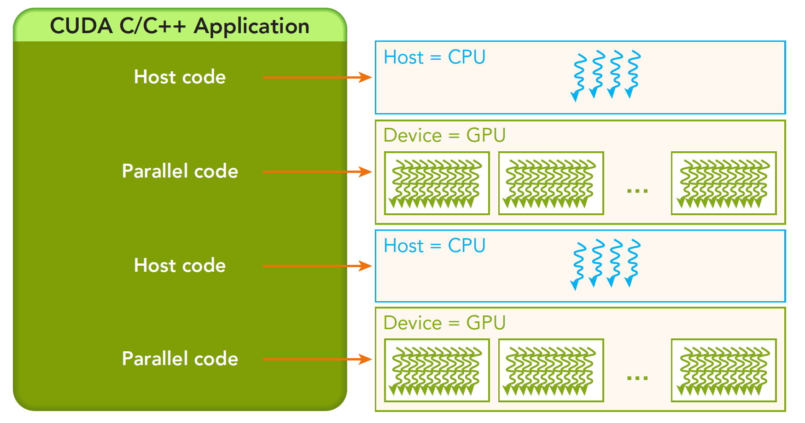

# 第 2 章 编程模型：线程组织

> [← 上一章：入门](../01_introduction/README.md) | [返回目录](../README.md) | [下一章：语法与 API →](../03_syntax_and_api/README.md)

本章目标：掌握 CUDA 的线程层次结构（Grid/Block/Thread），学会计算线程索引，并能为任意规模的数据配置执行参数。

还记得第 1 章结尾向量加法里的两处"咒语"吗——启动内核的 `vecAdd<<<blocks, threads>>>(...)`，和内核里计算身份编号的 `blockIdx.x * blockDim.x + threadIdx.x`。当时我们只求会用，本章就来把它们彻底讲透。这套机制对应第 1 章 [1.5.2 节](../01_introduction/README.md#15-cuda-编程模型概览三大抽象与自动可扩展)三大抽象中的**第一个——线程组的层次结构**，也是三者中必须最先过关的一个：不会组织线程，后面的共享内存与栅栏同步就无从谈起。

全章的行进路线如下，依然遵循"为什么 → 是什么 → 怎么做"：

```text
线程为什么要分层组织？分成了哪几层？          → 2.1
同一份代码，每个线程怎么知道"我是谁"？        → 2.2
怎么把线程身份换算成数据下标？（核心技能）      → 2.3
实战：2D 矩阵加法 / 任意规模数据             → 2.4、2.5
执行配置里的那些数字到底该怎么选？            → 2.6
```

正式开讲之前，先花两分钟把舞台看清楚——下面是第 1 章 1.3 节的快速回放，配上两张更细致的图。

一个异构环境通常有多个 CPU、多个 GPU，它们都通过 PCIe 总线相互通信，也是通过 PCIe 总线分隔开的。所以要先区分两种设备的内存：

- **主机**：CPU 及其内存（System DRAM）；
- **设备**：GPU 及其内存（GPU DRAM）。


补充一句：主机内存与设备内存是**两个独立的地址空间**，数据不会自己长腿跑过去，要靠 `cudaMemcpy` 显式搬运——这正是第 1 章 1.10 节六步流程中第 3、5 步存在的原因。本章所有示例都沿用那套六步骨架，主机端代码不再逐行重复，注意力集中在"内核如何组织线程"上。

对于一个完整的 CUDA 应用，可能的执行顺序如下图：



从 host 的串行执行到调用核函数——**核函数被调用后，控制权马上归还主机线程**。也就是说，在第一段并行代码（Kernel 1）执行时，很有可能第二段 host 代码已经开始同步执行了。这就是第 1 章说的"内核启动是异步的"在时间线上的样子。

把这条时间线记在心里：CPU 与 GPU 是两条并行的"泳道"，主机代码负责在合适的时机发令与收工；而每个 Kernel 方框的内部——成千上万个线程如何组织、如何各领各的活——就是本章接下来要展开的全部内容。

## 本章目录

- [2.1 线程层次：Grid、Block、Thread](#21-线程层次gridblockthread)
- [2.2 编程如何区分每个线程？](#22-编程如何区分每个线程)
- [2.3 全局线程索引的计算](#23-全局线程索引的计算)
- [2.4 实例：2D 矩阵加法](#24-实例2d-矩阵加法)
- [2.5 Grid-Stride Loop：让固定线程数处理任意规模数据](#25-grid-stride-loop让固定线程数处理任意规模数据)
- [2.6 Grid 和 Block 该如何设置？](#26-grid-和-block-该如何设置)
- [2.7 本章小结](#27-本章小结)
- [2.8 动手练习](#28-动手练习)

---

## 2.1 线程层次：Grid、Block、Thread

当内核函数开始执行，如何组织 GPU 的线程就成了最主要的问题。一次内核启动动辄产生几十万、上百万个线程，如果它们是一盘散沙，程序员没法指挥，硬件也没法调度。CUDA 的答案是**分层管理**——这一节先把层次结构立起来。

### 2.1.1 两级组织：线程组成块，块组成网格

为了方便管理海量线程，CUDA 将线程组织成**线程块（Block）**，再将线程块组织成**网格（Grid）**。线程块中的线程、网格中的线程块都可以是 1 维、2 维或 3 维的。这种分层的组织结构使得并行过程更加自如灵活。

"可以是 1/2/3 维"不是炫技，而是为了让线程的形状直接"贴"在数据的形状上：处理一维向量就用一维布局，处理矩阵、图像就用二维布局，处理体数据（如 CT 影像的三维体素）就用三维布局——后面 2.3 节算索引时你会体会到这种对应带来的便利。

必须明确的层次关系：**一个核函数只能有一个 Grid，一个 Grid 可以有很多个 Block，每个 Block 可以有很多个线程**。

用第 1 章的"包饺子"类比翻译一下：一次内核启动就是办一场包饺子大会（Grid），大会分成很多桌（Block），每桌坐着若干人（Thread）。动作说明书（内核代码）只有一份，人人拿到的都一样；但每个人都有自己的桌号和座位号——凭这两个号，各人认领各自的饺子皮，谁也不重、谁也不漏。

### 2.1.2 块内协作与块间隔离

分桌不只是为了点名方便，更重要的是划定了"谁能跟谁配合"的边界。一个线程块（Block）中的线程可以完成下述协作：

- **同步**（`__syncthreads()`）；
- **共享内存**（块内线程共享数据）。

但是需要注意：**不同块内的线程不能相互影响，它们是物理隔离的！**

```text
Kernel（核函数）
└── Grid（网格，1 个）
    ├── Block(0,0)  Block(1,0)  Block(2,0) ...   ← 线程块，可 1/2/3 维组织
    │   └── Thread(0,0) Thread(1,0) ...          ← 线程，可 1/2/3 维组织
```


这张图就是官方文档里最经典的线程层次示意：外层大格子是网格，里面的每个格子是一个线程块，块里又整齐排列着线程——两级结构、每级都可以有多个维度，一目了然。

关于线程块，有两条重要性质：

- **块内协作**：一个线程块内的所有线程都在同一个 SM 中执行，可以访问同一块片上共享内存，用于块内线程之间交换数据，也可以通过 `__syncthreads()` 进行块内同步。
- **块间独立**：线程块和线程块之间的调度顺序无法保证，因此线程块不能依赖其他线程块的结果（**不同块内的线程不能相互影响，它们是物理隔离的**）。CUDA 编程模型要求不同线程块中的线程之间不存在数据依赖关系，这种独立性正是 GPU 程序可以随硬件规模透明扩展（自动伸缩到任意数量 SM）的根本原因。

继续用包饺子大会理解这两条性质：同一桌的人共用一盘馅（共享内存），也能互相招呼"都包完这一轮再继续"（同步）；但桌与桌之间隔着距离、各干各的，你没法要求 3 号桌等 5 号桌——因为你根本不知道哪桌先开工、哪桌后开工，甚至不知道两桌是不是同时在包。

### 2.1.3 为什么恰好是两层

你可能会问：为什么不干脆让程序员直接管理一堆线程，非要多套一层"块"？

> [!TIP]
> 为什么要分"两层"（Grid→Block→Thread）而不是直接管理一堆线程？因为这是**软件可扩展性与硬件资源约束的折中**：块的大小受 SM 硬件资源限制（每块最多 1024 线程），而块的数量几乎不受限制（数十亿级）——同一份代码在小 GPU 上少量块并发、在大 GPU 上大量块并发，无需修改。

展开说：还记得第 1 章 1.5.1 节的比喻吗——GPU 是一座由几十上百个"车间"（SM）组成的工厂。**一个线程块整组进驻同一个车间**，所以块的大小不能超过一个车间容纳的上限（每块最多 1024 线程，见 2.6 节）；而块与块互不依赖，厂里的调度器就可以像分拣快递一样，把它们自由派发到任何空闲车间——车间少就多排几轮，车间多就同时多开几组。这正是第 1 章 [1.5.4 节](../01_introduction/README.md#15-cuda-编程模型概览三大抽象与自动可扩展)"块间独立 ⇒ 自动可扩展性"的完整闭环：**你负责把问题切成独立的块，硬件负责把块铺满整个 GPU**。

层次结构立起来了。但马上有一个新问题：既然所有线程执行的是**同一份**内核代码，每个线程怎么知道"我是谁、我该干哪份活"？这就轮到内建变量登场了。

## 2.2 编程如何区分每个线程？

上一节说每个线程都有"桌号"和"座位号"，这一节看它们在代码里长什么样。由于每个线程都执行同样的一串内核代码，就需要让每个线程能够相互区分——CUDA 的做法是给每个线程发一套只读的"身份证"变量，内核代码里随取随用。

### 2.2.1 位置变量：blockIdx 与 threadIdx

CUDA 通过两个内置结构体确定线程标号：

- `blockIdx`：线程块在网格内的位置索引；
- `threadIdx`：线程在线程块内的位置索引。

对应包饺子大会：`blockIdx` 是桌号，`threadIdx` 是座位号。换一个更贴近索引计算的类比——把网格想成一个小区：`blockIdx` 是"第几栋楼"，`threadIdx` 是"这栋楼里的第几户"。

这两个内置结构体基于 `uint3` 定义（包含三个无符号整数的结构），通过 `x`、`y`、`z` 三个字段访问：

- `blockIdx.x`、`blockIdx.y`、`blockIdx.z`
- `threadIdx.x`、`threadIdx.y`、`threadIdx.z`

三个字段对应 2.1.1 节说的"最多 3 维"：一维布局只用 `x`，二维布局用 `x`、`y`，三维布局三个都用。**这些变量不需要声明、不需要赋值，也不能修改**——它们由硬件在线程启动时自动填好，每个线程看到的值都不一样，这正是"一份代码、各干各活"的实现基础（第 1 章 Hello World 里打印的 `threadIdx.x` 就是它的最简用法）。

### 2.2.2 范围变量：blockDim、gridDim 与 dim3 类型

只知道"我在第几栋、第几户"还不够——要算全局编号，还得知道"每栋有几户、一共几栋"。与位置变量配套，还需要两个结构体保存对应的维度范围：

- `blockDim`：线程块的尺寸（每个块中有多少线程）；
- `gridDim`：网格的尺寸（每个网格中有多少线程块）。

它们是 `dim3` 类型（基于 `uint3` 定义的数据结构）的变量，同样包含 `x`、`y`、`z` 三个字段：

- `blockDim.x`、`blockDim.y`、`blockDim.z`
- `gridDim.x`、`gridDim.y`、`gridDim.z`

> [!NOTE]
> `dim3` 是主机端可见的手工定义类型（未指定的维度默认为 1）；`uint3` 是设备端执行时可见的类型，在内核运行期间不可修改——初始化完成后其值就不再变化。

`dim3` 的"未指定维度默认为 1"非常实用：`dim3 block(256)` 等价于 `(256, 1, 1)`，`dim3 grid(128, 64)` 等价于 `(128, 64, 1)`——所以一维、二维布局写起来毫不啰嗦。主机端用 `dim3` 描述想要的形状，通过执行配置 `<<<grid, block>>>` 传给 GPU；内核运行时，设备端的 `gridDim`、`blockDim` 就等于你传入的这两个值，对块内每个线程都相同。

> [!WARNING]
> 执行配置的顺序是 `<<<网格维度, 块维度>>>`——**先 grid 后 block**，先说"有几栋楼"，再说"每栋多少户"。新人常把两者写反，程序往往还能跑、结果也可能碰巧正确，但线程布局完全不是你想的那样，性能和正确性都埋了雷。

### 2.2.3 示例：打印每个线程的索引

四个变量凑齐了（`blockIdx`/`threadIdx` 定位，`gridDim`/`blockDim` 定范围），眼见为实——让每个线程把自己的"身份证"打印出来（完整代码见 [`code/check_index.cu`](code/check_index.cu)）：

```c++
#include <cuda_runtime.h>
#include <stdio.h>

__global__ void checkIndex(void) {
    printf("threadIdx:(%d,%d,%d) blockIdx:(%d,%d,%d) blockDim:(%d,%d,%d) gridDim:(%d,%d,%d)\n",
           threadIdx.x, threadIdx.y, threadIdx.z,
           blockIdx.x, blockIdx.y, blockIdx.z,
           blockDim.x, blockDim.y, blockDim.z,
           gridDim.x, gridDim.y, gridDim.z);
}

int main(int argc, char **argv) {
    dim3 grid(3, 3);    // 3×3 = 9 个线程块
    dim3 block(2, 2);   // 每块 2×2 = 4 个线程，共 36 个线程

    printf("grid.x %d grid.y %d grid.z %d\n", grid.x, grid.y, grid.z);
    printf("block.x %d block.y %d block.z %d\n", block.x, block.y, block.z);

    checkIndex<<<grid, block>>>();
    cudaDeviceReset();   // 同步并复位设备
    return 0;
}
```

```bash
nvcc -O3 check_index.cu -o check_index && ./check_index
```

这里表示使用 $3 \times 3$ 的线程块网格启动，并且每个线程块中线程是 $2 \times 2$（也就是启动这个内核用了 $3 \times 3 = 9$ 个线程块，每个线程块包含 $2 \times 2 = 4$ 个线程，总计 36 个线程）。逐点对照代码：

1. `dim3 grid(3, 3)` 与 `dim3 block(2, 2)` 都只给了两个维度，第三维按 2.2.2 节的规则默认为 1——所以设备端打印出的 `gridDim` 是 `(3,3,1)`、`blockDim` 是 `(2,2,1)`；
2. 36 个线程执行同一份 `printf`，输出 36 行——每行的 `threadIdx` 与 `blockIdx` 组合各不相同（这就是 2.2.1 节"每个线程看到的值都不一样"），而同一行里的 `blockDim`、`gridDim` 对所有线程都一样；
3. `cudaDeviceReset()` 会隐式同步再复位设备，作用类似第 1 章 Hello World 里的 `cudaDeviceSynchronize()`——不等的话 `main` 可能在 GPU 打印完之前就退出了。

> [!NOTE]
> 多运行几次你会发现：36 行输出的**顺序每次都可能不同**。这不是 bug，而是 2.1.2 节"块的调度顺序无法保证"的直接证据——练习 1 会让你亲手验证。

当然，启动核函数也可以直接使用 `int` 类型的变量（或常量），此时等价于一维布局：

```c++
checkIndex<<<4, 8>>>();   // 4 个线程块，每块 8 个线程
```

上述启动的线程布局为：


对着这张图数一数：4 个线程块（`blockIdx.x` 取 0~3），每块 8 个线程（`threadIdx.x` 取 0~7），共 32 个线程排成一条直线。现在提一个承前启后的问题：图中"2 号块里的 3 号线程"，在全部 32 个线程里排第几？——答案是 $2 \times 8 + 3 = 19$。恭喜，你已经自己推出了 CUDA 最重要的公式，下一节把它正式写出来。

## 2.3 全局线程索引的计算

2.2 节的四个内建变量告诉每个线程"我在第几栋楼、第几户"，但数据（数组）是一条平铺的直线，用一个下标访问。实际编程中最常用的操作，就是把多维的 `(blockIdx, threadIdx)` 映射为数据的全局下标——**这是 CUDA 编程的日常核心技能，本章最值得练熟的一节**。

### 2.3.1 一维索引：一个公式走天下

先看最常见的一维情形。推导只需一句话：**我前面有 `blockIdx.x` 个整块，每块 `blockDim.x` 个线程，所以我前面共有 `blockIdx.x * blockDim.x` 个线程；再加上我在本块内排第 `threadIdx.x`，就是我的全局编号**：

```c++
// 1 维网格 + 1 维线程块（最常见）
int idx = blockIdx.x * blockDim.x + threadIdx.x;
```

记忆技巧：把 `blockIdx.x * blockDim.x` 理解为"**我前面的块共有多少线程**"，再加上 `threadIdx.x`（"我在本块内排第几"），就是全局编号。

这和现实里算"全小区第几户"一模一样：每栋 8 户，我住 2 号楼 3 号房，全小区排号就是 $2 \times 8 + 3 = 19$——正是 2.2.3 节图里数出来的那个答案。第 1 章 1.11 节向量加法里"2 号块 5 号线程负责 `C[517]`"（块大小 256，$2 \times 256 + 5 = 517$）也是同一个公式。

拿到全局索引后，惯例是马上做**边界检查**：线程总数往往比数据量多（块数向上取整的缘故，见 2.4.2 节），越界线程必须用 `if (idx < n)` 拦住，否则就是非法内存访问。**"算全局索引 + 边界检查"这对搭档，几乎出现在每一个 CUDA 内核的开头**——第 1 章 1.11.1 节已经见过，本章还会一再出现。

### 2.3.2 二维索引：行、列与线性化

处理矩阵、图像时，用 2D 网格 + 2D 线程块最自然。此时 x、y 两个方向各自套用一维公式，再把（行，列）坐标按行主序展开成一维下标：

```c++
// 2 维网格 + 2 维线程块（常用于矩阵/图像）
int col = blockIdx.x * blockDim.x + threadIdx.x;   // x 方向 → 列
int row = blockIdx.y * blockDim.y + threadIdx.y;   // y 方向 → 行
int idx = row * width + col;                        // 行主序展开为一维
```

三行各司其职：前两行分别在两个方向上算"全局第几列、全局第几行"——每一行都是 2.3.1 节公式的原样复用，只是换了字段；第三行做**线性化**：C/C++ 的二维数组按行主序存储（一行接一行铺平），第 `row` 行第 `col` 列的元素，前面有 `row` 个整行（每行 `width` 个元素）加 `col` 个元素。

> [!IMPORTANT]
> 约定俗成：**x 维对应最内层（连续变化最快的）数据维度**。对行主序矩阵来说 x 对应"列"、y 对应"行"。遵守这个约定能保证 warp 内相邻线程访问相邻内存地址——这是第 5 章 5.2 节"合并访问"的基础，写反了性能可能相差一个数量级。

### 2.3.3 三维与通用推导

如果布局再复杂些（比如 3D 网格 + 3D 线程块），逐维硬记公式就不现实了。好在通用思路只有一句：

```c++
// 通用推导思路：
// 全局 ID = 块的线性编号 × 每块线程数 + 块内线程线性编号
```

也就是"先把块排成一队、再把块内线程排成一队"，两级各自线性化后拼接——本质上还是"我前面的块共有多少线程 + 我在本块排第几"。以最一般的 3D + 3D 为例：

```c++
// 块内线程的线性编号（z 最外层、x 最内层，与行主序一致）
int tid = threadIdx.z * blockDim.y * blockDim.x
        + threadIdx.y * blockDim.x
        + threadIdx.x;
// 块的线性编号
int bid = blockIdx.z * gridDim.y * gridDim.x
        + blockIdx.y * gridDim.x
        + blockIdx.x;
// 全局线性编号
int gid = bid * (blockDim.x * blockDim.y * blockDim.z) + tid;
```

不必背这组公式——实际工程里三维布局通常也是每个维度独立套用一维公式（像 2.3.2 节那样再加一个 `dep`/`z` 方向），真正要掌握的是"两级线性化再拼接"的推导能力：布局怎么变，公式都能现场推出来。

公式在手，该实战了。下一节用一个完整的 2D 例子，把 2.1~2.3 的所有零件拼成一台能跑的机器。

## 2.4 实例：2D 矩阵加法

第 1 章的向量加法是一维的，本节升级到二维：一个使用 2D 网格 + 2D 线程块处理矩阵的完整程序，体会"**线程网格覆盖数据网格**"的映射关系——把一张线程织成的网，罩在同样形状的数据上，一个线程对准一个元素。完整代码见 [`code/mat_add.cu`](code/mat_add.cu)。

### 2.4.1 内核：一个线程负责一个元素

```c++
// C[ny][nx] = A[ny][nx] + B[ny][nx]，行主序存储
__global__ void matAdd(const float *A, const float *B, float *C,
                       int nx, int ny) {
    int col = blockIdx.x * blockDim.x + threadIdx.x;   // x → 列（内层连续维度）
    int row = blockIdx.y * blockDim.y + threadIdx.y;   // y → 行

    if (col < nx && row < ny) {                        // 两个维度都要边界检查
        int idx = row * nx + col;
        C[idx] = A[idx] + B[idx];
    }
}
```

内核只有寥寥数行，但每一行都在回扣前文：

1. 前两行索引计算正是 2.3.2 节的公式原样落地，且遵守了"x 对应列（内层连续维度）"的约定；
2. `if (col < nx && row < ny)`——2.3.1 节说的边界检查惯例，二维情形下**两个维度都要查**：x 方向和 y 方向的边缘都可能有"不满员"的块，漏查任何一个方向都会越界；
3. `idx = row * nx + col` 把二维坐标线性化，矩阵宽度就是参数 `nx`。

### 2.4.2 执行配置：向上取整覆盖整个矩阵

主机端的关键是配出一张恰好罩住矩阵的"线程网"（节选自 `code/mat_add.cu`，六步流程的其余部分与第 1 章 1.11 节相同）：

```c++
int nx = 4096, ny = 4096;

// block.x = 32（warp 大小）保证 warp 内线程访问同一行连续 32 列 → 合并访问
dim3 block(32, 8);                                 // 每块 256 线程
dim3 grid((nx + block.x - 1) / block.x,
          (ny + block.y - 1) / block.y);
matAdd<<<grid, block>>>(dA, dB, dC, nx, ny);
```

`(nx + block.x - 1) / block.x` 就是第 1 章 1.11.1 节的"向上取整"技巧，这里两个方向各来一次。代入数字：x 方向 $4096 / 32 = 128$ 个块，y 方向 $4096 / 8 = 512$ 个块，`grid` 为 $(128, 512)$——共 65536 个块 × 每块 256 线程 = 16777216 个线程，恰好等于 $4096 \times 4096$ 个矩阵元素，一人一件不多不少。如果把 `nx` 改成 4100 这种除不尽的数，x 方向会多出一个"不满员"的块，多出来的线程就靠内核里的 `if` 拦住——**"向上取整 + 边界检查"这对搭档再次登场**。

### 2.4.3 要点回顾：块形状里的性能伏笔

这个例子有两个值得记住的要点：

- `block.x = 32`（warp 大小）保证 warp 内 32 个线程恰好处理同一行的连续 32 列 → 合并访问；
- 两个维度分别向上取整计算块数，边缘块中的越界线程靠 `if` 过滤。

第一点多说两句：块的总线程数是 $32 \times 8 = 256$，符合 2.6 节将给出的"32 的倍数、常用 256"经验值；而把 32 放在 x 方向（而不是写成 `(8, 32)`），是为了让同一 warp 的相邻线程访问同一行里相邻的内存地址——正是 2.3.2 节 IMPORTANT 提示的实践版。现在只需记住结论，第 4 章讲 warp、第 5 章讲合并访问时会彻底解释；练习 2 会让你实测两种块形状的性能差距。

到这里，"一个线程处理一个元素"的写法已经完全掌握。但它有一个隐含前提——线程数必须不少于数据量。如果数据多到开不出那么多线程，或者你想用固定的线程数处理可大可小的输入呢？下一节给出更工程化的答案。

## 2.5 Grid-Stride Loop：让固定线程数处理任意规模数据

前面的写法要求"线程数 ≥ 数据量"。更通用、更工程化的写法是**网格跨步循环（grid-stride loop）**：每个线程处理多个元素，步长为整个网格的线程总数。

### 2.5.1 思路：从"一人一件"到"按学号轮流认领"

回想第 1 章 [1.1.4 节](../01_introduction/README.md#11-并行计算一切的起点)的两种数据划分：向量加法"一人一件"是最细粒度的**块划分**；而 grid-stride loop 正是当时预告过的**周期划分**——好比 5 个学生做 15 道题，按学号轮流认领：1 号做第 1、6、11 题，2 号做第 2、7、12 题……

对应到线程上：设整个网格共有 `stride` 个线程（`stride = gridDim.x * blockDim.x`，2.2.2 节的两个范围变量在此派上用场），每个线程从自己的全局索引 `i` 出发，做完第 `i` 个元素就跳到第 `i + stride` 个，如此反复直到越过数据末尾。**线程数固定，数据多大都能被"轮"完**。

### 2.5.2 代码实现

内核与启动配置如下（完整代码见 [`code/grid_stride.cu`](code/grid_stride.cu)）：

```c++
__global__ void vecAddGS(const float *A, const float *B, float *C, int n) {
    int stride = gridDim.x * blockDim.x;      // 网格内线程总数
    for (int i = blockIdx.x * blockDim.x + threadIdx.x;
         i < n;
         i += stride) {                       // 每个线程处理多个元素
        C[i] = A[i] + B[i];
    }
}

// 块数取 SM 数量的若干倍即可，不必覆盖全部数据
int numSMs;
cudaDeviceGetAttribute(&numSMs, cudaDevAttrMultiProcessorCount, 0);
vecAddGS<<<32 * numSMs, 256>>>(dA, dB, dC, n);
```

对照第 1 章的向量加法逐点看变化：

1. 循环的初值还是那个熟悉的全局索引（2.3.1 节公式），只是从"算一次就完"变成了 for 循环的起点；
2. 循环条件 `i < n` 兼任边界检查——原来的 `if (i < n)` 消失了吗？没有，它化身成了循环条件，天然防越界；
3. 启动配置不再由数据量 `n` 反推，而是查询设备的 SM 数量（`cudaDeviceGetAttribute`），取其若干倍（这里是 32 倍）——块数和数据规模**解耦**了，块数只跟硬件规模挂钩，保证每个"车间"都有充足的活可轮换（呼应第 1 章"海量线程隐藏延迟"）。`code/grid_stride.cu` 里特意把 `n` 取成 $2^{24} + 7$ 这种除不尽的数来验证正确性。

### 2.5.3 三大优点

1. **数据规模解耦**：同一配置可处理任意大小的 `n`，天然包含边界检查——`n` 比线程总数小也没问题，多余线程第一次判断就退出循环；
2. **线程复用**：减少块调度开销，每线程串行处理多个元素还能提升指令级并行；
3. **可调试性**：把配置改成 `<<<1, 1>>>` 就变成串行执行，方便单步验证正确性——这是"一人一件"写法做不到的（练习 3 会用到）。

> [!TIP]
> grid-stride loop 是 CUDA 社区公认的内核书写惯例，NVIDIA 官方博客称之为"编写灵活内核的首选模式"。哪怕你暂时用不到"任意规模"这个特性，按这个模式写内核也没有坏处——它退化到"一人一件"时（线程数恰好够），循环体只执行一次，几乎没有额外开销。

两种写法都会碰到同一个问题：`<<<...>>>` 里的数字——256、`(32, 8)`、`32 * numSMs`——到底怎么定？最后一节给出系统的回答。

## 2.6 Grid 和 Block 该如何设置？

前面几节里执行配置的数字都是"直接给定"的，这一节讲清它们背后的选取逻辑。网格和块的维度存在几个限制因素。块大小主要与可利用的计算资源有关（如寄存器、共享内存等），与实际的 GPU 硬件规格紧密相关。

### 2.6.1 经验法则

先给出可以直接套用的经验法则：

| 原则 | 原因 |
|------|------|
| 块内线程数取 **32 的倍数**（常用 128 / 256 / 512） | SM 以 warp（32 线程）为单位调度，非 32 倍数会产生"残缺 warp"，浪费 warp lane 资源 |
| 块内线程数不小于 128，通常不超过 1024 | 每块最多 1024 线程（硬件上限）；太小则块数过多、调度开销大且难以隐藏延迟 |
| 块数应远多于 SM 数量 | 保证每个 SM 有多个常驻块可供切换，隐藏内存延迟；块数至少是 SM 数的数倍 |
| 结合寄存器/共享内存用量调整 | 每块占用的资源越多，SM 能同时常驻的块越少，占用率（Occupancy）越低 |
| 用工具验证 | 使用 `cudaOccupancyMaxPotentialBlockSize` 或 Nsight Compute 分析占用率后微调 |

前两条现在就能完全理解：32 的倍数对应第 1 章 1.5.5 节的 warp 规则（块里放 250 个线程，硬件实际按 8 个 warp 共 256 个"车道"跑，白白空转 6 个）；1024 上限就是 2.1.3 节"块的大小受 SM 资源限制"的具体数字。后三条涉及占用率与延迟隐藏，第 4 章会给出完整解释——现在先照做，很快就会知其所以然。

回看本章的例子：`check_index.cu` 的 `(2, 2)` 块只为教学演示（4 个线程连一个 warp 都填不满，实际工程不会这么用）；`mat_add.cu` 的 `(32, 8)` 和 `grid_stride.cu` 的 256 才是实战形态。

### 2.6.2 硬件限制速查

经验法则之外还有硬性天花板——超过就直接启动失败。硬件限制速查（大多数现代架构）：

| 项目 | 限制 |
|------|------|
| 每块最大线程数 | 1024 |
| 块维度上限 | (1024, 1024, 64)，且三维乘积 ≤ 1024 |
| 网格维度上限 | (2³¹−1, 65535, 65535) |
| 每 SM 最大常驻线程数 | 1024 ~ 2048（随架构） |
| 每 SM 最大常驻块数 | 16 ~ 32（随架构） |

> [!WARNING]
> 违反硬限制（比如 `dim3 block(33, 33)`，共 1089 线程 > 1024）时，内核会**静默启动失败**——不崩溃、不报错，只是什么都没执行，结果全是旧值。这正是第 1 章反复强调"每个 CUDA 调用都要检查错误"的原因：在 `<<<...>>>` 之后紧跟 `CHECK(cudaGetLastError())`，就能立刻捕获 `invalid configuration argument`。练习 5 会让你亲手踩一次这个坑。

> [!TIP]
> 没有普适的最优值——最优配置依赖内核的资源占用与访存模式，**先按经验取 256，再用性能分析工具（nvprof / Nsight）实测调优**才是正确路径。

至此，从层次结构、内建变量、索引计算到执行配置，"指挥千军万马"的基本功已经练完，最后照例做个盘点。

## 2.7 本章小结

- 线程层次：**一个 Kernel 一个 Grid → 多个 Block → 每块多个 Thread**，均可 1/2/3 维组织，线程形状"贴"着数据形状选；
- 块内可协作（共享内存 + `__syncthreads()`），**块间物理隔离、不可依赖**——这是第 1 章 1.5.4 节自动可扩展性的根基；
- 四个内置变量定位线程：`blockIdx` / `threadIdx`（位置），`gridDim` / `blockDim`（范围）；主机端用 `dim3` 描述维度（未指定的维度默认为 1），经 `<<<grid, block>>>` 传入；
- 全局索引公式：`blockIdx.x * blockDim.x + threadIdx.x`（"前面的块共多少线程 + 我在本块排第几"），多维情形按"两级线性化再拼接"推导；
- **x 维对应最内层连续数据维度**，保证 warp 内相邻线程访问相邻地址；
- **"向上取整算块数 + 内核里边界检查"是标准搭配**，二维要两个方向都检查；
- grid-stride loop 让固定线程数处理任意规模数据（周期划分的化身），且天然可退化为 `<<<1, 1>>>` 串行调试；
- 块大小经验值：**32 的倍数，常用 128~512，先取 256 再实测调优**；每块最多 1024 线程是硬限制，超限内核静默启动失败，务必配合 `cudaGetLastError` 检查。

## 2.8 动手练习

> 本章示例代码位于 [`code/`](code/) 目录：`check_index.cu`、`mat_add.cu`、`grid_stride.cu`。动手改一改、跑一跑，比多读三遍都有用。

1. 运行 `check_index.cu`，把 `grid` 和 `block` 改成三维（如 `dim3 grid(2,2,2); dim3 block(2,2,2)`），推算总线程数并与输出对照；再多跑几次，观察输出顺序是否固定，结合 2.1.2 节解释原因；
2. 修改 `mat_add.cu`：把 `block` 从 `(32, 8)` 改为 `(8, 32)`，用 3.9 节的事件计时对比性能差异，思考为什么（提示：warp 内线程的访存连续性，见 2.4.3 节）；
3. 在 `grid_stride.cu` 中把启动配置改为 `<<<1, 1>>>`，验证结果仍然正确——这就是 grid-stride loop 的可调试性优势（2.5.3 节）；
4. 写一个内核，把 2D 矩阵每个元素设置为它的"全局线性索引"，用 2D grid/block 启动并在主机端验证（提示：套用 2.3.2 节三行公式）；
5. 把 `mat_add.cu` 的块改成 `dim3 block(33, 33)`（共 1089 线程，超过 1024 上限），在 `<<<...>>>` 之后加上 `CHECK(cudaGetLastError())`，观察报错信息；再去掉检查重跑一次，体会 2.6.2 节说的"静默失败"有多危险。

---

> [← 上一章：入门](../01_introduction/README.md) | [返回目录](../README.md) | [下一章：语法与 API →](../03_syntax_and_api/README.md)
