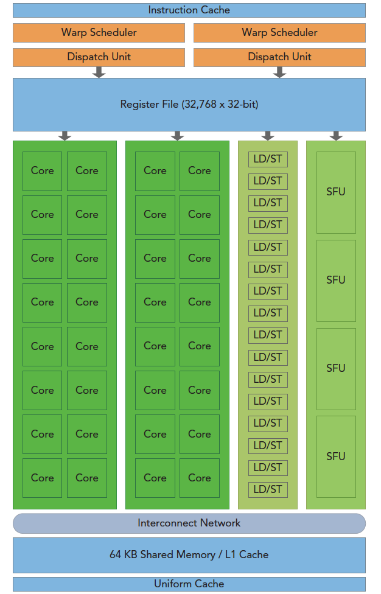
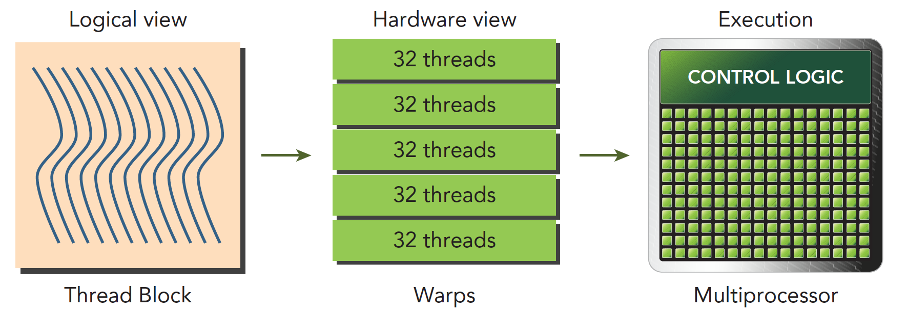
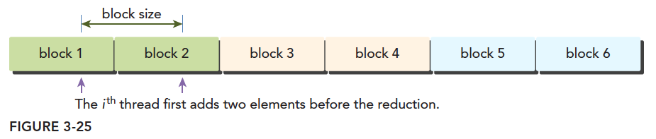

# 第 4 章 CUDA 执行模型

> [← 上一章：语法与 API](../03_syntax_and_api/README.md) | [返回目录](../README.md) | [下一章：内存模型 →](../05_memory_model/README.md)

> 什么时候我们沿着硬件设计的思路设计程序，我们就会得到好的结果；什么时候我们背离了硬件设计的思路去设计程序，就得不到好结果。理解执行模型，是一切 CUDA 性能优化的基础。

本章目标：理解 SM 的硬件结构、warp/SIMT 执行方式、延迟隐藏与占用率，掌握避免线程束分化的实战技巧。

前三章我们一直站在**编程模型**（逻辑视角）这一侧写代码：第 1 章建立了"CPU 指挥、GPU 干活"的全局图景，第 2 章学会了用 Grid/Block/Thread 组织海量线程，第 3 章备齐了语法与 API 工具箱。但有几个问题一直悬着：`<<<grid, block>>>` 里的线程落到真实的硅片上究竟是怎么跑起来的？第 1 章为什么反复叮嘱"块大小取 32 的倍数"？为什么同样的算法换一种写法就能快一倍？这些问题的答案都藏在**执行模型（Execution Model）**里——它是编程模型与 GPU 物理硬件之间的那座桥。第 1 章 [1.5.5 节](../01_introduction/README.md#15-cuda-编程模型概览三大抽象与自动可扩展)埋下的 warp 与 SIMT 伏笔，本章将逐一展开。

全章的行进路线是"**先看硬件，再看调度，最后学以致用**"：

```text
┌─ 硬件与调度 ────────────────────────────────────────────┐
│  SM 里面有什么？             GPU 架构与 SM 的组成   → 4.1  │
│  线程块怎么"落户"到 SM？      块调度与资源分配       → 4.2  │
│  硬件真正的执行单位是什么？    warp 与 SIMT         → 4.3  │
└──────────────────────────┬─────────────────────────────┘
┌─ 性能机制 ─────────────────▼─────────────────────────────┐
│  GPU 为什么不怕等内存？      零开销切换、延迟隐藏、占用率 → 4.4 │
│  warp 内步调不一致会怎样？   线程束分化              → 4.5  │
└──────────────────────────┬─────────────────────────────┘
┌─ 实战优化 ─────────────────▼─────────────────────────────┐
│  并行归约三版本演进 → 4.6      循环展开两步进阶 → 4.7       │
└─────────────────────────────────────────────────────────┘
```

## 本章目录

- [4.1 GPU 架构与 SM 的组成](#41-gpu-架构与-sm-的组成)
- [4.2 线程块如何被调度到 SM](#42-线程块如何被调度到-sm)
- [4.3 线程束（Warp）与 SIMT](#43-线程束warp与-simt)
- [4.4 零开销上下文切换与延迟隐藏](#44-零开销上下文切换与延迟隐藏)
- [4.5 线程束分化（Warp Divergence）](#45-线程束分化warp-divergence)
- [4.6 避免分支分化实例：并行归约（Reduction）](#46-避免分支分化实例并行归约reduction)
- [4.7 循环展开（Loop Unrolling）](#47-循环展开loop-unrolling)
- [4.8 本章小结](#48-本章小结)
- [4.9 动手练习](#49-动手练习)

---

## 4.1 GPU 架构与 SM 的组成

第 1 章 1.5.1 节把 SM 比作 GPU 工厂里的"生产车间"，当时只远远看了一眼车间的轮廓（寄存器文件、共享内存、功能单元）。现在我们推门进去，把车间里的每台设备看个仔细——后面所有关于调度、分化、占用率的讨论，都建立在你对这张"车间平面图"的印象之上。

### 4.1.1 SM：GPU 的基本硬件单元

GPU 架构是围绕**流式多处理器（SM，Streaming Multiprocessor）** 的可扩展阵列搭建的，通过复制这种结构来实现 GPU 的硬件并行。下图是经典的 Fermi SM 结构（虽然架构较老，但对于学习 GPU 编程而言是很好的入门结构，后续架构均在此基础上演进）：



上图包括的关键组件：

- **CUDA 核心（CUDA Core）**：在 NVIDIA GPU 架构中用于处理算术运算指令的硬件单元。在较新的架构中还有专门处理矩阵运算的 Tensor Core 核心。
- **共享内存 / 一级缓存（Shared Memory / L1 Cache）**：SM 内部的片上高速存储。
- **寄存器文件（Register File）**：存储线程私有变量。
- **加载/存储单元（LD/ST，Load/Store Unit）**：GPU 中用于从 Cache 或 DRAM 中存取数据的硬件单元。
- **特殊功能单元（SFU，Special Function Unit）**：用于执行超越函数（正弦、余弦、平方根、插值等）计算的硬件单元。
- **线程束调度器 & 指令调度单元（Warp Scheduler & Instruction Dispatch Unit）**：SM 中负责调度 warp 执行的硬件单元。SM 中 Warp Scheduler 的数量意味着每个周期最多可以有几个 warp 被同时发射执行。

对照第 1 章的车间类比，这几样设备可以这样理解：**CUDA Core 是流水线上的工人**，只会做算术这一件事但人数众多；**寄存器文件是每个工人手边的工具台**，放自己的私有变量；**共享内存/L1 是车间中央的公共物料架**，本车间的工人都能取用；**LD/ST 单元是负责去仓库（显存）取料送料的搬运工**；**SFU 是少数几位会"绝活"（超越函数）的老师傅**；而**线程束调度器就是车间主任**——每个时钟周期，他决定让哪一组工人开工执行哪条指令。注意"车间主任"这个角色：本章后面讲的调度、切换、延迟隐藏，全是他的工作日常。

### 4.1.2 CUDA Core 内部的计算单元

再把镜头拉近到单个"工人"身上。除此之外，CUDA Core 内部执行计算时还包含：

- **ALU（Arithmetic Logic Unit，算术逻辑单元）**：执行基本整数/逻辑运算的硬件单元，包括 mul、div、add、sub、mad、or、xor、and、移位等；
- **FPU（Floating Point Unit，浮点数单元）**：处理浮点数计算的硬件单元；
- **FMA（Fused Multiply Add，融合乘加单元）**：处理乘加计算（`A*B+C`，单条指令、一次舍入）的硬件单元。

FMA 值得多看一眼：乘加是科学计算和深度学习中最高频的运算模式（想想矩阵乘法的内层循环），把"先乘后加"融合成一条指令、只做一次舍入，既提高了吞吐又减小了精度损失——这也是官方统计 GPU 峰值算力时按"每 FMA 算 2 次浮点操作"计数的原因。

车间看完了，硬件的"静态结构"就交代清楚了。接下来的问题是动态的：你在第 2 章精心组织的那些线程块，是如何被派进这些车间开工的？

## 4.2 线程块如何被调度到 SM

第 1 章 1.5.4 节讲过"块间独立 ⇒ 自动可扩展"：调度器像分拣快递一样把块派发到空闲的 SM 上。这一节我们把"分拣"的具体规则讲清楚——这些规则直接决定了后面占用率的计算方式。

### 4.2.1 调度的基本规则

当一个核函数的网格被启动时，多个线程块会被分配给可用的 SM 上执行。调度规则如下：

- **一个线程块一旦被分配给一个 SM，就只能在这个 SM 上执行**，不会迁移到其他 SM；多个线程块可以被分配到同一个 SM 上。
- 一旦一个线程块在 SM 上启动，它的所有线程束（warps）都会一直驻留在该 SM 上，直到执行完成。
- SM 中的共享内存和寄存器是关键的稀缺资源，**以线程块为单位分配**给驻留的块。这导致一个 SM 中可同时驻留的线程块数量是有限的（受寄存器总量、共享内存总量、最大驻留线程/块数等约束）。

用车间类比串起来：线程块像一张"生产订单"——订单一旦派给某个车间就**落户**了，不会中途转厂；车间的工具台（寄存器）和物料架（共享内存）按订单整体划拨，一张订单占的资源越多，车间里能同时开工的订单就越少。"能同时驻留多少订单"这个数字，正是 4.4 节占用率的核心。

> [!NOTE]
> "驻留（resident）"是个值得留心的词：块被分配到 SM 后，它的线程状态（寄存器、共享内存）就一直占着位子，直到整个块执行完毕才释放。所以块不是"排队进车间干完一道工序就出来"，而是"整组人搬进去住到完工"。

### 4.2.2 编程逻辑与硬件的对应

从编程逻辑与硬件的对应关系看：


- 一个**线程**由 SM 中的一个 CUDA Core 执行；
- 一个**线程块**只能分配给一个 SM 执行（多个线程块可以分配到同一个 SM 上），并且线程块中的所有线程（可能有多个线程束）共享该 SM 中分到的寄存器和共享内存；
- 一个 **Grid** 对应整个 **Device（GPU）**。

这张对应关系图把第 2 章的"逻辑三层"（Thread/Block/Grid）和本章的"硬件三层"（CUDA Core/SM/Device）钉在了一起，建议在脑中长期保存。也正因为"一个块的所有线程保证在同一个 SM 上"，块内线程才能用共享内存交换数据、用 `__syncthreads()` 对齐进度——第 1 章三大抽象中的后两个（共享内存与栅栏同步），硬件基础就在这里。

> [!IMPORTANT]
> SM 数量有限。从编程模型角度看，所有线程是并行执行的；但从机器的微观角度看，线程块是**分批次**在物理硬件上执行的。线程块内不同线程的执行进度可能不一致，但同一个线程束内的线程拥有相同的进度。并行就会引起竞争——CUDA 只提供了**块内**同步（`__syncthreads()`）这一种方式，**块之间没有办法同步**。

### 4.2.3 以 Fermi 为例的调度过程

规则清楚了，再看一个具体架构上的调度实景。

以 Fermi 为例的具体调度过程：每个 SM 有两个线程束调度器（Warp Scheduler）和两个指令调度单元（Instruction Dispatch Unit）。当一个线程块被指定给一个 SM 时，线程块内的所有线程被分成多个线程束；两个线程束调度器选择其中两个线程束，再用指令调度单元存储两个线程束要执行的指令（每 16 个 CUDA 核心为一个组，还有 16 个加载/存储单元和 4 个特殊功能单元）。线程束就这样在 SM 上交替执行：


每个线程束在同一时间执行同一指令，同一个块内的线程束互相切换是没有时间消耗的。

注意这段描述里悄悄出现了一个新的主角——**线程束（warp）**。块被派进车间后，并不是 1024 个线程一起上，而是先被切成一个个 32 人的小组，车间主任以"组"为单位派活。这个小组才是硬件眼中真正的执行单位，值得用一整节来讲清楚。

## 4.3 线程束（Warp）与 SIMT

到目前为止，我们写代码时打交道的都是"线程"和"块"——但硬件的世界里还有一个你在代码中看不见、性能上却处处躲不开的中间层。第 1 章 1.5.5 节预告过它，现在正式登场。

### 4.3.1 执行的基本单元：warp

**线程束是 SM 中基本的执行单元。** 当一个网格被启动（网格被启动等价于一个内核被启动，每个内核对应自己的网格），网格中的线程块被分配到某一个 SM 上之后，将分为多个线程束，每个线程束一般是 32 个线程（目前的 GPU 都是 32 个线程，但不保证未来还是 32 个）。在一个线程束中，所有线程按照单指令多线程（SIMT）的方式执行——每一步执行相同的指令，但处理的数据是各自私有的。下图反映的就是**逻辑视角、实际执行、硬件视角**三个层面的对应关系：



线程块是个**逻辑产物**：在计算机里内存总是一维线性存在的，执行起来也是一维地访问线程块中的线程；但写程序时可以用二维、三维的方式组织，原因是方便我们写程序——比如处理图像或三维数据时，二维/三维的线程块会非常直观方便。

换句话说，你在代码里画的"二维方阵、三维立方体"只是给人看的；到了硬件手里，一切都被拉直成一条线，再按 32 个一组切成 warp。所以接下来的问题就是：这条线怎么拉直、组怎么切？

### 4.3.2 线程块如何被划分成 warp

当一个线程块中有 128 个线程时，它被分配到 SM 上执行会被分成 4 个线程束：

```text
warp0: thread   0, ..., thread  31
warp1: thread  32, ..., thread  63
warp2: thread  64, ..., thread  95
warp3: thread  96, ..., thread 127
```

当使用多维编号时，**x 位于最内层，y 位于中层，z 位于最外层**。想象一下 C 语言的数组：假设三维数组 `t` 保存了所有线程，那么 `(threadIdx.x, threadIdx.y, threadIdx.z)` 对应的就是 `t[z][y][x]`。计算三维编号对应的线性地址：

$$tid = threadIdx.x + threadIdx.y \times blockDim.x + threadIdx.z \times blockDim.x \times blockDim.y$$

然后 `warp_id = tid / 32`，`lane_id = tid % 32`。这个公式可以借助 C 语言三维数组计算相对地址的方法来理解——做过图像或矩阵的人对此应该不陌生，但初学者经常在这里绕晕（分不清"长和宽"），建议动手画一遍。你会发现它和第 2 章 2.3.3 节推导全局索引用的是同一套"线性化"思路，只是这次线性化的目的不是算数据下标，而是决定"谁和谁同组"。

一个线程块包含多少个线程束？

$$WarpsPerBlock = \left\lceil \frac{ThreadsPerBlock}{warpSize} \right\rceil$$

ceil 是向正无穷取整的函数，比如 $\lceil 9/8 \rceil = 2$：一个 40 线程的块虽然只"用得着" 40 个线程，硬件仍会分配 2 个完整 warp（64 个线程位置），后 24 个 lane 空转——这就是"块大小取 32 的倍数"的根本原因。

> [!NOTE]
> **线程束和线程块，一个是硬件层面的线程集合，一个是逻辑层面的线程集合。** 编程时为了程序正确，必须从逻辑层面把索引计算清楚；而为了让程序更快，硬件层面（warp 的行为）是必须注意的。

### 4.3.3 SIMT 执行模型

分好了组，这 32 个线程是怎么"齐步走"的？在一个线程块内，线程被组织成每 32 个线程一组的线程组，称为**线程束（warp）**。一个线程束以 **单指令多线程（SIMT，Single Instruction Multiple Thread）** 模式执行内核代码：warp 内的所有线程都执行相同的内核指令，但每个线程可以走不同的代码分支。基于此，每个线程：

- 都有自己的指令地址计数器；
- 都有自己的寄存器状态；
- 可以有一个独立的执行路径。

**SIMD vs SIMT 的区别**：两者都是将相同指令广播给多个执行单元，但 SIMD（向量机）要求所有通道必须同时执行相同指令、没有例外；而 SIMT 允许某些线程根据条件"选择性不执行"（被掩码屏蔽）。因此 SIMT 提供了线程级别的并行抽象，SIMD 更像指令级别的并行。

**对于硬件（SM）来说，CUDA 执行的实质是线程束的执行**。从机器的角度看，某个时刻 T，一个 warp 调度器只发射一个线程束的指令——即 32 个线程在**同时同步**执行同一条指令。线程块被分成多个线程束后，以流水线方式被调度执行。

> **为什么是 32？** 32 是硬件系统设计的结果（由集成电路设计决定，软件层面只能接受）。它是 SM 以 SIMD 方式同时处理工作的粒度：某一时刻有 32 个线程在执行同一条指令，其中有的线程可以选择不执行，但即使不执行也不能去执行别的指令，只能等待。
>
> 一个形象的类比（来自谭升博客）：老师给 32 个小朋友分水果——第一次分苹果，你可以不吃，但不吃也不能干别的，只能看别人吃，等大家吃完老师回收没吃的苹果；第二次分橘子，爱吃的吃，不爱吃的也只能等着；直到所有水果都发完，今天才放学。**warp 执行分支代码就是这个过程。**

当线程被分派到线程束中执行时，会被分配到一个 **warp lane（线程束通道）**，编号为 0 到 31。线程块的线程总数最好为 **32 的倍数**——这样分配 warp lane 时资源利用才能最大化（否则最后一个 warp 有部分 lane 空转陪跑）。这也回收了第 1 章 1.5.5 节和第 2 章 2.6 节反复提到的那条经验法则：现在你知道它不是玄学，而是 warp 划分公式的直接推论。

"分水果"类比里还藏着一个更大的问题：如果一组小朋友都在等水果（等数据从仓库运来），老师难道干站着？当然不——他转身去给另一组分水果了。这个"转身"，就是 GPU 性能的第一大支柱。

## 4.4 零开销上下文切换与延迟隐藏

第 1 章 1.2.2 节对比 CPU 与 GPU 时说过：GPU 隐藏延迟的方式是"等就等，我换一批线程先算着"。当时是一句口号，现在我们看它的硬件实现——为什么 GPU 换线程可以不花时间，以及要换得动，需要备多少线程。

### 4.4.1 零开销切换：状态常驻寄存器文件

如果一个 warp 的操作数之一或两者都还没有准备好（例如，尚未从全局内存中取回数据），就会发生"上下文切换"——调度器将控制权转移到另一个就绪的线程束上。但与 CPU 不同的是：**切换离开某个线程束时，该线程束的所有状态（寄存器等）仍然保留在寄存器文件中**，当其操作数就绪后可以立即恢复执行。所以 **warp 之间的切换是零开销的**。

这正是 GPU 隐藏内存延迟的核心机制：同一个 SM 上可以有不止一个常驻的线程束，有些在执行，有些在等待数据，它们之间状态的转换不需要开销。**常驻 warp 越多，SM 越容易找到就绪的 warp 来填满流水线**。

对比一下你熟悉的 CPU：CPU 切换线程要把寄存器压栈、刷新流水线、换页表——好比工人换岗要先把整个工具台收拾干净搬走，再把下一位的工具台搬进来，成本高昂。而 GPU 的做法是**给每个 warp 一张固定的专属工具台**（4.1 节那块巨大的寄存器文件就是为此准备的，Fermi 之后每 SM 动辄 6 万多个寄存器），换岗时人走台留，随时回来接着干。代价是每张"工具台"都占着寄存器不放——这笔账马上会算到占用率头上。

### 4.4.2 warp 的三种状态：活跃、就绪与阻塞

"调度器转移控制权"这件事可以说得更精确。已经分配到 SM 上、资源（寄存器/共享内存）就位的 warp 称为**活跃的（active）warp**；在每个时钟周期，warp 调度器从活跃 warp 中挑选可以发射指令的对象。按当下能不能开工，活跃 warp 又分两类：

- **就绪的（eligible）warp**：执行所需的资源齐备（下一条指令已就位、操作数已就绪、有空闲的执行单元），随时可被调度器选中发射；
- **阻塞的（stalled）warp**：还在等待——等内存数据、等前一条指令的结果、等同步点等，暂时无法发射。

调度器每个周期做的事就是：从就绪队列里挑 warp 发射指令。**延迟隐藏成立的条件，就是任意时刻就绪队列都不空**——只要总有 eligible warp 可发射，个别 warp 阻塞多久都无所谓，计算单元照样满负荷。反过来，若某个周期一个就绪 warp 都找不到，流水线就只能空转，延迟便"藏不住"了。

### 4.4.3 需要多少个 warp 才能隐藏延迟

那么"总有就绪 warp 可发射"需要备多少 warp？可以用 **Little's Law（利特尔法则）** 粗略估算：

$$\text{所需并行度} = \text{延迟} \times \text{吞吐量}$$

例如：算术指令延迟约 20 周期、SM 每周期可发射 4 个 warp 的指令，则至少需要 $20 \times 4 = 80$ 个就绪 warp 轮转才能填满算术流水线；全局内存延迟约 400~800 周期，需要的在途访存请求（即等待中的 warp）就更多。这解释了为什么 GPU 要"超额订阅"线程——**线程数远超核心数不是浪费，而是隐藏延迟的必需**。

> [!TIP]
> 建立一个数量直觉：一个 SM 可能只有 64~128 个 FP32 单元，却支持最多 2048 个驻留线程（64 个 warp）——**16~32 倍的超额订阅是设计出来的常态**。写内核时如果发现总线程数只有几千，先别急着优化指令，多半是并行度本身不够（回想第 1 章 1.2.4 节"数据规模够大"那条判据）。

### 4.4.4 占用率（Occupancy）

由此产生一个重要性能指标——**活跃线程束比例（占用率）**：

$$\text{Occupancy} = \frac{\text{每个周期活跃的线程束平均数}}{\text{一个 SM 支持的线程束最大值}}$$

由于一个 SM 中的共享资源（寄存器、共享内存）是以线程块为单位分配的，资源占用过多会导致 SM 中可驻留的线程块/线程束数量下降，占用率降低，延迟隐藏能力变差。

> 例如：某 GPU 的一个 SM 最多驻留 32 个线程块、64 个线程束（即 2048 个线程）。若每个线程块 256 线程（8 个 warp），则最多驻留 8 个块即达到 2048 线程上限；但若该内核每线程使用大量寄存器，使得寄存器总量只够 4 个块使用，则实际只能驻留 4 个块（32 个 warp），占用率降为 50%。

把上面例子里的逻辑一般化，限制占用率的因素主要有三个，谁先触顶谁说了算（木桶效应）：

| 限制因素 | 机制 | 典型表现 |
|---------|------|---------|
| **每线程寄存器数** | 驻留线程数 × 每线程寄存器 ≤ SM 寄存器总量 | 内核局部变量多、计算复杂时，寄存器先耗尽 |
| **每块共享内存** | 驻留块数 × 每块共享内存 ≤ SM 共享内存总量 | `__shared__` 数组开得大，能驻留的块变少 |
| **块大小** | 驻留块数 ≤ SM 最大驻留块数，且驻留线程 ≤ SM 最大驻留线程数 | 块太小（如 32 线程）时受"最大块数"限制，凑不满线程上限 |

想知道自己的内核吃了多少资源？编译时加一个参数就能看到（第 1 章 1.8.4 节出现过这条命令）：

```bash
nvcc -O3 --ptxas-options=-v reduce_divergence.cu -o reduce_divergence
# 输出形如：Used 18 registers, 0 bytes smem ...（每线程寄存器数与每块共享内存用量）
```

拿到这两个数字，对照 `cudaGetDeviceProperties` 查到的 SM 资源总量（第 3 章 3.10 节），就能手算出理论占用率。嫌手算麻烦，也可以用 Runtime API 直接查询/推荐配置：

```c++
// 让 CUDA 推荐使占用率最大的块大小
int minGridSize, blockSize;
cudaOccupancyMaxPotentialBlockSize(&minGridSize, &blockSize, myKernel, 0, 0);
printf("suggested block size: %d\n", blockSize);

// 查询给定配置下每个 SM 能驻留多少个块
int numBlocks;
cudaOccupancyMaxActiveBlocksPerMultiprocessor(&numBlocks, myKernel, 256, 0);
```

运行期的真实数据则交给 profiler：**Nsight Compute（`ncu`）的 Occupancy 小节会同时报告理论占用率（Theoretical Occupancy）与实测占用率（Achieved Occupancy）**，并指出当前是哪一项资源卡住了上限——比自己算又快又准。

> [!TIP]
> 占用率不是越高越好——它只是"有足够 warp 可供切换"的代理指标。实践中 50% 以上的占用率通常已够用，此时瓶颈往往转移到访存效率（第 5 章）。用寄存器换占用率（`-maxrregcount` 限制寄存器）有时反而变慢，一切以实测为准。

到这里，"warp 怎么被调度、怎么靠人多隐藏延迟"讲完了。但 warp 还有一个软肋：32 个线程绑在一起齐步走，一旦"步调"出现分歧，队伍就走不快了。这就是接下来的主题。

## 4.5 线程束分化（Warp Divergence）

4.3.3 节"分水果"的类比其实已经剧透了本节内容：不吃苹果的小朋友只能干等。现在把这个现象放到代码里，看清它的机制、代价与规避方法——这是本章最重要的实战知识点。

### 4.5.1 分化如何发生

warp 内所有线程在同一时刻执行同一条指令。如果内核中存在 `if-else`、`for` 等条件控制流，且 **warp 内不同线程的条件判断结果不同**，就会产生**线程束分化**：硬件会依次执行每个分支路径，不满足当前分支条件的线程被屏蔽（空转陪跑），各分支**串行**通过，导致并行效率下降。


要点：

- 分化只发生在 **warp 内部**。不同 warp 走不同分支没有任何代价（它们本来就独立调度）。
- 若一个 warp 内所有线程条件一致（全真或全假），也不会分化。
- 优化思路：**让分支的粒度对齐到 warp 的整数倍**，即以 `threadIdx.x / warpSize` 而不是 `threadIdx.x` 的奇偶等细粒度条件来划分工作。

补充一点硬件机制，回扣第 1 章 [1.5.5 节](../01_introduction/README.md#15-cuda-编程模型概览三大抽象与自动可扩展)提到的"掩码"：warp 内部维护一个 32 位的**活跃掩码（active mask）**，每一位对应一个 lane。执行到分支时，硬件先带着"满足条件"的掩码走完 if 路径（掩码为 0 的 lane 空转），再翻转掩码走 else 路径，最后在汇合点恢复全员执行。所以一个五五开的分化 warp，实际执行时间约等于两条路径之和——**算力凭空打了对折**；最坏情况下 32 个线程走 32 条不同路径，性能可退化到 1/32。

> [!NOTE]
> 编译器并非坐视不管：对很短的分支，它会用**谓词执行（predication）**把分支变成"两边都算、按条件选结果"，避免真正的控制流分化。但这招只对短小分支有效，长分支仍会真实分化——所以不能指望编译器兜底，结构性的分化要靠算法设计来消除。

### 4.5.2 规避分化：让分支粒度对齐 warp

规避的钥匙藏在"分化只发生在 warp 内部"这条要点里：**条件本身可以有，只要同一个 warp 内的 32 个线程判断结果一致就没事**。对比下面两种写法：

```c++
// 会产生 warp 分化：同一 warp 内奇偶线程走不同分支
if (threadIdx.x % 2 == 0) { ... } else { ... }

// 不产生分化：以 warp 为单位划分分支（warpSize = 32）
if ((threadIdx.x / warpSize) % 2 == 0) { ... } else { ... }
```

第一种写法里，任何一个 warp 内部都是 16 个奇数 lane、16 个偶数 lane，每个 warp 都分化；第二种写法把粒度放大到 32 的整数倍——warp0 整体走 if、warp1 整体走 else，每个 warp 内部步调完全一致，一点不浪费。**两种写法的"工作总量"一模一样，只是"谁干哪份活"的映射不同**——这个"重排映射来消除分化"的思想，就是下一节归约优化的灵魂。

## 4.6 避免分支分化实例：并行归约（Reduction）

道理讲完了，来一场实战。本节用同一个问题的三个内核版本，把"分化有多伤、怎么一步步消除"完整走一遍——三个版本的完整可运行代码在 [`code/reduce_divergence.cu`](code/reduce_divergence.cu)，用第 3 章 3.9 节的 CUDA Event 计时框架做了对比（含预热与结果校验），强烈建议边读边跑。

### 4.6.1 归约问题与并行三步走

**归约问题**：把一组数通过满足**结合律和交换律**的运算（加法、乘法、求最大值等）合并成一个数。并行归约的基本套路是三步走：

1. 将输入向量划分到更小的数据块中（一个线程块处理一个数据块）；
2. 用线程块内多轮迭代计算出该数据块的部分和；
3. 对每个数据块的部分和再求和得到最终结果（这一步通常在 CPU 上完成）。

成对配对常见有两种方式：**相邻配对**（元素与相邻元素配对）和**交错配对**（元素与间隔一定距离的元素配对）。

为什么归约是讲分化的绝佳例子？因为它的迭代天生"淘汰制"：每轮参与干活的线程减半，**"让哪些线程留下干活"这个映射选得好不好，直接决定分化的严重程度**。示例程序对 $2^{24}$ 个 1 求和（结果应等于 $2^{24}$，便于校验 PASS/FAIL），块大小 512，下面依次看三个版本。

### 4.6.2 版本 1：相邻配对（原始版，严重分化）

最直观的写法：第一轮相邻两数相加，第二轮隔 2 相加，第三轮隔 4 相加……像一张自下而上收拢的淘汰赛对阵表：

```c++
__global__ void reduceNeighbored(int *g_idata, int *g_odata, unsigned int n) {
    unsigned int tid = threadIdx.x;
    unsigned int idx = blockIdx.x * blockDim.x + threadIdx.x;
    // 定位到本块处理的数据块起点
    int *idata = g_idata + blockIdx.x * blockDim.x;
    if (idx >= n) return;

    // in-place reduction in global memory
    for (int stride = 1; stride < blockDim.x; stride *= 2) {
        if ((tid % (2 * stride)) == 0) {      // ← 引发严重 warp 分化
            idata[tid] += idata[tid + stride];
        }
        __syncthreads();   // 每轮并行操作后必须块内同步，避免竞争
    }
    if (tid == 0) g_odata[blockIdx.x] = idata[0];
}
```

逐点拆解：

1. `idata = g_idata + blockIdx.x * blockDim.x` 把全局指针平移到本块负责的数据段起点——之后块内一律用局部下标 `tid` 访问，这是三步走里"第 1 步划分"的代码形态；
2. 循环里 `stride` 每轮翻倍（1、2、4、…），`tid % (2 * stride) == 0` 挑出"本轮干活"的线程；
3. 每轮之后必须 `__syncthreads()`：下一轮要读的 `idata[tid + stride]` 是别的线程上一轮写的，不同步就是竞争条件（第 3 章 3.7 节）；
4. 最后 `tid == 0` 的线程把本块部分和写入 `g_odata[blockIdx.x]`，留给主机端做第 3 步汇总。

`if ((tid % (2 * stride)) == 0)` 这个条件判断给内核造成了极大的分支：第一轮有 $\frac{1}{2}$ 的线程没用、第二轮有 $\frac{3}{4}$ 的线程没用、第三轮有 $\frac{7}{8}$ 的线程没用……这些空闲线程与干活的线程混在同一个 warp 里，只能等待，不能执行别的指令，线程利用率极低。用 4.5.1 节的掩码视角看：第一轮每个 warp 的活跃掩码是 `0101...01`（一半 lane 陪跑），之后一轮比一轮稀疏，但**只要掩码里还有一个 1，整个 warp 就得整组占着执行单元走完全程**。

### 4.6.3 版本 2：重排线程索引（消除大部分分化）

问题不在"干活的线程变少"（淘汰赛必然如此），而在**干活的线程散落在每个 warp 里**。那就重排映射：让低编号的连续线程去干活，高编号线程整 warp 地闲下来：

```c++
__global__ void reduceNeighboredLess(int *g_idata, int *g_odata, unsigned int n) {
    unsigned int tid = threadIdx.x;
    unsigned int idx = blockIdx.x * blockDim.x + threadIdx.x;
    int *idata = g_idata + blockIdx.x * blockDim.x;
    if (idx >= n) return;

    for (int stride = 1; stride < blockDim.x; stride *= 2) {
        // 关键：把连续的低编号线程映射到有活干的内存位置
        int index = 2 * stride * tid;
        if (index < blockDim.x) {
            idata[index] += idata[index + stride];
        }
        __syncthreads();
    }
    if (tid == 0) g_odata[blockIdx.x] = idata[0];
}
```

关键一步是 `int index = 2 * stride * tid;`——它保证**干活的始终是块内前面连续的那部分线程**。数据的配对方式没变（还是相邻配对），变的只是"哪个线程负责哪一对"：第一轮 512 线程的块里，`tid` 0~255 负责全部 256 对加法（`index` = 0、2、4、…、510），`tid` 256~511 全部闲置——前 8 个 warp 满载、后 8 个 warp 整体不满足条件。当一个 warp 内所有线程都不需要执行分支时，硬件会直接跳过它，从而节省了资源。实测该版本比版本 1 快约一倍，`nvprof --metrics inst_per_warp` 显示每 warp 平均指令数从 444.9 降到 150.5（分化程度越高该指标越高），`gld_throughput` 内存吞吐也提升近一倍。

> [!NOTE]
> `nvprof` 是老一代 profiler，新 GPU（Volta 之后）请用 Nsight Compute 的等价指标：`ncu --metrics smsp__average_inst_executed_per_warp ./reduce_divergence`（4.9 节练习 2 会用到）。

### 4.6.4 版本 3：交错配对（跨步从大到小）

还能更简洁：把配对方式也换掉。交错配对让 `stride` 从 `blockDim.x / 2` 开始逐轮**减半**——每轮都是"前一半线程"把"后一半数据"加到自己身上：

```c++
__global__ void reduceInterleaved(int *g_idata, int *g_odata, unsigned int n) {
    unsigned int tid = threadIdx.x;
    unsigned int idx = blockIdx.x * blockDim.x + threadIdx.x;
    int *idata = g_idata + blockIdx.x * blockDim.x;
    if (idx >= n) return;

    // 跨度从 blockDim.x/2 开始逐轮减半
    for (int stride = blockDim.x / 2; stride > 0; stride >>= 1) {
        if (tid < stride) {                   // 前 stride 个线程干活，无分化
            idata[tid] += idata[tid + stride];
        }
        __syncthreads();
    }
    if (tid == 0) g_odata[blockIdx.x] = idata[0];
}
```

`if (tid < stride)` 使得干活的线程永远是块内连续的前段线程，warp 分化最小；且相邻线程访问相邻内存，访存模式对合并访问也更友好。实测通常比版本 2 更快。

三个版本放在一起，优化脉络一目了然：

| 版本 | 配对方式 | 干活线程的分布 | 分化程度 |
|------|---------|--------------|---------|
| 1 `reduceNeighbored` | 相邻配对 | 按 `2*stride` 间隔散落在所有 warp 中 | 严重（每轮每个 warp 都分化） |
| 2 `reduceNeighboredLess` | 相邻配对 + 索引重排 | 块内前段连续线程 | 轻微（仅活跃/闲置交界的 warp） |
| 3 `reduceInterleaved` | 交错配对 | 块内前段连续线程 | 轻微，且访存更连续 |

> [!IMPORTANT]
> 请体会这组优化最反直觉的一点：**三个版本的加法次数一次不多、一次不少，快慢差在"活派给谁干"**。GPU 优化常常不是减少计算量，而是把同样的计算重新排布成硬件喜欢的形状——顺着硬件设计的思路走，这正是本章开头那句话的含义。

> 归约还能继续优化：使用共享内存（第 5 章 [5.3.8 节](../05_memory_model/README.md#538-综合实例二共享内存优化并行归约)）、循环展开、warp shuffle 原语（第 7 章 [7.4 节](../07_atomics_and_warp/README.md#74-warp-级原语shuffle-指令)），一路可以逼近内存带宽极限。

其中"循环展开"这一步无需任何新硬件知识、只靠改写循环就能立竿见影，我们现在就把它讲掉。

## 4.7 循环展开（Loop Unrolling）

归约三版本消灭了分化，但循环本身还留着两笔"隐性税"：每轮迭代的条件判断/计数指令，以及归约尾声"活越干越少"的低利用率。循环展开正是冲着这两笔税去的。

循环展开是一个尝试通过**减少分支出现的频率和循环维护指令**来优化循环的技术，是用空间换时间的经典技巧。

先看一个 C++ 入门循环：

```c++
// 展开前：最传统的写法
for (int i = 0; i < 100; i++) {
    a[i] = b[i] + c[i];
}

// 展开后（展开因子为 4）：把本来循环自己搞定的事情自己列出来
for (int i = 0; i < 100; i += 4) {
    a[i + 0] = b[i + 0] + c[i + 0];
    a[i + 1] = b[i + 1] + c[i + 1];
    a[i + 2] = b[i + 2] + c[i + 2];
    a[i + 3] = b[i + 3] + c[i + 3];
}
```

从串行角度看，好处是减少了条件判断（分支）的次数。但如果把这段 CPU 代码拿到机器上跑，其实看不出什么效果——现代编译器会把上述两种写法编译成类似的机器语言，我们不展开，编译器也会帮我们做。

> [!NOTE]
> 值得注意的是：**目前 CUDA 的编译器还不能自动做这种优化，人为地展开核函数内的循环，能够非常显著地提升内核性能**。也可以使用 `#pragma unroll` 指示编译器展开。

在 CUDA 中展开循环的目的就是两个：

1. **减少指令消耗**（分支指令、循环计数指令）；
2. **增加更多的独立调度指令**，提高指令级并行。

像 `a[i+0]=...; a[i+1]=...; a[i+2]=...; a[i+3]=...;` 这样一组相互独立的指令被添加到 CUDA 流水线上是非常受欢迎的，因为它们能最大限度地提高指令和内存带宽。第二个目的和 4.4 节是一脉相承的：延迟既可以靠"warp 多"来隐藏（线程级并行），也可以靠"单个线程手头有多条互不依赖的指令"来隐藏（指令级并行）——两条腿走路，流水线才填得满。

下面继续以 4.6 节的归约为例，演示循环展开的两步实战优化。

### 4.7.1 展开数据块：一个块干两个块的活

第一步在"块"这个层面展开：让每个线程块处理两个数据块的数据——进入归约循环之前，先让每个线程把"隔壁块"的对应元素加过来：

```c++
__global__ void reduceUnroll2(int *g_idata, int *g_odata, unsigned int n) {
    // set thread ID
    unsigned int tid = threadIdx.x;
    unsigned int idx = blockDim.x * blockIdx.x * 2 + threadIdx.x;   // ← 乘 2 的偏移
    // boundary check
    if (tid >= n) return;
    // convert global data pointer to the local pointer of this block
    int *idata = g_idata + blockIdx.x * blockDim.x * 2;             // ← 乘 2 的偏移

    // 展开：先把"隔壁块"的对应元素加到本块上
    if (idx + blockDim.x < n) {
        g_idata[idx] += g_idata[idx + blockDim.x];
    }
    __syncthreads();

    // in-place reduction in global memory（与 4.6 版本 3 相同）
    for (int stride = blockDim.x / 2; stride > 0; stride >>= 1) {
        if (tid < stride) {
            idata[tid] += idata[tid + stride];
        }
        __syncthreads();
    }
    if (tid == 0) g_odata[blockIdx.x] = idata[0];
}
```

代码中第 4 行和第 8 行在确定线程块对应的数据位置时有个**乘 2 的偏移量**：



这就是这两句指令的含义——每个线程块只处理图中红色的数据块，而旁边白色的数据块用开头那句

```c++
if (idx + blockDim.x < n) {
    g_idata[idx] += g_idata[idx + blockDim.x];
}
```

预先"吃"掉了。也就是说：**用原来一半数量的线程块、每个线程只多做一次加法，就完成了原来全部的计算量。** 注意调用时网格数量要对应减半：

```c++
// kernel: reduceUnrolling2（注意 grid.x / 2）
reduceUnroll2<<<grid.x / 2, block>>>(idata_dev, odata_dev, size);
...
for (int i = 0; i < grid.x / 2; i++)   // 主机端求和的块数也减半
    gpu_sum += odata_host[i];
```

这一优化的本质是**提高每个线程的算术强度**（每线程干更多独立的活），效果通常非常可观。同理还可以继续展开为一个块处理 4 块、8 块数据（`reduceUnroll4` / `reduceUnroll8`）。

### 4.7.2 展开最后的 warp：消除尾部的同步与分支

接着把目标对准最后那 32 个线程。归约运算是个"倒金字塔"，最后从 64 个数算到 1 个数的过程中，每执行一步，活跃线程的数量就减半（64 → 32 → 16 → … → 1），线程利用率越来越低，而每一步还要付出一次 `__syncthreads()` 的代价。解决办法：**当活跃线程收缩到一个 warp（32 线程）以内时，展开最后 6 步迭代**（64、32、16、8、4、2 → 1）：

```c++
__global__ void reduceUnrollWarp8(int *g_idata, int *g_odata, unsigned int n) {
    unsigned int tid = threadIdx.x;
    unsigned int idx = blockDim.x * blockIdx.x * 8 + threadIdx.x;
    if (tid >= n) return;
    int *idata = g_idata + blockIdx.x * blockDim.x * 8;

    // 第一步：展开 8 个数据块（一个块干 8 个块的活）
    if (idx + 7 * blockDim.x < n) {
        int a1 = g_idata[idx];
        int a2 = g_idata[idx + blockDim.x];
        int a3 = g_idata[idx + 2 * blockDim.x];
        int a4 = g_idata[idx + 3 * blockDim.x];
        int a5 = g_idata[idx + 4 * blockDim.x];
        int a6 = g_idata[idx + 5 * blockDim.x];
        int a7 = g_idata[idx + 6 * blockDim.x];
        int a8 = g_idata[idx + 7 * blockDim.x];
        g_idata[idx] = a1 + a2 + a3 + a4 + a5 + a6 + a7 + a8;
    }
    __syncthreads();

    // 第二步：常规归约，但只迭代到 stride > 32 为止
    for (int stride = blockDim.x / 2; stride > 32; stride >>= 1) {
        if (tid < stride) {
            idata[tid] += idata[tid + stride];
        }
        __syncthreads();
    }

    // 第三步：展开最后一个 warp（最后 6 步），不再需要 __syncthreads()
    if (tid < 32) {
        volatile int *vmem = idata;
        vmem[tid] += vmem[tid + 32];
        vmem[tid] += vmem[tid + 16];
        vmem[tid] += vmem[tid +  8];
        vmem[tid] += vmem[tid +  4];
        vmem[tid] += vmem[tid +  2];
        vmem[tid] += vmem[tid +  1];
    }

    if (tid == 0) g_odata[blockIdx.x] = idata[0];
}
```

三步各司其职：第一步是 4.7.1 节思路的加强版（8 路展开，注意 8 个读取 `a1`~`a8` 相互独立，正是"独立指令喂流水线"的实例）；第二步是熟悉的交错归约，但提前在 `stride > 32` 处刹车；第三步接管最后一个 warp。关于最后一段展开代码的两个关键点：

1. **为什么不再需要 `__syncthreads()`**：当活跃线程都在同一个 warp 内时，它们以 SIMT 方式同步执行同一条指令（隐式同步），不需要块级栅栏；
2. **为什么要用 `volatile`**：它强制编译器每次都真正读写内存，禁止把 `vmem[tid]` 缓存到寄存器中——否则在没有 `__syncthreads()` 的情况下，编译器优化可能让线程读到过期的值，导致结果错误。

> [!WARNING]
> 依赖 warp 内隐式同步的写法在 Volta（CC 7.0）之后的**独立线程调度**架构上已不再被官方保证安全。现代写法应使用 `__syncwarp()` 或第 7 章的 **warp shuffle 原语**完成最后一个 warp 的归约——本节示例主要用于理解"展开"的优化思想。

小结：典型的归约优化组合是——每个线程先串行累加多个数据块（展开数据块），再做块内归约（无分化的交错配对），最后展开/用 shuffle 处理最后一个 warp。这条优化链在第 5 章（共享内存版归约）和第 7 章（三层归约内核）还会两次升级，届时回头看本章，你会对"顺着硬件设计思路写程序"有更深的体会。

## 4.8 本章小结

- GPU = SM 的可扩展阵列；SM 内含 CUDA Core、寄存器文件、共享内存/L1、LD/ST、SFU 和 warp 调度器；CUDA Core 内部由 ALU/FPU/FMA 完成实际运算；
- 线程块一旦分配给某个 SM 就不再迁移；寄存器/共享内存**以块为单位分配**，决定 SM 能驻留多少块；逻辑三层与硬件三层对应：Thread ↔ CUDA Core、Block ↔ SM、Grid ↔ Device；
- **执行的实质是 warp**：32 线程一组（`warp_id = tid / 32`、`lane_id = tid % 32`，多维索引先按 x→y→z 线性化），SIMT 方式同步执行同一条指令——SIMT 与 SIMD 的区别在于允许线程被掩码屏蔽、各自保有独立执行路径；
- warp 切换零开销（状态常驻寄存器文件）→ 靠海量常驻 warp 隐藏延迟（Little's Law：所需并行度 = 延迟 × 吞吐量）→ 调度器每周期从活跃（active）warp 中挑就绪（eligible）者发射，阻塞（stalled）者等待；
- 占用率是延迟隐藏能力的代理指标（够用即可，不必 100%），受寄存器、共享内存、块大小三大因素限制；用 `nvcc --ptxas-options=-v` 看资源占用、occupancy API 拿推荐配置、Nsight Compute 看实测占用率；
- warp 内条件分支不一致 → **线程束分化** → 硬件按活跃掩码串行走完各分支；解法是让分支粒度对齐 warp（归约三版本演进：相邻配对 → 索引重排 → 交错配对，计算量不变、只改线程映射）；
- CUDA 编译器不会充分自动展开循环，手工/`#pragma unroll` 展开常有显著收益：减少循环维护指令 + 增加独立指令提高指令级并行（展开数据块、展开最后的 warp）；
- 一切优化以 profiler（nvprof / Nsight）实测为准。

## 4.9 动手练习

> 本章示例代码位于 [`code/`](code/) 目录：`reduce_divergence.cu`（归约三版本对比）。

1. 运行 `reduce_divergence.cu`，记录三个版本的耗时比例；再把 `threads` 从 512 改为 128/1024，观察相对差距的变化；
2. 用 `ncu --metrics smsp__average_inst_executed_per_warp ./reduce_divergence` 验证"分化程度越高、每 warp 平均指令数越高"；
3. 给版本 3 增加"每线程先累加 2 个数据块再归约"的预处理（启动块数减半），实测收益；
4. 写一个刻意分化的内核（`if (threadIdx.x % 2)` 走不同分支各做 1000 次乘法），再改成按 warp 划分分支，对比耗时验证 4.5 节结论；
5. 用 `nvcc -O3 --ptxas-options=-v` 编译 `reduce_divergence.cu`，记下每个内核的寄存器用量；结合第 3 章 `device_query.cu` 查到的每 SM 寄存器总量与最大驻留线程数，手算三个内核在块大小 512 时的理论占用率；
6. 在代码里调用 `cudaOccupancyMaxPotentialBlockSize` 查询 `reduceInterleaved` 的推荐块大小，与你在练习 1 中实测的最优块大小对比，思考两者不一致时该信谁（提示：4.4.4 节的 TIP）。

---


> [← 上一章：语法与 API](../03_syntax_and_api/README.md) | [返回目录](../README.md) | [下一章：内存模型 →](../05_memory_model/README.md)
