# 第 5 章 CUDA 内存模型：层次总览、全局内存与共享内存

> [← 上一章：执行模型](../04_execution_model/README.md) | [返回目录](../README.md) | [下一章：流与并发 →](../06_streams_and_concurrency/README.md)

上一章我们从执行模型的角度理解了 warp 如何被调度和执行；本章转向性能优化的另一半图景——内存。

为什么内存值得用全书最长的一章来讲？先看一组数字：A100 的 FP32 算力约 19.5 TFLOPS，显存带宽约 2 TB/s——换算一下，**从显存每读入一个 float 的时间里，计算单元足足能做约 40 次浮点运算**。也就是说，对绝大多数 CUDA 内核而言，瓶颈不在"算"而在"喂数据"：计算单元像一群吃饭飞快的壮汉，内存系统是那个上菜的服务员。第 4 章教你让壮汉们排好队形（执行模型），本章教你让服务员少跑冤枉路（访存优化）——这往往是同一个内核快 2 倍还是快 10 倍的分水岭。

本章目标：建立 GPU 内存层次的全景认知，深入掌握全局内存的访问机制（段、缓存行、事务与合并）与共享内存的 bank 结构，学会用对齐/合并访问、SoA 布局、共享内存中转与 padding 等手段优化访存性能。

全章按"先认全家福 → 再攻主战场 → 最后用好片上利器"三步走：

```text
┌─ 第一步：认识全家福 ─────────────────────────────────┐
│ 5.1 内存层次总览：寄存器/本地/共享/常量/纹理/全局      │
│     + 主机侧机制：锁页内存、零拷贝、统一内存           │
└──────────────────────┬──────────────────────────────┘
┌─ 第二步：攻下主战场 ──▼──────────────────────────────┐
│ 5.2 全局内存：合并黄金法则 → 访问模式图解 → AoS/SoA   │
│     → 矩阵转置 → 基准实测 →（进阶）段/事务/缓存行      │
└──────────────────────┬──────────────────────────────┘
┌─ 第三步：用好片上利器 ▼──────────────────────────────┐
│ 5.3 共享内存：bank 结构 → 冲突分析 → padding          │
│     → 共享内存版转置与归约（兑现 5.2 留下的伏笔）      │
└─────────────────────────────────────────────────────┘
```

本章将内存相关的知识整合为三大部分，构成完整的 CUDA 内存知识体系，建议按顺序阅读：

| 部分 | 内容 | 定位 |
|------|------|------|
| [5.1 内存模型基础](#51-内存模型基础层次总览) | 内存层次总览、寄存器/本地/常量/纹理内存、锁页与零拷贝、L1/L2 缓存 | 建立全景认知 |
| [5.2 全局内存访问深入](#52-全局内存访问深入合并法则访问模式与硬件机制) | 内存段、事务粒度、缓存行、合并与对齐、AoS/SoA、矩阵转置、带宽基准实测 | 最重要的访存优化 |
| [5.3 共享内存深入](#53-共享内存深入bank-与-bank-冲突) | Bank 结构与冲突、内存填充、共享内存版转置与归约 | 片上内存优化 |

配套代码位于 [`code/`](code/) 目录：带宽基准测试 `main.cu`、共享内存矩阵转置 `transpose_smem.cu`、共享内存归约 `reduce_smem.cu`。

## 本章目录

- [5.1 内存模型基础：层次总览](#51-内存模型基础层次总览)
  - 层次与各类内存：5.1.1 局部性原理｜5.1.2 内存层次总览｜5.1.3 寄存器与本地内存｜5.1.4 共享内存（概览）｜5.1.5 常量内存与纹理内存｜5.1.6 全局内存
  - 管理与缓存：5.1.7 内存管理（分配、传输、锁页、零拷贝、UVA 与统一内存）｜5.1.8 L1/L2 缓存
  - 5.1.9 小结｜5.1.10 动手练习
- [5.2 全局内存访问深入：合并法则、访问模式与硬件机制](#52-全局内存访问深入合并法则访问模式与硬件机制)
  - 实用篇：5.2.1 Warp 视角的内存访问｜5.2.2 合并访问的黄金法则｜5.2.3 访问模式图解（L1 加载／L2 加载／写入）｜5.2.4 数据布局 AoS 与 SoA｜5.2.5 实例分析：矩阵转置｜[5.2.6 配套基准测试](#526-配套基准测试实测验证访问模式的影响)
  - 进阶选读（硬件机制）：5.2.7 内存段与对齐｜5.2.8 内存事务与事务粒度｜5.2.9 缓存行｜5.2.10 L1/L2 缓存行为何一大一小｜5.2.11 一次访存的完整旅程｜5.2.12 概念体系总览
  - 5.2.13 小结｜5.2.14 动手练习
- [5.3 共享内存深入：Bank 与 Bank 冲突](#53-共享内存深入bank-与-bank-冲突)
  - Bank 机制：5.3.1 特性与资源分配｜5.3.2 存储体｜5.3.3 存储体冲突｜5.3.4 存储体宽度｜5.3.5 访问数据类型与 bank 冲突｜5.3.6 内存填充（Padding）
  - 综合实例：5.3.7 共享内存优化矩阵转置｜5.3.8 共享内存优化并行归约
  - 5.3.9 小结｜5.3.10 动手练习
- [5.4 本章小结](#54-本章小结)
- [5.5 动手练习索引](#55-动手练习索引)

---

## 5.1 内存模型基础：层次总览

本部分目标：建立 GPU 内存层次的全景认知——各类内存的位置、速度、作用域，以及锁页内存、零拷贝、统一虚拟寻址等主机侧机制。这里建立的概念是后面两部分深入分析的公共语言。

---

### 5.1.1 局部性原理

在认识 GPU 的各类内存之前，先回顾一条贯穿所有存储系统设计的原理——局部性。程序具有局部性特点，存储层次结构正是围绕它设计的：

1. **时间局部性**：程序在运行时，最近刚刚被引用过的一个内存位置容易再次被引用。比如调用一个函数时，前不久才使用过的本地参数容易再次被使用。
2. **空间局部性**：最近引用过的内存位置以及其周边的内存位置容易再次被使用。

现代计算机的内存速度和大小的关系结构主要如下：


这个内存模型在程序局部性原则成立的时候有效。学习过串行编程的人应该熟悉这个层次：速度最快的是**寄存器**，它能和 CPU 同步配合；接着是**缓存**，在 CPU 片上；然后是**主存储器**（内存条，显卡上也有自己的内存芯片）；最后是**硬盘**。这些存储设备的速度和容量成反比——越快的越小，越慢的越大。

局部性是个非常有趣的事情：局部性的产生并不是因为设备的原因，而是**程序从一开始被编写就自带这个特征**。当人们发现此特征后，就开始设计满足此特征的硬件结构（也就是上面的内存层次）；而当内存层次成为标准后，想写快速高效的程序就必须让自己的程序局部性足够好——于是形成正反馈：设备越来越优化局部性，程序也越来越局部化。

总结一下最底层存储（硬盘、磁带之类）的特点：

- 每比特位的价格更低；
- 容量更高；
- 延迟较高；
- 处理器访问频率低。

CPU 和 GPU 的主存都采用 **DRAM**（动态随机存取存储器），而低延迟的内存（比如一级缓存）则采用 **SRAM**（静态随机存取存储器）。虽然底层存储器延迟高、容量大，但其中的数据被频繁使用时，就会向更高一级的层次传输——比如运行程序处理数据时，第一步就是把硬盘里的数据传输到主存里。

GPU 和 CPU 的内存设计有相似的准则和模型。它们的重要区别是：**CUDA 编程模型将内存层次结构更好地呈现给开发者，让我们可以显式地控制其行为**。

### 5.1.2 内存层次总览

既然 CUDA 把内存层次显式暴露给了开发者，那么首先要弄清：哪些内存是我们能控制的？内存根据是否可以编程（能否通过代码显式控制），分为：

- **可编程内存**：可以通过编程代码进行控制的存储；
- **不可编程内存**：无法显式控制，只能根据其工作原理，尽可能利用其运行规则来加速（如缓存）。

GPU 设备上的**可编程内存**有：

| 内存 | 位置 | 速度 | 说明 |
|------|------|------|------|
| 寄存器（Register） | 片上（SM 内） | 最快 | 线程私有，编译器自动分配 |
| 共享内存（Shared Memory） | 片上（SM 内） | 极快 | 块内线程共享，显式声明 `__shared__` |
| 本地内存（Local Memory） | 片外 DRAM | 慢 | 线程私有；寄存器溢出或无法确定索引的局部数组会放到这里 |
| 常量内存（Constant Memory） | 片外 DRAM（有专用缓存） | 只读、广播快 | `__constant__` 声明，全体线程只读 |
| 纹理内存（Texture Memory） | 片外 DRAM（有专用缓存） | 只读 | 针对 2D 空间局部性优化，支持硬件插值 |
| 全局内存（Global Memory） | 片外 DRAM | 慢、容量最大 | 所有线程可读写，主要数据存储区 |

以及 GPU 缓存（**不可编程**）：

- 一级缓存（L1）；
- 二级缓存（L2）；
- 只读常量缓存；
- 只读纹理缓存。

**每个 SM 都有一个一级缓存，所有 SM 共用一个二级缓存**。一级、二级缓存都被用来存储本地内存和全局内存中的数据，也包括寄存器溢出的部分。每个 SM 还有一个独立的常量缓存，用于缓存内核生命周期内声明为常量的全局内存数据。

初次见面记不住这么多类型？先抓住两个最实用的维度——**谁能看到它（作用域）**和**它活多久（生命周期）**。下表同时给出了"在代码里写什么，变量就住进哪类内存"的对应关系：

| 变量声明写法 | 所在内存 | 作用域 | 生命周期 |
|-------------|---------|--------|---------|
| `float x;`（内核内普通标量） | 寄存器 | 单线程 | 内核执行期间 |
| `float arr[N];`（变下标或大数组） | 本地内存 | 单线程 | 内核执行期间 |
| `__shared__ float tile[32][32];` | 共享内存 | 线程块 | 线程块执行期间 |
| `__device__ float g_data[256];` | 全局内存 | 全局（所有线程 + 主机） | 整个应用程序 |
| `__constant__ float coef[9];` | 常量内存 | 全局（所有线程 + 主机） | 整个应用程序 |
| `cudaMalloc` 分配的内存 | 全局内存 | 全局（所有线程 + 主机） | 直到手动 `cudaFree` |

一个好记的规律：**作用域越小的内存离计算单元越近、速度越快**——线程私有的寄存器最快，块共享的共享内存次之，人人可见的全局内存最慢。这不是巧合：共享范围越大，物理上就必须放在离所有使用者"都不远也都不近"的位置。

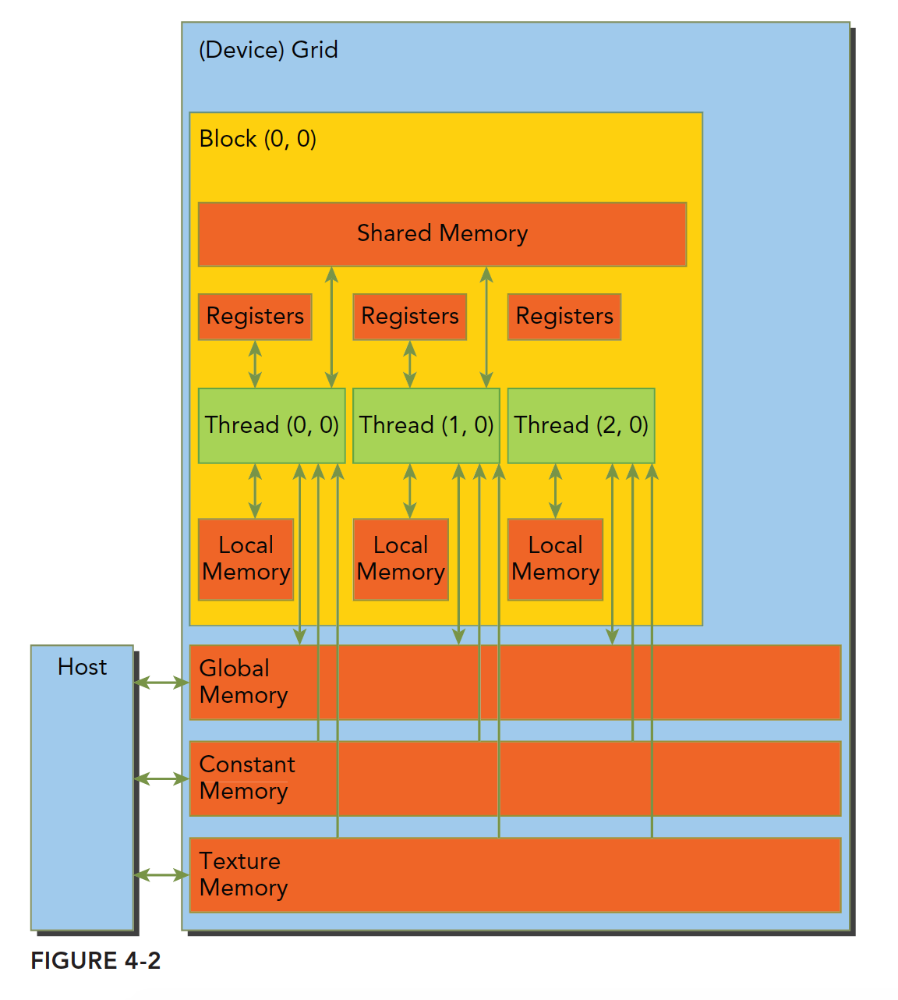

#### 5.1.2.1 延迟与带宽量级速查

对性能优化来说，记住各级存储的**数量级差异**比精确数值更重要（以现代数据中心 GPU 为例）：

| 存储 | 典型延迟（周期） | 典型带宽 | 直观感受 |
|------|----------------|---------|---------|
| 寄存器 | ≈ 1 | — | 手边的草稿纸 |
| 共享内存 / L1 | ~20-30 | ~10 TB/s 级（片上聚合） | 桌上的书 |
| L2 缓存 | ~200 | ~5 TB/s 级 | 书架上的书 |
| 全局内存（HBM） | ~400-800 | 1~3 TB/s | 图书馆借书 |
| 主机内存（经 PCIe/NVLink） | ~10⁴+ | 16~64 GB/s（PCIe 4/5） | 从外地邮寄 |

> [!IMPORTANT]
> 注意最后一行：**主机↔设备的 PCIe 传输带宽比显存带宽低 1~2 个数量级**。这就是"能不传就不传、数据尽量留在 GPU 上"这条黄金法则的由来。

### 5.1.3 寄存器与本地内存

有了全景图，下面按"由快到慢"的顺序逐一认识各类可编程内存，先从速度最快的寄存器和与它关系密切的本地内存说起。

**寄存器文件**：存储线程局部变量，通常由编译器分配，是最快的存储——内核里一个不加任何修饰符的 `float sum = 0.f;` 通常就住在寄存器里。但寄存器是有硬性预算的：现代架构下**每个 SM 有 65536 个 32 位寄存器（共 256 KB），每个线程最多使用 255 个**。要将线程块调度到 SM 中，*每个线程所需的寄存器数 × 线程块中的线程数* 必须小于等于 SM 中可用的寄存器总量。寄存器用量过大有两个后果：限制驻留块数（降低占用率，见第 4 章），或发生 **寄存器溢出（register spilling）**——放不下的变量被"挤"到本地内存。

**本地内存**：名字带"本地"，听起来应该很快？恰恰相反——它物理上位于设备 DRAM（经 L1/L2 缓存），**访问延迟与全局内存同级**，"本地"仅指它归单个线程私有。官方文档给出了变量会被编译器放进本地内存的三种典型情况：

1. **无法用常量下标访问的数组**——"运行时才知道访问哪个元素"的数组没法拆进寄存器；
2. **过大的结构体或数组**——寄存器预算装不下；
3. **寄存器溢出**——内核使用的寄存器超过可用上限。

```c++
__global__ void kernel(int k) {
    float a = 1.0f;           // 寄存器：普通标量
    float b[4] = {0, 1, 2, 3};
    float x = b[1];           // 寄存器：常量下标，编译器可把 b 拆成 4 个寄存器
    float y = b[k];           // 本地内存：下标 k 运行时才确定 → 无法放寄存器
    float big[1024];          // 本地内存：太大，寄存器装不下
}
```

查看内核的寄存器用量与溢出情况：

```bash
nvcc -O3 --ptxas-options=-v kernel.cu
# 输出示例：Used 40 registers, 0 bytes spill stores, 0 bytes spill loads
#           ↑ 寄存器用量       ↑ 溢出写            ↑ 溢出读（非 0 即发生了溢出）
```

> [!TIP]
> 看到 `spill stores/loads` 非零先别慌：少量溢出若能被 L1 接住，影响有限；大量溢出才需要动手——精简局部变量、把大内核拆小，或用 `__launch_bounds__` 提示编译器在寄存器与占用率之间重新权衡。

### 5.1.4 共享内存（概览）

共享内存可用于线程块内线程之间的数据交换（分配以线程块为级别进行）。它是片上低延迟存储，常被称为"可编程的缓存"。

"可编程的缓存"这个称呼值得咂摸：L1/L2 里放什么、什么时候换出，都是硬件说了算；而共享内存放什么、放多久，**完全由你的代码说了算**——它相当于车间（SM）里一块由工人自己管理的公共工作台。绝大多数共享内存的用法都遵循同一个"三步曲"：

```c++
__shared__ float tile[256];              // ① 声明：块内所有线程可见
tile[threadIdx.x] = g_in[idx];           // ② 装载：每人从全局内存搬一件（合并读）
__syncthreads();                         //    等全组装载完毕（栅栏同步，第 3 章）
float v = tile[255 - threadIdx.x];       // ③ 复用：之后随便怎么读，都是片上速度
```

每个线程块能用的共享内存有限（默认上限 48 KB，新架构可申请更多），用量还会反过来影响占用率——这些细节连同 bank 结构与冲突优化见[5.3 节](#53-共享内存深入bank-与-bank-冲突)。

### 5.1.5 常量内存与纹理内存

除了寄存器和共享内存这两类通用片上资源，GPU 还提供两类带专用缓存的只读内存，适合特定访问模式。

#### 5.1.5.1 常量内存

使用 `__constant__` 声明，容量通常为 64 KB，设备端只读。当 warp 内所有线程读**同一个地址**时经常量缓存一次广播完成，效率极高；若各线程读不同地址则串行化。适合存放系数、查找表等所有线程共用的只读参数。

```c++
__constant__ float coef[9];                       // 文件作用域声明

// 主机端写入常量内存（不能用 cudaMemcpy）
float h_coef[9] = {...};
cudaMemcpyToSymbol(coef, h_coef, sizeof(h_coef));

__global__ void stencil(const float *in, float *out, int n) {
    int i = blockIdx.x * blockDim.x + threadIdx.x;
    float sum = 0.f;
    #pragma unroll
    for (int k = 0; k < 9; k++)
        sum += coef[k] * in[i + k];   // warp 内全体读同一 coef[k] → 广播，几乎零成本
    out[i] = sum;
}
```

#### 5.1.5.2 纹理内存

经由只读纹理缓存访问，针对 2D 空间局部性做了优化，还提供硬件级的边界处理和插值，常用于图像处理。现代 CUDA 中普通只读数据更常用 `__ldg()` / `const __restrict__` 走只读数据缓存：

```c++
__global__ void kernel(const float * __restrict__ in, float *out) {
    // 编译器可将 in 的读取路由到只读缓存（等价于 __ldg(&in[i])）
    ...
}
```

### 5.1.6 全局内存

最后来到容量最大、也是日常编程中打交道最多的全局内存。GPU 和 CPU 都有各自直连的 DRAM 芯片：**与 GPU 直连的 DRAM 被称为全局内存（显存），与 CPU 直连的 DRAM 被称为系统内存或主机内存**。多 GPU 系统中，每个 GPU 都有自己的 DRAM。

- 全局内存是容量最大、延迟最高、最常用的内存，用 `cudaMalloc` 分配或 `__device__` 静态声明。
- 从 host 启动的 CUDA kernel 返回值是 `void`，因此**内核把计算结果返回给主机的唯一方法就是将结果写入全局内存**，再由主机 `cudaMemcpy` 拷回。
- 与 CPU 类似，GPU 也使用虚拟内存寻址，并且 CPU 和 GPU 共用一个统一的虚拟地址空间（对于给定的虚拟地址，可以确定它位于 GPU 内存还是系统内存中；在多 GPU 系统中，还可以确定位于哪个 GPU 上）。

全局内存的访问效率是大多数内核的性能瓶颈所在，其访问机制（段、缓存行、事务、合并）在[5.2 节](#52-全局内存访问深入合并法则访问模式与硬件机制)深入展开。

### 5.1.7 内存管理：分配、传输与主机侧内存机制

认识完设备侧的各类内存，再看主机侧如何管理它们——分配、初始化、传输，以及几种加速主机与设备之间数据交换的机制。

#### 5.1.7.1 内存分配、初始化与释放

每个 CUDA 程序都包含这一步——分配设备内存：

```c++
cudaError_t cudaMalloc(void **devPtr, size_t count);
```

这个函数唯一要注意的是第一个参数：**指针的指针**。一般的用法是先声明一个指针变量，再调用这个函数：

```c++
float *devMem = NULL;                          // 初始化为 NULL，避免野指针
cudaMalloc((float **)&devMem, count);          // 传入指针的地址
```

为什么要传指针的指针？因为 `cudaMalloc` 要**修改 `devMem` 本身的值**（让它指向分配好的设备内存），所以必须把它的地址传给函数——如果直接把 `devMem` 按值传递，函数返回后指针的内容还是 NULL。

分配完成后，可以用下面的函数初始化（用法和 C 的 `memset` 类似，但注意操作的物理内存在 GPU 上）：

```c++
cudaError_t cudaMemset(void *devPtr, int value, size_t count);
```

当分配的内存不再使用时，释放它：

```c++
cudaError_t cudaFree(void *devPtr);
```

注意参数必须是之前 `cudaMalloc` 类函数分配的空间——输入非法指针参数会返回 `cudaErrorInvalidDevicePointer` 错误，重复释放同一块空间也会报错。

#### 5.1.7.2 内存传输

主机线程不能直接解引用设备内存的指针，设备线程也不能直接访问普通主机内存，因此需要显式传输数据：

```c++
cudaError_t cudaMemcpy(void *dst, const void *src, size_t count,
                       enum cudaMemcpyKind kind);
```

注意这里的参数是指针（不是指针的指针）：第一个参数 `dst` 是目标地址，第二个参数 `src` 是源地址，然后是拷贝的字节数，最后是传输方向：

- `cudaMemcpyHostToHost`
- `cudaMemcpyHostToDevice`
- `cudaMemcpyDeviceToHost`
- `cudaMemcpyDeviceToDevice`

两个新人常踩的点，提前说破：

- **`cudaMemcpy` 是同步阻塞的**——函数返回时拷贝已经完成，主机线程在此期间被卡住。想让传输和计算重叠，要用 `cudaMemcpyAsync` + 流（第 6 章的主题）；
- **方向参数写错不会有编译错误**——比如把 `cudaMemcpyHostToDevice` 误写成 `cudaMemcpyDeviceToHost`，编译照样通过，运行时才报错。拿不准时可以用 `cudaMemcpyDefault` 让运行时根据指针自动判断方向（依赖统一虚拟寻址，见 5.1.7.5）。

任何带数据传输的 CUDA 程序都有这两步：从主机到设备 → 计算 → 从设备到主机，如图：

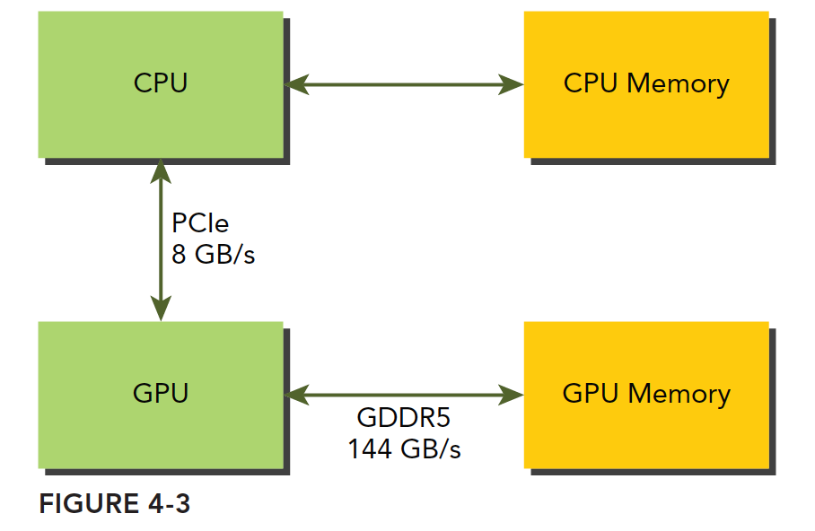

> [!NOTE]
> 处理二维数据时，官方还提供 `cudaMallocPitch` / `cudaMemcpy2D`：它们会自动在每行末尾做填充（pitch），保证每一行的起始地址都满足对齐要求——这正是 5.2 节将展开的"对齐访问"在 API 层面的体现。

#### 5.1.7.3 锁页内存（Pinned / Page-locked Memory）

主机内存采用**分页式管理**：操作系统把物理内存分成一些"页"，应用程序拿到一大块内存，但这块内存可能落在一些不连续的物理页上——应用只能看到虚拟地址，而操作系统可能随时更换页对应的物理位置（把数据从一处复制到另一处），应用对此毫无察觉。但从主机向设备传输数据时，如果恰好发生页面移动，对传输操作来说是致命的。所以在数据传输之前，CUDA 驱动会**先锁定页面**，或者干脆**直接分配固定的（锁页）主机内存**：

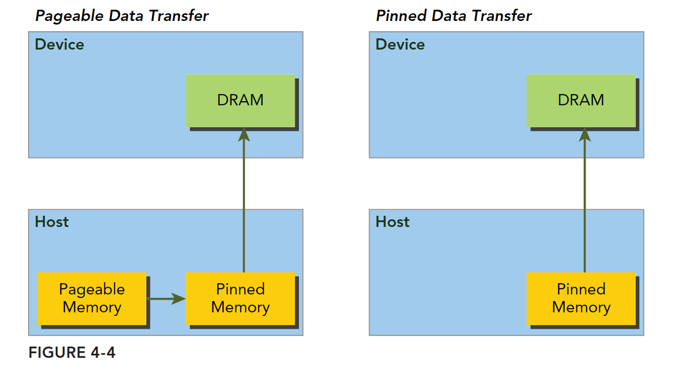

- **左图（可分页内存）**：`malloc` 分配，传输过程是"锁页 → 复制到内部固定缓冲区 → 复制到设备"，多一次中转；
- **右图（固定内存）**：分配时就是锁页的，直接 DMA 传输到设备。

用 `cudaMallocHost` 分配锁页内存：

```c++
float *h_buf;
cudaMallocHost(&h_buf, bytes);    // 锁页内存：更高传输带宽 + 支持异步拷贝
...
cudaFreeHost(h_buf);
```

> [!WARNING]
> 锁页内存是把双刃剑：它把物理页从操作系统的分页管理中"扣"了出来，分配过多会挤压系统可用内存、拖慢整机性能（官方 Best Practices Guide 特别提醒 *"Excessive use can reduce overall system performance"*）。原则：**只对参与主机↔设备传输的大缓冲区使用锁页内存**，用完及时 `cudaFreeHost`。它还是第 6 章异步拷贝（`cudaMemcpyAsync`）真正异步生效的前提条件。

#### 5.1.7.4 零拷贝内存（Zero-Copy）

零拷贝是**映射到设备地址空间的锁页主机内存**——GPU 线程可以直接读写主机内存，省去显式拷贝：

```c++
float *h_ptr, *d_ptr;
cudaHostAlloc(&h_ptr, bytes, cudaHostAllocMapped);   // 分配可映射的锁页内存
cudaHostGetDevicePointer(&d_ptr, h_ptr, 0);          // 取得设备侧指针
kernel<<<grid, block>>>(d_ptr, n);                   // 内核直接访问主机内存
```

适用场景：数据只被 GPU 访问一次（如流式处理）、或设备内存不足时。**频繁访问则性能极差**（每次都走 PCIe）。

#### 5.1.7.5 统一虚拟寻址（UVA）与统一内存

- **UVA（Unified Virtual Addressing，统一虚拟寻址）**：主机与所有设备共享同一个虚拟地址空间——设备内存和主机内存被映射到同一虚拟地址空间中，指针本身可辨别其位置（`cudaMemcpy` 可用 `cudaMemcpyDefault` 自动判断方向）：

  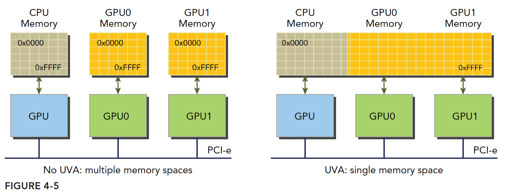

- **统一内存（Unified/Managed Memory）**：CUDA 6.0 引入，目的是进一步简化内存管理。它在统一的内存空间中创建一个**托管内存池**（CPU 侧、GPU 侧都有），内存池中已分配的空间可以通过**同一个指针**直接被 CPU 和 GPU 访问，底层系统自动完成设备和主机间的数据传输——传输对应用透明，大大简化了代码（`cudaMallocManaged`，见第 3 章 3.6 节示例）。

一句话区分：**UVA 只是"地址统一"，统一内存才是"数据自动搬家"**。

统一内存还配有两个"性能补丁"，在你明确知道数据将被谁访问时，提前给运行时提示、避免按需迁移（缺页）的开销：

```c++
cudaMemPrefetchAsync(ptr, bytes, deviceId, stream);        // 提前把数据搬到目标设备
cudaMemAdvise(ptr, bytes, cudaMemAdviseSetReadMostly, 0);  // 声明访问特征（如"以读为主"）
```

> [!NOTE]
> 统一内存好用但不免费：跨处理器的按需迁移有明显开销。官方的定位是——**统一内存用于快速原型和简化开发；追求极致性能时，仍推荐显式 `cudaMalloc` + `cudaMemcpy` 精确控制数据位置**（即使用了统一内存，也应尽量让数据留在访问它的处理器一侧）。

### 5.1.8 L1/L2 缓存

以上都是可编程内存；本部分最后看不可编程的缓存——虽然无法直接控制，但理解其结构对访存优化至关重要。

- 每个 SM 单元都有一个 **L1 缓存**，它是统一数据缓存的一部分（Volta 之后 L1 与共享内存共用同一片片上 SRAM，可动态划分容量）。
- GPU 内的所有 SM 共享一个更大的 **L2 缓存**。**所有**全局内存访问都会经过 L2。L2 的缓存行大小为 **32 字节**——这就是为什么在现代 GPU（Compute Capability 6.0+）上，全局内存访问的基本事务粒度是 32 字节。
- 每个 SM 还有独立的**常量缓存**。

L1 与 L2 的缓存行大小为什么不同（L1 是 128 字节、L2 是 32 字节）、两级缓存如何协同工作，是理解全局内存访问效率的关键，[5.2 节](#52-全局内存访问深入合并法则访问模式与硬件机制)将展开完整分析。

### 5.1.9 小结（内存模型基础）

- 存储层次围绕**局部性**设计：越靠近计算单元越快越小（寄存器 → 共享内存/L1 → L2 → 全局内存 → 主机内存）；
- 六类可编程内存的关键词：寄存器（线程私有最快）、共享内存（块内协作）、本地内存（寄存器溢出，实际在 DRAM）、常量内存（只读广播）、纹理内存（2D 局部性）、全局内存（容量最大、主战场）；
- **PCIe 传输带宽比显存带宽低 1~2 个数量级**——数据尽量留在 GPU 上；
- 锁页内存提高传输带宽且是异步拷贝前提；零拷贝适合单次访问；统一内存 = UVA + 自动迁移；
- 每 SM 一个 L1（行 128 B），全芯片共享一个 L2（行 32 B），所有全局访存必经 L2。

### 5.1.10 动手练习

1. 用 `--ptxas-options=-v` 编译第 4 章的归约内核，记录寄存器用量；在内核里声明一个 `float tmp[64]` 并用变量下标访问，再次编译，观察本地内存（spill/local）的变化；
2. 写一个 pageable vs pinned 内存的 H2D 传输对比测试（各拷 1 GB，用事件计时），验证锁页内存的带宽优势；
3. 用 `__constant__` 存放一个 16 元素系数表实现简单卷积，对比把系数放在全局内存的版本；
4. 估算你的 GPU 上"读一次全局内存的延迟内，一个 SM 能做多少次 FMA"，体会为什么访存优化通常比计算优化更重要。

---
## 5.2 全局内存访问深入：合并法则、访问模式与硬件机制

5.1 节提到全局内存是大多数内核的性能瓶颈所在，本部分就来彻底弄清怎么把它用好。组织顺序是**先给结论、再给原理**：

- **实用篇（5.2.1~5.2.6）**：只需记住三条硬件事实，就能看懂全部访问模式图解、做出 AoS/SoA 与矩阵转置的优化决策，并用基准程序亲手验证；
- **进阶选读（5.2.7~5.2.12）**：把这三条事实追到硬件根源（段、事务、缓存行），第一遍可以跳过，不影响写出高效代码。

> 全部分只有一条主线：**warp 是访存的基本单位——warp 内 32 个线程的内存请求会被硬件合并（coalesce）成尽可能少的内存事务**。事务越少、每个事务中有效数据越多，带宽利用率越高。（内容依据 CUDA C++ Programming Guide §8.3.2、Best Practices Guide §10.2 与 PTX ISA §9.7.9.1，正文尽量以中文结论呈现，不再逐段摘抄原文。）

在钻进细节之前，先用一个贯穿本部分的类比把直觉立起来。把 DRAM 想象成一座**只按"整箱"发货的仓库**：

- 货架按固定尺寸分箱（32/64/128 字节）——这是**内存段**；
- 每次出库必须搬走完整的一箱，哪怕你只要其中一件——这是**内存事务**的"全取或不取"；
- 车间门口有两级暂存区：每个车间私有的小货架（L1，整筐 128 字节）和全园区共享的中央仓（L2，小箱 32 字节）——这是**缓存行**；
- 一个 warp 的 32 个工人同时来领料，管理员会把 32 张领料单**拼单**成尽可能少的整箱搬运——这就是**合并访问**。

优化访存的全部秘密就一句话：**让 32 张领料单尽量落在同几个箱子里**。

---

### 5.2.1 Warp 视角的内存访问

一切分析从"谁在发出内存请求"开始。GPU 的硬件执行模型中，**Warp（线程束）是 GPU 执行的基本调度单位，由 32 个线程组成**。当一个 warp 执行一条访问全局内存的指令时，这 32 个线程各自产生的内存地址会被硬件**合并（coalesce）**为尽可能少的**内存事务（memory transactions）**。

为什么讨论访存效率必须以 warp 为单位？因为 SM 执行的基础是线程束——当一个 SM 中正在被执行的某个线程需要访问内存时，**和它同线程束的其他 31 个线程也在执行同一条访存指令**。对应到仓库类比：领料从来不是一个人去，而是整组 32 人同时递单——所以分析"一次访存花多少"，看的不是单张领料单，而是整组单子最终**拼成了几箱**。

全局内存通过缓存实现加载的路径如下图：


### 5.2.2 合并访问的黄金法则

先把三条硬件事实当"公理"记下来（它们为什么成立，5.2.7 节起的进阶部分会给出完整推导；第一遍读先接受即可）：

1. **最小搬运单位是 32 字节**：现代 GPU（CC 6.0+）访问全局内存，一次事务固定搬运一"箱"32 字节；
2. **箱子的位置是固定的**：每箱只能从 32 的整数倍地址开始（**自然对齐**），整个地址空间就像预先划好格子的货架；
3. **整箱搬运、全取或不取**：不管 warp 实际需要几个字节，触碰到哪个箱子就得搬走整箱。

三条合起来，就得到全局内存优化的**黄金法则**：

> **让 warp 中的 32 个线程访问连续且对齐的地址**——此时 32 张领料单恰好拼成最少的箱数，搬回来的每个字节都有用，带宽利用率 100%。

用最常见的情形算一笔账：32 个线程各读一个 `float`（4 字节），warp 总需求 = 128 字节 = 4 箱。看四种典型访问模式各要搬几箱：

```text
情况1：连续对齐（stride=1，起始地址是 32 的倍数）
  首地址 [0, 4, 8, ..., 124] → 覆盖 [0,32) [32,64) [64,96) [96,128)
  → 4 箱，128/128 字节有效，利用率 100%（最优）

情况2：连续但非对齐（起始地址偏移 4 字节）
  首地址 [4, 8, 12, ..., 128] → 两头各多占半箱，共 5 箱
  → 5 箱，128/160 字节有效，利用率 80%

情况3：跨步访问（stride=2，隔一个取一个）
  首地址 [0, 8, 16, ..., 248] → 覆盖 [0,256) 的全部 8 箱
  → 8 箱，128/256 字节有效，利用率 50%

情况4：极端跨步（stride=32）
  首地址 [0, 128, 256, ..., 3968] → 32 个互不相邻的箱子
  → 32 箱，128/1024 字节有效，利用率约 3%
```

| 访问模式 | 事务（箱）数 | 带宽利用率 | 一句话点评 |
|---------|------------|-----------|----------|
| 连续 + 对齐 | 4 | 100% | 完美拼单，黄金法则的样子 |
| 连续 + 非对齐 | 5 | 80%（实测约 90%） | 多搬一箱；L1 会让相邻 warp 复用多搬的数据，实际损失更小 |
| 跨步 stride=2 | 8 | 50% | 每箱有一半是没人要的 |
| 跨步 stride=32 | 32 | ~3% | 每人独占一箱、各拿一件，几乎全是浪费 |

> [!IMPORTANT]
> 非对齐和跨步谁更糟？**跨步**。非对齐多搬的箱子往往会被相邻 warp 用上（L1 缓存行复用，见 5.2.11.3 节）；而跨步跳过的数据没有任何线程需要，是纯粹的浪费，且跨步越大浪费越狠。所以优化优先级是：**先消跨步，再抠对齐**。

> [!TIP]
> 一个顺手的进阶技巧——**向量化访问**：全局内存指令支持单线程一次读写 1/2/4/8/16 字节，用 `float4`/`int4` 等宽类型让一条指令搬 16 字节，warp 总请求量不变，但访存**指令数**减为 1/4，可显著降低指令发射压力（第 8 章优化清单会再次出现）。前提是宽类型的地址必须按其大小对齐——非对齐的 8/16 字节访问会**读出错误数据**（见 5.2.7.5 节）。

掌握这条法则和这张利用率表，你已经能做出大部分访存优化决策。接下来把各种访问模式逐一画出来看个明白。

### 5.2.3 全局内存加载的访问模式图解

有了黄金法则，本节把各种典型访问模式逐一画出来，按"经 L1 加载、经 L2 加载、写入"三种路径分别分析带宽利用率。先交代一个马上会在小节标题里出现的编译开关：`-Xptxas -dlcm=ca`（默认）表示加载**经 L1+L2 缓存**、以 128 字节（L1 缓存行）为粒度；`-Xptxas -dlcm=cg` 表示**绕过 L1、只经 L2**、以 32 字节为粒度（背后的机制见进阶篇 5.2.10 节）。再明确两个基本概念：

- **对齐内存访问（Aligned Memory Access）**：当内存事务的第一个地址是缓存粒度（32 字节的 L2 或 128 字节的 L1）的整数倍时就是对齐内存访问。运行非对齐的加载会造成带宽浪费。
- **合并内存访问（Coalesced Memory Access）**：当一个线程束中全部 32 个线程访问一个连续的内存块时，就是合并内存访问。

再结合缓存层次理解：GPU 全局内存的组织基于固定大小的内存段，其划分依据与硬件缓存层次及内存控制器设计密切相关

- **缓存行**：GPU 缓存（L1、L2）以缓存行为最小数据管理单元（L1 行 128 字节、L2 行 32 字节）。对线程而言，**读取全局内存一定会经过 L1/L2 缓存中的至少一个进行加载**；
- **内存控制器传输粒度**：DRAM 控制器以固定大小的内存事务为基本传输单位，该单位与缓存行或其倍数对齐。

由此，是否对齐就分为：

- **对齐访问（Aligned Access）**：数据访问严格限定于单个内存事务的边界内，无需拆分请求；
- **未对齐访问（Unaligned Access）**：数据访问跨越内存事务边界（如 32/128 字节边界），需拆分为多个事务处理。

先看一个基准情形：一个线程束加载数据，使用一级缓存，并且这个事务所有请求的数据都在一个对齐的内存数据段上（首地址是访问粒度的整数倍）。例如，**地址 128 ~ 地址 255 是使用一级缓存后的对齐内存数据段，按照线程顺序访问的数据是连续的**（线程 0 访问地址 128-131，线程 1 访问地址 132-135，……）：


如果一个事务加载的数据**不在一个对齐的内存数据段**上，则分为两种情况：

- **不对齐，但连续**：比如请求访问的数据分布在内存地址 1~128，那么 0~127 和 128~255 这两个内存数据段的数据要通过两次事务加载到 SM 上；
- **不对齐，也不连续**：如下图，大部分数据在地址 128~255 上（绿色部分，这部分数据在一个数据段上，一个事务即可），但存在个别（红色箭头）线程请求其他内存数据段的数据，需要多次事务才能完成访问。


#### 5.2.3.1 全局内存读之使用一级缓存加载（`-Xptxas -dlcm=ca`，默认）

**此时内存事务的粒度为 128 字节（warp最先接触的是L1，所以读也是一个 L1 缓存行）。** 各种访问模式的利用率如下：

**（1）对齐、连续**：warp 全部 128 字节落在一个 128 字节缓存行内，1 个事务，利用率 **100%**：


**（2）对齐、但线程访问顺序打乱（交叉不连续）**：只要访问的地址仍落在同一个 128 字节段内，仍然 1 个事务，利用率 **100%**（硬件不关心 warp 内线程与地址的对应顺序，只关心地址集合覆盖了哪些段）：


**（3）非对齐、但连续**：数据跨越两个 128 字节段，需要**两个 128 字节事务**来完成，利用率 50%：


**（4）warp 内所有线程请求同一个地址**：数据必然落在一个缓存行内，1 个事务。如果每个线程请求 4 字节，则利用率为 $\frac{4}{128} \times 100\% = 3.125\%$：


**（5）最坏情况：warp 请求 32 个分散地址**：请求的数据分布在 N 个（$1 \leq N \leq 32$）缓存行上，需要 N 个事务，利用率为 $\frac{1}{N}$（N=32 时为 $\frac{128}{4096} = 3.125\%$）：


#### 5.2.3.2 全局内存读之使用二级缓存加载（禁用一级缓存，`-Xptxas -dlcm=cg`）

**当不使用一级缓存时，一定会使用二级缓存(此时，warp最直接接触的是L2)。此时内存事务的粒度变为 32 字节。更细的粒度意味着更高的潜在利用率**——对于分散/非对齐访问，加载的"无用数据"更少。逐一图解各种访问模式：

1. **对齐、合并访问 128 字节**：最理想的情况，恰好使用 4 个段，利用率 **100%**：

   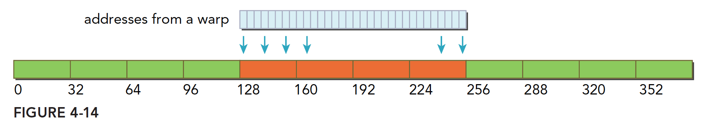

2. **对齐、但线程访问顺序打乱**：所有地址仍落在 4 个段内且互不重复，利用率同样是 **100%**：

   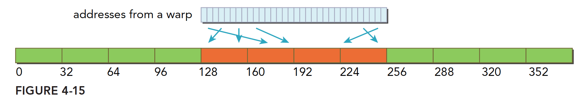

3. **连续、但不对齐**：一个段 32 字节，一个连续的 128 字节请求即使不对齐，最多也不会超过 5 个段（注意前提是"连续"，因此不可能超过五段），利用率 $\frac{4}{5} = 80\%$——优于 L1 模式的 50%（两个 128 字节段共 256 字节）：

   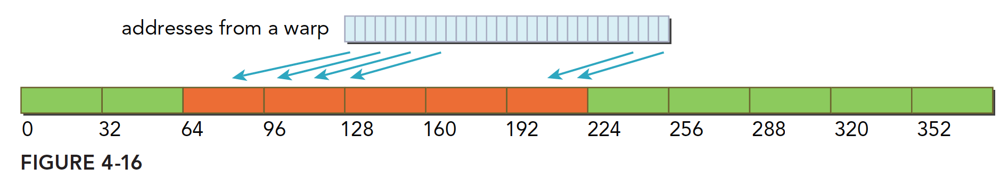

4. **所有线程访问同一个 4 字节地址**：1 个 32 字节事务，利用率 $\frac{4}{32} = 12.5\%$——优于 L1 模式的 3.125%：

   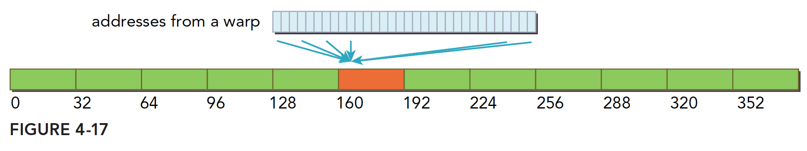

5. **最坏的情况：目标数据分散在内存的各个角落**：需要 N 个内存段。此时与使用一级缓存相比也是有优势的——因为 $N \times 128$ 字节比 $N \times 32$ 字节大不少。这里假设 N 不随粒度变化；实际情况中使用大粒度缓存行时 N 有可能会减小（多个分散地址恰好落进同一个 128 字节行）：

   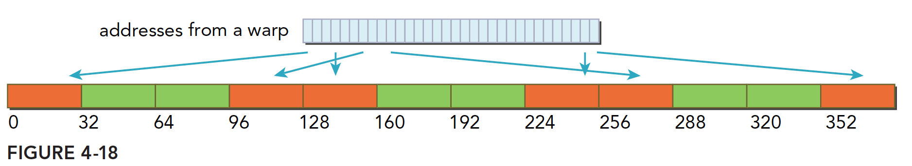

> [!TIP]
> 规律：**访问越规整（对齐 + 连续），L1 大粒度越有利（预取+复用）；访问越分散，细粒度（32 字节）越有利（少拉无用数据）**。CC 6.0+ 硬件已统一为 32 字节数据访问单元，兼得两者优点。

#### 5.2.3.3 全局内存写入

写入相对简单：**较新 GPU 架构中，写入不经过一级缓存，只经过二级缓存**（store 默认 `.wb`/`.cg` 语义在 L2 聚合）。内存写入（存储）操作在 **32 字节的粒度**上执行，内存事务相应分为**一段（1 × 32 B）、两段（2 × 32 B = 64 B）、四段（4 × 32 B = 128 B）事务**。

事务合并的机制：合并是硬件自动进行的（事务合并的支持性也由硬件决定），当访问模式满足条件时，会生成更大的合并事务，而不是多次小事务。硬件的事务合并能力取决于内存访问的对齐性和 warp 访问模式：

- **一段事务（32 B）**：
  - 触发条件：线程束的访问地址无法合并为更大的段（如分散访问、未对齐到 64 B/128 B 边界）；
  - 示例：32 个线程写入非连续的 32 B 段（每个线程写入不同段），需拆分为多个一段事务。
- **两段事务（64 B）**：
  - 触发条件：线程束的访问地址在 64 B 范围内连续且对齐到 64 B 边界；
  - 示例：32 个线程写入 2 个连续的 32 B 段，合并为一个 64 B 事务。
- **四段事务（128 B）**：
  - 触发条件：线程束的访问地址在 128 B 范围内连续且对齐到 128 B 边界；
  - 示例：32 个线程写入 4 个连续的 32 B 段，合并为一个 128 B 事务。

> 换句话说：如果两个地址同在一个 128 字节段内但不在同一个 64 字节范围内，则会产生**一个四段**事务；其他情况以此类推。

图解三种典型写入情况：

**（1）对齐、访问一个连续的 128 字节范围**：写入操作使用**一个四段事务**完成：


**（2）分散在一个 192 字节范围内、不连续**：使用**三个一段事务**完成：


**（3）对齐、并且在一个 64 字节范围内连续**：使用**一个二段事务**完成：


### 5.2.4 数据布局：AoS 与 SoA

访问模式很大程度上由数据布局决定——同样的数据，布局不同，合并程度可以天差地别。最典型的对比就是 AoS 与 SoA。

**数组的结构体（AoS，Array of Structures）**就是一个数组、每个元素是一个结构体；**结构体的数组（SoA，Structure of Arrays）**则是结构体中的每个成员是数组。用代码表示：

```c++
// AoS：数组的结构体
struct A {
    int a;
    int b;
};
struct A aos[N];      // 内存布局：a0 b0 a1 b1 a2 b2 ...

// SoA：结构体的数组
struct {
    int a[N];
    int b[N];
} soa;                // 内存布局：a0 a1 a2 ... b0 b1 b2 ...
```

当 32 个线程同时各自访问自己的 `a` 成员时，SoA 的访问是连续的（一个 warp 读到的全是有用的 `a`），而 AoS 则是间隔跨步的（每读 128 字节只有一半是 `a`，另一半 `b` 被白白拉进来）：


并行编程范式，尤其是 SIMD（单指令多数据）对 SoA 更友好。**CUDA 中普遍倾向于使用 SoA，因为这种内存访问模式可以被有效地合并**，带宽利用率更高。

> [!NOTE]
> "SoA 优先"不等于"AoS 一无是处"：如果每个线程**总是同时用到一个元素的全部字段**（比如粒子的 x/y/z/w 四个分量一起参与计算），把结构体凑成 16 字节、按 `float4` 整体读取，AoS 同样可以完全合并。判断标准始终回到本质——**warp 一次实际触碰的字节是否连续、对齐、无浪费**，AoS/SoA 只是达成这一目标的不同布局手段。

### 5.2.5 实例分析：矩阵转置

前面的结论多是"规则化访问"的一般原理；矩阵转置则是一个读写两侧无法同时合并的经典难题，正好用来检验这些原理如何指导实际决策。

#### 5.2.5.1 问题与 CPU 实现

给定一个二维矩阵，其转置结果如下：


使用串行编程很容易实现：

```c++
void transformMatrix2D_CPU(float *MatA, float *MatB, int nx, int ny) {
    for (int j = 0; j < ny; j++) {
        for (int i = 0; i < nx; i++) {
            MatB[i * nx + j] = MatA[j * nx + i];
        }
    }
}
```

#### 5.2.5.2 内存视角：读合并、写交叉

从真实的内存布局角度看（内存硬件层面都是一维排布），转置的数据流动是这样的：

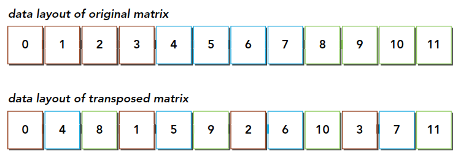

> 注意图中的颜色：读的过程中同一颜色可以看成是合并读取的，但转置发生后**写入的过程是交叉的**。交叉访问是内存访问性能变差的罪魁祸首，但作为矩阵转置本身，读写两侧总有一侧的交叉是无法避免的。在这种无法避免的前提下如何提升效率，就是一个有趣的课题。

#### 5.2.5.3 按行读还是按列读？——L1 缓存的作用

考虑两种线程到数据的映射方法：


1. **按行读（合并读）、按列写（交叉写）**；
2. **按列读（交叉读）、按行写（合并写）**。

最初的直觉是：按照方法一合并读更有效率——因为写的时候不经过一级缓存，那么对于开启一级缓存的程序，合并的读取应该更有效率。**但这个直觉是不对的。**

需要补充一级缓存的一个关键作用：内存发起加载请求时，会先在 L1 里查找数据，如果有就是一次**命中**（这与 CPU 缓存原理相同），命中就不需要再访问全局内存。用在这个例子里：虽然按列读是不合并的（每次 128 字节的加载中只有 4 字节有用），但这些"多加载"的数据并不会被马上覆盖——L1 的容量有几十 KB 甚至更大。当读下一列时，理想情况下所需元素已经在 L1 中，直接从缓存读取即可。因此**方法二（交叉读 + 合并写）反而更快**：读侧的交叉损失被 L1 命中吸收，而写侧（不经过 L1、无法靠缓存补救）保持了合并。

> 结论：**在读、写只能保一侧合并的情况下，优先保证"写"合并，让"读"的交叉损失由 L1 缓存来弥补。**

#### 5.2.5.4 GPU 朴素实现

矩阵转置：对于一个形状为 $N \times N$ 的矩阵 A，转置为矩阵 C：


实现代码如下（对应 [`code/transpose_smem.cu`](code/transpose_smem.cu) 中的版本 1）：

```c++
/* macro to index a 1D memory array with 2D indices in row-major order */
/* ld is the leading dimension, i.e. the number of columns in the matrix */
#define INDX(row, col, ld) (((row) * (ld)) + (col))

// 版本 1：朴素转置（读合并，写交叉——不合并）
__global__ void naiveTranspose(int m, const float *a, float *c) {
    int myCol = blockDim.x * blockIdx.x + threadIdx.x;
    int myRow = blockDim.y * blockIdx.y + threadIdx.y;
    if (myRow < m && myCol < m)
        c[INDX(myCol, myRow, m)] = a[INDX(myRow, myCol, m)];
}
```

说明：

- 对矩阵 A 的**读操作**访问是内存合并的（warp 内相邻线程读相邻地址）；
- 但对矩阵 C 的**写操作**访问没有合并（相邻线程写的地址相隔 m 个元素）。为了缓解这一问题，可以**使用共享内存做中转**：块内先把 A 的一个 tile 合并读入共享内存，再从共享内存按转置后的顺序取出、以合并方式写入 C（详见[5.3.7 节](#537-综合实例一共享内存优化矩阵转置)）。

### 5.2.6 配套基准测试：实测验证访问模式的影响

理论讲完，用实验说话——本节用一个可运行的基准程序，实测非对齐与跨步两类访问模式对有效带宽的影响。

> 本节对应的可运行程序位于本章目录 [`code/main.cu`](code/main.cu)。

#### 5.2.6.1 程序说明

`main.cu` 复现了 Best Practices Guide §10.2.1.3（offset copy）与 §10.2.1.4（strided access）的经典实验，实测两类非理想访问模式对有效带宽的影响：

| 实验 | Kernel | 验证的结论 |
|------|--------|-----------|
| Offset 实验 | `offset_access`：`out[i+offset] = in[i+offset] + 1` | 非对齐访问约损失 10~20% 带宽（见 5.2.7.5 节） |
| Stride 实验 | `stride_access`：`out[i*stride] = in[i*stride] + 1` | stride=2 约 50% 效率，随 stride 增大急剧恶化（见 5.2.11.4 节） |

#### 5.2.6.2 编译与运行

```bash
cd code

# 编译（-O3 优化；架构参数按设备调整，或省略使用默认值）
nvcc -O3 -o mem_benchmark main.cu

# 运行
./mem_benchmark
```

#### 5.2.6.3 预期输出形态

```text
Device: NVIDIA A100-SXM4-80GB (CC 8.0)
Offset array: 64 MB, stride array: 16 MB (x32), block size: 256

=== Offset access (out[i+offset] = in[i+offset] + 1) ===
offset      bandwidth (GB/s)    relative
     0             1550.23        100.0%
     1             1402.11         90.4%      <- 非对齐，约 9/10（L1 复用补偿）
     ...
    32             1548.90         99.9%      <- 偏移 32 元素 = 128B，重新对齐

=== Strided access (out[i*stride] = in[i*stride] + 1) ===
stride      bandwidth (GB/s)    relative
     1             1549.87        100.0%
     2              812.44         52.4%      <- 约 1/2
     4              401.15         25.9%      <- 约 1/4
     ...
    32              48.33           3.1%      <- 极端跨步，~3%
```

具体数值随 GPU 型号变化，但**相对趋势**应与 5.2.7.5、5.2.11.4 节的官方数据一致。

> **测量注意**：数组规模应显著大于 L2 容量（A100 为 40 MB），否则测得的是缓存带宽而非 DRAM 带宽；显存较小的设备可在源码中调小 `kStrideElems`（stride 实验的寻址上界为 `kStrideElems × 32` 个 float）。

---

> **进阶选读分界线**：到这里，"怎么写出高效访存代码"的实用部分已经完整。下面六节（5.2.7~5.2.12）把前面当作公理的三条硬件事实（32 字节、对齐、全取或不取）追到硬件根源——依次回答"DRAM 为什么按段划分""一次访问到底产生几个事务""缓存行是什么""L1/L2 缓存行为何一大一小""一次访存在两级缓存中怎么走"。第一遍学习可以直接跳到 [5.2.13 小结](#5213-小结全局内存)；当你需要用 Nsight Compute 分析事务数、想真正读懂 profiler 指标时，再回来精读。

### 5.2.7 深入硬件（一）：内存段与对齐

进阶之旅从"箱子"的学名说起。5.2.2 节把"硬件按固定大小的箱子发货"当作公理，这个箱子的正式名称是**内存段（segment）**——本节回答它为什么存在、为什么必须对齐。

#### 5.2.7.1 定义

GPU 的设备内存（device memory，即 DRAM / HBM）不是逐字节随意访问的，而是通过固定大小的 **内存段（segment）** 来访问。每次内存事务操作的就是一个完整的段。官方的规定（Programming Guide §8.3.2）翻译过来就一句话：**全局内存只能通过 32、64 或 128 字节的内存事务读写，且事务必须"自然对齐"——段的首地址必须是段大小的整数倍**。

**内存段就是硬件将 DRAM 地址空间按固定大小切分后的每一个地址区块**。全局内存的段大小有三种粒度：

| 段大小 | 对齐要求 | 说明 |
|--------|---------|------|
| 32 字节 | 首地址必须是 32 字节的整数倍 | 最小事务粒度（现代 GPU 的基础事务单元 / L2 缓存行大小） |
| 64 字节 | 首地址必须是 64 字节的整数倍 | 中间粒度 |
| 128 字节 | 首地址必须是 128 字节的整数倍 | 最大事务粒度 / L1 缓存行大小 |

**自然对齐（naturally aligned）** 的含义：一个 N 字节的段，其起始地址必须是 N 的整数倍。例如，一个 128 字节的段只能从地址 0、128、256、384…… 开始。

#### 5.2.7.2 三种段大小同时存在

这三种大小并非互斥，而是同一块 DRAM 的不同"视角"，硬件根据访问情况选择使用哪种粒度：

```text
同一段 DRAM 地址空间（0~256 字节）的三种划分视角：

32 字节段：
  [0,32) [32,64) [64,96) [96,128) [128,160) [160,192) [192,224) [224,256)
   段0    段1     段2     段3       段4        段5        段6        段7

64 字节段：
  [0,64)         [64,128)         [128,192)           [192,256)
   段0             段1              段2                 段3

128 字节段：
  [0,128)                         [128,256)
   段0                              段1
```

每个事务只能读取/写入这些**对齐边界上的完整段**，不能跨段合并，也不能只读取段的一部分（硬件层面总是传输完整段——"全取或不取"）。

#### 5.2.7.3 为什么起始地址必须是段大小的整数倍

这不是人为规定，而是**硬件寻址位运算的数学必然结果**。

以 32 字节段（32 = 2⁵）为例，硬件将地址的低 5 位作为"段内偏移"，高位作为"段号"：

```text
地址位结构（32 字节段，低 5 位为段内偏移）：

 地址(十进制) | 段号(高位) | 段内偏移(低5位) | 说明
      0       |     0      |     00000       | 段0 起点
      4       |     0      |     00100       | 段0 内部
     31       |     0      |     11111       | 段0 末尾
     32       |     1      |     00000       | 段1 起点 ← 32 是 32 的整数倍
     64       |     2      |     00000       | 段2 起点 ← 64 是 32 的整数倍
    128       |     4      |     00000       | 段4 起点 ← 128 是 32 的整数倍
    100       |     3      |     00100       | 段3 内部 ← 100 不是段的起点
```

**段起始地址 = 段号 × 段大小**，因此段的起始地址必然是段大小的整数倍。这是位运算寻址结构的天然结果，不可更改。

同理，这三个粒度（32 / 64 / 128 字节）**由 GPU 芯片的内存控制器物理总线宽度决定，是硬件固化的，程序员无法修改，也无法自定义其他值**（比如 48 字节或 96 字节的段）。

#### 5.2.7.4 非对齐访问触发额外事务

官方结论（Best Practices Guide §10.2.1.2）：**warp 连续但未对齐到 32 字节段的访问，会请求 5 个 32 字节段**（对齐时只需 4 个）；段是"全取或不取"的最小单位，多请求的段里混着无人需要的字节，就是纯粹的带宽浪费。极端情况下浪费可以非常惊人——若每个线程的 4 字节访问都各自触发一个 32 字节事务，吞吐量直接除以 8（Programming Guide §8.3.2）。

具体的地址级分析见下一小节。

#### 5.2.7.5 访问数据时可以不对齐内存段吗？

**答案：可以不对齐，但硬件会自动处理，代价是触发更多事务、浪费带宽。在特殊情况下（8/16 字节宽类型）甚至会产生错误结果。**

**（1）"必须自然对齐"说的是事务，不是数据指针**

官方原文中 "must be naturally aligned" 描述的主语是**内存事务本身**，而非用户数据的起始地址。含义是：

- **你的数据指针**：可以是任意地址，不强制对齐内存段；
- **硬件执行内存事务时**：只能以对齐的段为单位读写 DRAM；
- 如果数据地址跨越了段边界，硬件会**自动拆成多个对齐事务**来覆盖整个数据范围。

**（2）非对齐时硬件的实际行为**

```text
数据地址 [4, 132)（不对齐，起始地址 4 不是 32 的整数倍）：

物理内存段边界：  0     32    64    96    128   160
               |      |     |     |      |     |
你的数据范围：     [4 ...................... 132)

硬件必须覆盖的对齐段：
  [0,  32) ← 段0：其中 [0,4)  共 4 字节不属于你的数据，但必须整段加载
  [32, 64) ← 段1：全部有效
  [64, 96) ← 段2：全部有效
  [96,128) ← 段3：全部有效
  [128,160)← 段4：其中 [132,160) 共 28 字节不属于你的数据，但必须整段加载

结果：5 个事务（对齐时只需 4 个），实际有效数据 128 字节，加载 160 字节，浪费 32 字节
```

**（3）非对齐访问的性能影响**

Best Practices Guide §10.2.1.3 在 Tesla V100 上的实测：理论损失为 4/5 = 80% 吞吐，实测约为 9/10 = 90%——因为 L1 的 128 字节大缓存行使得**相邻 warp 可以复用彼此"多取"的数据**，弥补了部分性能损失（这正是 5.2.2 节利用率表中"实测约 90%"的出处）。

| 情况 | 事务数 | 加载字节 | 有效字节 | 带宽利用率 | 实测吞吐（V100） |
|------|--------|---------|---------|-----------|----------------|
| 对齐访问（地址 % 32 == 0） | 4 | 128 B | 128 B | 100% | 基准 |
| 非对齐访问（地址 % 32 != 0） | 5 | 160 B | 128 B | 80% | ~90%（L1 缓存行复用补偿） |

**（4）特殊情况：8/16 字节宽类型非对齐会产生错误结果**

官方明确警告（Programming Guide §8.3.2）：对于 `double`（8 字节）、`float4` / `double2`（16 字节）等宽类型，**读取未自然对齐的 8/16 字节字会产生错误结果**（错位若干个字）——不只是性能问题，必须严格保证对齐：

```c
// 危险：double 要求 8 字节对齐
double *ptr = (double *)((char *)base + 4);  // 地址偏移 4，不是 8 的倍数
double val = *ptr;  // 产生错误结果！

// 安全：cudaMalloc 保证 ≥256 字节对齐，天然满足所有类型
double *safe_ptr;
cudaMalloc(&safe_ptr, N * sizeof(double));   // 地址保证 8 字节对齐
```

#### 5.2.7.6 cudaMalloc 的对齐保证

官方保证（Programming Guide, Device Memory Accesses）：**全局内存中的变量地址，以及运行时/驱动 API 内存分配函数返回的地址，总是至少对齐到 256 字节**。所以通过 `cudaMalloc` / `cuMemAlloc` 分配的内存，其起始地址天然满足所有基本类型的对齐要求。

> [!NOTE]
> 对于 PyTorch 张量，`torch.Tensor.data_ptr()` 返回的是以"字节"为单位的地址。实际验证中会发现其地址往往与 512 B 对齐。这是因为在 `backend:native`（PyTorch 默认 CUDA caching allocator）下，PyTorch 会把请求大小按 512 B 做 round 和 split，因此返回地址常常表现为 512 B 对齐。**但严格来说，PyTorch 并没有在 API 文档里承诺过"永远 512 B 对齐"，它更像是当前默认分配策略导致的结果**。

### 5.2.8 深入硬件（二）：内存事务与事务粒度

段回答了"DRAM 按什么单位划分"，接下来看硬件按什么单位传输——内存事务，以及一次 warp 访问到底会产生多少个事务。

#### 5.2.8.1 定义

一次 **内存事务（memory transaction）** 是 GPU 内存子系统执行的一次原子性数据传输操作，它传输一个完整的、自然对齐的内存段。也可以从内核角度定义：从核函数发起内存请求，到硬件响应返回数据的过程称为一个内存事务（加载和存储分别算一个内存事务）。

**事务粒度**是内存总线一次物理传输的最小数据量，其大小由底层内存控制器的硬件总线宽度决定，与上层软件无关。CUDA 全局内存支持三种事务粒度：32、64、128 字节（与内存段大小对应）。三个值硬件固化、程序员无法修改；实际生效的粒度由 Compute Capability 决定。

三种粒度的来源是内存系统分级总线的物理设计：

```text
硬件层级              传输粒度      对应段大小
─────────────────────────────────────────
内存控制器 ↔ L2       32 字节       32 字节段（现代 GPU 的基础事务单元）
L2       ↔ L1       32 字节       32 字节段
L1 缓存行填充        128 字节      128 字节段（L1 一次预取的完整块）
```

**程序员能做的不是改变段大小，而是通过优化访问模式来减少触发的段数量。**

#### 5.2.8.2 实际生效的事务粒度：由 Compute Capability 决定

官方结论（Best Practices Guide §10.2.1）：CC 5.x 时代 L1 默认关闭、开启后按 128 字节段计事务；**CC 6.0 起 L1 默认开启，且无论是否经过 L1，数据访问单元统一为 32 字节**：

| Compute Capability | 有效事务粒度 | 说明 |
|--------------------|------------|------|
| CC 5.0 | 128 字节（L1 未开启时按 L2 段计） | L1 默认关闭，全走 L2 |
| CC 5.2 | 128 字节（开启 L1 时） | 默认关闭，`-Xptxas -dlcm=ca` 可开启 |
| **CC 6.0+** | **32 字节** | 默认开启 L1，数据访问单元统一为 32 字节 |

**结论**：CC 6.0+ 的现代 GPU 统一以 **32 字节**作为全局内存的基本事务粒度（数据访问单元），与是否经过 L1 无关——这正是 5.2.2 节"公理一"的出处。

#### 5.2.8.3 一次访问产生多少个事务：由两个因素共同决定

Programming Guide（§8.3.2）给出了决定事务数的两个因素：

1. **每个线程访问的数据类型大小（word size）**；
2. **线程之间的内存地址分布（address distribution）**。

**因素一：数据类型大小。** 全局内存指令支持读写 **1、2、4、8、16 字节**的字。当且仅当数据类型大小是这几种之一且数据自然对齐时，访问才会编译成**单条**全局内存指令；否则会编译成多条交错指令，阻碍完全合并。数据类型大小决定了整个 warp 的总请求量：

```text
数据类型   单线程字节   warp 总请求（32线程）   最少触发段数（32字节段）
char       1 字节       32 字节               1 个
short      2 字节       64 字节               2 个
float      4 字节       128 字节              4 个（最常见情况）
double     8 字节       256 字节              8 个
float4    16 字节       512 字节             16 个
```

**因素二：地址分布。** 地址分布决定 warp 的总请求究竟跨越了几个对齐的 32 字节段。四种典型分布（连续对齐 4 箱 → 非对齐 5 箱 → stride=2 8 箱 → stride=32 32 箱）已在 [5.2.2 节](#522-合并访问的黄金法则)用具体地址完整推演过，此处不再重复；官方对最优情况的表述是：warp 访问相邻的 4 字节字时，由 **4 个合并的 32 字节事务**完成，且任何一个段哪怕只被请求了一部分字，**整段仍会被完整搬运**。

#### 5.2.8.4 总结：固定与可变的边界

| 维度 | 是否固定 | 由什么决定 |
|------|---------|-----------|
| 段大小的三个选项（32/64/128 B） | **固定** | GPU 芯片内存控制器总线宽度，硬件决定 |
| 实际生效的事务粒度 | **随架构变化** | Compute Capability：CC 6.0+ 统一为 32 字节 |
| 一次访问产生的事务数 | **动态，运行时决定** | ① 数据类型大小 × 32 线程 = warp 总请求量；② 地址分布决定跨越几个对齐段 |
| 程序员能控制的 | **事务数（间接）** | 通过对齐访问、连续访问、合理选择数据类型来最小化事务数 |

### 5.2.9 深入硬件（三）：缓存行（Cache Line）

事务在总线上传输的数据，最终要存进缓存——缓存侧对应的概念就是缓存行。

#### 5.2.9.1 定义

缓存行是**缓存内部存储数据的最小单位**，即一个缓存槽位能存放的数据大小。缓存以缓存行为单位进行分配和替换，不能存半行。PTX ISA 文档的建议一语中的：**写对程序可以完全不管缓存行，但要压出峰值性能，代码结构必须考虑它**。

#### 5.2.9.2 L1 与 L2 的缓存行大小

| 缓存层级 | 缓存行大小 | 文档依据 |
|---------|-----------|----------|
| **L1 Cache** | **128 字节** | CC 5.2 开启 L1 时，事务数等于所需 128-byte aligned segments 的数量 |
| **L2 Cache** | **32 字节** | CC 6.0+ 统一 data access unit 为 32 字节；L2 以 32 字节段为原子单位操作 |

#### 5.2.9.3 缓存行与事务粒度的关系

两者是描述同一物理行为的不同视角：

```text
事务粒度（Transaction Granularity）
  → 内存总线视角：一次物理传输搬运多少字节
  → 强调"传输行为"

缓存行（Cache Line）
  → 缓存存储视角：一个缓存槽位存放多少字节
  → 强调"存储结构"

对应关系（CC 6.0+）：
  L2 缓存行（32 字节） ≡ 事务粒度（32 字节）
  L1 缓存行（128 字节）= 4 × L2 缓存行 = 4 × 32 字节事务的聚合
```

另有一个相近概念——**数据访问单元（Data Access Unit）**：从 warp 视角描述的最小请求单位，在 CC 6.0+ 中与事务粒度数值相同（均为 32 字节），但描述侧重不同：事务粒度强调硬件总线的"物理传输"，数据访问单元强调 warp/软件"一次请求触发的最小数据量"。

### 5.2.10 深入硬件（四）：为什么 L1 与 L2 的缓存行大小不同？

上一节给出了一个值得追问的事实：L1 缓存行 128 字节、L2 缓存行 32 字节。这个差异不是偶然，而是两级缓存不同定位下的刻意设计。

#### 5.2.10.1 架构演进背景（官方文档各代架构描述）

- **CC 5.x（Maxwell）**：统一 L1/纹理缓存 24 KB；全局内存访问**总是缓存在 L2**，L1 仅对只读数据（`__ldg()`）开放；
- **CC 6.x（Pascal）**：统一 L1/纹理缓存 24 KB（6.0/6.2）或 48 KB（6.1）；L1 默认开启、访问单元统一为 32 字节；
- **CC 7.x（Volta/Turing）**：重大变化——**L1 缓存与共享内存合并到同一片片上 SRAM**（统一数据缓存），总量 128 KB（Volta）/ 96 KB（Turing），共享内存容量可配置、剩余部分作 L1；
- **CC 8.x（Ampere）**：统一数据缓存 + 共享内存总量 192 KB（8.0/8.7）。

#### 5.2.10.2 两级缓存行大小不同的设计原因

| 设计维度 | L1 Cache（128 字节缓存行） | L2 Cache（32 字节粒度） |
|---------|--------------------------|------------------------|
| **物理位置** | 每个 SM 私有，片上（极低延迟，~20-30 周期） | 全芯片共享，片上（低延迟，~200 周期） |
| **容量** | 小（数十 KB，与 Shared Memory 共享） | 大（数 MB，A100 为 40 MB） |
| **服务对象** | 单个 SM 的多个 warp | 全部 SM 共享访问 |
| **设计目标** | 利用**空间局部性**进行大块预取，减少 SM 等待 DRAM 的次数 | 精确按需管理，减少带宽浪费，支持多 SM 公平竞争 |
| **缓存行设计** | 大行（128 字节）：一次填充，覆盖更多相邻数据，提高命中率 | 小行（32 字节）：精确粒度，避免无效数据占用宝贵共享容量 |

**核心设计逻辑**：

- **L1 用大缓存行（128 字节）**：L1 是 SM 私有的极小缓存，容量珍贵但延迟最低。通过大块预取（128 字节），期望同一线程块中的后续 warp 能直接命中，用空间换时间，最大化缓存命中率。这与 CPU 的 L1 缓存设计哲学相同。
- **L2 用小粒度（32 字节）**：L2 是全芯片所有 SM 共享的，必须精确管理。若 L2 也用 128 字节大粒度，每个 SM 的访问都会填充大量可能永远不会被用到的数据，造成缓存污染和带宽浪费。32 字节的细粒度使 L2 能精确匹配各种访问模式，减少无效传输。

#### 5.2.10.3 PTX Cache Operators 对 L1/L2 的独立控制

在指令层面，PTX ISA（§9.7.9.1）允许对两级缓存分别控制，最常用的两个 load 缓存操作符是：

```text
ld.ca  → Cache at ALL levels：L1 + L2 都缓存（CC 6.0+ 的默认行为）
ld.cg  → Cache at Global level：绕过 L1，只缓存在 L2
```

（另有 `.cs` 流式驱逐、`.lu` 最后一次使用、`.cv` 不缓存等变体，store 侧对应 `.wb` 写回 / `.cg` 仅 L2 / `.wt` 直写，需要时查 PTX ISA 即可。）这说明 **L1 和 L2 是独立的两级缓存**，可分别选择是否缓存、缓存行大小不同但协同工作。5.2.3 节图解中出现过的编译开关正是它们的 nvcc 入口：

```bash
nvcc -Xptxas -dlcm=ca app.cu   # 默认：加载经 L1+L2（128 字节粒度视角）
nvcc -Xptxas -dlcm=cg app.cu   # 禁用 L1：加载只经 L2（32 字节粒度）
```

### 5.2.11 深入硬件（五）：一次访存的完整旅程——两级缓存的实际命中过程

明白了"为什么不同"，再把两级缓存串起来，走一遍一次真实访存从 warp 到 DRAM 的完整旅程。

#### 5.2.11.1 完整访问流程（以 CC 7.0 Volta 为例）

场景：warp 的 32 个线程各访问一个 `float`（4 字节），地址范围 **[0, 128)**（对齐，`.ca` 默认缓存模式）。

```text
第 1 步：warp 发出访问请求 & 合并（Coalesce）
─────────────────────────────────────────────────────────────────
32 个线程的地址：[0,4), [4,8), ..., [124,128)
硬件合并为 4 个 32 字节事务请求（数据访问单元 = 32 字节）：
  请求1: [0,   32)
  请求2: [32,  64)
  请求3: [64,  96)
  请求4: [96, 128)

第 2 步：查询 L1 Cache（缓存行 = 128 字节）
─────────────────────────────────────────────────────────────────
L1 以 128 字节为缓存行大小。
查询目标：地址 [0, 128) 所在的 128 字节对齐缓存行块 = [0, 128)

  ┌─ L1 命中 ──────────────────────────────────────────────────────┐
  │ [0, 128) 这整个 128 字节缓存行在 L1 中存在                     │
  │ → 直接从 L1 返回所需数据给 warp 寄存器                          │
  │ → 延迟极低（约 20~30 个时钟周期）                               │
  └────────────────────────────────────────────────────────────────┘

  ┌─ L1 未命中（进入第 3 步）──────────────────────────────────────┐
  │ [0, 128) 缓存行不在 L1 中                                       │
  │ → 向 L2 发起 4 次 32 字节查询                                   │
  └────────────────────────────────────────────────────────────────┘

第 3 步：查询 L2 Cache（缓存行 = 32 字节）
─────────────────────────────────────────────────────────────────
L2 以 32 字节为粒度，对每个 32 字节请求独立查询：

  [0,  32)  → L2 命中？ ┬─ 是 → 返回 32 字节给 L1
  [32, 64)  → L2 命中？ │
  [64, 96)  → L2 命中？ │  L2 全部命中：
  [96, 128) → L2 命中？ ┘  4 × 32 字节 = 128 字节 传到 L1
                            L1 将其填入一个 128 字节缓存行槽位
                            → 返回数据给 warp（约 200 个周期）

                         ┬─ 否 → 向 DRAM 发起 32 字节事务
                         │       DRAM 返回 32 字节数据
                         │       → 填入 L2（32 字节槽位）
                         └       → 聚合后填入 L1（128 字节缓存行）
                                  → 返回数据（约 600~800 个周期）
```

#### 5.2.11.2 L1 的 128 字节缓存行如何从 L2 的 32 字节数据"拼凑"而来

```text
从 L2（或 DRAM）分 4 次收到的 32 字节段：

  [0,   32) ██████████  (32 字节)
  [32,  64) ██████████  (32 字节)   →  L1 缓存行 [0, 128):
  [64,  96) ██████████  (32 字节)      ████████████████████████████████ (128 字节)
  [96, 128) ██████████  (32 字节)

L1 将 4 个连续 32 字节段合并，填入 1 个 128 字节的缓存行槽位。
这就是两级缓存行大小不同却能协同工作的核心机制。
```

#### 5.2.11.3 非对齐访问的命中分析

场景：warp 访问地址 **[4, 132)**（偏移 4 字节，跨越 5 个 32 字节段）：

```text
触发的 5 个 32 字节事务：
  [0,  32) [32, 64) [64, 96) [96, 128) [128, 160)
  ←──────────── 128字节块A ──────────────→ ←─ 128字节块B ─

L2 层：5 次 32 字节查询（比对齐时多 1 次 → 带宽多消耗 25%）

L1 层：涉及两个 128 字节缓存行：
  缓存行A: [0,   128) → 包含 4 个 32 字节段（[0,32) [32,64) [64,96) [96,128)）
  缓存行B: [128, 256) → 包含 1 个 32 字节段（[128,160)）

关键：相邻 warp 的缓存复用机会
  如果下一个 warp 访问 [128, 256) 范围的数据：
  → 缓存行B 已在 L1 中 → L1 命中！
  → 这正是 Best Practices Guide §10.2.1.3 所说：
    "adjacent warps reuse the cache lines their neighbors fetched"
    （相邻 warp 复用彼此预取的缓存行）
```

正因为 L1 缓存行是 128 字节，比 L2 的 32 字节大 4 倍，相邻 warp 的访问地址往往都落在同一个 128 字节缓存行内，从而产生大量缓存复用，弥补了非对齐带来的部分性能损失。

#### 5.2.11.4 跨步访问（Strided Access）的缓存命中影响

Best Practices Guide（§10.2.1.4）：

> *"A stride of 2 results in a **50% of load/store efficiency** since half the elements in the transaction are not used and represent wasted bandwidth."*

```text
stride=1（连续访问）：4 个 32 字节段 → 128 字节 → 1 个 L1 缓存行，100% 利用率
stride=2（间隔访问）：8 个 32 字节段 → 256 字节 → 跨 2 个 L1 缓存行，50% 利用率
stride=32（极端跨步）：32 个 32 字节段 → 1024 字节 → 跨 8 个 L1 缓存行，~3% 利用率
```

跨步越大，浪费越严重，且与非对齐不同——**跨步浪费无法被相邻 warp 复用弥补**（跳过的数据没有任何线程需要）。这是"避免跨步访问"比"避免非对齐"更重要的原因。

### 5.2.12 概念体系总览

到这里，段、事务、缓存行、访问模式等概念已经全部出场。本节把它们汇总成对照表与全景图，作为整个 5.2 部分的"地图"。

#### 5.2.12.1 概念定义对照表

| 概念 | 定义 | 大小（CC 6.0+） | 描述视角 |
|------|------|----------------|---------|
| **内存段（Segment）** | DRAM 按固定大小切分的地址块，起始地址 = n × 段大小 | 32 / 64 / 128 字节 | DRAM 物理地址结构 |
| **事务粒度** | 内存总线一次物理传输的最小数据量 | **32 字节** | 硬件内存总线视角 |
| **数据访问单元** | warp 一次内存请求触发的最小数据量 | **32 字节** | warp/软件请求视角 |
| **L2 缓存行** | L2 内部一个存储槽位的大小 | **32 字节** | L2 缓存存储结构 |
| **L1 缓存行** | L1 内部一个存储槽位的大小 | **128 字节** | L1 缓存存储结构 |

#### 5.2.12.2 各代 GPU 缓存体系演进（官方文档汇总）

| 架构 | CC | L1 大小（全局内存可用部分） | L2 | 全局内存 L1 默认策略 |
|------|----|--------------------------|-----|---------------------|
| Maxwell | 5.0 | 24 KB（仅只读数据） | 共享 | 关闭；仅 `__ldg()` 走 L1 |
| Maxwell | 5.2 | 24 KB | 共享 | 关闭；`-dlcm=ca` 可开启 |
| Pascal | 6.0/6.2 | 24 KB | 共享 | **默认开启**；32 字节访问单元 |
| Pascal | 6.1 | 48 KB | 共享 | **默认开启**；32 字节访问单元 |
| Volta | 7.0 | 最多 128 KB（与 Shared Memory 共享，可配 0~96 KB 给 Shared） | 共享 | 默认开启 |
| Turing | 7.5 | 最多 96 KB（可配 32/64 KB 给 Shared） | 共享 | 默认开启 |
| Ampere | 8.0/8.7 | 最多 192 KB（与 Shared Memory 共享） | 40 MB（A100） | 默认开启 |

#### 5.2.12.3 层次结构全景图

```text
warp 发出 load 指令（访问 float arr[tid]）
              │
              ▼
  ┌─────────────────────────────────────┐
  │       数据访问单元 = 32 字节         │  ← warp 的每次请求以 32 字节为单位
  │  warp 的 32 线程 × 4字节 = 128字节  │    合并为 4 个 32 字节请求
  └──────────────┬──────────────────────┘
                 │ 4 个 32 字节请求
                 ▼
  ┌─────────────────────────────────────┐
  │            L1 Cache                 │  ← SM 私有，片上
  │       缓存行大小 = 128 字节          │    一个槽位存 128 字节
  │       (~20-30 周期延迟)             │    4 个 32B 请求 → 查 1 个 128B 缓存行
  └──────────────┬──────────────────────┘
                 │ L1 miss → 向 L2 发 4 个 32 字节请求
                 ▼
  ┌─────────────────────────────────────┐
  │            L2 Cache                 │  ← 全芯片共享，片上
  │       缓存行大小 = 32 字节           │    每个 32B 请求独立查询
  │       (~200 周期延迟)               │    4 次 32B 命中 → 返回给 L1 填缓存行
  └──────────────┬──────────────────────┘
                 │ L2 miss → 向 DRAM 发 32 字节事务
                 ▼
  ┌─────────────────────────────────────┐
  │         Global Memory（DRAM）        │  ← 片外，高延迟
  │       事务粒度 = 32 字节             │    (~600-800 周期延迟)
  │       内存段 = 32/64/128 字节        │
  └─────────────────────────────────────┘
```

---

### 5.2.13 小结（全局内存）

- **黄金法则**：让 warp 中 32 个线程访问**连续且对齐**的地址；优化优先级——先消跨步，再抠对齐；
- 一条主线：**warp 的 32 个访存请求被硬件合并成尽可能少的对齐内存事务**；
- 内存段（32/64/128 B）是 DRAM 的硬件划分，起始地址必然是段大小整数倍（位运算寻址的数学必然）；
- CC 6.0+ 统一以 **32 字节**为事务粒度/数据访问单元/L2 缓存行；L1 缓存行为 128 字节（= 4 个 32 B 段的聚合）；
- 事务数由两个因素决定：**数据类型大小 × 地址分布**；段"全取或不取"，跨步/分散访问浪费带宽；
- `cudaMalloc` 保证 ≥256 B 对齐；8/16 字节宽类型非对齐会**读出错误数据**；
- 数据布局优先 **SoA**；读写只能保一侧合并时**优先保写合并**（读的交叉损失由 L1 命中弥补）。

### 5.2.14 动手练习

1. 编译运行 5.2.6 节的基准测试 `code/main.cu`，记录 offset=0 与 offset=1（非对齐）的带宽比值，与 5.2.7.5 节的理论值（80%~90%）对照；
2. 写一个 stride 可变的拷贝内核（`out[i] = in[i * stride]`），测 stride = 1/2/4/8/32 的带宽曲线，验证 5.2.11.4 节的规律；
3. 定义一个 `struct {float x, y, z, w;}` 的 AoS 数组和对应的 SoA 布局，分别实现"只更新 x 字段"的内核并对比带宽；
4. 用 `nvcc -Xptxas -dlcm=cg` 重新编译练习 2，观察禁用 L1 后非对齐访问的相对损失变化。

---

## 5.3 共享内存深入：Bank 与 Bank 冲突

5.2 部分多次提到"用共享内存做中转"可以化解全局内存的交叉访问，本部分就来兑现这个承诺——但共享内存自身也有访问陷阱（bank 冲突），用好它同样需要理解硬件结构。

本部分目标：掌握共享内存的声明与使用、bank 结构与冲突分析方法，并通过归约和矩阵转置两个经典实例学会用共享内存做性能优化。

---

### 5.3.1 共享内存的特性与资源分配

共享内存（Shared Memory，SMEM）是 GPU 的一个关键部件。物理上，每个 SM 都有一个小的低延迟内存池，被当前正在该 SM 上执行的线程块中的所有线程所共享。当每个线程块开始执行时，会分配给它一定数量的共享内存。这个共享内存的地址空间被线程块中所有的线程共享，它与创建时所在的线程块具有相同的生命周期。

共享内存的典型用途：

1. **块内线程通信**：块内线程通过共享内存交换数据（配合 `__syncthreads()`）；
2. **可编程缓存**：把要多次复用的全局内存数据先加载进共享内存；
3. **访存模式转换**：把不可合并的全局内存访问转换为合并访问（如矩阵转置）。

**共享内存与占用率**：共享内存被 SM 中的所有**常驻线程块**划分，是设备并行性的关键资源。一个核函数使用的共享内存越多，处于并发活跃状态的线程块就越少。虽然一个 SM 可以同时驻留多个线程块，但如果核函数占用的共享内存过多，就挤占了其他线程块的资源——SM 在线程块启动前就要为其分配好共享内存，分不到共享内存资源的线程块只能等待其他块执行完释放资源，这种"等待"就表现为线程块的"不活跃"，从而减少了活跃线程块（活跃 warp）的数量、降低占用率。

> [!NOTE]
> 澄清一个易混点：从硬件层面看，SM 中的每个 warp 调度器在一个时钟周期只能发射一个 warp 的指令，但 SM 上可以**同时常驻多个线程块**的多个 warp，它们交替执行以隐藏延迟。"一次只算一个 warp" 是指令发射视角，"常驻多个 block" 是资源分配视角，两者并不矛盾。

声明方式：

```c++
// 静态分配：编译期已知大小
__shared__ float tile[32][32];

// 动态分配：启动时由执行配置第三个参数指定字节数
extern __shared__ int shared[];
kernel<<<grid, block, sharedBytes>>>(...);
```

到底能用多少？各架构的共享内存容量如下（它与 L1 共享同一片片上 SRAM、比例可配置，完整数据见官方计算能力表）：

| 架构（CC） | 每 SM 统一数据缓存 | 每线程块共享内存上限 |
|-----------|------------------|---------------------|
| Volta（7.0） | 128 KB | 默认 48 KB，可 opt-in 至 96 KB |
| Turing（7.5） | 96 KB | 默认 48 KB，可 opt-in 至 64 KB |
| Ampere（8.0，A100） | 192 KB | 默认 48 KB，可 opt-in 至 163 KB |
| Hopper（9.0，H100） | 256 KB | 默认 48 KB，可 opt-in 至 227 KB |

> [!WARNING]
> "opt-in"是新人从教程小例子走向大 tile 内核时的常见坑：**超过 48 KB 的动态共享内存必须先显式申请**——`cudaFuncSetAttribute(kernel, cudaFuncAttributeMaxDynamicSharedMemorySize, bytes)`，否则内核启动直接失败。

### 5.3.2 存储体（Banks）

共享内存为什么能同时服务 32 个线程？答案在于它的物理组织方式——存储体。

**存储体（banks）**：为了获得高带宽，共享内存被划分成 **32 个独立的 banks**（对应线程束中的 32 个线程），**每个 bank 具有独立的访问通道**。共享内存是一个可以被同时访问的一维地址空间：如果线程束的 32 个线程通过 32 个 banks 加载或存储数据，且每个 bank 上只访问不多于一个的内存地址，则可以由一个内存事务完成；否则需要多个内存事务，从而降低内存带宽的利用率。

类比理解：共享内存像一个开了 **32 个窗口的服务大厅**，32 个线程同时来办事——每人去不同窗口，一轮全部办完；几个人挤到同一个窗口（同一 bank）办**不同**业务（不同地址），就只能排队一个个来。这个"排队"就是下一节的 bank 冲突。

地址到 bank 的映射（以 4 字节 bank 宽度为例）：

```text
bank 编号 = (地址 / 4) % 32
```

即连续的 32 位字（word）依次分布在连续的 bank 中，第 33 个字又回到 bank 0，循环往复。

创建一维共享内存数组：

```c++
extern __shared__ int shared[];
```

这里 `shared` 实际物理存储就是一维连续地址，但由于共享内存的 bank 管理，会将其划分到多个独立的存储体（Banks）中进行组织，排列方式如下图：


### 5.3.3 存储体冲突（Bank Conflicts）

32 个独立通道并行工作是理想情况；一旦多个线程挤进同一个通道，性能问题就来了——这就是共享内存优化的头号敌人：bank 冲突。

**存储体冲突**：当同一个线程束中的多个线程尝试访问**同一个 bank 中的不同地址**时，就会发生 bank 冲突。注意是访问**同一个存储体**，而不是同一个地址——访问同一个地址不产生冲突（走广播形式）。发生冲突时，对该 bank 的访问将被**串行化**（产生等待和更多的事务），直到所有请求都完成为止，严重影响效率。

一个线程束试图同时访问同一个 bank 中的 n 个不同地址，将导致 n 次内存事务，称为 **n 路 bank 冲突（n-way bank conflict）**。

线程束访问共享内存有三种经典模式：

| 模式 | 条件 | 结果 |
|------|------|------|
| **并行访问** | 多个地址落在多个不同 bank（最理想：32 线程 → 32 个不同 bank） | 一个事务完成，无冲突 |
| **串行访问** | 多个线程访问**同一 bank 中的不同地址** | n 路冲突，串行化为 n 个事务 |
| **广播访问** | 多个（或全部）线程读取**同一 bank 中相同的地址** | 执行一次事务后把该字**广播**给所有请求线程，**无冲突**（但带宽利用率低） |

对三种模式的进一步说明：

- **并行访问**是最常见、效率较高的一种，又分为完全无冲突和小部分冲突两种情况。完全无冲突是理想模式：线程束中所有线程通过一个内存事务完成各自的需求，互不干扰，效率最高；有小部分冲突时，不冲突的大部分通过一个事务完成，冲突的部分被拆分成额外的不冲突事务执行，效率稍低。
- 小部分冲突恶化到极致就是**串行访问**——所有线程访问同一个存储体的不同地址（注意：一个存储体上有很多地址），这是最糟糕的形式，32 路冲突意味着 32 次串行事务。
- **广播访问**是所有线程访问同一个地址：一个内存事务执行完毕后，一个线程得到数据，再以广播形式分发给其他所有线程。延迟不慢，但一次只读了一个数据，**带宽利用率很差**。

图解三种典型情形：

最优访问模式（并行、无冲突）：

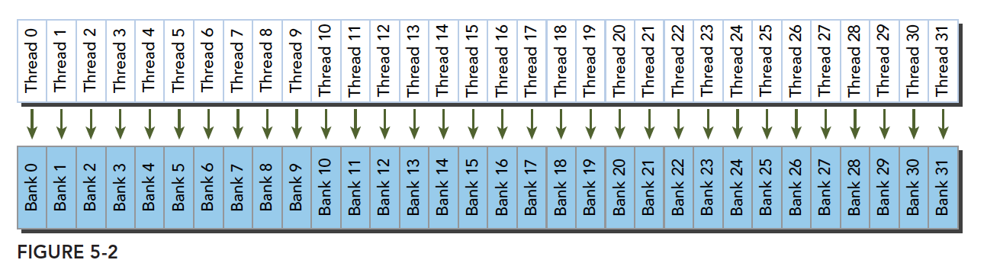

不规则的访问模式（并行、无冲突——地址打乱但仍一一对应不同 bank）：

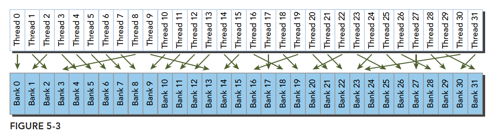

不规则的访问模式（可能冲突也可能不冲突——多个线程指向同一 bank 时，若是同一地址则广播无冲突，不同地址则冲突）：

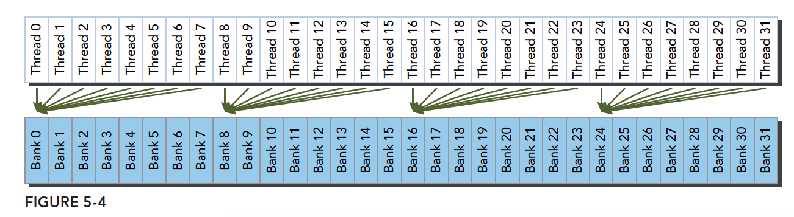

#### 5.3.3.1 步长与 bank 冲突的关系

线程按如下方式访问共享内存（以 4 字节 bank 宽度、`int` 数据为例）：

```c++
int data = shared[baseIndex + s * tid];  // baseIndex 是 0 点位置，s 是步长，tid 是线程索引
```

- 从**单个线程角度**看：对于线程 `tid=4`（s = 1），访问的是 `shared[4]`，需要通过 `bank4` 的访问通道进行数据访问。
- 从**线程束角度**看（**当步长 s 为奇数时不会发生 bank 冲突**）：
  - 当 **s=1** 时，0-31 号线程访问的数据分别为 `shared[0]`、`shared[1]`、…、`shared[31]`，分别通过 `bank0`、`bank1`、…、`bank31` 的通道访问，**不发生冲突**；
  - 当 **s=2** 时，0-15 号线程访问 `shared[0]`、`shared[2]`、…、`shared[30]`，通过 `bank0`、`bank2`、…、`bank30` 访问；而 16-31 号线程访问 `shared[32]`、`shared[34]`、…、`shared[62]`，又映射到 `bank0`、`bank2`、…、`bank30`——**线程束中不同线程访问了同一 bank 的不同地址，产生 2 路 bank 冲突**；
  - 一般规律：步长 s 与 32 的最大公约数 $d = \gcd(32, s)$ 决定冲突程度，冲突路数为 $d$ 对应的分组重叠数（$32/d$ 个不同 bank 被复用 $d$ 次）。**s 为奇数时 $\gcd(32,s)=1$，无冲突**。

### 5.3.4 存储体宽度（Bank Width）

上面的分析默认每个 bank 一次处理 4 字节，但这个"宽度"其实随架构演进有过变化，分析冲突时需要知道自己面对的是哪一种。

**存储体宽度**是共享内存的物理特性：每个 bank 一次能处理的数据位数/字节数。不同架构有两种设计：

- **4 字节（32-bit）bank 宽度**：Fermi 及大多数现代架构（Maxwell 之后固定为 4 字节）；
- **8 字节（64-bit）bank 宽度**：Kepler 架构（可通过 `cudaDeviceSetSharedMemConfig` 配置）。

对于 8 字节 bank 宽度（64 位），线程一次访问 4 字节数据时，其独立的访问通道会被划分为两个 32 位子单元：若线程 1 访问地址 `Bank30[0:3]`（低 32 位），线程 2 访问地址 `Bank30[4:7]`（高 32 位），则两者属于同一 bank 但不同子单元。现代 GPU 可以通过内部多端口设计或更宽的数据通路，允许同一 bank 内不同子单元的并发访问，从而避免冲突（这是 GPU 硬件的能力，即硬件可以将 8 字节 bank 设计为支持同时访问两个 4 字节子单元）。

类比理解：

- **传统 4 字节 bank**：类似单车道道路，同一时间只能有一辆车通过。若两辆车（线程）试图同时进入同一车道的不同位置（不同地址），会拥堵（冲突）；
- **8 字节 bank**：类似双车道道路，同一 bank 被划分为两个车道（子单元）。若两辆车进入同一道路的不同车道（不同子单元），可以并行通过（无冲突）。

### 5.3.5 访问数据类型与 bank 冲突

除了步长与 bank 宽度，第三个影响因素是每个线程实际访问的数据类型宽度。bank 冲突分析要以**实际访问的字节宽度**为准（以 4 字节 bank 宽度的现代架构为例）：

- **4 字节类型（`int` / `float`）**：一一对应关系最直观，按 5.3.3 节的步长规律分析即可；
- **小于 4 字节的类型（`char` / `short`）**：多个相邻元素落在同一个 bank 的同一个 4 字节字内。如 `char shared[64]` 中，线程 0~3 访问 `shared[0..3]` 时四个字节属于同一个 word——同一位置读取会触发**广播/合并**，不算冲突；但 `shared[char_idx = tid]` 这类布局在写入时可能因同 word 竞争而串行化；
- **8 字节类型（`double`）**：每个元素横跨两个相邻 bank。32 个线程连续访问 `double shared[32]` 时，线程 i 与线程 i+16 会用到相同的 bank 对，典型情况下形成 **2 路冲突**（硬件会拆成两次 32 位宽的访问波）；
- **16 字节类型（`float4` 等）**：横跨 4 个 bank，连续访问时通常形成 4 路冲突的访问波（由硬件拆分为多个周期完成），设计数据布局时需要特别注意。

> [!TIP]
> 判断方法始终是一句话：**把 warp 中 32 个线程一次访存实际触碰的所有 4 字节字算出来，映射到 `(word_index % 32)`，看是否有两个线程落到同一 bank 的不同字上。**

### 5.3.6 内存填充（Padding）避免 bank 冲突

知道了冲突从何而来，接下来看最常用的消除手段。

**内存填充（memory padding）**是消除 bank 冲突最常用、最简单的技巧：在二维共享内存数组的每一行末尾多声明一列（或若干列），人为错开地址到 bank 的映射。

以经典的 32×32 tile 为例：

```c++
// 有冲突：同一列的 32 个元素全部落在同一个 bank 中
__shared__ float tile[32][32];
// tile[0][c]、tile[1][c]、...、tile[31][c] 的 word 索引分别为
//   c, 32+c, 64+c, ...  →  (word % 32) 全部等于 c → 32 路冲突！

// 无冲突：每行填充 1 列，使同一列的元素依次错开一个 bank
__shared__ float tile[32][33];      // ← 关键：33 = 32 + 1（padding）
// tile[r][c] 的 word 索引为 r*33 + c → (r*33 + c) % 32 = (r + c) % 32
// 同一列 c 的 32 个元素分布在 32 个不同的 bank 中 → 完全无冲突
```

代价是每行浪费 4 字节共享内存（32 行共 128 字节），换来按列访问从 32 路冲突降为无冲突，通常收益巨大。

#### 5.3.6.1 用一个小例子直观理解 padding

假如当前存储体内的数据罗列如下（这里为了画图方便假设共 4 个存储体，实际是 32 个）。当声明为：

```c++
__shared__ int a[5][4];
```

就会得到下图的内存布局——同一列的元素全部落在同一个 bank 中。当线程束按列访问 bank0 中的不同数据时，就会发生一个 5 路冲突：

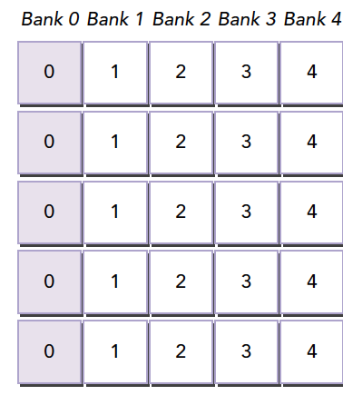

但当声明改成（每行末尾加入一个填充元素）：

```c++
__shared__ int a[5][5];
```

就会产生下面的效果：

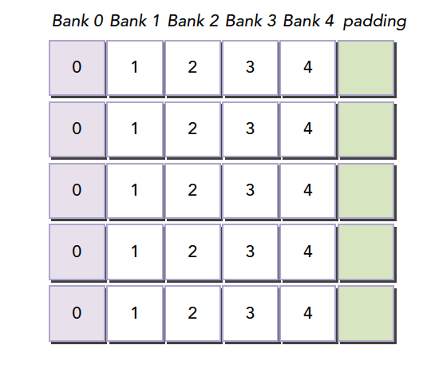

编译器会将这个二维数组重新分配到存储体上：因为存储体一共就 4 个，而每一行有 5 个元素，所以每行都有一个元素"溢出"到下一轮 bank 编号中——这样同一列的所有元素就全部错开了，不再有冲突：

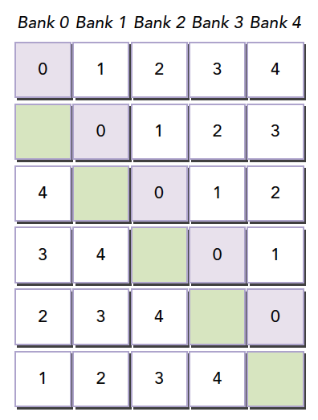

检测 bank 冲突的工具指标：

```bash
# 平均每次共享内存请求需要几个事务（1.0 为无冲突理想值）
nvprof --metrics shared_load_transactions_per_request,shared_store_transactions_per_request ./app
# Nsight Compute
ncu --metrics l1tex__data_bank_conflicts_pipe_lsu_mem_shared ./app
```

### 5.3.7 综合实例一：共享内存优化矩阵转置

工具齐备，回头解决 5.2.9 节遗留的矩阵转置问题：朴素版本中对输出矩阵的写操作无法合并。使用共享内存 tile 做中转 + padding 消除 bank 冲突，读写两侧都能达到合并访问（对应 [`code/transpose_smem.cu`](code/transpose_smem.cu) 中的版本 3，该文件还包含朴素版与无 padding 版共三个版本供对比）：

```c++
#define TILE_DIM 32

// 版本 3：共享内存 + padding（+1 列彻底消除 bank 冲突）
__global__ void smemPadTranspose(int m, const float *a, float *c) {
    // +1 padding 消除按列读共享内存时的 bank 冲突
    __shared__ float tile[TILE_DIM][TILE_DIM + 1];    // ← 关键：33 = 32 + 1

    // 第一步：以合并方式按行读入 A 的一个 tile
    int col = blockIdx.x * TILE_DIM + threadIdx.x;
    int row = blockIdx.y * TILE_DIM + threadIdx.y;
    if (row < m && col < m)
        tile[threadIdx.y][threadIdx.x] = a[row * m + col];

    __syncthreads();   // 等待整个 tile 装载完毕

    // 第二步：写目标为转置后的块位置；从共享内存按转置顺序取数，
    //         对全局内存 C 的写仍是"行连续"→ 合并写
    col = blockIdx.y * TILE_DIM + threadIdx.x;   // 注意 block 坐标交换
    row = blockIdx.x * TILE_DIM + threadIdx.y;
    if (row < m && col < m)
        c[row * m + col] = tile[threadIdx.x][threadIdx.y];
}
```

优化要点总结：

1. **全局内存读**：warp 按行读 A 的 tile → 合并访问；
2. **全局内存写**：warp 按行写 C 的 tile（块坐标交换，转置在共享内存内部完成）→ 合并访问；
3. **共享内存**：`tile[threadIdx.x][threadIdx.y]` 是按列访问，若不 padding 会产生 32 路 bank 冲突；`TILE_DIM + 1` 的 padding 使其完全无冲突。

### 5.3.8 综合实例二：共享内存优化并行归约

共享内存的另一个经典应用是归约。第 4 章的归约内核（reduce_divergence.cu）直接在全局内存上原地迭代，每一轮都要读写全局内存。改用共享内存后，中间结果的多轮读写全部发生在片上（完整程序见 [`code/reduce_smem.cu`](code/reduce_smem.cu)）：

```c++
#define BLOCK_SIZE 256

__global__ void reduceSmem(const int *g_idata, int *g_odata, unsigned int n) {
    __shared__ int smem[BLOCK_SIZE];

    unsigned int tid = threadIdx.x;
    unsigned int idx = blockIdx.x * blockDim.x + threadIdx.x;

    // 第一步：每个线程把自己的元素从全局内存装入共享内存（合并读）
    smem[tid] = (idx < n) ? g_idata[idx] : 0;
    __syncthreads();

    // 第二步：在共享内存中做交错配对归约（无分化 + 无 bank 冲突）
    for (int stride = blockDim.x / 2; stride > 0; stride >>= 1) {
        if (tid < stride) {
            smem[tid] += smem[tid + stride];
        }
        __syncthreads();
    }

    // 第三步：块结果写回全局内存
    if (tid == 0) g_odata[blockIdx.x] = smem[0];
}
```

相比全局内存版本的收益：

- 迭代中的读写延迟从数百周期（全局内存）降到约 20~30 周期（共享内存）；
- `smem[tid]` 与 `smem[tid + stride]` 的访问步长是 1（连续），天然无 bank 冲突；
- 还可以继续叠加优化：每线程先累加多个元素再进入共享内存归约（减少块数）、最后 32 个元素用 warp shuffle 归约（见[第 7 章](../07_atomics_and_warp/README.md)），逐步逼近带宽上限。

### 5.3.9 小结（共享内存）

- 共享内存是 SM 片上的"可编程缓存"，块级分配、块级生命周期；用量过大挤压驻留块数、降低占用率；
- 共享内存分 **32 个 bank**，`bank = (地址/4) % 32`；同 warp 多线程访问**同一 bank 不同地址** → n 路冲突串行化；同地址读是**广播**，无冲突；
- 步长规律：`gcd(32, s) = 1`（奇数步长）无冲突；分析宽类型时按实际触碰的 4 字节字计算；
- **+1 padding**（`tile[32][33]`）是消除按列访问冲突的标准手法；
- 两个经典应用：矩阵转置（把交叉访问转为合并访问）与归约（中间迭代全部片上完成）。

### 5.3.10 动手练习

> 本章示例代码位于 [`code/`](code/) 目录：`transpose_smem.cu`（三版本对比）、`reduce_smem.cu`。

1. 运行 `transpose_smem.cu`，记录 naive / smem / smem+pad 三个版本的带宽差距；用 `ncu --metrics l1tex__data_bank_conflicts_pipe_lsu_mem_shared` 验证 padding 前后 bank 冲突的变化；
2. 把 `TILE_DIM` 改为 16，重新分析：`tile[16][16]` 按列访问是几路冲突？padding 还需要吗？实测验证；
3. 对比 `reduce_smem.cu` 与第 4 章 `reduce_divergence.cu` 中版本 3 的耗时，量化共享内存带来的收益；
4. 实现"每线程先累加 4 个元素再进入共享内存归约"的版本，观察进一步提升。

---

## 5.4 本章小结

三大部分各自的详细小结见 [5.1.9](#519-小结内存模型基础)、[5.2.13](#5213-小结全局内存)、[5.3.9](#539-小结共享内存) 节，这里回顾贯穿全章的主线：

- **层次**：GPU 内存按"越近越快越小"分层（寄存器 → 共享内存/L1 → L2 → 全局内存 → 主机内存），CUDA 把这套层次显式暴露给程序员，PCIe 传输是最外层瓶颈；
- **全局内存**：warp 的 32 个请求被合并成对齐的 32 字节事务（CC 6.0+），事务数由数据类型大小与地址分布共同决定——对齐 + 连续 + SoA 布局是合并访问的三件套，读写只能保一侧合并时优先保写；
- **共享内存**：32 个 bank 并行供数，"同 bank 不同地址"即冲突，+1 padding 是标准解法；矩阵转置与归约两个实例展示了"共享内存中转 + 消除冲突"的完整优化路径。

把第 4 章的执行模型和本章的内存模型合在一起，**单个内核**优化的两大支柱就齐了。但一个真实应用不止有内核——主机↔设备的数据传输还占着大头（别忘了 5.1.2.1 节那条"从外地邮寄"的最慢通道），传输能不能和计算重叠起来？多个内核能不能并发？这就是下一章"流与并发"要解决的问题。

## 5.5 动手练习索引

本章练习按三大部分就近编排，配套代码位于 [`code/`](code/) 目录：

- [5.1.10 动手练习](#5110-动手练习)：寄存器用量观察、pinned 内存带宽对比、常量内存卷积；
- [5.2.14 动手练习](#5214-动手练习)：offset/stride 带宽基准（`main.cu`）、AoS vs SoA、禁用 L1 实验；
- [5.3.10 动手练习](#5310-动手练习)：转置三版本对比（`transpose_smem.cu`）、bank 冲突分析、共享内存归约（`reduce_smem.cu`）。

---

> [← 上一章：执行模型](../04_execution_model/README.md) | [返回目录](../README.md) | [下一章：流与并发 →](../06_streams_and_concurrency/README.md)
