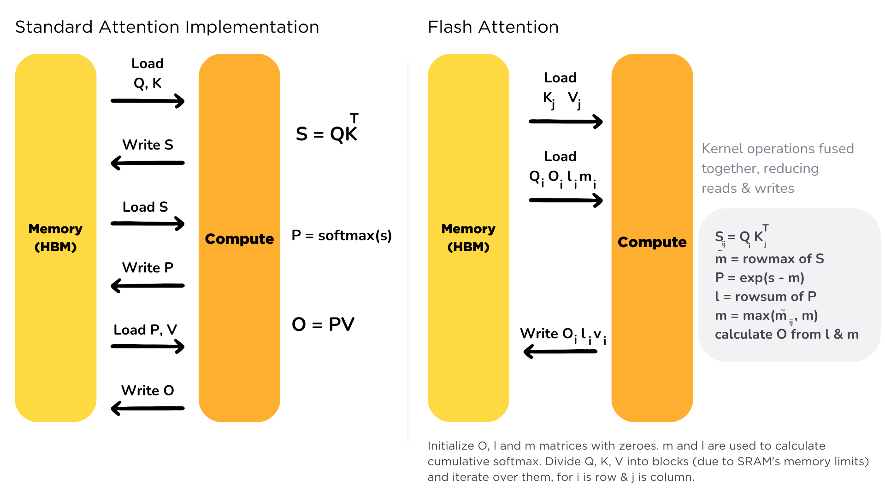

# CUDA Attention 算子优化指南

> 本文以 Scaled Dot-Product Attention 为例，介绍 CUDA 上两类典型的优化手段：**算子融合（kernel fusion）**与**分块流式计算（tiling / streaming）**。
>
> Attention 的结构很特殊：它是"两个矩阵乘，中间夹一个 softmax"。朴素实现会在显存里生成两个 $N \times N$ 的中间矩阵——序列越长，这两个矩阵的读写就越是压倒性的瓶颈。因此全文只有一条主线：**逐步减少、直至彻底消灭 $N^2$ 中间数据在显存中的往返**。
>
> 优化按难度递进，共五个版本：
>
> - **V0**：最朴素的三个 kernel，中间矩阵落地显存（基准）；
> - **V1**：把 scale、mask、softmax 融合成一个 kernel（融合入门）；
> - **V2**：Online Softmax，拆掉 softmax "必须看完全行"的数学枷锁（分块的钥匙）；
> - **V3**：FlashAttention，分块融合，$N \times N$ 矩阵从头到尾不落地，显存从 $O(N^2)$ 降到 $O(N)$；
> - **V4**：FlashAttention-2，在 V3 之上做并行度与指令效率的工程打磨。
>
> 本文内容自包含：所需的 GPU 执行模型、内存层次、归约、数值稳定性、算术强度等基础概念都在第 2 章从零讲起，无需先读其他资料。

---

## 目录

- [第 1 章 问题定义：什么是 Attention](#第-1-章-问题定义什么是-attention)
- [第 2 章 预备知识：GPU 基础、归约、数值稳定性与流量分析](#第-2-章-预备知识gpu-基础归约数值稳定性与流量分析)
- [第 3 章 优化路线总览](#第-3-章-优化路线总览)
- [第 4 章 V0：基准实现——三个 kernel，中间矩阵落地](#第-4-章-v0基准实现三个-kernel中间矩阵落地)
- [第 5 章 V1：算子融合入门——scale + mask + softmax 单 kernel](#第-5-章-v1算子融合入门scale--mask--softmax-单-kernel)
- [第 6 章 V2：Online Softmax——把三遍扫描压成一遍](#第-6-章-v2online-softmax把三遍扫描压成一遍)
- [第 7 章 V3：FlashAttention——分块融合，N² 矩阵永不落地](#第-7-章-v3flashattention分块融合n-矩阵永不落地)
- [第 8 章 V4：FlashAttention-2——并行度与指令效率的工程改进](#第-8-章-v4flashattention-2并行度与指令效率的工程改进)
- [第 9 章 场景扩展：推理 Decode 阶段与 Flash-Decoding](#第-9-章-场景扩展推理-decode-阶段与-flash-decoding)
- [第 10 章 工程化：PyTorch SDPA 与正确性验证](#第-10-章-工程化pytorch-sdpa-与正确性验证)
- [第 11 章 总结与实践建议](#第-11-章-总结与实践建议)
- [附录：关键概念速查](#附录关键概念速查)

---

## 第 1 章 问题定义：什么是 Attention

优化之前，先把要优化的东西定义清楚：Attention 算什么、分几步、每一步的数据有多大。本章最后会得出一个贯穿全文的结论——**朴素 Attention 的瓶颈不在计算，而在 $N^2$ 中间矩阵的显存读写**。

### 1.1 Scaled Dot-Product Attention 的定义

Attention 是 Transformer 的核心算子，定义为：

$$
\mathrm{Attention}(Q, K, V) = \mathrm{softmax}\!\left(\frac{QK^\top}{\sqrt{d}}\right)V
$$

| 符号 | 形状 | 含义 |
|------|------|------|
| $Q$（query） | $N \times d$ | $N$ = 序列长度（token 数），$d$ = 每个注意力头的维度 |
| $K$（key） | $N \times d$ | 本文聚焦单个注意力头；多头即把此计算独立重复 $h$ 次 |
| $V$（value） | $N \times d$ | |
| $O$（输出） | $N \times d$ | |

计算分三步，每一步都有明确的语义：

| 步骤 | 公式 | 形状 | 语义 |
|------|------|------|------|
| ① | $S = QK^\top / \sqrt{d}$ | $N \times N$ | 每个 query 与每个 key 的"相似度分数" |
| ② | $P = \mathrm{softmax}(S)$ | $N \times N$ | 逐行归一化成概率分布（每行和为 1） |
| ③ | $O = PV$ | $N \times d$ | 按概率对 value 加权求和 |

其中 softmax 对矩阵的**每一行独立**进行：

$$
\mathrm{softmax}(x)_j = \frac{e^{x_j}}{\sum_{k} e^{x_k}}
$$

两个定义细节，后文都会用到：

- **为什么除以 $\sqrt{d}$**：若 $q$、$k$ 的各分量近似独立、方差为 1，则点积 $q \cdot k$ 的方差为 $d$。除以 $\sqrt{d}$ 把分数的方差归一回 1，避免 softmax 输入过大而饱和（也缓解第 2.5 节讨论的数值上溢，但不能根除）。
- **mask**：实际使用中第①②步之间通常还有掩码，最常见的是**因果掩码（causal mask）**——生成式模型中位置 $i$ 的 query 只允许看位置 $j \le i$ 的 key，实现上把 $S$ 中 $j > i$ 的元素置为 $-\infty$（softmax 后即为 0）。本文的 kernel 都带这个可选项。

CPU/PyTorch 上的参考实现只有三行：

```python
S = Q @ K.T / math.sqrt(d)        # ① N×N 分数矩阵
P = torch.softmax(S, dim=-1)      # ② 逐行归一化
O = P @ V                         # ③ 加权求和
```

### 1.2 计算量、访存量与显存：N² 是万恶之源



以 $N = 4096$、$d = 64$、fp32 为例，给单个注意力头算三笔账。

**第一笔：计算量。** 两个矩阵乘各 $2N^2d$ FLOP，softmax 约 $5N^2$（求最大、减、exp、求和、除）：

$$
\mathrm{FLOP} \approx \underbrace{2N^2d}_{QK^\top} + \underbrace{2N^2d}_{PV} + \underbrace{5N^2}_{\mathrm{softmax}} \approx 4N^2d = 4 \times 4096^2 \times 64 \approx 4.3\ \mathrm{GFLOP}
$$

**第二笔：数据规模。** 这是 Attention 与普通 GEMM 最大的不同：

| 数据 | 元素数 | 大小（fp32） |
|------|--------|-------------|
| $Q$、$K$、$V$、$O$（各） | $N \times d$ ≈ 26 万 | **各 1 MB** |
| $S$、$P$（各） | $N^2$ ≈ 1678 万 | **各 64 MB** |

输入输出总共 4 MB，而两个**中间矩阵**各 64 MB——中间数据比有效输入输出大 30 倍，且随 $N$ **平方**增长（$N = 32\mathrm{K}$ 时单个 $S$ 就要 4 GB）。

**第三笔：访存量（朴素实现）。** $S$ 和 $P$ 每次在 kernel 之间传递，都要在显存（HBM）走一个来回。即使 softmax 只按一读一写计，最少也有：

$$
\text{写 } S + \text{读 } S + \text{写 } P + \text{读 } P = 4 \times 64\ \mathrm{MB} = 256\ \mathrm{MB}
$$

三笔账合起来看：**算术强度（Arithmetic Intensity, AI）** 只有 $4.3\ \mathrm{GFLOP} / 268\ \mathrm{MB} \approx 16\ \mathrm{FLOP/Byte}$，低于典型 GPU 约 35 FLOP/Byte 的平衡点（见 2.6 节）。也就是说，**朴素 Attention 是 memory-bound 的**——尽管它内部有两个大矩阵乘，瓶颈却不在计算，而在 $N^2$ 中间矩阵反复过显存。

于是优化的主线呼之欲出：**让 $S$ 和 $P$ 不要落地**。如果 $N^2$ 的数据能在片上（共享内存/寄存器）随产随消，访存量就只剩 $Q$、$K$、$V$、$O$ 这 4 MB 的量级，算子回到 compute-bound，$O(N^2)$ 的显存占用也随之消失。这正是 V1 → V3 逐步实现的目标。

### 1.3 并行化的基本形状

GPU 靠上万个线程同时干活，所以拿到一个算子，除了算流量账，还要回答一个问题：**哪些计算互不依赖、可以同时算？** 判断标准很朴素——A 不需要 B 的结果，B 也不需要 A 的，两者就能各干各的。

对 Attention，把**一行输出的依赖链**画出来，答案就全有了。看第 $i$ 行：

$$
q_i \;\xrightarrow{\ \cdot\, K^\top / \sqrt{d}\ }\; s_i \;\xrightarrow{\ \mathrm{softmax}\ }\; p_i \;\xrightarrow{\ \cdot\, V\ }\; o_i
$$

这条链从头到尾只用到两样东西：**自己的 query $q_i$**，以及**全部 K/V**——不需要任何其他行的中间结果或输出。本节的所有结论都从这条链推出。

**并行维一：batch × heads。** 多头注意力把这条链用 $h$ 组不同的投影独立重复 $h$ 次，头与头之间零数据交换；batch 里不同样本更是毫无关系。所以 $B \times h$ 份 attention 是**完全独立的问题**——独立性最彻底、粒度最粗，永远放在并行组织的最外层。$B = 8$、$h = 32$ 时，一上来就有 256 份互不相干的活。

**并行维二：序列维 $N$（行与行）。** 依赖链直接给出：行 $i$ 与行 $i'$ 互不需要对方的任何东西，$N$ 行可以全部同时算。这里有个值得辨析的细节——所有行都要**读**同一份 K/V，这算不算冲突？不算：

- 并行的冲突只来自"**写**同一个位置"，而每行写的是自己的 $o_i$，互不重叠；
- 只读共享反而是好事：一份 K/V 搬到片上可以喂给很多行——这正是数据复用的机会（第 7 章把 K/V tile 装进共享内存、供块内所有行共用，用的就是这个性质）。

**并行维三：head 维 $d$（行内的输出通道）。** 把 $o_i$ 拆到分量看：$o_i[x] = \sum_j p_{ij}\, V[j, x]$。$d$ 个分量用的是**同一行**权重 $p_i$，但分量之间互不依赖——权重可用之后，$d$ 个通道可以交给 $d$ 个（组）线程各自累加。这是行内更细粒度的并行来源（8.7 节把它切给 Warp 的 32 个 lane）。

**唯一的例外——行内的 $j$ 方向（归约维）。** 依赖链的三个箭头里都藏着"沿 $j$ 把很多数缩成一个"的**归约**：分数 $s_{ij}$ 是 $d$ 项点积，softmax 的 max 与分母是全行归约，$o_i$ 是 $N$ 项加权和。归约的参与者通过结果彼此耦合，没法各干各的。这个方向**可以切，但切完必须合并**，合并的代价有两种形态：

- 切给**能通信**的线程（同一 Block 内）：用硬件归约原语合并（2.4 节的两级归约）；
- 切给**不能通信**的执行单位（不同 Block）：只能靠数学恒等式事后归并（第 6 章的在线合并；第 9 章的 Flash-Decoding 全靠它救场）。

一句口诀：**并行维切了白赚，归约维切了要还**。

四个方向汇总如下（Grid/Block/Warp 等术语在 2.1 节定义，这里先记结论）：

| 方向 | 性质 | 规模（$B{=}8$、$h{=}32$、$N{=}4096$、$d{=}64$） | 后文的典型分配 |
|------|------|------|---------|
| batch × heads | 并行维：完全独立 | 256 | Grid 的一个维度 |
| 序列维 $N$（行） | 并行维：写独立、读共享 K/V | 4096 | Grid 另一维 / Block 内的线程或 Warp |
| head 维 $d$（通道） | 并行维：共享本行权重 | 64 | 线程内循环 / Warp 的 lane |
| KV 维 $j$（行内） | **归约维**：切分需合并 | 4096 | 通常顺序扫；并行度不足时才切（第 9 章） |

后文每个版本的线程组织，本质上都是给这四个方向换一种分配方案：V1 一行一个 Block（行并行 + 行内归约）；V3 的教学版用 Grid 铺满"行块 × batch × heads"、Block 内一线程管一行；V4 改成一 Warp 管一行、32 个 lane 分摊 $d$；到了推理 decode 场景，$N$ 塌缩为 1，三个并行维全部枯竭，只剩归约维可切——那就是 Flash-Decoding（第 9 章）。读各章的线程组织设计时，不妨回头对照这张表。

---

## 第 2 章 预备知识：GPU 基础、归约、数值稳定性与流量分析

本章从零介绍理解全文所必需的概念。已熟悉 CUDA 的读者可以只读 2.4～2.7（Attention 特有的工具），其余跳过。

### 2.1 GPU 执行模型速览

CUDA 将一次 kernel 启动的线程组织为三层：

```
Grid（一次启动的全部线程）
 └── Block（同一 SM 上的一组线程，可用共享内存通信、__syncthreads() 同步）
      └── Thread（最小执行单位，私有寄存器）
```

| 内置变量 | 含义 |
|----------|------|
| `threadIdx` / `blockIdx` | 线程在 Block 内 / Block 在 Grid 中的坐标 |
| `blockDim` / `gridDim` | Block / Grid 各维度的大小 |

硬件真正的调度单位是 **Warp**——编号连续的 32 个线程，**锁步执行同一条指令**（SIMT）。由此有两条贯穿全文的推论：

1. 一条访存指令实际发出的是"32 个线程的 32 个地址"，地址连续才能合并成最少的内存事务（见 2.2 节）；
2. Warp 内 32 个线程天然同步，彼此交换数据可以用寄存器级的 shuffle 指令，无需经过内存（见 2.4 节）。

### 2.2 内存层次与合并访存

| 层次 | 容量 | 延迟 | 可见性 |
|------|------|------|--------|
| 全局内存（HBM） | 几十 GB | ~400–600 cycles | 所有线程 |
| L2 缓存 | 几十 MB | ~200 cycles | 所有线程 |
| 共享内存（SRAM） | ~100 KB / SM | ~20–30 cycles | 同一 Block 内 |
| 寄存器 | 255 个 / 线程 | ~1 cycle | 仅本线程 |

三条使用规则：

- **合并访存**：同一 Warp 的 32 个线程访问 32 个**连续**地址时，硬件合并为最少的内存事务（效率 100%）；地址间距一整行时退化为 32 次独立事务（效率 ≤ 12.5%）。写 kernel 时始终让 `threadIdx.x` 对应数据中**连续**的那个维度；
- **共享内存**是程序员手动管理的片上缓存，每 Block 独占一份，生命周期随 Block 结束，用于组织 Block 内线程间的数据复用——FlashAttention 中 K/V 分块正是驻留在这里；
- **寄存器**最快但线程私有，累加器一类"越攒越多的私有状态"应放这里。

一个对本文至关重要的事实：**HBM 带宽（~1 TB/s）与片上带宽（共享内存 ~20 TB/s，寄存器更高）之间有 1～2 个数量级的鸿沟**。同一份数据在 HBM 多走一个来回，就要多付一份最贵的运费——这是全文一切优化的动机。

### 2.3 算子融合（Kernel Fusion）的收益模型

深度学习框架默认"一个算子一个 kernel"。相邻 kernel 之间传递数据的唯一通道是**全局内存**：

```
kernel A 算出 X → 写 HBM → kernel B 从 HBM 读 X → 计算
```

若把 A、B 融合成一个 kernel，$X$ 就能以寄存器/共享内存为载体直接传递，省掉一写一读。收益可以直接量化：

$$
\text{省下的时间} \approx \frac{2 \times \mathrm{sizeof}(X)}{\text{HBM 带宽}} \qquad (X \text{ 越大越划算})
$$

对 Attention 而言，$X$ 是 64 MB 的 $N^2$ 矩阵：一写一读约 128 MB，在 1 TB/s 带宽下约 0.13 ms；而整个 attention 的计算在理想算力下不足 0.15 ms——**省一次中间矩阵往返，收益与全部计算时间同量级**。此外融合还附带省去 kernel 启动开销与显存占用。

融合的难点在于：**后一个算子往往需要前一个算子的"全局结果"**。softmax 就是典型——归一化分母需要整行的和，看似必须"先算完整行、再归一化"。这把锁正是 V2（Online Softmax）要拆的。

### 2.4 归约与两级归约：Attention kernel 的核心组件

softmax 的行内求 max、求 sum 都是**归约（reduction）**：把一组数缩成一个数。GPU 上的高效实现分两级。

**第一级：Warp 内归约（寄存器直传）。** `__shfl_xor_sync` 让 Warp 内线程直接交换寄存器值（延迟 1～2 周期，不经内存），蝶形（butterfly）模式 5 步完成 32 个数的归约，且**每个线程都持有最终结果**（省去广播）：

```cuda
__device__ float warpReduceMax(float v) {
    for (int offset = 16; offset > 0; offset >>= 1)
        v = fmaxf(v, __shfl_xor_sync(0xffffffff, v, offset));
    return v;   // 32 个 lane 都得到全 Warp 最大值
}
__device__ float warpReduceSum(float v) {
    for (int offset = 16; offset > 0; offset >>= 1)
        v += __shfl_xor_sync(0xffffffff, v, offset);
    return v;
}
```

**第二级：Block 内归约。** 各 Warp 先内部归约，代表（lane 0）把部分结果写进共享内存，再由第一个 Warp 对这些部分结果做一次 Warp 归约：

```cuda
__device__ float blockReduceMax(float v) {
    __shared__ float warpRes[32];                 // 最多 32 个 Warp
    int lane = threadIdx.x % 32, wid = threadIdx.x / 32;
    v = warpReduceMax(v);
    if (lane == 0) warpRes[wid] = v;
    __syncthreads();
    int nWarp = (blockDim.x + 31) / 32;
    v = (lane < nWarp) ? warpRes[lane] : -INFINITY;
    if (wid == 0) v = warpReduceMax(v);
    // 把结果广播给全 Block
    __shared__ float result;
    if (threadIdx.x == 0) result = v;
    __syncthreads();
    return result;
}
```

`blockReduceSum` 同理（初值换成 0、`fmaxf` 换成 `+`）。这对组件将在 V1 的融合 softmax 中直接使用。

### 2.5 数值稳定性：exp 的上溢与 Safe Softmax

直接按定义计算 softmax，在浮点下会爆炸：

| 精度 | 上溢点 | 后果 |
|------|--------|------|
| fp32 | $e^x$ 在 $x > 88.7$ 时上溢为 inf | inf/inf = NaN，全行报废 |
| fp16 | $x > 11.1$ | 更容易触发 |

1.1 节说过缩放后的分数方差为 1，但 $N$ 很大时一行的**最大值**仍可能达到几十。标准解法是 **Safe Softmax**——利用恒等式，给每个元素减去该行最大值 $m$：

$$
\mathrm{softmax}(x)_j = \frac{e^{x_j}}{\sum_k e^{x_k}} = \frac{e^{x_j - m}}{\sum_k e^{x_k - m}}, \qquad m = \max_k x_k
$$

分子分母同乘 $e^{-m}$，数学上恒等；数值上 $x_j - m \le 0$，exp 的输入永不为正，**彻底杜绝上溢**（下溢为 0 是无害的）。代价是多了一遍"求 max"扫描，于是标准 softmax 需要**三遍扫描**：

$$
\begin{aligned}
\text{pass 1:}\quad & m = \max_j x_j && \text{（读一遍 } x\text{）} \\
\text{pass 2:}\quad & l = \textstyle\sum_j e^{x_j - m} && \text{（再读一遍 } x\text{）} \\
\text{pass 3:}\quad & y_j = e^{x_j - m} / l && \text{（第三遍读 } x\text{，写 } y\text{）}
\end{aligned}
$$

"三遍扫描"意味着三倍读流量——这个数字在 2.7 节的流量账本和 V2 的优化中都会反复出现。

### 2.6 算术强度与 Roofline：给 Attention 定位

**算术强度（Arithmetic Intensity，缩写 AI）**（该缩写与"人工智能"无关，Roofline 文献中也称 Operational Intensity）定义为：

$$
\mathrm{AI} = \frac{\text{计算量（FLOP）}}{\text{访存量（Byte）}}
$$

硬件的平衡点是"峰值算力 / 峰值带宽"。以典型 GPU 为例：$35\ \mathrm{TFLOPS\ (fp32)} / 1\ \mathrm{TB/s} \approx 35\ \mathrm{FLOP/B}$：

- $\mathrm{AI} < 35$：**memory-bound**，上限是带宽，优化目标是减流量、跑满带宽；
- $\mathrm{AI} > 35$：**compute-bound**，上限是算力，优化目标是提高数据复用、跑满算力。

Attention 三个阶段各自的定位（$N = 4096$、$d = 64$、fp32）：

| 阶段 | FLOP | 独立成 kernel 时的最少 HBM 流量 | AI（FLOP/B） | 定位 |
|------|------|-------------------------------|-------------|------|
| ① $S = QK^\top$ | $2N^2d$ | 读 Q,K（2 MB）+ 写 S（64 MB） | ~32 | 被写 S 拖累 |
| ② $P = \mathrm{softmax}(S)$ | ~$5N^2$ | 读 S（64 MB × 3 遍）+ 写 P（64 MB） | **~0.3** | 重度 memory-bound |
| ③ $O = PV$ | $2N^2d$ | 读 P（64 MB）+ 读 V（1 MB）+ 写 O（1 MB） | ~31 | 被读 P 拖累 |

单看矩阵乘本身，$2N^2d$ 的计算配 $Nd$ 级的输入，本应是高 AI 的 compute-bound 计算（同 GEMM）；**是 $N^2$ 中间矩阵的落地把整条链拖进了 memory-bound 区**。反过来说：把 $S$/$P$ 留在片上，AI 立即回升——这就是 FlashAttention 的 Roofline 逻辑。

### 2.7 一条贯穿全文的分析工具：数"N² 流量过 HBM 几遍"

与逐 kernel 分析相比，一个更快的定位方法是只盯着**最大的数据（$N^2$ 矩阵）在 HBM 上走了几个来回**——它比其他所有数据大 30 倍以上，其余流量几乎可以忽略。本文默认参数下：

$$
\text{一遍} = N^2 \times 4\ \mathrm{B} = 64\ \mathrm{MB}
$$

| 版本 | S/P 的 HBM 读写遍数 | N² 流量 |
|------|-----|---------|
| V0（三 kernel + 三遍扫描 softmax） | 写 S 1 + 读 S 3 + 写 P 1 + 读 P 1 = **6 遍** | ~384 MB |
| V1（融合 softmax，行驻留片上） | 写 S 1 + 读 S 1 + 写 P 1 + 读 P 1 = **4 遍** | ~256 MB |
| V2（online softmax，理论意义） | 同 V1（单独使用时省的是行内扫描遍数） | ~256 MB |
| V3（FlashAttention） | **0 遍**（S/P 只存在于片上） | ~0 |

后文每个版本的效果，都可以先用这张表预估，再看实现细节。

---

## 第 3 章 优化路线总览

基础工具备齐，先把整条优化路线一次看完。每个版本都针对上一版暴露的一个具体瓶颈：

```
V0: 朴素实现：三个 kernel（QKᵀ → softmax → PV），S/P 落地 HBM
 │   瓶颈：N² 中间矩阵 6 遍过 HBM；显存占用 O(N²)
 ▼
V1: 融合 scale + mask + softmax 为单 kernel，一行一 Block、块内两级归约
 │   瓶颈：融合只省了 softmax 内部的重复扫描，S、P 本身仍要落地（4 遍）
 ▼
V2: Online Softmax：max 与分母 l 在一遍扫描中同时递推得到
 │   意义：softmax 从"必须先看完全行"变成"可以流式逐段处理"
 │        ——单独使用收益有限，但它是分块融合的数学钥匙
 ▼
V3: FlashAttention：K/V 沿序列分块驻留片上，(m, l, o~) 在线递推
 │   S/P 永不落地：N² 流量归零，显存 O(N)
 │   （本文按"外层 Q + 延迟归一化"的自然形式讲解——历史上这两点
 │     是 FA-2 才确立的，第 7 章的历史注有说明）
 │   瓶颈：算子转为 compute-bound，片上计算效率成为新短板——
 │        Block 内的 Warp 还没有分工，点积仍是单线程串行
 ▼
V4: FlashAttention-2：复盘 FA-1 原始实现（外层 KV、状态驻显存、
    块内归一化）为何慢，确立"序列维并行 / split-Q / 延迟归一化 /
    负载均衡"四条工程原则，并把行内并行细化到 Warp 与 lane
    ——逼近硬件矩阵乘的效率上限
```

各版本解决的瓶颈分类：

| 瓶颈类别 | 具体问题 | 解决版本 |
|---------|---------|---------|
| 访存量 | softmax 三遍扫描 | V1 / V2 |
| 访存量 | N² 中间矩阵落地 | V3 |
| 显存容量 | O(N²) 中间矩阵 | V3 |
| 算法结构 | softmax 的全局依赖阻碍分块 | V2 |
| 并行度/指令效率 | Block 内 Warp 分工、非矩阵乘指令占比、历史实现的循环顺序 | V4 |
| 特殊场景 | decode 阶段并行度骤减 | 第 9 章 |

一个有用的对照：**GEMM 的优化是在"计算受限"的算子上建立数据复用；Attention 的优化则是先用"融合 + 分块"把算子从 memory-bound 拉回 compute-bound，然后才轮到 GEMM 式的优化**。FlashAttention 内部的每个分块小矩阵乘，用的正是 GEMM 的全套技术。

---

## 第 4 章 V0：基准实现——三个 kernel，中间矩阵落地

一切优化都需要基准。V0 把 1.1 节的三步照搬成三个 kernel，不做任何优化——它的价值在于把 1.2 节"纸面上的流量账"变成可以实测验证的现实。

### 4.1 实现

最直接的实现是把三步各交给一个 kernel（矩阵乘可以调 cuBLAS，这里为完整性给出朴素版）：

```cuda
// kernel 1: S = Q·Kᵀ / √d    （每线程算 S 的一个元素）
__global__ void qk_kernel(const float* Q, const float* K, float* S,
                          int N, int d, float scale) {
    int col = blockIdx.x * blockDim.x + threadIdx.x;   // key 序号 j
    int row = blockIdx.y * blockDim.y + threadIdx.y;   // query 序号 i
    if (row < N && col < N) {
        float s = 0.0f;
        for (int x = 0; x < d; x++)
            s += Q[row * d + x] * K[col * d + x];      // K 按行存，Kᵀ 即按行取 K
        S[row * N + col] = s * scale;                  // scale = 1/√d
    }
}

// kernel 2: P = softmax(S) 逐行（此处为示意的三遍扫描；每线程处理一行——效率极低）
__global__ void softmax_kernel(const float* S, float* P, int N) {
    int row = blockIdx.x * blockDim.x + threadIdx.x;
    if (row >= N) return;
    float m = -INFINITY;
    for (int j = 0; j < N; j++) m = fmaxf(m, S[row * N + j]);        // pass 1
    float l = 0.0f;
    for (int j = 0; j < N; j++) l += expf(S[row * N + j] - m);       // pass 2
    for (int j = 0; j < N; j++)                                      // pass 3
        P[row * N + j] = expf(S[row * N + j] - m) / l;
}

// kernel 3: O = P·V    （每线程算 O 的一个元素）
__global__ void pv_kernel(const float* P, const float* V, float* O,
                          int N, int d) {
    int col = blockIdx.x * blockDim.x + threadIdx.x;   // 0..d-1
    int row = blockIdx.y * blockDim.y + threadIdx.y;   // 0..N-1
    if (row < N && col < d) {
        float o = 0.0f;
        for (int k = 0; k < N; k++)
            o += P[row * N + k] * V[k * d + col];
        O[row * d + col] = o;
    }
}
```

宿主端按顺序启动三个 kernel，中间结果 $S$、$P$ 各分配一块 $N^2$ 的显存。

### 4.2 瓶颈分析

按 2.7 节的流量账本：

| 项目 | 流量 |
|------|------|
| kernel 1 写 S | 64 MB |
| kernel 2 读 S 三遍（safe softmax 的三遍扫描，2.5 节） | 192 MB |
| kernel 2 写 P | 64 MB |
| kernel 3 读 P | 64 MB |
| **$N^2$ 级流量合计** | **384 MB**（有效输入输出 Q/K/V/O 合计仅 4 MB） |

在 1 TB/s 带宽下，仅数据搬运就需要约 0.4 ms；而 4.3 GFLOP 的计算在 35 TFLOPS 下只要约 0.12 ms——**四分之三的时间在等内存**。此外还有两个问题：

- **显存占用 $O(N^2)$**：$N = 32\mathrm{K}$ 时单头单批就要 2 × 4 GB，长序列直接 OOM；
- 三个 kernel 三次启动开销，且 kernel 之间有数据依赖、无法重叠。

两个矩阵乘 kernel 本身也远未优化（无分块复用），但**先解决 $N^2$ 流量才是主要矛盾**——即使把两个 GEMM 换成 cuBLAS，S/P 的 6 遍落地照旧，总时间改善有限。这个判断本身就是一课：**优化前先算流量账，找最大的搬运项下手**。

上表中最扎眼的是 softmax 一项独占 256 MB（读 3 + 写 1），且它还是三个 kernel 里唯一没有并行化行内计算的——先从它开刀。

---

## 第 5 章 V1：算子融合入门——scale + mask + softmax 单 kernel

### 5.1 优化思路

V0 的 softmax kernel 有两个显而易见的低效：

1. **每线程独自处理一整行**：行内 4096 个元素串行扫描；且相邻线程（处理相邻行）同一时刻访问的地址相距一整行，完全不合并（违反 2.2 节规则）；
2. **三遍扫描，三倍读流量**。

V1 的改法：**一行分配一个 Block**（256 线程协作处理 4096 个元素），行内归约用 2.4 节的两级归约完成；同时把 scale 和 causal mask 一并融合进来（若做成独立 kernel，它们还要各自多走一遍 $N^2$ 读写）。三遍扫描改在 Block 内进行，行数据在三遍之间大概率驻留 L1/L2，HBM 层面接近一读一写。

```
线程组织：  grid = N（一行一 Block）,  block = 256
每线程分工：跨步处理本行的 N/256 = 16 个元素
行内归约：  blockReduceMax / blockReduceSum（2.4 节组件）
```

### 5.2 实现

```cuda
// P = softmax(mask(S · scale))，逐行；一行一个 Block
__global__ void fused_softmax_kernel(const float* S, float* P,
                                     int N, float scale, bool causal) {
    int row = blockIdx.x;
    int tid = threadIdx.x;
    const float* srow = S + (size_t)row * N;
    float*       prow = P + (size_t)row * N;

    // pass 1: 求行最大值（scale 与 mask 在读取时现场应用，不额外过显存）
    float m = -INFINITY;
    for (int j = tid; j < N; j += blockDim.x) {
        float x = srow[j] * scale;
        if (causal && j > row) x = -INFINITY;        // 因果掩码
        m = fmaxf(m, x);
    }
    m = blockReduceMax(m);

    // pass 2: 求分母 l = Σ exp(x − m)
    float l = 0.0f;
    for (int j = tid; j < N; j += blockDim.x) {
        float x = srow[j] * scale;
        if (causal && j > row) x = -INFINITY;
        l += __expf(x - m);                          // exp(-inf) = 0，mask 自然生效
    }
    l = blockReduceSum(l);

    // pass 3: 写出归一化结果
    float inv_l = 1.0f / l;
    for (int j = tid; j < N; j += blockDim.x) {
        float x = srow[j] * scale;
        if (causal && j > row) x = -INFINITY;
        prow[j] = __expf(x - m) * inv_l;
    }
}
// 启动：fused_softmax_kernel<<<N, 256>>>(S, P, N, 1.0f/sqrtf(d), true);
```

三个值得注意的设计点：

- **跨步循环 `j = tid; j += blockDim.x`**：同一时刻 Warp 内 32 个线程访问的 `j` 连续 → 地址连续 → 完全合并；同时任意行长 $N$ 都能被 256 线程覆盖；
- **scale/mask 融合进读取路径**：它们不再是独立 kernel，省掉了各自的 $N^2$ 读写各一遍；$-\infty$ 经 exp 变成 0，mask 的语义自动正确；
- **`__expf`** 是硬件特殊函数单元（SFU）上的快速指数，softmax 场景下精度足够。

### 5.3 效果与遗留问题

| | V0 softmax | V1 融合 softmax |
|--|-----------|----------------|
| 行内并行 | 无（单线程串行） | 256 线程 + 两级归约 |
| 访存合并 | 完全不合并 | 完全合并 |
| scale/mask | 需独立 kernel（各 +2 遍 N²） | 融合，零额外流量 |
| S 的 HBM 读 | 3 遍 | ~1 遍（三遍扫描命中缓存） |

softmax 这一段的行内并行与访存合并由此全部到位。但从全局账本看，**$S$ 和 $P$ 这两个 $N^2$ 矩阵本身还在**：QKᵀ 写 S 一遍、softmax 读 S 写 P 各一遍、PV 读 P 一遍——4 遍 $N^2$ 流量（256 MB）与 $O(N^2)$ 显存原封未动。

要消灭它们，就必须把三步彻底融成**一个** kernel：$S$ 的每个分块算出来就地喂给 softmax，softmax 的结果就地喂给 PV 累加。拦路的正是 softmax 的**全局依赖**——分母要等整行算完才知道。下一章拆掉这把锁。

---

## 第 6 章 V2：Online Softmax——减少三遍全局扫描

本章是全文的数学核心。V2 做的事情用一句话概括：**把 softmax 从"必须先看完全行才能动手"改写成"来一段算一段、错了可以事后修正"的流式递推**。它单独使用收益有限，但它是 V3 分块融合的前提。

推导按四步递进：逐元素递推（6.2）→ 分块合并（6.3）→ 连输出一起递推（6.4）→ 从单行推广到多行（6.5）。每一步都只在前一步上加一个很小的想法。

全章统一使用三个记号（与 2.5 节的 safe softmax 一脉相承，请留意区分小写 $l$ 与 head 维度 $d$）：

| 记号 | 含义 | 首次出现 |
|------|------|---------|
| $m$ | 目前为止见过的**最大值**（safe softmax 的基准） | 2.5 节 |
| $l$ | 以 $m$ 为基准的**指数和**，即 softmax 的分母 | 2.5 节 |
| $\tilde{o}$ | 以 $m$ 为基准的**未归一化输出**（分子），最终 $o = \tilde{o}/l$ | 6.4 节 |

三个量都遵循同一条规则：**局部量加下标**（如 $m_1$、$l_1$ 表示第 1 块的统计量，$m_t$、$l_t$ 表示前 $t$ 个元素的统计量），**全局/累积量不加下标**。

### 6.1 问题：safe softmax 的"先全局后局部"结构

safe softmax 的 $m$（行最大值）和 $l$（分母）都是全行的函数。按 2.5 节的三遍扫描，处理任何一个元素之前都要先扫完整行拿到 $m$——这意味着 $S$ 的一行必须**完整存在**于某处。若想分块流式处理（每次只看一小段），必须回答一个问题：

> 看到一半时用的是"临时最大值"，后面来了更大的数怎么办？

### 6.2 递推公式：错了可以补救

[Online Softmax（Milakov & Gimelshein, 2018）](https://arxiv.org/abs/1805.02867)的核心发现是：**基于旧 $m$ 算出的部分和，可以用一个指数因子事后修正**。逐个读入 $x_1, x_2, \dots$ 时维护两个量：

$$
m_t = \max_{i \le t} x_i, \qquad l_t = \sum_{i=1}^{t} e^{x_i - m_t}
$$

即 "前 $t$ 个元素的最大值" 和 "以当前最大值为基准的部分分母" 。读入新元素 $x_{t+1}$ 时递推：

$$
m_{t+1} = \max(m_t,\ x_{t+1})
$$

$$
l_{t+1} = \underbrace{l_t \cdot e^{\,m_t - m_{t+1}}}_{\text{旧部分和统一"换基准"}} + \ e^{\,x_{t+1} - m_{t+1}}
$$

**正确性**：$l_t$ 中每一项都是 $e^{x_i - m_t}$，乘以补偿系数 $e^{m_t - m_{t+1}}$ 后变成 $e^{x_i - m_{t+1}}$——所有旧项被一次性换到新基准下，再加上新项，恰好是定义式。两种情形自查：

- 新元素不更大（$m_{t+1} = m_t$）：补偿系数 $e^0 = 1$，退化为普通累加；
- 新元素更大：旧项统一乘上一个小于 1 的因子——它们相对新的最大值变"不重要"了，且永不上溢。

扫完一遍后，$m_N$、$l_N$ 与三遍扫描的结果**逐位一致**（不是近似）。代码只有几行：

```cuda
float m = -INFINITY, l = 0.0f;
for (int j = 0; j < N; j++) {
    float m_new = fmaxf(m, x[j]);
    l = l * __expf(m - m_new) + __expf(x[j] - m_new);
    m = m_new;
}
// 此时 m、l 与"先求 max 再求 sum"完全一致
```

于是 softmax 从三遍扫描降为**两遍**（一遍得 $m$/$l$，一遍写归一化结果）。

### 6.3 分块合并视角：递推的"批量"形式与一个数值实例

6.2 的递推是**逐元素**的。把它"批量化"，就得到一个等价且对 GPU 更友好的形式：**把数据切成块，每块先独立算出局部统计量，块间再合并**——块内是规整的并行运算，块间只需一步修正。这正是 FlashAttention 实际采用的组织方式，下面用一个真实数值实例把整个过程走一遍。

以 6 个元素、切成三块为例：

$$
x = [\,1,\ 3 \mid 2,\ 5 \mid 4,\ 0\,]
$$

每块先独立算出局部统计量——局部最大值 $m_b$ 与以它为基准的局部分母 $l_b$（$b$ 为块号），定义与 2.5 节的 safe softmax 相同，只是范围从全行缩小到本块：

$$
m_b = \max_{x_j \in \text{块 } b} x_j, \qquad l_b = \sum_{x_j \in \text{块 } b} e^{x_j - m_b}
$$

三块之间没有任何依赖，可以完全并行地代入计算：

$$
\begin{aligned}
\text{块 1 } [1, 3]:\quad & m_1 = \max(1,\ 3) = 3, & l_1 &= e^{1-3} + e^{3-3} = 0.1353 + 1 = 1.1353 \\
\text{块 2 } [2, 5]:\quad & m_2 = \max(2,\ 5) = 5, & l_2 &= e^{2-5} + e^{5-5} = 0.0498 + 1 = 1.0498 \\
\text{块 3 } [4, 0]:\quad & m_3 = \max(4,\ 0) = 4, & l_3 &= e^{4-4} + e^{0-4} = 1 + 0.0183 = 1.0183
\end{aligned}
$$

注意此时**绝不能**直接取 $l_1 + l_2 + l_3 \approx 3.2034$ 当全局分母。按定义，全局分母应该以**全局**最大值 $m = \max(m_1, m_2, m_3) = 5$ 为基准：

$$
l = \sum_{j=1}^{6} e^{x_j - 5}
$$

而 $l_1$ 中每一项以 $m_1 = 3$ 为基准、$l_2$ 以 $m_2 = 5$ 为基准、$l_3$ 以 $m_3 = 4$ 为基准——三块的"参考系"各不相同，直接相加没有意义。

怎么把一个以 $m_1$ 为基准的部分和，换算到基准 $m$ 上？还是 6.2 用过的那个指数恒等式（**换基准**）。对块 1 中的任意一项：

$$
e^{x - m} = \underbrace{e^{x - m_1}}_{l_1 \text{ 中的旧项}} \cdot \underbrace{e^{m_1 - m}}_{\text{补偿系数（与 } x \text{ 无关）}}
$$

关键在于：补偿系数 $e^{m_1 - m}$ **与 $x$ 无关**——块内每一项要乘的都是同一个数。于是不必拆开逐项处理，**给整个部分和乘一次就够了**：$l_1 \cdot e^{m_1 - m}$ 就是块 1 换到全局基准后的正确贡献。三块都这样换基准，再相加，就得到全局分母的**一次性合并公式**：

$$
l = l_1\, e^{m_1 - m} + l_2\, e^{m_2 - m} + l_3\, e^{m_3 - m}
$$

代入数值验证：

$$
l = l_1\, e^{m_1 - m} + l_2\, e^{m_2 - m} + l_3\, e^{m_3 - m}
  = 1.1353 \cdot e^{3-5} + 1.0498 \cdot e^{5-5} + 1.0183 \cdot e^{4-5}
  \approx 0.1536 + 1.0498 + 0.3746 \approx 1.5781
$$

正是正确答案（本节末尾还会用定义式再验一遍）。

不过，一次性合并有个前提：要先知道全局最大值 $m$，这意味着所有块都算完才能动手。实际计算中块是**依次到来**的（FlashAttention 里 K/V 块沿序列一块块加载），我们希望**来一块就并一块**。办法与 6.2 完全相同：维护全局状态 $(m, l)$——"目前为止见过的最大值"与"以它为基准的累积分母"，初始 $m = -\infty$、$l = 0$；每接入一个块，先把基准更新为两者中的较大者，再把"旧累积"和"新块"**各自**换到新基准后相加：

$$
m_{\mathrm{new}} = \max(m,\ m_b), \qquad
l \leftarrow \underbrace{l \cdot e^{\,m - m_{\mathrm{new}}}}_{\text{旧累积换基准}} + \underbrace{l_b \cdot e^{\,m_b - m_{\mathrm{new}}}}_{\text{新块换基准}}, \qquad
m \leftarrow m_{\mathrm{new}}
$$

对照一下：这就是 6.2 的递推式，只是"新元素 $x_{t+1}$"换成了"新块的局部统计量 $(m_b, l_b)$"（单个元素相当于 $m_b = x_{t+1}$、$l_b = 1$ 的块）。

下面把三次递推逐一代入数值展开。

**接入块 1**（$m_1 = 3$，$l_1 = 1.1353$）：

$$
\begin{aligned}
m_{\mathrm{new}} &= \max(m,\ m_b) = \max(-\infty,\ 3) = 3 \\
l &= \underbrace{l \cdot e^{\,m - m_{\mathrm{new}}}}_{\text{旧累积换基准}} + \underbrace{l_b \cdot e^{\,m_b - m_{\mathrm{new}}}}_{\text{新块换基准}} \\
  &= \underbrace{0 \cdot e^{-\infty - 3}}_{\text{旧累积（空）} \times\, 0} + \underbrace{1.1353 \cdot e^{3 - 3}}_{\text{新块} \times\, 1} = 0 + 1.1353 = 1.1353 \\
m &= m_{\mathrm{new}} = 3
\end{aligned}
$$

初始的空状态被 $e^{-\infty} = 0$ 自然清零，无需特判——7.3 节代码把 $m$ 初始化为 `-INFINITY`，正是为了让第一块走同一条公式。当前状态 $(m, l) = (3,\ 1.1353)$。

**接入块 2**（$m_2 = 5$，$l_2 = 1.0498$）——新块的最大值更大，**旧累积要打折**：

$$
\begin{aligned}
m_{\mathrm{new}} &= \max(m,\ m_b) = \max(3,\ 5) = 5 \\
l &= \underbrace{l \cdot e^{\,m - m_{\mathrm{new}}}}_{\text{旧累积换基准}} + \underbrace{l_b \cdot e^{\,m_b - m_{\mathrm{new}}}}_{\text{新块换基准}} \\
  &= \underbrace{1.1353 \cdot e^{3 - 5}}_{\text{旧累积} \times\, 0.1353} + \underbrace{1.0498 \cdot e^{5 - 5}}_{\text{新块} \times\, 1} = 0.1536 + 1.0498 = 1.2034 \\
m &= m_{\mathrm{new}} = 5
\end{aligned}
$$

旧累积 1.1353 当初以 3 为基准，如今全局基准升到 5，整体乘 $e^{3-5} = e^{-2} \approx 0.1353$ 统一"贬值"；新块的基准恰好就是新基准，补偿系数 $e^0 = 1$，原样并入。状态更新：$(3,\ 1.1353) \to (5,\ 1.2034)$。

**接入块 3**（$m_3 = 4$，$l_3 = 1.0183$）——最大值不刷新，**轮到新块打折**：

$$
\begin{aligned}
m_{\mathrm{new}} &= \max(m,\ m_b) = \max(5,\ 4) = 5 \\
l &= \underbrace{l \cdot e^{\,m - m_{\mathrm{new}}}}_{\text{旧累积换基准}} + \underbrace{l_b \cdot e^{\,m_b - m_{\mathrm{new}}}}_{\text{新块换基准}} \\
  &= \underbrace{1.2034 \cdot e^{5 - 5}}_{\text{旧累积} \times\, 1} + \underbrace{1.0183 \cdot e^{4 - 5}}_{\text{新块} \times\, 0.3679} = 1.2034 + 0.3746 \approx 1.5781 \\
m &= m_{\mathrm{new}} = 5
\end{aligned}
$$

这次已累积的 1.2034 一个字都不用改（补偿系数 $e^0 = 1$），只有新块被乘 $e^{4-5} = e^{-1} \approx 0.3679$ 换到全局基准。状态更新：$(5,\ 1.2034) \to (5,\ 1.5781)$。

**验证**：直接以全局最大值 $m = 5$ 为基准，按定义一次性算全量：

$$
l = \sum_{j=1}^{6} e^{x_j - m} = e^{1-5} + e^{3-5} + e^{2-5} + e^{5-5} + e^{4-5} + e^{0-5} = 0.0183 + 0.1353 + 0.0498 + 1 + 0.3679 + 0.0067 \approx 1.5781
$$

与三次递推的结果一致（文中数值保留 4 位小数，末位或有 ±1 的舍入差；用全精度计算则**严格逐位相等**）——分块合并是精确变换，不是近似。

三点观察：

- 6.2 的逐元素递推就是"块大小 = 1"的特例——新元素自成一块（$m_b = x_{t+1}$、$l_b = 1$），块粒度递推退化为 6.2 的递推式；反过来说，上面三次"接入"就是 6.2 递推在块粒度上的重演；
- 合并是**可结合的**：上例改成先合并块 2 与块 3、再并入块 1，结果不变；多块可以两两归并、任意分组，甚至树状并行归并——第 9 章 Flash-Decoding 的跨 Block 归并直接建立在这个性质上；
- 块内计算（求 $m_b$、$l_b$）是规整的批量运算，GPU 可以用矩阵/向量指令高效完成；块间合并只有标量级开销——这正是"分块"对硬件友好的原因。


### 6.4 更进一步：连输出的加权和也能在线递推

单独优化 softmax 只省一遍扫描，真正的威力在于把第③步（$O = PV$）也拉进递推。仍然只看 $S$ 的一行：记该行的分数为 $x_j$（与 6.3 同），每个分数对应一个 value 向量 $v_j$——即 $V$ 矩阵的第 $j$ 行，长度为 head 维 $d$。这一行的输出是概率加权和：

$$
o = \sum_j \mathrm{softmax}(x)_j \, v_j = \frac{\sum_j e^{x_j - m} \, v_j}{l}
$$

分母 $l$ 的流式递推已经被 6.2/6.3 解决；再看分子——它同样是"以 $m$ 为基准的指数加权和"，与 $l$ 的唯一区别是每项多乘了一个 $v_j$，因此**基准变化时服从与 $l$ 完全相同的修正规律**（整体乘 $e^{\,m_{\mathrm{old}} - m_{\mathrm{new}}}$）。于是维护第三个量（长度为 head 维 $d$ 的向量），即**未归一化输出**：

$$
\tilde{o} = \sum_j e^{x_j - m} \, v_j
$$

照搬 6.3 的分块流程：每块在 $(m_b, l_b)$ 之外，再多算一个局部分子

$$
\tilde{o}_b = \sum_{x_j \in \text{块 } b} e^{x_j - m_b} \, v_j
$$

块粒度递推只需在 6.3 的公式上**新增一行**——$\tilde{o}$ 的更新与 $l$ 逐字相同，用的是同一个补偿系数：

$$
\begin{aligned}
m_{\mathrm{new}} &= \max(m,\ m_b) \\
l &\leftarrow l \cdot e^{\,m - m_{\mathrm{new}}} + l_b \cdot e^{\,m_b - m_{\mathrm{new}}} \\
\tilde{o} &\leftarrow \tilde{o} \cdot e^{\,m - m_{\mathrm{new}}} + \tilde{o}_b \cdot e^{\,m_b - m_{\mathrm{new}}} \\
m &\leftarrow m_{\mathrm{new}}
\end{aligned}
$$

全部块接入后收尾：$o = \tilde{o} / l$，**全程唯一的一次除法**。（块大小取 1 即逐元素版本：$\tilde{o} \leftarrow \tilde{o} \cdot e^{\,m - m_{\mathrm{new}}} + e^{\,x_{t+1} - m_{\mathrm{new}}} \, v_{t+1}$，与 6.2 的 $l$ 递推式一一对应。）

**把 6.3 的数值实例接着算完。** 沿用分数 $x = [\,1,\ 3 \mid 2,\ 5 \mid 4,\ 0\,]$，为每个分数配一个 value（取 $d = 1$，$v_j$ 为标量，便于手算）：

$$
v = [\,10,\ 20 \mid 30,\ 40 \mid 50,\ 60\,]
$$

各块的局部分子（公式 → 代值，与 6.3 算 $l_b$ 时并行完成）：

$$
\begin{aligned}
\tilde{o}_1 &= e^{1-3} \cdot 10 + e^{3-3} \cdot 20 = 1.3534 + 20 = 21.3534 \\
\tilde{o}_2 &= e^{2-5} \cdot 30 + e^{5-5} \cdot 40 = 1.4936 + 40 = 41.4936 \\
\tilde{o}_3 &= e^{4-4} \cdot 50 + e^{0-4} \cdot 60 = 50 + 1.0989 = 51.0989
\end{aligned}
$$

流式接入三块。$m$、$l$ 的更新与 6.3 完全相同（$m: -\infty \to 3 \to 5 \to 5$，$l: 0 \to 1.1353 \to 1.2034 \to 1.5781$），此处只展开新增的 $\tilde{o}$ 一行——注意每步乘的补偿系数与 6.3 中 $l$ 用的**一模一样**：

$$
\begin{aligned}
\text{接入块 1:}\quad \tilde{o} &= \tilde{o} \cdot e^{\,m - m_{\mathrm{new}}} + \tilde{o}_1 \cdot e^{\,m_1 - m_{\mathrm{new}}} = 0 \cdot e^{-\infty - 3} + 21.3534 \cdot e^{3-3} = 21.3534 \\
\text{接入块 2:}\quad \tilde{o} &= \underbrace{21.3534 \cdot e^{3-5}}_{\text{旧累积} \times\, 0.1353} + \underbrace{41.4936 \cdot e^{5-5}}_{\text{新块} \times\, 1} = 2.8899 + 41.4936 = 44.3835 \\
\text{接入块 3:}\quad \tilde{o} &= \underbrace{44.3835 \cdot e^{5-5}}_{\text{旧累积} \times\, 1} + \underbrace{51.0989 \cdot e^{4-5}}_{\text{新块} \times\, 0.3679} = 44.3835 + 18.7982 \approx 63.1817
\end{aligned}
$$

收尾一除，并与定义式对拍验证：

$$
o = \frac{\tilde{o}}{l} = \frac{63.1817}{1.5781} \approx 40.04, \qquad
o_{\text{定义}} = \frac{\sum_{j=1}^{6} e^{x_j - 5} \, v_j}{l} = \frac{63.1817}{1.5781} \approx 40.04
$$

两者一致（全精度下严格相等）——$\tilde{o}$ 与 $l$ 用同一套补偿系数、各自独立累加，6.3 的精确性原样继承到了输出上。

顺带把例子里被简化掉的一层结构说清楚：为了手算，上例取了 $d = 1$，$v_j$ 和 $\tilde{o}$ 都退化成了标量。一般情形下 $v_j$ 是 $V$ 矩阵的第 $j$ **行**（长度为 head 维 $d$ 的行向量），$\tilde{o}$ 是 $d$ 维累加器。此时递推式不需要任何改动——$\tilde{o} \cdot e^{\,m - m_{\mathrm{new}}}$ 与 $\tilde{o}_b \cdot e^{\,m_b - m_{\mathrm{new}}}$ 都是"向量乘标量"，$d$ 个分量乘的是**同一个**补偿系数。换句话说，$d > 1$ 就是 $d$ 条并行的标量递推（每个分量一条，与上例完全相同），共享同一套 $(m, l)$：max 和分母只由分数 $x_j$ 决定，与 value 的维度无关。这正是 6.5 表格中"单行时 $\tilde{o}$ 是 $d$ 维向量"的含义，也是 7.3 节代码里数组 `o[D]` 只配一对标量 `m`、`l` 的原因。

**这意味着**：处理完 $x$ 的一段并丢弃它之后，照样能得到精确的最终输出——每个分数只在算出来的那一刻被用一次（喂进 $\tilde{o}$ 和 $l$ 的递推），之后再也不需要。$P$ 矩阵从数学上就不必存在了。

**一个自然的追问：能不能每块先归一化？** 直觉上，更符合"softmax 输出概率"定义的做法是让每块先算出**局部归一化输出**（把本块当成全量时的正确答案）：

$$
o_b = \frac{\tilde{o}_b}{l_b}
$$

块间再合并。答案是：数学上可行，但绕了远路。推一遍即见——块 $b$ 的分子换到全局基准 $m$ 后应为 $e^{m_b - m}\, \tilde{o}_b$，若手里只有归一化过的 $o_b$，就得先乘回 $l_b$ 还原成分子（$\tilde{o}_b = l_b\, o_b$）：

$$
o = \frac{l_1\, e^{m_1 - m}\, o_1 + l_2\, e^{m_2 - m}\, o_2 + \cdots}{l}
$$

公式成立，但块内先除以 $l_b$、合并时又乘回 $l_b$——归一化被原样抵消，一除一乘全是无用功。结论：**块内归一化是多余的**，应当始终维护未归一化的分子 $\tilde{o}$（正是本节递推做的事），让分子与分母"兵分两路"：各自用同一补偿系数独立累加、互不干扰，唯一的除法推迟到所有块处理完之后。这个"分子分母分离"的选择既让合并逻辑干净，又避开了 GPU 上昂贵的除法指令——它就是 8.4 节"延迟归一化"的数学根源（FlashAttention-1 的早期形式在循环内维护归一化的输出，FA-2 改为维护 $\tilde{o}$，是其主要提速点之一）。

### 6.5 从一维到二维：m、l、õ 升级为"逐行"的向量

前三节已经在**一行**分数上建好了完整的流式递推：状态 $(m, l, \tilde{o})$，来一块更新一次，收尾一除。推广到 Attention 的真实形态（$N$ 行同时算）只需一步：softmax 是**按行独立**的（1.3 节），所以**每一行都有自己的一套 $(m, l, \tilde{o})$**，行与行互不干扰。把 $Q$ 按行切成块（每块 $B_r$ 行）后，统计量从标量升级为向量：

| | $m$、$l$ | $\tilde{o}$ |
|--|----------|-------------|
| 一维（单行） | 标量 | $d$ 维向量 |
| 二维（$B_r$ 行） | $B_r$ 维向量 | $B_r \times d$ 矩阵（每行一套，互不相干） |

对应地，$K$/$V$ 沿序列切成列块（每块 $B_c$ 行）——前文一维递推里"接入一个块"，在这里就是"接入一个 K/V 列块"。一次接入处理的分数是 $B_r \times B_c$ 的小矩阵 $S_{\mathrm{blk}} = Q_{\mathrm{blk}} K_{\mathrm{blk}}^\top$（已含缩放），更新流程**逐行并行**（$\odot$ 为逐元素乘，$r$ 沿行广播）：

$$
\begin{aligned}
m_{\mathrm{blk}} &= \mathrm{rowmax}(S_{\mathrm{blk}}) && \text{每行在本块内的最大值（} B_r \text{ 维）} \\
m_{\mathrm{new}} &= \max(m,\ m_{\mathrm{blk}}) && \text{逐元素取大} \\
r &= e^{\,m - m_{\mathrm{new}}} && \text{补偿系数：每行一个（} B_r \text{ 维）} \\
l &\leftarrow l \odot r + \mathrm{rowsum}\!\left(e^{\,S_{\mathrm{blk}} - m_{\mathrm{new}}}\right) && \\
\tilde{O} &\leftarrow \tilde{O} \odot r + e^{\,S_{\mathrm{blk}} - m_{\mathrm{new}}} \, V_{\mathrm{blk}} && \\
m &\leftarrow m_{\mathrm{new}} &&
\end{aligned}
$$

与一维递推逐条对应，只是所有标量运算换成了"沿行的向量运算 + 广播"。

**一处写法差异值得点破**：此前一维递推的新块一侧写作 $l_b \cdot e^{\,m_b - m_{\mathrm{new}}}$（先按局部基准 $m_b$ 算好，接入时再换基准），上式的新块一侧却是 $\mathrm{rowsum}\!\left(e^{\,S_{\mathrm{blk}} - m_{\mathrm{new}}}\right)$，看不到补偿系数了。两者是恒等的——把换基准乘法吸收进指数即可：

$$
l_b \cdot e^{\,m_b - m_{\mathrm{new}}} = \left(\sum_j e^{\,x_j - m_b}\right) \cdot e^{\,m_b - m_{\mathrm{new}}} = \sum_j e^{\,x_j - m_{\mathrm{new}}}
$$

区别只在计算时机：数值实例的设定里各块**先并行算好**局部量（基准只能取本块的 $m_b$），接入时不得不补一次换基准；而在 FlashAttention 的循环里，接入某块时才现算它的指数，此时 $m_{\mathrm{new}}$ 已知，**一步到位直接以 $m_{\mathrm{new}}$ 为基准**更省——新块一侧的换基准乘法就地消失，只有算完的旧累积仍需乘 $r$。第 7 章的算法与代码用的正是这个形式（$\tilde{P} = e^{\,S_{\mathrm{blk}} - m_{\mathrm{new}}}$）。

两个容易误解的要点：

- **$m$ 不是全矩阵的最大值**。它是"每行各自的最大值"拼成的列向量——行与行的归一化互不影响，这是 softmax 按行定义的直接结果；
- **行独立性正是"Q 按行分块"合理性的来源**：某一行的 query 看完所有 K/V 块后，这一行的输出就完整了，与其他行何时算完毫无关系。$N \times N$ 分数矩阵自始至终不需要以任何形式完整存在。

至此，FlashAttention 的全部数学已经就位；剩下的是把这套"逐行向量递推"映射到 GPU 的线程组织上——第 7 章的实现中，每行一套的 $m$、$l$、$\tilde{o}$ 恰好按"每线程一行"放进各线程的寄存器。

### 6.6 意义与遗留问题

V2 本身若做成独立的 softmax kernel，收益只是 3 遍读变 2 遍。它真正的角色是**钥匙**：

| softmax 的锁 | Online Softmax 的解 |
|--------------|-------------------|
| 分母需要全行的和 | $l$ 可流式递推，随时可修正 |
| safe 化需要全行的 max | $m$ 可流式递推，旧结果按 $e^{\Delta m}$ 补偿 |
| $PV$ 需要完整的 $P$ | $\tilde{o}$ 与 $l$ 同规律递推，$P$ 逐块用完即弃 |

本章已经把全部数学准备好了：6.2 的逐元素递推、6.3 的块粒度递推（含数值实例）、6.4 的输出递推与分子分母分离、6.5 的逐行向量化与"直接以 $m_{\mathrm{new}}$ 为基准"的实现形式。剩下的是纯粹的工程问题——把"每次接入 K/V 的一个 tile，块内小矩阵乘（用满 GPU 算力），块间一次补偿"落到 CUDA 的线程组织、共享内存与寄存器上。这就是 FlashAttention。

---

## 第 7 章 V3：FlashAttention——分块融合，N² 矩阵永不落地

第 6 章备齐了全部数学，本章把它落成真正的 GPU 算法与代码，顺序是：核心思想（7.1）→ 完整算法（7.2）→ 教学版 kernel（7.3）→ 收益账本（7.4）→ causal 加成（7.5）→ 遗留问题（7.6，通往 V4）。

### 7.1 核心思想

把第 6 章末尾的逐行分块递推原样搬上 GPU，并让所有中间量驻留片上。整体是两层循环：

- **外层（可并行）**：每个 Q 行块 $Q_i$（$B_r$ 行）独立处理，各自维护私有状态 $(m,\ l,\ \tilde{O})$——每行一个最大值、一个分母、一份未归一化输出；
- **内层（顺序）**：沿序列遍历 K/V 列块（每块 $B_c$ 行），每接入一块，执行一次逐行的在线更新：

| 步骤 | 计算 | 说明 |
|------|------|------|
| ① 分块分数 | $S_{ij} = Q_i K_j^\top \cdot \mathrm{scale}$ | $B_r \times B_c$，只存在于片上 |
| ② 分块指数 | $\tilde{P} = e^{\,S_{ij} - m_{\mathrm{new}}}$ | 直接以 $m_{\mathrm{new}}$ 为基准，新块一侧无需补偿系数 |
| ③ 补偿累加 | $\tilde{O} \leftarrow \tilde{O} \odot r + \tilde{P}\, V_j$，$\quad l \leftarrow l \odot r + \mathrm{rowsum}(\tilde{P})$ | $r = e^{\,m - m_{\mathrm{new}}}$ 为逐行补偿系数 |

- **收尾**：内层走完后 $O_i = \tilde{O} / l$ 写回 HBM——这是全程唯一的一次除法，也是唯一一次 $N \times d$ 级写出。

> **历史注**：这个"外层 Q、内层 KV、状态私有驻留"的组织方式是最自然的形式，本文直接采用；但历史上 FlashAttention-1（2022）的原始实现恰恰是反的（外层 KV、状态放显存、块内归一化）。为什么"反着写"会慢一倍、FA-2（2023）又如何逐条纠正，是第 8 章的主题——本章先专心把自然形式讲透。

```
      K/V 分块 j=0    j=1    j=2   ...
       ┌──────┬──────┬──────┬────┐
 Q 块 i│ tile │ tile │ tile │    │   每个 tile：小矩阵乘 + 补偿累加
 (Br行)│ (i,0)→ (i,1)→ (i,2)→ ...│   S/P~ 只活在共享内存/寄存器里
       └──────┴──────┴──────┴────┘
         m, l, O~ 随块滑动持续更新（驻留寄存器）
```

对照 2.7 节账本：$S$ 和 $P$ 的 HBM 读写**归零**；HBM 流量只剩 $Q$ 读 1 遍、$K$/$V$ 各被每个 Q 块读 1 遍、$O$ 写 1 遍。显存占用从 $O(N^2)$ 降到 $O(N)$（只需给每行留 $m$/$l$ 统计量，甚至可以不留）。

### 7.2 完整算法（forward，单头）

记 $T_r = N / B_r$（Q 块数）、$T_c = N / B_c$（K/V 块数）。

**对每个 Q 块 $i = 0, \dots, T_r - 1$（Grid 并行）：**

1. 加载 $Q_i$（$B_r \times d$）到片上；初始化 $m = -\infty$（$B_r$ 维）、$l = 0$（$B_r$ 维）、$\tilde{O} = 0$（$B_r \times d$）；
2. **对每个 K/V 块 $j = 0, \dots, T_c - 1$（内层顺序循环）：**
   1. 加载 $K_j$、$V_j$（各 $B_c \times d$）到共享内存；
   2. $S = Q_i K_j^\top \cdot \mathrm{scale}$ —— $B_r \times B_c$，片上（causal 时把块内"列号 > 行号"的元素置 $-\infty$）；
   3. $m_{\mathrm{new}} = \max(m,\ \mathrm{rowmax}(S))$ —— 逐行取大；
   4. $\tilde{P} = e^{\,S - m_{\mathrm{new}}}$ —— $B_r \times B_c$，片上；
   5. $r = e^{\,m - m_{\mathrm{new}}}$ —— 逐行补偿系数（6.5 的 $r$）；
   6. $l \leftarrow l \odot r + \mathrm{rowsum}(\tilde{P})$；
   7. $\tilde{O} \leftarrow \tilde{O} \odot r + \tilde{P}\, V_j$ —— $B_r \times d$ 累加；
   8. $m \leftarrow m_{\mathrm{new}}$；
3. 收尾：$O_i = \tilde{O} / l$，写回 HBM（唯一一次除法）。

步骤 2.3～2.8 就是第 6 章末尾的逐行更新公式原文照录，正确性完全由那套递推与合并公式保证——FlashAttention 是**精确算法**，不是近似。

### 7.3 教学版 CUDA 实现

下面给出一个以可读性为先的实现。线程组织：每个 Block 处理一个（batch × head 内的）Q 行块，`blockDim.x = Br`，**每个线程负责块内一行**——$q$、$\tilde{o}$、$m$、$l$ 全部驻留该线程的寄存器——"每行一套统计量"恰好一线程一套，数学结构直接映射成了线程组织；K/V tile 由全 Block 协作装入共享内存：

```cuda
// 教学版 FlashAttention forward（fp32，单头版式）
// Q/K/V/O: [BH, N, D]（BH = batch*heads），要求 N 是 Bc 的倍数、D ≤ 模板上限
template <int Br, int Bc, int D>
__global__ void flash_attn_v3(const float* Q, const float* K,
                              const float* V, float* O,
                              int N, float scale, bool causal) {
    int qb  = blockIdx.x;                 // Q 行块编号 0..N/Br-1
    int bh  = blockIdx.y;                 // batch*head 编号
    int tid = threadIdx.x;                // 0..Br-1：本线程负责的块内行

    // 指针推进到本 (batch, head)
    size_t off = (size_t)bh * N * D;
    Q += off; K += off; V += off; O += off;

    __shared__ float Ks[Bc][D];
    __shared__ float Vs[Bc][D];

    // ① 本线程的 Q 行与在线统计量 → 寄存器（全程驻留）
    int qRow = qb * Br + tid;
    float q[D], o[D];
    for (int x = 0; x < D; x++) { q[x] = Q[qRow * D + x]; o[x] = 0.0f; }
    float m = -INFINITY, l = 0.0f;

    // ② 内层：沿序列遍历 K/V 块
    for (int j0 = 0; j0 < N; j0 += Bc) {
        if (causal && j0 > qRow) break;   // 整块都在掩码之外，直接结束（见 7.5）

        // 协作装载 K/V tile（Br 个线程搬 Bc×D 个元素，跨步循环、地址连续）
        for (int idx = tid; idx < Bc * D; idx += Br) {
            Ks[idx / D][idx % D] = K[(size_t)(j0 + idx / D) * D + idx % D];
            Vs[idx / D][idx % D] = V[(size_t)(j0 + idx / D) * D + idx % D];
        }
        __syncthreads();

        // 本行 vs tile 内 Bc 个 key：算分数 + 在线修正累加
        for (int c = 0; c < Bc; c++) {
            if (causal && j0 + c > qRow) break;      // 块内尾部掩码

            float s = 0.0f;                          // s = q · k_c
            for (int x = 0; x < D; x++) s += q[x] * Ks[c][x];
            s *= scale;

            float m_new = fmaxf(m, s);
            float p     = __expf(s - m_new);         // 本分数的指数权重（直接以 m_new 为基准）
            float corr  = __expf(m - m_new);         // 旧累积的补偿系数
            l = l * corr + p;
            for (int x = 0; x < D; x++)
                o[x] = o[x] * corr + p * Vs[c][x];   // o~ 递推（6.4 新增的那一行）
            m = m_new;
        }
        __syncthreads();                             // 用完才许下一轮覆盖 tile
    }

    // ③ 归一化并写回（合并写出的行主序连续段）
    float inv_l = 1.0f / l;
    for (int x = 0; x < D; x++) O[qRow * D + x] = o[x] * inv_l;
}
// 启动：dim3 grid(N/Br, batch*heads);
//       flash_attn_v3<64, 64, 64><<<grid, 64>>>(Q, K, V, O, N, 1.0f/sqrtf(64), true);
```

结构上，它与 GEMM 优化中经典的共享内存分块（Block Tiling，见本仓库 `01_gemm` 指南第 6 章）完全同构：**K/V tile 是"料盒"（共享内存，滑动覆盖），q/õ/m/l 是"越攒越多的私有状态"（寄存器）**，两次 `__syncthreads()` 的语义也一样（没到齐不许吃 / 没吃完不许撤）。

> 教学版为清晰做了取舍：块内分数逐个（`c` 循环）处理——即"块大小 = 1"的逐元素递推，$S_{ij}$ 未显式成块；点积 `q·k_c` 未做 Warp 级并行；未用 Tensor Core。生产实现（flash-attn 库 / CUTLASS）把 ①② 换成分块矩阵乘 + Tensor Core（即本仓库 `01_gemm` 指南 V4~V7 的全套技术），并按块粒度公式整块更新，骨架不变。

### 7.4 流量与显存账本

按 2.7 节的口径（$N = 4096$、$d = 64$、fp32、$B_r = 64$）：

| | V1（融合 softmax，S/P 仍落地） | V3（FlashAttention） |
|--|------------------------------|---------------------|
| $N^2$ 流量 | 4 遍 × 64 MB = **256 MB** | **0** |
| $Q$ 读 + $O$ 写 | 2 MB | 2 MB |
| $K$/$V$ 读 | 2 MB | 每个 Q 块读一遍全量：$(N/B_r) \times 2\ \mathrm{MB} = 128\ \mathrm{MB}$ |

约 2 倍的直接流量削减（$B_r$ 越大、$d$ 越小、或 K/V 命中 L2 越多，优势越大）。更重要的是三项**结构性收益**：

1. **显存 $O(N^2) \to O(N)$**：长序列（32K、128K）从"根本放不下"变成常规可跑，这是长上下文 LLM 的使能技术；
2. **三步计算融合进一个 kernel**：矩阵乘与 softmax 的运算交错填充流水线（FlashAttention 论文报告了 2～4 倍的加速）；
3. **AI 回到 compute-bound 区**：瓶颈从带宽转回算力，Tensor Core 等算力优化（V4）才有了用武之地。

理论上界（FlashAttention 论文）：HBM 访问量从 $\Theta(N^2)$ 降为 $\Theta(N^2 d^2 / M)$（$M$ 为片上存储大小），且证明了在此模型下是最优的。

### 7.5 causal mask 的免费午餐

因果掩码下，Q 块 $i$ 只需要遍历 $j \le i$ 的 K/V 块——右上三角的块**整块跳过**（代码中的 `break`）。计算量与 K/V 流量直接减半；同时不同 Q 块的工作量从相同变为线性递增，这也是 V4 中负载均衡讨论的背景。

### 7.6 小结与遗留问题

V3 完成了全文的主线任务：$N^2$ 流量归零、显存 $O(N)$、三步融合为一个 kernel。但按第 3 章"每个版本解决上一版暴露的瓶颈"的节奏，本章也留下了三个问题，正好构成第 8 章的三条线索：

| 遗留问题 | 具体表现 | 第 8 章的回应 |
|---------|---------|--------------|
| 历史包袱 | 本章采用的"外层 Q"是事后看来的自然形式；FA-1 原始实现反着写（FA-2 论文报告两者约有 2 倍差距）——弯路本身值得复盘 | 8.1 摆出 FA-1 原始算法，8.2/8.4 拆解它输在哪 |
| 片上并行度 | 7.3 教学版"每线程一行"：点积串行、访存不合并，Block 内的 Warp 之间也没有明确分工 | 8.3 split-Q 原则，8.7 教学版落地 |
| 指令效率 | $N^2$ 流量归零后算子回到 compute-bound，exp/乘/除等非矩阵乘指令的占比开始决定上限 | 8.4 延迟归一化与补偿系数合并 |

---

## 第 8 章 V4：FlashAttention-2——并行度与指令效率的工程改进

V3 已经解决了访存的主要矛盾——$N^2$ 流量归零之后，算子回到 compute-bound，瓶颈转移到"片上计算本身是否高效"。本章顺着 7.6 的三条线索展开，结构是：先把历史上的 FA-1 原始算法完整摆出来当**靶子**（8.1），然后逐条拆解 FA-2（2023）的四项改进（8.2 交换循环、8.3 split-Q、8.4 延迟归一化、8.5 负载均衡），最后汇总成 FA-2 完整算法（8.6）、落成教学版 kernel（8.7），并给出性能定位（8.8）。

### 8.1 靶子：FA-1 的原始算法

上一章的历史注说过：FlashAttention-1 的原始实现与第 7 章的自然形式是**反的**。下面是它的完整算法（FlashAttention-1 论文 Algorithm 1 的忠实转述），记号与 7.2 相同（$T_r = N/B_r$、$T_c = N/B_c$）。请特别留意加粗的三处——它们就是 FA-2 四项改进中前三项的靶心：

**FA-1 原始算法（外层 KV）**——$O$、$m$、$l$ 常驻 HBM：

1. 在 HBM 中初始化 $O = 0$（$N \times d$）、$m = -\infty$、$l = 0$（各 $N$ 维）；
2. **对每个 K/V 块 $j = 0, \dots, T_c - 1$（外层顺序循环）：**
   1. 加载 $K_j$、$V_j$（各 $B_c \times d$）到片上；
   2. **对每个 Q 块 $i = 0, \dots, T_r - 1$（内层循环）：**
      1. 从 HBM 读入 $Q_i$ 与进度 $(O_i,\ m_i,\ l_i)$ —— **每块一次读改写**；
      2. $S = Q_i K_j^\top \cdot \mathrm{scale}$；
      3. $\tilde{m} = \mathrm{rowmax}(S)$，$\tilde{P} = e^{\,S - \tilde{m}}$，$\tilde{l} = \mathrm{rowsum}(\tilde{P})$ —— 以块局部 max 为基准（先算局部量、合并时再换基准——分块合并最原始的形式）；
      4. $m_{\mathrm{new}} = \max(m_i,\ \tilde{m})$，$\quad l_{\mathrm{new}} = e^{\,m_i - m_{\mathrm{new}}}\, l_i + e^{\,\tilde{m} - m_{\mathrm{new}}}\, \tilde{l}$；
      5. $O_i \leftarrow \mathrm{diag}(l_{\mathrm{new}})^{-1} \left( l_i\, e^{\,m_i - m_{\mathrm{new}}}\, O_i + e^{\,\tilde{m} - m_{\mathrm{new}}}\, \tilde{P}\, V_j \right)$ —— **维护已归一化的 $O$**：先乘回 $l_i$ 还原分子，累加后再除以 $l_{\mathrm{new}}$；
      6. 把 $(O_i,\ m_{\mathrm{new}},\ l_{\mathrm{new}})$ 写回 HBM。

数学上它与 7.2 **逐位等价**（都是第 6 章递推的合法组织方式，10.3 节的 PyTorch 模拟可直接验证这一点），但工程上处处别扭：

| 靶心 | 位置 | 代价 | 拆解 |
|------|------|------|------|
| 外层在 KV 上 | 步骤 2 | 状态成为共享进度，且序列维无法并行 | 8.2 |
| 状态常驻 HBM | 步骤 2.2.1 / 2.2.6 | $O$ 级数据反复过 HBM | 8.2 |
| 块内归一化 | 步骤 2.2.5 | 每块一次除法 + 一次"乘回去" | 8.4 |

（Block 内部的 Warp 分工问题不体现在算法伪码层面，见 8.3。）

### 8.2 改进一：交换循环，最大化序列维并行

上面 FA-1 算法的外层在 **K/V 块**上，带来两个问题：不同 Block 要向同一个 $O$ 累加（需要原子操作或额外同步），且并行度只有 batch × heads——序列维完全是顺序的。FA-2 交换为**外层 Q 块**（即第 7 章通篇采用的方向）：

| | 外层循环 | 后果 |
|--|---------|------|
| FA-1 | K/V 块 | $O$ 是所有 Block 共享的累加目标，存在写冲突；可并行的只有 batch × heads |
| FA-2 | Q 块 | 每个 Q 块的 $(m,\ l,\ \tilde{O})$ 完全私有，Block 间零通信；Grid = $(N/B_r) \times \mathrm{batch} \times \mathrm{heads}$，**序列维成为并行维度** |

后者在长序列、小 batch 的场景（正是长上下文推理/训练的典型形态）下能启动足够多的 Block 填满 SM，这是 FA-2 论文所报告的约 2 倍提速的最大来源。

除并行度外，还可以从**状态的存放位置**算一笔账。FA-1 算法里"读入进度、写回进度"那两步（2.2.1/2.2.6）之所以存在，是因为外层在 KV 上时"累加中的 $O$"是所有 Q 块共享的进度——片上装不下全部 $O$，只能放显存：

| | 状态 $(\tilde{O},\ m,\ l)$ 的存放 | O 级数据的 HBM 往返 |
|--|----------------------------------|---------------------|
| FA-1（外层 KV） | 所有 Q 块共享的"进度"，只能放显存；每处理一个 KV 块都要读入、更新、写回 | 约 $2 T_c$ 遍（$N = 4096$、$B_c = 64$ 时 $T_c = 64$：$O$ 被反复搬运上百遍！） |
| FA-2（外层 Q） | 当前 Q 块的私有状态，全程驻留寄存器/共享内存，内层循环一次不碰 HBM | 每个 O 块只在收尾时写出 **1 次** |

一句话对比：**FA-1 拿着同一块 KV，挨个更新所有 Q 的"进度条"（进度条存在显存里，每次都要取出来改再放回去）；FA-2 揪住一个 Q，让它一次看完全部 KV，当场得出最终结果，进度条从头到尾攥在手里**。10.3 节用 PyTorch 分别模拟了这两种循环顺序，可以直观量化这笔账的差距。

### 8.3 改进二：Warp 间分工，split-K 改 split-Q

循环交换解决了 Block 之间的分工；下一层是 Block **内部**（如 4 个 Warp）如何分担一个 tile 的计算：

| | Warp 分工 | 后果 |
|--|----------|------|
| FA-1（split-K） | 4 个 Warp 各算 $S$ 的一段**列** | 每个 Warp 只持有部分和，需经共享内存互相归约——同步 + 读写开销 |
| FA-2（split-Q） | 4 个 Warp 各负责 Q 块的一段**行** | 行与行天然独立（softmax 按行定义），各自走完全流程，Warp 间零通信 |

原则与改进一相同，只是尺度从 Block 缩小到 Warp：**让并行单元之间不共享可写状态**——通信是并行的敌人，能靠划分消掉就消掉。

### 8.4 改进三：减少非矩阵乘运算，延迟归一化

前两条改进解决"怎么分工"，这一条解决"每个人干的活里有没有废动作"。Tensor Core 时代矩阵乘吞吐极高，夹在中间的**逐元素运算**（exp、补偿乘法、除法）反而成为新短板。对照 FA-1 算法的步骤 2.2.5——它维护已归一化的 $O$，每个内层步都要"乘回 $l_i$、除以 $l_{\mathrm{new}}$"。为什么这（直觉上更符合 softmax 输出概率的定义）反而是坏主意？第 6 章的合并推导已给出数学层面的答案——归一化在合并时被原样抵消，这里补上硬件层面的两条：

1. **合并变绕**：块内归一化后的 $o_b$ 在合并时必须先乘 $l_b$ 还原成分子再参与累加——"除了又乘回来"纯属浪费，还让代码逻辑复杂；
2. **除法是慢指令**：GPU 上浮点除法/倒数的吞吐远低于乘加（FMA）。放在内层循环意味着每个 KV 块都付一次代价，$T_c$ 个块就是 $T_c$ 次；推迟到循环外，全程只付一次。

FA-2 的两处削减：

- **归一化推迟到最后**：内层循环只维护未归一化的 $\tilde{o}$（第 7 章的写法本就如此，`inv_l` 只在收尾出现一次）；
- **补偿系数合并**：rescale 乘法尽量批量地作用于 $\tilde{o}$，减少每块的标量乘次数。

于是内层循环中**分子 $\tilde{o}$ 与分母 $l$ "兵分两路"**：各自用同一补偿系数独立累加，$l$ 全程不参与 $\tilde{o}$ 的更新，唯一的一次相除发生在所有块处理完之后。这一条与 GEMM 优化中"让指令流以 FFMA/MMA 为主"的思想一脉相承——**统计非核心指令的占比，是 profile 计算受限 kernel 的通用视角**。

### 8.5 改进四：causal mask 下的负载均衡

因果掩码使 Q 块的工作量随行号线性递增（7.5 节）。若调度不当，先完成的 SM 会闲等。FA-2 依靠"Q 块数 × batch × heads 远多于 SM 数"的超额并行让硬件调度自然填坑；后续工作（如 FA-3、各类推理引擎）进一步引入块粒度的动态调度。

### 8.6 FA-2 完整算法（forward，单头）

四条改进汇总之后，FA-2 的循环结构就是 7.2——第 7 章本就按这个顺序讲解，此处不再重复。相对 7.2 需要补充的是三点工程增量：

1. **并行层级**（改进一/二）：Grid = $T_r \times \mathrm{batch} \times \mathrm{heads}$，序列维成为并行维度；Block 内 4 个 Warp 按 split-Q 各管 $B_r/4$ 行，行内再由 32 个 lane 分担 head 维；
2. **状态全程驻留片上**（改进一/三）：$(m,\ l,\ \tilde{O})$ 是 Q 块的私有变量，内层循环不碰 HBM，收尾只做一次除法；
3. **为 backward 只存 logsumexp**：收尾时另存 $L = m + \log l$（$N$ 维）即可——backward 重算 $P = e^{\,S - L}$ 时一个量顶两个用，省一半统计量的存储与读取。

正确性同样由第 6 章的递推保证；FA-1 与 FA-2 输出**逐位一致**（可用 10.3 节的模拟代码直接验证）。

### 8.7 教学版 CUDA 实现：把 split-Q 落到 Warp

7.3 的教学版已经采用了 FA-2 的外层 Q 循环（改进一），但 Block 内部是"**每线程一行**"——点积和 $\tilde{o}$ 累加都由单个线程串行完成，这正是它自己声明的缺陷。下面的升级版把改进二的 split-Q 落到 Warp 粒度：**一个 Warp 负责一行**，行内的 head 维 $d$ 切给 32 个 lane 并行。与 7.3 的差异一览：

| | 7.3 教学版 | 本节 FA-2 教学版 |
|--|-----------|-----------------|
| 一行由谁负责 | 1 个线程 | 1 个 Warp（32 个 lane） |
| 点积 $q \cdot k_c$ | 串行 $D$ 次乘加 | 各 lane 算 $D/32$ 个分量 + 蝶形归约 5 步（2.4 节） |
| $\tilde{o}$ 的累加 | 单线程更新 $D$ 个分量 | 每 lane 只更新自己的 $D/32$ 个分量 |
| $m$、$l$ | 每线程一份 | 每 lane 冗余一份（归约后天然一致，省广播） |
| Warp 间关系 | — | **零通信**（split-Q） |

```cuda
// 教学版 FlashAttention-2 forward（fp32，单头版式）
// 相对 7.3 的升级（对应本章改进一/二/三）：
//   split-Q —— 一个 Warp 负责一行，Warp 间除协作装载 K/V 外零通信；
//   Warp 级并行 —— 点积由 32 个 lane 分担 + 蝶形归约，o~ 的分量切给各 lane。
// 要求：D 是 32 的倍数；Bc 是 Br 的倍数（保证 causal 跳出时全 Block 同步）
template <int Br, int Bc, int D>          // Br = 每 Block 的 Warp 数（每 Warp 一行）
__global__ void flash_attn_v4(const float* Q, const float* K,
                              const float* V, float* O,
                              int N, float scale, bool causal) {
    constexpr int DL = D / 32;            // 每 lane 分担的 head 维分量数
    int lane = threadIdx.x % 32;
    int wid  = threadIdx.x / 32;          // Warp 编号 = 本 Warp 负责的块内行
    int qb   = blockIdx.x;                // Q 行块编号
    int bh   = blockIdx.y;                // batch*head 编号

    size_t off = (size_t)bh * N * D;
    Q += off; K += off; V += off; O += off;

    __shared__ float Ks[Bc][D];
    __shared__ float Vs[Bc][D];

    int qRow = qb * Br + wid;

    // ① q 与 o~ 沿 head 维切给 32 个 lane（每 lane DL 个分量，驻留寄存器）
    float q[DL], o[DL];
    for (int x = 0; x < DL; x++) {
        q[x] = Q[qRow * D + x * 32 + lane];      // lane 连续 → 合并访存
        o[x] = 0.0f;
    }
    float m = -INFINITY, l = 0.0f;               // 本行统计量（每 lane 冗余一份）

    // ② 内层：沿序列遍历 K/V 块
    for (int j0 = 0; j0 < N; j0 += Bc) {
        if (causal && j0 > qRow) break;          // Bc % Br == 0 时全 Block 同步跳出

        // 全 Block（32×Br 线程）协作装载 K/V tile
        for (int idx = threadIdx.x; idx < Bc * D; idx += 32 * Br) {
            Ks[idx / D][idx % D] = K[(size_t)(j0 + idx / D) * D + idx % D];
            Vs[idx / D][idx % D] = V[(size_t)(j0 + idx / D) * D + idx % D];
        }
        __syncthreads();

        for (int c = 0; c < Bc; c++) {
            if (causal && j0 + c > qRow) break;  // Warp 内 32 lane 行号相同，不发散

            // Warp 级并行点积：各 lane 算 DL 个分量的部分和，蝶形归约拼出完整 s
            float s = 0.0f;
            for (int x = 0; x < DL; x++) s += q[x] * Ks[c][x * 32 + lane];
            for (int d2 = 16; d2 > 0; d2 >>= 1)
                s += __shfl_xor_sync(0xffffffff, s, d2);   // 2.4 节的蝶形归约
            s *= scale;                                     // 32 个 lane 都持有完整 s

            // 在线递推与 7.3 完全相同（m、l 在各 lane 上冗余但数值一致）
            float m_new = fmaxf(m, s);
            float p     = __expf(s - m_new);
            float corr  = __expf(m - m_new);
            l = l * corr + p;
            for (int x = 0; x < DL; x++)
                o[x] = o[x] * corr + p * Vs[c][x * 32 + lane];
            m = m_new;
        }
        __syncthreads();
    }

    // ③ 延迟归一化（唯一一次除法）+ 写回：各 lane 写自己的 DL 个分量，地址连续
    float inv_l = 1.0f / l;
    for (int x = 0; x < DL; x++)
        O[qRow * D + x * 32 + lane] = o[x] * inv_l;
}
// 启动：dim3 grid(N/Br, batch*heads);  每 Block Br 个 Warp、32*Br 线程
//       flash_attn_v4<8, 64, 64><<<grid, 8 * 32>>>(Q, K, V, O, N, 1.0f/sqrtf(64), true);
```

三个值得注意的设计点：

- **$q$/$\tilde{o}$ 的 lane 切分**（索引 `x * 32 + lane`）：同一时刻 Warp 内 32 个 lane 访问的地址连续——装载 $q$、读 K/V tile、写回 $O$ 全部满足合并访存（2.2 节规则），这是 7.3"每线程一行"版本做不到的（它读 `Ks[c][x]` 时整个 Warp 广播同一地址，写 $O$ 时各线程相距一整行）；
- **蝶形归约后每个 lane 都持有完整的 $s$**（2.4 节的性质），于是 $m$、$l$ 的递推在 32 个 lane 上冗余进行、数值逐位一致，省去一次广播——"本行的一切状态都在本 Warp 内部"，正是 split-Q 的"行独立走完全流程"；
- **代价与取舍**：每 Warp 只管一行使 $B_r$ 缩到 8，K/V 全量读取次数 $N/B_r$ 变大（7.4 的账本变差 8 倍）。生产实现让每个 Warp 处理多行（如 16 行）、$B_r$ 保持 64~128，兼得复用与并行——那属于寄存器分块（`01_gemm` 指南 V4/V5）的范畴，骨架不变。

FA-2 的另外两项改进本版未体现：补偿系数的批量合并（需把 $S$ 整块物化后统一 rescale）与 Tensor Core 矩阵乘（需 fp16/bf16 + MMA 指令）。它们是 flash-attn 库源码的主要增量，读懂本版后再看生产代码会容易得多。

### 8.8 性能位置

据 FlashAttention-2 论文报告，在 A100/H100 上其 forward 可达理论算力的 50%～70%（fp16/bf16，Tensor Core），与高度调优的 GEMM 同一量级——考虑到它还内嵌了 softmax 与掩码逻辑，这已接近该算法结构的硬件上限。后续的 FlashAttention-3 进一步利用 Hopper 的 TMA 与 wgmma 异步流水，属于"双缓冲 → 硬件异步化"这条思想脉络（`01_gemm` 指南第 10 章）的延伸。

---

## 第 9 章 场景扩展：推理 Decode 阶段与 Flash-Decoding

前八章优化的都是"$N$ 行 query 一起算"的 prefill 形态。推理的 decode 阶段形态完全不同，第 3 章的方法论需要重新套用一遍：**先判断算子形态（compute-bound 还是 memory-bound），再选武器**。

### 9.1 Decode：每步只有一个新 query

自回归生成时，历史 token 的 K/V 缓存在显存中（**KV Cache**），每生成一个新 token，只需用 **1 行 query** 对全部历史做 attention：

$$
q \in \mathbb{R}^{1 \times d}, \quad K, V \in \mathbb{R}^{N \times d} \text{（缓存）} \quad \Rightarrow \quad o \in \mathbb{R}^{1 \times d}
$$

$$
\mathrm{AI} \approx \frac{4Nd\ \mathrm{FLOP}}{2Nd \times 4\ \mathrm{B}} = 0.5\ \mathrm{FLOP/B} \qquad \Rightarrow \quad \text{极度 memory-bound}
$$

decode attention 的本质是**读一遍 KV Cache 的带宽测试**：优化目标变回"跑满带宽"，与 prefill（第 4～8 章的 compute-bound 优化）完全不同。

### 9.2 新问题：并行度塌缩

拿 V4 的并行方案直接套 decode：Q 只有 1 行 → Q 块只有 1 个 → Grid = 1 × batch × heads。小 batch 时只有几十个 Block，**上百个 SM 大面积闲置**——不是带宽不够，而是没有足够的 Block 去发起访存。

### 9.3 Flash-Decoding：沿 KV 维切分再归并

解法是把唯一能切的维度——**KV 序列维**——切给多个 Block：

1. 把长度 $N$ 的 KV 缓存切成 $S$ 段，$S$ 个 Block **并行**，各自对本段做 flash attention，输出部分结果 $\left(m^{(s)},\ l^{(s)},\ \tilde{o}^{(s)}\right)$，$s = 1, \dots, S$；
2. 一个轻量 kernel 归并这 $S$ 份部分结果。

归并公式就是第 6 章的块粒度递推做一步——把两份部分结果分别当作"旧累积"与"新块"合并即可。值得注意的是，这里各段**先并行算好**局部量 $(m^{(s)}, l^{(s)}, \tilde{o}^{(s)})$、归并时再换基准，是分块合并最原始的形式；FlashAttention 主循环那种"直接以 $m_{\mathrm{new}}$ 为基准"的省乘法写法在这里用不了——各段在不同 Block 上并行计算，算的时候彼此不知道对方的最大值：

$$
m = \max\!\left(m^{(1)}, m^{(2)}\right)
$$

$$
l = l^{(1)} e^{\,m^{(1)} - m} + l^{(2)} e^{\,m^{(2)} - m}, \qquad
\tilde{o} = \tilde{o}^{(1)} e^{\,m^{(1)} - m} + \tilde{o}^{(2)} e^{\,m^{(2)} - m}
$$

$$
o = \tilde{o} / l
$$

段数多于 2 时两两归并即可——归并的**可结合性**（第 6 章数值实例验证过）保证任意分组、任意顺序的结果都相同，甚至可以树状并行归并。这与 GEMM 中的 Split-K（K 维切给多 Block 再归约）是同一族技巧：**当天然并行维度不足时，牺牲一次归并换取并行度**。

### 9.4 完整算法（decode，单头）

两个 kernel 顺序启动，中间经一块小工作区衔接（$M_p$、$L_p$ 各 $S$ 维，$O_p$ 为 $S \times d$；多头时各乘 batch × heads）。decode 场景**不需要 causal 判断**——缓存里全是历史 token，位置天然都在当前 query 之前。

**Kernel 1：分段部分注意力**——Grid = $S \times \mathrm{batch} \times \mathrm{heads}$，每个 Block 负责一段。对第 $s$ 段（key 范围 $[\,s \cdot \lceil N/S \rceil,\ \min((s{+}1)\lceil N/S \rceil,\ N))$）：

1. 初始化 $m = -\infty$、$l = 0$、$\tilde{o} = 0$（$d$ 维）；
2. **对段内每个 key $c$（流式扫过）：**
   1. $s_c = q \cdot k_c \cdot \mathrm{scale}$；
   2. 在线递推：$m_{\mathrm{new}} = \max(m, s_c)$，$\ l \leftarrow l\, e^{\,m - m_{\mathrm{new}}} + e^{\,s_c - m_{\mathrm{new}}}$，$\ \tilde{o} \leftarrow \tilde{o}\, e^{\,m - m_{\mathrm{new}}} + e^{\,s_c - m_{\mathrm{new}}}\, v_c$，$\ m \leftarrow m_{\mathrm{new}}$ ——即"块大小 = 1"的逐元素在线递推；
3. 写出 $\left(m^{(s)},\ l^{(s)},\ \tilde{o}^{(s)}\right)$ 到工作区——**不做归一化**（6.4：归一化了归并时还得乘回来）。

**Kernel 2：归并**——Grid = $\mathrm{batch} \times \mathrm{heads}$，每个 Block 归并一份：

1. 初始化 $m = -\infty$、$l = 0$、$\tilde{o} = 0$；
2. **对 $s = 0, \dots, S-1$：** 用上一节的归并公式两两合并——把 $\left(m^{(s)}, l^{(s)}, \tilde{o}^{(s)}\right)$ 当作"新块"，$(m, l, \tilde{o})$ 当作"旧累积"；
3. $o = \tilde{o} / l$，写回。

正确性由归并的可结合性保证：先段内逐元素递推、再段间归并，与单线程从头扫到尾**逐位一致**。

### 9.5 教学版 CUDA 实现

沿用 FA-2 教学版（8.7）的 Warp 组织——一个 Warp 干一份活，lane 沿 head 维切分、蝶形归约拼点积——两个 kernel 的代码几乎就是它内层循环的"拆开重排"：

```cuda
// 教学版 Flash-Decoding（fp32，单头版式）
// q: [BH, D]，K/V: [BH, N, D]（KV Cache），out: [BH, D]
// 工作区 Mp/Lp: [BH, S]，Op: [BH, S, D]；要求 D 是 32 的倍数、N ≥ S（每段非空）

// Kernel 1：每个 Block（1 个 Warp）负责一段 KV，输出本段部分结果 (m, l, o~)
template <int D>
__global__ void decode_partial(const float* q, const float* K, const float* V,
                               float* Mp, float* Lp, float* Op,
                               int N, int S, float scale) {
    constexpr int DL = D / 32;            // 每 lane 分担的 head 维分量数
    int lane = threadIdx.x;               // blockDim = 32：一个 Warp
    int seg  = blockIdx.x;                // 段编号 0..S-1
    int bh   = blockIdx.y;                // batch*head 编号

    int len   = (N + S - 1) / S;          // 每段长度（向上取整）
    int begin = seg * len;
    int end   = min(begin + len, N);

    const float* Kb = K + (size_t)bh * N * D;
    const float* Vb = V + (size_t)bh * N * D;

    // q 与 o~ 沿 head 维切给 32 个 lane（同 FA-2 教学版）
    float qr[DL], o[DL];
    for (int x = 0; x < DL; x++) { qr[x] = q[(size_t)bh * D + x * 32 + lane]; o[x] = 0.0f; }
    float m = -INFINITY, l = 0.0f;

    for (int c = begin; c < end; c++) {   // 流式扫过本段的 key（9.4 的步骤 2）
        float s = 0.0f;                   // Warp 级并行点积 + 蝶形归约（同 FA-2 教学版）
        for (int x = 0; x < DL; x++) s += qr[x] * Kb[(size_t)c * D + x * 32 + lane];
        for (int d2 = 16; d2 > 0; d2 >>= 1)
            s += __shfl_xor_sync(0xffffffff, s, d2);
        s *= scale;

        float m_new = fmaxf(m, s);        // 逐元素在线递推（块大小 = 1）
        float p     = __expf(s - m_new);
        float corr  = __expf(m - m_new);
        l = l * corr + p;
        for (int x = 0; x < DL; x++)
            o[x] = o[x] * corr + p * Vb[(size_t)c * D + x * 32 + lane];
        m = m_new;
    }

    // 写出部分结果（未归一化：归一化了归并时还得乘回去）
    size_t ws = (size_t)bh * S + seg;
    if (lane == 0) { Mp[ws] = m; Lp[ws] = l; }    // m/l 各 lane 一致，一个人写即可
    for (int x = 0; x < DL; x++)
        Op[ws * D + x * 32 + lane] = o[x];
}

// Kernel 2：每个 Block（1 个 Warp）归并一个 (batch, head) 的 S 份部分结果
template <int D>
__global__ void decode_reduce(const float* Mp, const float* Lp, const float* Op,
                              float* out, int S) {
    constexpr int DL = D / 32;
    int lane = threadIdx.x;
    int bh   = blockIdx.x;

    float m = -INFINITY, l = 0.0f;
    float o[DL];
    for (int x = 0; x < DL; x++) o[x] = 0.0f;

    for (int s = 0; s < S; s++) {                  // 逐段两两归并（9.3 的公式）
        size_t ws = (size_t)bh * S + s;
        float ms = Mp[ws], ls = Lp[ws];
        float m_new = fmaxf(m, ms);
        float c_old = __expf(m - m_new);           // 旧累积的补偿系数
        float c_new = __expf(ms - m_new);          // 新一段的补偿系数
        l = l * c_old + ls * c_new;
        for (int x = 0; x < DL; x++)
            o[x] = o[x] * c_old + Op[ws * D + x * 32 + lane] * c_new;
        m = m_new;
    }

    float inv_l = 1.0f / l;                        // 全程唯一一次除法
    for (int x = 0; x < DL; x++)
        out[(size_t)bh * D + x * 32 + lane] = o[x] * inv_l;
}
// 启动：decode_partial<128><<<dim3(S, BH), 32>>>(q, K, V, Mp, Lp, Op, N, S, scale);
//       decode_reduce <128><<<BH, 32>>>(Mp, Lp, Op, out, S);
```

三个值得注意的设计点：

- **并行度对症下药**：并行度塌缩的病根是 Block 太少。Kernel 1 的 Grid 从 $\mathrm{batch} \times \mathrm{heads}$ 扩到 $S \times \mathrm{batch} \times \mathrm{heads}$——例如 batch = 4、heads = 32、$S = 16$ 时，Block 数从 128 变成 2048，SM 从"大面积闲置"到基本喂饱；
- **两个 kernel 的成本极不对称**：Kernel 1 要流式读全部 KV Cache（$2Nd$ 个元素，decode 的主要成本），Kernel 2 只读 $S \times (d + 2)$ 个元素的工作区——"牺牲一次归并"的代价通常不到总时间的百分之几；
- **两种基准形式的分工**在代码里看得很清楚：Kernel 1 内部"边扫边以当前 $m_{\mathrm{new}}$ 为基准"（顺序计算时省一次换基准乘法），Kernel 1 与 Kernel 2 之间则"先算好局部量、归并时再换基准"（并行计算时彼此不知道对方的最大值）——上一节的理论讨论在此落到了实处。

教学版的简化：每段只用 1 个 Warp（生产实现每 Block 多 Warp + 向量化加载以逼近带宽上限）；工作区用 fp32（生产实现 KV Cache 常为 fp16/int8，部分结果也可降精度）；$S$ 固定由调用方给定（生产实现按 $N$ 与 SM 数动态选取，如 vLLM/FlashInfer 的启发式）。

### 9.6 相关技术一览（了解即可）

| 技术 | 一句话 |
|------|--------|
| MQA / GQA | 多个 query 头共享一组 KV 头，成倍削减 KV Cache 的容量与读流量 |
| PagedAttention (vLLM) | KV Cache 按页非连续存放，kernel 按页表寻址，消除显存碎片 |
| FA-3 / FlashMLA | Hopper TMA + 异步流水在 attention 上的延伸 |

---

## 第 10 章 工程化：PyTorch SDPA 与正确性验证

原理讲完了，本章回答三个实践问题：日常怎么用现成实现（10.1）、手写的 kernel 怎么验证对不对（10.2）、动手写 CUDA 之前怎么先把算法调对（10.3），以及什么情况下才值得手写（10.4）。

### 10.1 用好现成实现：scaled_dot_product_attention

PyTorch 2.x 已内置多后端的 attention（含 FlashAttention），日常使用**不需要手写**：

```python
import torch
import torch.nn.functional as F

q = torch.randn(B, H, N, D, device='cuda', dtype=torch.float16)
k, v = torch.randn_like(q), torch.randn_like(q)

o = F.scaled_dot_product_attention(q, k, v, is_causal=True)   # 自动选后端

# 需要指定后端时（如强制 FlashAttention）：
from torch.nn.attention import sdpa_kernel, SDPBackend
with sdpa_kernel(SDPBackend.FLASH_ATTENTION):
    o = F.scaled_dot_product_attention(q, k, v, is_causal=True)
```

三个内置后端与本文版本的对应：`MATH`（V0/V1 级的落地实现，兜底）、`EFFICIENT_ATTENTION`（memory-efficient，分块思想同 V3）、`FLASH_ATTENTION`（V3/V4）。

### 10.2 手写 kernel 的正确性验证

以 7.3 的教学版为例，与 PyTorch 参考实现对拍：

```python
import torch, math

def reference(q, k, v, causal):
    s = q @ k.transpose(-1, -2) / math.sqrt(q.shape[-1])
    if causal:
        n = q.shape[-2]
        s = s.masked_fill(torch.triu(torch.ones(n, n, device=q.device, dtype=torch.bool), 1), float('-inf'))
    return torch.softmax(s, dim=-1) @ v

o_mine = my_ext.flash_attn(q, k, v, causal=True)     # 自己的扩展
o_ref  = reference(q, k, v, causal=True)
print(torch.allclose(o_mine, o_ref, rtol=1e-3, atol=1e-3))
```

Attention 特有的验证陷阱，比 GEMM 更多：

- **必须用随机数据**：全同值输入下 softmax 输出是均匀分布，mask 错位、归一化错误等 bug 全部隐形；
- **causal 要单独测**，且用**非方阵场景**（如 $N$ 不等于块大小的整数倍）测边界——mask 与边界的交互是 bug 高发区；
- **容差按精度定**：fp32 用 rtol ≈ 1e-3；fp16/bf16 下在线递推与参考实现的求和顺序不同，rtol ≈ 1e-2 属正常，不要按逐位一致排查；
- **测极端分布**：给一行注入一个特别大的分数（如 +50），验证 safe/online softmax 没有 NaN——这正是 2.5 节问题的回归测试；
- **性能计时**用 CUDA event + 预热，报告带宽（decode 场景）或 TFLOPS（prefill 场景），并与 `F.scaled_dot_product_attention` 同条件对比。

### 10.3 动手前的热身：用 PyTorch 模拟分块算法与循环顺序

写 CUDA 之前，可以先用纯 PyTorch 把分块递推"演"一遍——既验证第 6 章的数学（在线合并是否精确），又能直观感受循环顺序（FA-1 外层 KV vs FA-2 外层 Q）的影响。下面的代码同时实现 FA-1 风格（外层 KV）与 FA-2 风格（外层 Q），核心数学完全一致，只交换了循环内外与状态的存放位置：

```python
import torch

N, D  = 4096, 128          # 序列长度 / head 维度
Br = Bc = 64               # Q 块大小 / KV 块大小
Tr, Tc = N // Br, N // Bc
scale = D ** -0.5
dev = 'cuda'

Q = torch.randn(N, D, device=dev)
K = torch.randn(N, D, device=dev)
V = torch.randn(N, D, device=dev)

def fa1_outer_kv(Q, K, V):
    """FA-1 风格：外层 KV，内层 Q —— (o~, m, l) 存于"全局"张量，反复读改写"""
    O = torch.zeros(N, D, device=dev)
    m = torch.full((N, 1), float('-inf'), device=dev)
    l = torch.zeros(N, 1, device=dev)
    for j in range(Tc):                                  # 外层：KV 块
        K_j, V_j = K[j*Bc:(j+1)*Bc], V[j*Bc:(j+1)*Bc]
        for i in range(Tr):                              # 内层：Q 块
            sl = slice(i*Br, (i+1)*Br)
            O_i, m_i, l_i = O[sl], m[sl], l[sl]          # 灾难点：取回历史状态
            S = Q[sl] @ K_j.T * scale                    # Br×Bc 分块分数
            m_blk = S.max(dim=-1, keepdim=True).values
            m_new = torch.maximum(m_i, m_blk)            # 逐行在线更新
            P     = torch.exp(S - m_new)
            corr  = torch.exp(m_i - m_new)               # Br 维补偿系数
            l[sl] = l_i * corr + P.sum(dim=-1, keepdim=True)
            O[sl] = O_i * corr + P @ V_j                 # 灾难点：写回全局
            m[sl] = m_new
    return O / l                                         # 延迟归一化：除法只做最后一次

def fa2_outer_q(Q, K, V):
    """FA-2 风格：外层 Q，内层 KV —— (o~, m, l) 是局部变量，收尾写一次"""
    O = torch.zeros(N, D, device=dev)
    for i in range(Tr):                                  # 外层：Q 块
        Q_i = Q[i*Br:(i+1)*Br]
        o = torch.zeros(Br, D, device=dev)               # 局部状态（模拟片上驻留）
        m = torch.full((Br, 1), float('-inf'), device=dev)
        l = torch.zeros(Br, 1, device=dev)
        for j in range(Tc):                              # 内层：KV 块
            K_j, V_j = K[j*Bc:(j+1)*Bc], V[j*Bc:(j+1)*Bc]
            S = Q_i @ K_j.T * scale
            m_blk = S.max(dim=-1, keepdim=True).values
            m_new = torch.maximum(m, m_blk)
            P     = torch.exp(S - m_new)
            corr  = torch.exp(m - m_new)
            l = l * corr + P.sum(dim=-1, keepdim=True)
            o = o * corr + P @ V_j
            m = m_new
        O[i*Br:(i+1)*Br] = o / l                         # 每个 O 块只写 1 次
    return O

# 正确性：两种顺序 + 朴素参考实现三方对拍
out1, out2 = fa1_outer_kv(Q, K, V), fa2_outer_q(Q, K, V)
ref = torch.softmax(Q @ K.T * scale, dim=-1) @ V
print((out1 - out2).abs().max().item())   # 0.0 —— 合并公式精确，与顺序无关
print((out2 - ref ).abs().max().item())   # ~1e-6 量级（浮点求和顺序差异）
```

跑通对拍后，可以顺手给两种实现计时（先预热几轮，再多次取平均，计时前后调用 `torch.cuda.synchronize()`）。预期 FA-2 风格明显更快，且 $N$ 越大差距越大，机理如下：

| 实现 | 状态的去向 | 状态搬运总量 |
|------|-----------|--------------|
| FA-1 风格（外层 KV） | 每个内层步都对全局 O/m/l 切片读改写 | 随块数按 $T_r \times T_c$（**平方级**）增长 |
| FA-2 风格（外层 Q） | 状态是局部变量，每个 O 块只写一次 | 只随 $T_r$（**线性**）增长 |

两个值得咀嚼的观察：

1. **FA-1 与 FA-2 的最大误差是 0（逐位一致）**。两者的计算顺序、累加路径完全不同，但补偿系数保证了数学恒等——这是对第 6 章推导最直接的实验验证；与朴素参考实现的 ~1e-6 差异则来自浮点求和顺序不同，属正常现象（对应 10.2 节的容差建议）；
2. **不要期望模拟能复现真实 CUDA 实现中两者的全部差距**。PyTorch 模拟有个突破不了的天花板：`o = o * corr + P @ V_j` 中每个算子的结果张量都落在 HBM 上——"状态驻留片上"只是逻辑上的，物理上做不到；Python 循环还叠加了每次迭代的 kernel 启动开销，这些都会稀释循环顺序本身的差异。真正的 CUDA 实现中 $\tilde{o}$、$m$、$l$ 锁在寄存器里、内层循环全程不碰 HBM，收益才完整兑现。

这个模拟的价值在于确立一条开发复杂 kernel 的推荐工作流：**先用高级语言把算法逻辑调对（对拍到逐位一致），再下沉到 CUDA 处理"物理层"的寄存器驻留与访存合并**——调试代数错误远比调试 CUDA 竞态容易。

### 10.4 什么时候手写 Attention

| 场景 | 建议 |
|------|------|
| 标准 attention（训练/推理） | 直接用 SDPA / flash-attn 库，不要手写 |
| 变体：自定义 mask、bias、稀疏模式 | FlexAttention（PyTorch）/ Triton 手写 |
| 极端场景：特殊 KV 布局、量化 KV、投机解码 | 参考 vLLM/SGLang kernel 修改 |
| 学习原理 | 手写 V0~V4（本文，7.3 与 8.7 均有教学版实现） |

与 GEMM 一样，手写的最大价值是**获得读懂并修改 flash-attn / vLLM 这类生产 kernel 的能力**——它们的骨架就是本文的分块递推 + GEMM 篇的分块矩阵乘。

---

## 第 11 章 总结与实践建议

### 11.1 版本回顾

| 版本 | 核心手段 | 解决的瓶颈 | N² 流量（遍） |
|------|---------|-----------|------------|
| V0 | 三个独立 kernel | —（基准） | 6 |
| V1 | 融合 scale+mask+softmax，行内两级归约 | softmax 多遍扫描、不合并访存 | 4 |
| V2 | Online Softmax 递推（m, l, õ） | softmax 的全局依赖（分块的数学障碍） | 4（钥匙作用） |
| V3 | FlashAttention：K/V 分块 + $(m, l, \tilde{o})$ 在线递推（外层 Q + 延迟归一化） | N² 中间矩阵落地、O(N²) 显存 | **0** |
| V4 | FA-2：对照 FA-1 复盘，确立序列维并行、split-Q、延迟归一化等原则；行内并行细化到 Warp/lane | 片上并行度、Warp 通信、非矩阵乘指令 | 0 |
| 第 9 章 | Flash-Decoding：KV 维切分 + 归并 | decode 阶段并行度塌缩 | 0 |

### 11.2 通用优化方法论

Attention 的优化过程沉淀出三条可迁移的规律：

1. **先算流量账，向最大的搬运项开刀**。$N^2$ 中间矩阵比有效数据大 30 倍，在它面前优化矩阵乘细节是徒劳——"数最大的数据过 HBM 几遍"（2.7 节）应当成为分析任何算子链的第一步；
2. **融合的障碍常在数学结构，解锁靠代数变换**。softmax 的全局依赖看似不可分块，Online Softmax 用"可修正的部分量 $(m, l, \tilde{o})$"将其改写为流式递推——遇到"必须先全局后局部"的算子，先找有没有等价的递推形式（同类例子：Welford 方差递推之于 LayerNorm）；
3. **memory-bound 与 compute-bound 会随场景切换，优化目标要跟着换**。同一个 attention，prefill 是 compute-bound（拼算力利用率），decode 是 memory-bound（拼带宽与并行度），长序列小 batch 还要拼调度——先判形态，再选武器。

### 11.3 学习路径建议

| 目标 | 建议 |
|------|------|
| 理解 attention 为什么慢 | 精读第 1、4 章，自己算一遍流量账 |
| 理解 FlashAttention | 精读第 6 章（数学）→ 第 7 章（实现），手推一遍 6.2 递推与 6.3 分块合并 |
| 动手实践 | 先跑 10.3 的 PyTorch 模拟找感觉，再实现 7.3 教学版，用 10.2 的方法对拍；然后升级到 8.7 的 Warp 并行版，用 ncu 对比两版的访存与指令差异 |
| 进阶 | FlashAttention-1/2/3 论文、flash-attn 源码、Triton 教程的 fused attention |
| 生产 | PyTorch SDPA / flash-attn / vLLM，变体用 FlexAttention 或 Triton |

---

## 附录：关键概念速查

| 概念 | 含义 | 相关章节 |
|------|------|---------|
| Scaled Dot-Product Attention | $\mathrm{softmax}(QK^\top/\sqrt{d})\,V$，两个矩阵乘夹一个逐行 softmax | 第 1 章 |
| $\sqrt{d}$ 缩放 | 点积方差 = $d$，除以 $\sqrt{d}$ 归一为 1，防止 softmax 饱和 | 第 1 章 |
| causal mask | 位置 $i$ 只可见 $j \le i$；置 $-\infty$，softmax 后为 0；可整块跳过 | 第 1、7 章 |
| $N^2$ 中间矩阵 | $S$、$P$ 各 $N^2$ 元素，随序列长平方增长，朴素实现的根本瓶颈 | 第 1、4 章 |
| 算子融合 | 相邻 kernel 合一，中间数据经寄存器/共享内存而非 HBM 传递 | 第 2、5 章 |
| 两级归约 | Warp 内 shuffle 蝶形归约 + Warp 间经共享内存汇总 | 第 2、5 章 |
| Safe Softmax | 全行减最大值再 exp，杜绝上溢；代价是多一遍求 max | 第 2 章 |
| 算术强度（AI） | Arithmetic Intensity = FLOP / Byte，与硬件平衡点比较判定 memory-/compute-bound | 第 2 章 |
| Online Softmax | $m$/$l$ 一遍流式递推，旧部分和乘 $e^{\Delta m}$ 修正，结果精确 | 第 6 章 |
| 分块合并（两两归并） | 各块局部 $(m, l)$ 乘补偿系数后相加；可结合、可树状并行归并 | 第 6、9 章 |
| 补偿系数（换基准） | $e^{\,m_{\mathrm{old}} - m_{\mathrm{new}}}$，把以旧 max 为基准的部分和换到新基准 | 第 6 章 |
| 未归一化输出 $\tilde{o}$ | $\sum_j e^{s_j - m} v_j$，与 $l$ 同规律递推，最后一除即得 $O$ | 第 6~7 章 |
| 分子分母分离（延迟归一化） | 内层只累加分子 $\tilde{o}$ 与分母 $l$，除法推迟到循环外一次完成 | 第 6、8 章 |
| FlashAttention | K/V 分块驻留片上 + 在线重缩放，S/P 永不落地，显存 $O(N)$ | 第 7 章 |
| 重缩放（rescale） | 块间最大值更新时，累积量统一乘 $e^{\,m_{\mathrm{old}} - m_{\mathrm{new}}}$ | 第 6~7 章 |
| 循环顺序（外 Q vs 外 KV） | FA-2 外层 Q：状态私有驻留片上，O 只写一次；FA-1 反之 | 第 8、10 章 |
| split-Q / split-K | Block 内 Warp 分工方式；FA-2 用 split-Q 消除 Warp 间通信 | 第 8 章 |
| KV Cache | 推理时缓存历史 K/V；decode 即对其做单行 attention | 第 9 章 |
| Flash-Decoding | KV 维切分给多 Block，部分结果按 $(m, l, \tilde{o})$ 归并 | 第 9 章 |
| MQA / GQA | 多 query 头共享 KV 头，削减 KV Cache 容量与带宽 | 第 9 章 |
| SDPA | PyTorch 的 scaled_dot_product_attention，多后端自动分发 | 第 10 章 |
| 流量分析法 | 数"最大的数据过 HBM 几遍"，定位算子链的主要矛盾 | 第 2、4 章 |
