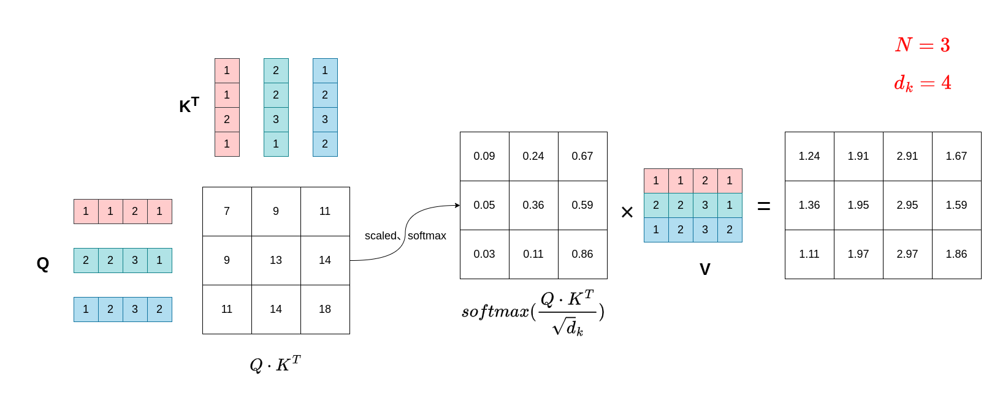
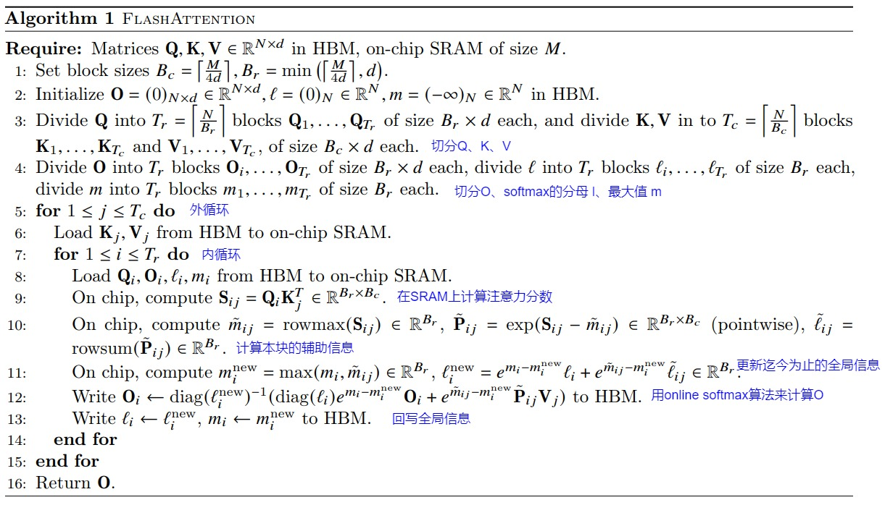
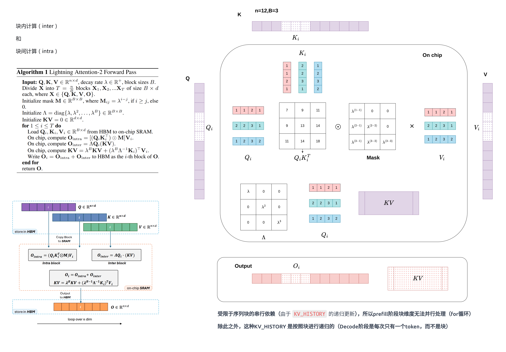

# Attention 和Linear Attention优化

# GPU内存分级存储的架构


# Attention的演进（safe-Softmax->3pass-Softmax->2pass-Softmax->1pass-Attention->FlashAttentionV1->FlashAttentionV2）


演进前提：

- 使用GPU并行加速 Attention的前提是能够将计算内容进行分块（tiling），而模型分块的难点在于 softmax 计算。

- 在推理引擎实现中，对于性能受限于内存带宽的操作进行加速的常用方式就是**算子融合**，其**基本思想是**：在SRAM存储容许的情况下，将多个操作融合成一个操作来完成，从而避免反复执行“从HBM中读取输入数据，执行计算，将计算结果写入到HBM中

- Tiling 技巧的核心思想是，尽可能避免对整个序列进行操作，而是通过维护一些中间变量来递推式地完成某些操作，从而减少内存的消耗。


## 标准 Self-Attention算法和缺陷


缩放点积注意力（Scaled Dot-Product Attention）模块的核心公式为：

$Attention(Q,K,V)=softmax(\frac{QK^T}{\sqrt{d_k}}) \times V$


其中：Q和K的维度均是(N,d_k)，V的维度是(N,d_v)，其中N是输入序列长度，d_k，d_v是特征维度。softmax(QKT)的维度是(N,N)，Attention(Q,K,V)的输出维度是(N,d_v)。


假设 $N=3, \; d_k=4$, 即有 3 个token，每个token向量的维度为4，则一个简化版注意力计算过程（这里举例的Q、K、V是相同的）如下图：



这个 $QK^T$ 一般被称为**注意力分数（或相似度得分）**，而 $softmax(\frac{QK^T}{\sqrt{d_k}})$ 则一般被称为**注意力权重**。

标准的 Attention 计算过程具体可分成三步（也叫 3-pass 算法，为表达方便，先不考虑 $\sqrt{d_k}$ 和掩码。），如下：

- $S=QK^T \in R^{N \times N}$

- $P=softmax(S) \in R^{N \times N}$

- $O=PV \in R^{N \times d}$


上述3-pass标准注意力算法在GPU内存分级存储的架构下存在两个缺陷：**显存占用多和HBM读写次数多**。造成缺陷的罪魁祸首是 $QK^T$ 操作，该操作一方面决定了注意力机制的算法复杂度是 $O(N^2)$，另一方面其产生的两个中间矩阵S和P的内存占用过大，需要在HBM和SRAM中搬运，而 HBM 的读写带宽 相比 SRAM 低很多，于是减慢了运行时间（wall-clock time）。


内存（**这里内存是广义上的，在GPU上就是所谓的显存**）占用分析：

- 对于Q、K、V、O而言，其所需的内存为 $O(Nd)$，中间向量S和P所需内存为 $O(N^2)$，因此内存总需求是 $O(Nd+N^2)$。当序列长度N很大（ $N >> d$）的时候，这个中间向量S和P是内存刺客。


HBM的 IO 分析：

- 第一步有三次操作，总共需要进行 $(2Nd+N^2)$ 次的HBM访问。

    - 两次读操作：从HBM中读取完整的Q和K向量（ $Q,V \in R^{N \times d}$ ）

    - 一次写操作：把相似度得分 S 向量（ $S \in R^{N \times N}$）写回到HBM

- 第二步有两次操作，总共需要进行 $(2N^2)$ 次HBM访问。

    - 一次读操作：从HBM中读取完整的 S 向量（ $S \in R^{N \times N}$）

    - 一次写操作：把 P 向量（ $P \in R^{N \times N}$）回写到HBM

- 第三步有三次操作，总共需要进行 $(N^2+Nd+Nd)$ 次HBM访问。

    - 两次读操作：从HBM中读取完整的 P 和 V 向量（ $P \in R^{N \times N}, \; V \in R^{N \times d}$）

    - 一次写操作：把输出向量O（ $O \in R^{N \times d}$）写回到HBM

3-pass标准注意力算法IO分析汇总：HBM总开销为 $(4Nd+4N^2)$，IO复杂度为 $O(Nd+N^2)$。


FlashAttention的优化思路是 "算子融合+分块计算"：

1. 算子融合：将上述3-pass算法中的计算进行融合，减少中间向量 S 和 P 在 SRAM 和 HBM 之间的数据拷贝。 （算子融合的前提是SRAM存储足够大，或者说，只有SRAM能够容纳中间结果，才有算子融合的可行性。）

2. Tiling 分块计算：因为SRAM未必能够一次性存储完中间向量S和P，所以需要通过 tiling 操作来进行分块计算保证每次计算的中间向量S和P能够被 SRAM 存储。在分块计算中只加载必要的参与计算的Q，K，V的分块到SRAM ，这样其总体内存不超过SRAM的大小，并且计算完成S后，直接使用S来计算P。借此来提高整体读写速度（减少了HBM访问次数）。

注意力机制的计算过程是“矩阵乘法 --> scale --> mask --> softmax --> dropout --> 矩阵乘法”，矩阵乘法和逐点操作（scale，mask，dropout）的分块计算是比较容易实现的。但是 Attention 中有 Softmax 操作，而 **Softmax 的分母包含与所有元素相关的求和项（全局数据依赖）**。所以对 Attention 进行分块计算的**真正难点在于对 Softmax 的分块计算**。

## Softmax 分块计算 --> Attention分块计算

正如上述描述，对Attention计算分块的难点在于**对 Softmax 的分块计算**。为了能够将softmax算法本身从全局数据依赖中解耦，从而 Attention 可以 tiling 快速片上（on-chip）计算，发展有几个历程：


> 参考：
> 
> [《Online normalizer calculation for softmax》](https://arxiv.org/abs/1805.02867)
> 
> [《From Online Softmax to FlashAttention》](https://courses.cs.washington.edu/courses/cse599m/23sp/notes/flashattn.pdf)这个是重点
> 
> 


### 原生Softmax计算


假设一组数据 $x=[x_1,x_2,...,x_V]$，其中 $x_i$ 是数组中的第i个元素，则函数 $y=softmax(x)$ 被定义为：

$$
y_i=\frac{e^{x_i}}{{\textstyle \sum_{j=1}^{V} e^{x_j}}}
$$

具体算法如下：


算法流程需要两个循环，涉及两次从内存读取和一次内存写回操作：

- 计算归一化项（normalization term） $d_V$：Softmax 函数中，分母的求和项被叫做归一化项 $d_V$。

- 计算输出值 $y_i$。


### 3-Pass Safe Softmax算法


原生 Softmax 计算数据溢出问题：

- 数据上溢：浮点数表示的范围有限，对于float32，当 $x \ge 89$, $e^x$ 就会变成inf；对于 float16，当 $x > 11$, $e^x$ 也会变成inf，造成数据上溢。

- 数据下溢：当数组中每个元素都是较大负值时，每个 $e^{x_i}$ 都可能下溢导致整个分母为0，进而导致Softmax 计算出错。

所以实际会使用 Safe Softmax 算法，即基于Softmax 的“平移不变性”，把每个元素减去所有元素最大值之后，再做Softmax操作，具体公式如下：

$$
m = max(x) = max([x_1, x_2, ..., x_V])
$$

$$
y_i = softmax(x_i) = \frac{e^{x_i - m}}{\textstyle \sum_{j=1}^{V} e^{x_j-m}}
$$

Softmax的平移不变性（Translation Invariance）是指：**当输入向量的每个元素都加上同一个常数时，Softmax的输出结果保持不变**。


Softmax 函数的定义为：
$y_i=softmax(x_i)=\frac{e^{x_i}}{{\textstyle \sum_{j=1}^{V} e^{x_j}}}$
若对输入向量 **x** 的每个元素加上一个常数 *c*，得到新的输入 $x'=[x_1+c,x_2+c,...,x_V+c]$，则新的Softmax输出为：
$y_i'=\frac{e^{x_i+c}}{{\textstyle \sum_{j=1}^{V} e^{x_j+c}}}=\frac{e^{x_i} \cdot e^c}{{\textstyle \sum_{j=1}^{V} e^{x_j} \cdot e^c}}=\frac{e^{x_i}}{{\textstyle \sum_{j=1}^{V} e^{x_j}}}=y_i$


Safe Softmax 算法需要三个循环，并且这三个循环之间存在数据计算依赖：

- 第一个循环计算数组的最大值

- 第二个循环计算 softmax 的分母

- 第三个循环计算 softmax 输出

这个 3-pass Safe Softmax 算法是为了解决数据溢出问题，在原生基础上会增加一次循环访存（IO）。


### 2-Pass Online Softmax算法

这个主要是在 Safe Softmax 公式基础上优化的计算过程（相比于3-pass Safe Softmax 算法，从三次循环变成两次循环，内存访问次数从每个向量元素的 4 次减少到 3 次）：


具体而言，

- 算法针对输入数据 $x=[x_1,x_2,...,x_V]$，其中 $x_i$ 是数组中的第i个元素

- 在循环的第 j 步， $m_j$ 表示子数组 $x_{1:j}$ 的最大值， $d_j$ 表示子数组 $x_{1:j}$ 计算 Safe Softmax 的分母

- $m_V$ 表示整个数组中的最大值， $d_V$ 表示整个数组中计算 Safe Softmax 的分母

2-Pass Online Softmax算法本质其实是对 Safe Softmax分母计算做了一次优化（以递归的形式，去除计算 $d_j$ 时迭代过程中对全局最大值 $m_V$ 的依赖）。相对于 3-pass Safe Softmax 算法虽然减少了一次循环访存（IO），但是增加了额外的scale计算 $d_{j-1} \times e^{m_{j-1} - m_j}$。

由于 2-Pass Online Softmax 算法中，第二个循环依赖于第一个循环中的 $d_V$，从Sofemax计算来看，无法做到 1-Pass 的算法。

### Multi-Pass Self-Attention

回归问题，我们的目标是优化计算 $O=softmax(QK^T)V$，而不是softmax。虽然无法做到 1-Pass Online Softmax算法，但是可以做到 1-Pass Self-Attention 算法。

首先将上述中的 2-Pass Online Softmax 算法应用于 Attention的计算过程，获得 2-Pass Self-Attention 的算法：


### 1-Pass Self-Attention

从2-Pass Self-Attention 的算法中发现，对于 $o_i$ 的更新 $o_i \ge ts o_{i-1} + \alpha V[i,:]$ 可以找到 $o_i$ 和 $o_{i-1}$ 之间不依赖于全局数据 $m_N$ 的递归关系，具体而言：


因此可以得到 1-Pass Self-Attention 的算法递归式：


### 多元素Tiling版本的 Attention 算法

其实上述过程的演进是一个元素进行迭代的，而在实际过程中，一般会将输入分为多个块，每个块包含多个元素。


## Flash-Attention V1/V2 //不是重点，待更新。。

参考：

[《FlashAttention: Fast and Memory-Efficient Exact Attention with IO-Awareness》](https://arxiv.org/abs/2205.14135)




# Linear Attention的演进（Linear Attention->Lightning Attention->Minimax模型）

## ALiBi位置编码

论文：[《Train Short, Test Long: Attention with Linear Biases Enables Input Length Extrapolation》](https://arxiv.org/abs/2108.12409)


ALiBi 不像 RoPE 位置编码通过词嵌入方式添加，而是通过与距离成比例的惩罚来偏置 query-key 注意力分数。并且其实现方式也很粗暴，是直接作用在 attention score 中。具体而言，会给 attention score 加上一个预设好的偏置矩阵（有个假设前提：如果两个token距离越远，那么相互共享度就很低，因此其attention score分数应该很小）。

$softmax(q_iK^T + m [-(i-1),...,-2,-1,0])$


其中，m是一种调节因子。于是整体在实际计算时候是：

$$
softmax\left(
\begin{bmatrix}
q_1 \cdot k_1 & & & & \\
q_2 \cdot k_1 & q_2 \cdot k_2 & & & \\
q_3 \cdot k_1 & q_3 \cdot k_2 & q_3 \cdot k_3 & & \\
q_4 \cdot k_1 & q_4 \cdot k_2 & q_4 \cdot k_3 & q_4 \cdot k_4 & \\
q_5 \cdot k_1 & q_5 \cdot k_2 & q_5 \cdot k_3 & q_5 \cdot k_4 & q_5 \cdot k_5
\end{bmatrix}
+ m \cdot
\begin{bmatrix}
0 & & & & \\
-1 & 0 & & & \\
-2 & -1 & 0 & & \\
-3 & -2 & -1 & 0 & \\
-4 & -3 & -2 & -1 & 0
\end{bmatrix}
\right)
$$

其实Lightning Attention-V2中借用了这种添加位置编码的方式，只不过在实现过程中略有不同


## Linear Attention

最开始起源于论文[《Transformers are RNNs: Fast Autoregressive Transformers with Linear Attention》](https://arxiv.org/abs/2006.16236)，从传统基于softmax的注意力机制出发，线性注意力的诞生流程可归纳为下图：


相比Softmax Attention，Linear Attention的改进点如下：

- 替换原始的softmax为其他激活函数

- Attention的计算由左乘改为右乘，将原本的二次计算复杂度转化为线性复杂度，即将复杂度由 $O(N^2d)$ 降低为 $O(Nd^2)$


## Lightning Attention（闪电注意力）

Lightning Attention的基本思想是Linear Attention，根据时间顺序，先后出了两个版本，即V1和V2，分别解决了线性注意力机制的2个问题，如下:

- GPU 上的内存访问（I/O）可能影响Attention计算的整体速度；

- 因果注意力下，所需的累积求和（cumsum）操作使其无法达到理论训练速度。


### Lightning Attention-V1

考虑到因果mask的情况下**右乘的计算很低效**，在训练过程中，作者继续沿用了传统的**左乘版本**。但是沿用了FlashAttention中的启发，设计了：


其中一次计算示意图如下：


### Lightning Attention-V2

具体算法如下：




为什么块内（intra）、块间（inter）之间能这么计算?


## Lightning Attention代码实现

参考：https://github.com/OpenNLPLab/lightning-attention/tree/main/lightning_attn/ops/triton


### Pytorch（最初版）

其实这里有个衰减率（decay rate）的概念，参考ALiBi位置编码

其实 Linear Attention 的整体计算是：

$(Q \cdot K^T \odot M)V$

不过在具体实现的时候，这个掩码M处理有点不同，直接用叉乘：

$$
\left(
\begin{bmatrix}
q_1 \cdot k_1 & q_1 \cdot k_2 & \cdots & q_1 \cdot k_n \\
q_2 \cdot k_1 & q_2 \cdot k_2 & \cdots & q_2 \cdot k_n \\
\vdots & \vdots & \ddots & \vdots \\
q_n \cdot k_1 & q_n \cdot k_2 & \cdots & q_n \cdot k_n
\end{bmatrix}
\times
\begin{bmatrix}
e^{(1-1)} & & & {\color{red} e^{-\infty}} \\
e^{-(2-1)} & e^{-(2-2)} & & \\
\vdots & \vdots & \ddots & \\
e^{-(n-1)} & e^{-(n-2)} & \cdots & e^{-(n-n)}
\end{bmatrix}
\right)
\times
\begin{bmatrix}
v_{11} & v_{12} & \cdots & v_{1d} \\
v_{21} & v_{22} & \cdots & v_{2d} \\
\vdots & \vdots & \ddots & \vdots \\
v_{n1} & v_{n2} & \cdots & v_{nd}
\end{bmatrix}
$$

其中， $q_i \cdot k_j$ 表示q的第i行和k的第j列的点乘。具体代码如下：

```Python
import torch
import math

def get_mask(n, slope=1):
    *"""*
    参考*ALiBi 位置编码*
    *当 n=5 时候返回 mask * slope，其中mask是矩阵：*
    *   [[ 0., -inf, -inf, -inf, -inf],*
    *    [-1.,   0., -inf, -inf, -inf],*
    *    [-2.,  -1.,   0., -inf, -inf],*
    *    [-3.,  -2.,  -1.,   0., -inf],*
    *    [-4.,  -3.,  -2.,  -1.,   0.]]*
    *"""*
    mask = torch.triu(torch.zeros(n, n).float().fill_(float("-inf")), 1)
    # -n, ..., -2, -1, 0
    for i in range(n):
        x = torch.arange(i + 1)
        y = slope * x
        mask[i, : i + 1] = -torch.flip(y, [0])

    return torch.exp(mask)

# 这个主要是根据注意力头 head维度的不同，给的slopes对应每个 head 的 调节因子
def get_full_mask(n, slopes):
    if slopes == None:
        mask = torch.tril(torch.ones((n, n)))
    else:
        arr = []
        for slope in slopes:
            arr.append(get_mask(n, slope.item()))
        mask = torch.stack(arr, dim=0)

    return mask

def _build_slope_tensor(n_attention_heads: int):
    *"""*
*    基于指数衰减的多头注意力斜率生成机制，其核心思想是为每个注意力头分配不同的衰减系数（slope），使不同头能关注不同距离的历史位置。*
*    这里的衰减系数是 1/2 具体计算方式如下：*
*    当n_attention_heads=10时候，返回的斜率为：*
*    tensor([2^(-1), 2^(-2), 2^(-3), 2^(-4), 2^(-5), 2^(-6), 2^(-7), 2^(-8)   ,   2^(-0.5), 2^(-1.5)])*

*    ****:param**** n_attention_heads: 注意力头的数量*
*    ****:return****: *
*    """*
*    *
*    *def get_slopes(n):
        def get_slopes_power_of_2(n):
            start = 2 ** (-(2 ** -(math.log2(n) - 3)))
            ratio = start
            return [start * ratio ** i for i in range(n)]

        if math.log2(n).is_integer():
            return get_slopes_power_of_2(
                n
            )  # In the paper, we only train models that have 2^a heads for some a. This function has
        else:  # some good properties that only occur when the input is a power of 2. To maintain that even
            closest_power_of_2 = 2 ** math.floor(
                math.log2(n)
            )  # when the number of heads is not a power of 2, we use this workaround.
            return (
                    get_slopes_power_of_2(closest_power_of_2)
                    + get_slopes(2 * closest_power_of_2)[0::2][: n - closest_power_of_2]
            )

    # h, 1, 1
    slopes = torch.tensor(get_slopes(n_attention_heads)).reshape(
        n_attention_heads, 1, 1
    )

    return slopes


def linear_attn(q, k, v, s=None):
    b, h, n, d = q.shape
    mask = get_full_mask(n, s).to(q.device).to(torch.float32)
    qk = torch.matmul(q, k.transpose(2, 3))
    qk = (qk.to(torch.float32) * mask).to(q.dtype)
    o = torch.matmul(qk, v)

    return o
    

if __name__ == '__main__':
    torch.manual_seed(2024)
    dtype = torch.bfloat16
    device = torch.device("cuda")

    b, h, n, d, e = 6, 20, 2048, 128, 64

    q = (torch.randn((b, h, n, d), dtype=dtype, device=device) / 10).requires_grad_()
    k = (torch.randn((b, h, n, d), dtype=dtype, device=device) / 10).requires_grad_()
    v = (torch.randn((b, h, n, e), dtype=dtype, device=device) / 10).requires_grad_()
    s = _build_slope_tensor(h).to(q.device).to(torch.float32)

    # forward
    o = linear_attn(q, k, v, s)
    print(o.shape) 
```


### Lightning Attention-V2（GPU并行加速版）

在整体上计算还是等同于

$(Q \cdot K^T \odot M)V$

不过为了让 IO 与计算匹配，重新替换新算法：


#### prefill代码一：这个严格按照上述算法更新（不过在 $O_i$ 维度更新时候，可以并行计算，划分了grid）


其中调用入口函数为：

```Python
def forward(ctx, q, k, v, s):
    q = q.contiguous()
    k = k.contiguous()
    v = v.contiguous()
    s = s.contiguous()

    b, h, n, d = q.shape
    e = v.shape[-1] # 最终结果 o 的 dim 维度由 v 中的 dim 维度确定
    
    # 在HBM上申请一个用于存储计算结果的显存空间
    o = torch.empty((b, h, n, e), dtype=q.dtype, device=q.device)

    # 每次迭代计算时块的大小，即每次实际计算传入的 token 数量。
    BLOCK = 64
    NUM_BLOCK = triton.cdiv(q.shape[2], BLOCK)  # 需要迭代多少次，对应上述的 T    
    
    # parallel over channel
    # b 维度数据计算 和 h维度数据计算 天然没有相关性，可以直接并行
    # 对于 e 维度，主要是在最后计算 out 时候，不同的 v 块（e维度）可以并行得到对应的 out 块
    BLOCK_MODEL = min(triton.next_power_of_2(e), 32)
    grid = (b * h, triton.cdiv(e, BLOCK_MODEL))
    
    # GPU核心调用 Launcher Kernel
    _fwd_kernel[grid](
        q, k, v, o, s, # ====> q,k,v,s 是向量数据
        b, h, n, d, e, # ====> q,k,v,s 的形状（因为在算子中没有shape这个概念。）
        BLOCK=BLOCK,
        NUM_BLOCK=NUM_BLOCK,
        BLOCK_MODEL=BLOCK_MODEL,
    )

    ctx.save_for_backward(q, k, v, s)

    return o
```

上述算法中对应的核心GPU代码如下：

```Python
@triton.jit
def _fwd_kernel(
    Q, K, V, # 输入张量 Q,K,V
    Out, # 输出张量 Out
    S,  # log lambda ==> 衰减因子的对数，用于控制时间步间的衰减。
    b: tl.constexpr, # 这个 tl.constexpr *用于声明编译时常量， batch size*
    h: tl.constexpr, # head数
    n: tl.constexpr, # 序列长度
    d: tl.constexpr, # Query / Key 的维度dim
    e: tl.constexpr, # Value 的维度dim
    BLOCK: tl.constexpr, # 时间步维度的分块大小（如将序列长度n分成多个BLOCK大小的块处理）
    NUM_BLOCK: tl.constexpr, # 时间步维度的分块总数（n // BLOCK）
    BLOCK_MODEL: tl.constexpr, # 特征维度 e 的分块大小（将输出维度拆分为多个子块并行计算）
):
    ##### get offset (各个向量的 **起始偏移量**)
    off_bh = tl.program_id(0)     # 线程块ID，对应batch和head的组合索引
    off_h = off_bh % h            # 提取head索引
    off_e = tl.program_id(1)      # 线程块ID，对应特征维度的子块索引
    qk_offset = off_bh * n * d    # Q/K张量的起始偏移量（batch和head的基地址）
    v_offset = off_bh * n * e     # V张量的起始偏移量
    o_offset = off_bh * n * e     # Out张量的起始偏移量
    # channel offset
    e_offset = off_e * BLOCK_MODEL    # 特征维度子块 e 的偏移量

    ##### get block ptr （内存块指针构建）
    Q_block_ptr = Q + qk_offset + tl.arange(0, d)[None, :]     # 指向当前 head 的Q矩阵
    K_trans_block_ptr = K + qk_offset + tl.arange(0, d)[:, None] # 指向当前head的K矩阵（转置）
    V_block_ptr = V + v_offset + e_offset + tl.arange(0, BLOCK_MODEL)[None, :]      # 指向当前特征e维度子块的V矩阵
    O_block_ptr = Out + o_offset + e_offset + tl.arange(0, BLOCK_MODEL)[None, :]    # 指向当前特征e维度子块的输出矩阵
    S_block_ptr = S + off_h     # 指向当前head的log λ值

    ##### init diag decay(Lambda); q, k decay（初始化一个上三角的指数衰减矩阵） 
    s = tl.load(S_block_ptr)
    # q, k decay
    off_block = tl.arange(
        0, BLOCK
    )  # Not bug, this is a bit different from algorithm 1, but is mathematically equivalent
    q_decay = tl.exp(-s.to(tl.float32) * off_block[:, None])
    k_trans_decay = tl.exp(-s.to(tl.float32) * (BLOCK - off_block[None, :]))
    block_decay = tl.exp(-s.to(tl.float32) * BLOCK)
    # diag decay
    index = off_block[:, None] - off_block[None, :]
    s_index = s * index
    s_index = tl.where(index >= 0, -s_index, float("-inf"))
    diag_decay = tl.exp(s_index)
    
    # 初始化kv = 0
    kv = tl.zeros([d, BLOCK_MODEL], dtype=tl.float32)

    ##### compute
    for i in range(NUM_BLOCK):
        # load 将当前计算数据加载到 on-chip 内存上
        q = tl.load(
            Q_block_ptr + off_block[:, None] * d, mask=off_block[:, None] < n, other=0.0
        ).to(tl.float32)
        k_trans = tl.load(
            K_trans_block_ptr + off_block[None, :] * d,
            mask=off_block[None, :] < n,
            other=0.0,
        ).to(tl.float32)
        v = tl.load(
            V_block_ptr + off_block[:, None] * e, mask=off_block[:, None] < n, other=0.0
        ).to(tl.float32)

        # compute 在 on-chip 上更新 
        qk = tl.dot(q, k_trans) * diag_decay   # 计算当前块内QK^T
        o_intra = tl.dot(qk, v)                # 块内注意力输出
        o_inter = tl.dot(q, kv) * q_decay      # 块间注意力计算
        o = o_intra + o_inter                  # 合并块内和块间计算结果

        # save and update （存储输出）
        tl.store(
            O_block_ptr + off_block[:, None] * e,
            o.to(O_block_ptr.dtype.element_ty),
            mask=off_block[:, None] < n, # 边界判断
        )
        kv = block_decay * kv + tl.dot(k_trans * k_trans_decay, v) # 显存的更新
        off_block += BLOCK # ==> 用于后续更新地址 以便 找到下一个块对应的数据
```


#### prefill代码二：并行度相对于代码二更高了


# 参考

1. [Attention 优化原理篇：FlashAttention/Linear Attention/Lightning Attention](https://zhuanlan.zhihu.com/p/1920800829725709333)

2. [探秘Transformer系列之文章列表](https://www.cnblogs.com/rossiXYZ/p/18785601)

3. [[Attention优化][2w字]📚原理篇: 从Online-Softmax到FlashAttention V1/V2/V3](https://zhuanlan.zhihu.com/p/668888063)

4. [FlashAttentionV1/V2+PageAttentionV1/V2+RadixAttention算法总结](https://zhuanlan.zhihu.com/p/1890132185966682238)

5. [Cuda 编程之 Tiling](https://zhuanlan.zhihu.com/p/342103911)

6. [线性注意力机制：Linear Attention->Lightning Attention->Minimax模型](https://zhuanlan.zhihu.com/p/1896380352202794899)

7. [online-softmax 论文解读 - Tw93](https://www.armcvai.cn/2024-10-01/online-softmax-paper.html)

8. [FlashAttentionV1/V2+PageAttentionV1/V2+RadixAttention算法总结](https://zhuanlan.zhihu.com/p/1890132185966682238)

9. [Cuda 编程之 Tiling](https://zhuanlan.zhihu.com/p/342103911)

10. [大模型位置编码-ALiBi位置编码](https://zhuanlan.zhihu.com/p/656684326)

11. [Triton写算子：Flash attention v2（入门版）](https://zhuanlan.zhihu.com/p/17790319806)

12. [CUDA流和事件详解|GPU流水线执行](https://zhuanlan.zhihu.com/p/713295598)

