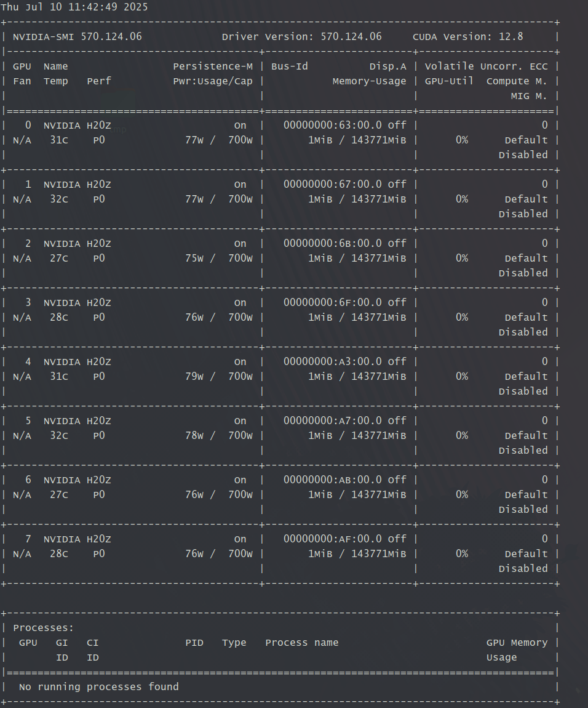

# Docker




https://yeasy.gitbook.io/docker_practice/image/dockerfile/copy


Docker compose 在ubuntu系统中，可能找不到命令：

```Bash
> docker compose
docker: 'compose' is not a docker command.
See 'docker --help'

```

所以需要安装下插件：

```Bash
sudo apt install docker-compose-v2
```

`sudo apt install docker-compose-v2` 这个命令的作用是通过 APT 包管理器 在基于 Debian/Ubuntu 的系统上安装 Docker Compose V2 的版本。Docker Compose 是一个用于定义和运行多容器 Docker 应用程序的工具，允许你通过一个 YAML 文件（`docker-compose.yml`）来配置服务、网络和卷，并一键启动整个环境。

- Docker Compose 从 V2 版本开始，官方将其拆分为两个分支：

    - Docker Compose V1 （旧版，基于 Python 开发，与 Docker Desktop 集成）。

    - Docker Compose V2 （新版，基于 Go 语言开发，更轻量且与 Docker Engine 更紧密集成）。

- 这个命令会安装独立的 Docker Compose V2 版本，不需要依赖 Docker Desktop ，适合在服务器或命令行环境下使用。

- 安装完成后，你可以通过命令 `docker compose`（注意：V2 的命令格式改为 `docker compose`，而非旧版的 `docker-compose`）来管理多容器应用。（有时候linux中会使用alias改名操作，所以需要具体追踪下是哪个版本）

```Bash
使用 \ 强制忽略别名（alias），直接调用原始命令：

\docker-compose --version
\docker compose --version


如果 \docker-compose --version 有输出 → V1 已安装 。
如果 \docker compose version 有输出 → V2 已安装 。
```

[DockerCheatSheet-ByGeekHour.pdf](images/DockerCheatSheet-ByGeekHour.pdf)

[GitCheatSheet-ByGeekHour.pdf](images/GitCheatSheet-ByGeekHour.pdf)


# Docker compose

```YAML
services:
  sglang:
    build:
      context: .
      dockerfile: ./Dockerfile
    image: tz/sglang:tag0.4.7
    container_name: tz_sglang_0.4.7
    volumes:
      - /home/work/:/home/work/
      - /home/work/tz/:/workspace
      # If you use modelscope, you need mount this directory
      # - ${HOME}/.cache/modelscope:/root/.cache/modelscope
    restart: always
    network_mode: host # required by RDMA
    privileged: true # required by RDMA
    # Or you can only publish port 30000
    # ports:
    #   - 30000:30000
    environment:
      HF_TOKEN: <secret>
      # if you use modelscope to download model, you need set this environment
      # - SGLANG_USE_MODELSCOPE: true
    entrypoint: /bin/bash
    ulimits:
      memlock: -1
      stack: 67108864
    ipc: host
```

在使用 `docker-compose up` 命令时，默认行为是优先尝试从远程仓库拉取指定的镜像（即 `image: tz/sglang:tag0.4.7`），如果本地不存在该镜像或远程拉取失败，则会根据 `build` 配置构建镜像。


如果你希望 **跳过远程拉取步骤，直接使用本地 Dockerfile 构建镜像**，可以使用以下命令：

```Bash
docker-compose up --build
```

该命令会强制 Docker Compose 使用本地的构建上下文和 Dockerfile 重新构建服务镜像，不会尝试从远程仓库拉取 。

### 说明

- `--build` 参数会忽略本地是否已有同名镜像，强制执行构建过程。

- 如果你只是想构建而不启动容器，可以使用：

```Bash
docker-compose build
```

- 如果你希望构建后启动容器，使用：

```Bash
docker-compose up --build
```


## Docker compose 重建机制

在使用 Docker Compose 时，如果你在不同的目录下运行 `docker compose up -d` 但指定了相同的 Compose 文件（如 `-f compose.yaml`），Docker 会将这些操作视为对同一项目的更新 ，从而导致之前运行的容器被停止或重建。


Docker Compose 默认会以当前目录名作为项目的名称（`project name`）。如果两个目录下的 Compose 文件内容相同（尤其是服务名称和配置），即使你显式指定了 `-f compose.yaml`，Docker 也会认为这是对同一项目的操作，从而触发重建流程。


解决方案

1. 通过 `-p` 参数显式指定不同的项目名称，避免冲突

    ```Bash
    # 在第一个目录中
    docker compose -p project1 -f compose.yaml up -d
    
    # 在第二个目录中
    docker compose -p project2 -f compose.yaml up -d
    ```

2. 确保不同目录下的 `compose.yaml` 文件中的服务名称和容器名称不同：

    ```Bash
    # 第一个目录的 compose.yaml
    services:
      service1:
        image: my_image
        container_name: container1
    
    # 第二个目录的 compose.yaml
    services:
      service2:
        image: my_image
        container_name: container2
    ```


# dockerfile中的一些修改（国内源代码修改）

https://www.zhihu.com/question/639277546

```Dockerfile
# 清华源 
RUN pip config set global.index-url https://pypi.tuna.tsinghua.edu.cn/simple 

# 阿里源 
RUN pip config set global.index-url https://mirrors.aliyun.com/pypi/simple/ 

# 小米源 
RUN pip config set global.index-url https://pkgs.d.xiaomi.net/artifactory/api/pypi/pypi-virtual/simple
```

这样，在使用 `pip install` 的时候就会去国内源中找python包


但是会遇到类似pytorch安装指定版本wheel的情况：

```Dockerfile
RUN python3 -m pip install --no-cache-dir torch --index-url https://download.pytorch.org/whl/cu126;
```

直接考虑是否可以替换（只有其中存在的。需要在https://developer.aliyun.com/mirror/查找存在的），参考pytorch：

- 阿里：https://developer.aliyun.com/mirror/pytorch-wheels

```Dockerfile
# 阿里
https://mirrors.aliyun.com/pytorch-wheels/cu126

# 错误提示：
python3 -m pip install --no-cache-dir torch --index-url https://mirrors.aliyun.com/pytorch-wheels/cu126;

Looking in indexes: https://mirrors.aliyun.com/pytorch-wheels/cu126
ERROR: Could not find a version that satisfies the requirement torch (from versions: none)
ERROR: No matching distribution found for torch


# 


```


# Docker容器构建过程

一般在dockerfile中一个RUN 会构建一层镜像，然后生成hash值，如果前面都一样，那么在构建过程中就会使用已经有的层，否则就得从头构建，

对于源码编译，如果修改了一个代码（哪怕是一个空格）就会导致重新生成这个层，所以一般所有的源码编译会放在最后构建


# CMD \&\& ENTRYPOINT

当你使用 Docker 启动容器时，镜像的 Dockerfile 中可能定义了 `ENTRYPOINT` 和 `CMD`，它们共同决定了容器启动时执行的命令。如果你希望在启动容器时替换原有的 `ENTRYPOINT` 命令 ，可以使用以下方法。

替换 `ENTRYPOINT` 是调试容器的常见手段，比如进入容器内部查看日志、修改配置等。

|**指令**|**作用说明**|
|---|---|
|CMD|容器启动时的默认命令，可以被 docker run 后面的命令覆盖|
|ENTRYPOINT|容器启动时的主命令，通常不会被覆盖，除非使用 `--entrypoint` 显式替换|

## **查看镜像的默认 ENTRYPOINT 和 CMD**

在替换之前，建议先查看镜像的默认配置：

```Bash
docker inspect my_image | grep -A 6 -B 2 'Entrypoint\|Cmd'
```

输出可能类似：

```JSON
"Entrypoint": ["python3", "-m", "vllm.entrypoints.openai.api_server"],
"Cmd": null
```

这说明容器启动时默认执行的是：

```Bash
python3 -m vllm.entrypoints.openai.api_server
```


## **替换 ENTRYPOINT 的几种方式**

使用 `docker run --entrypoint`:

```Bash
docker run --entrypoint <新入口命令> my_image [参数]
```

示例 1：替换为 `bash`（容器启动默认用的是\`/bin/bash\`）

```Bash
docker run -it --entrypoint /bin/bash my_image
```

示例 2：替换为运行其他 Python 模块

```Bash
docker run -it --entrypoint python3 my_image -m my_custom_module
```

https://devtest-notes.readthedocs.io/zh/latest/CI/continuous-integration-for-blog-build-with-github-actions.html


## sglang调试容器

```Python
docker run -itd \
    --gpus all \
    -v $HOME/.cache/modelscope/:/root/.cache/modelscope \
    -v $HOME/.cache/huggingface/:/root/.cache/huggingface \
    -v /home/work/models/:/root/work_models \
    -v $HOME/dev/sglang:/sgl-workspace/sglang \
    --ipc=host \
    --network=host \
    --privileged \
    --name sglang_dev \
    --entrypoint /bin/bash \
    lmsysorg/sglang:dev
Python
pip install -e "python[all]" -i https://pkgs.d.xiaomi.net/artifactory/api/pypi/pypi-virtual/simple
# 验证
python3 -m sglang.launch_server --help
Python
docker run -itd \
    --gpus all \
    -v $HOME/.cache/modelscope/:/root/.cache/modelscope \
    -v $HOME/.cache/huggingface/:/root/.cache/huggingface \
    -v /home/work/models/:/root/work_models \
    -v $HOME/dev/sglang:/sgl-workspace/sglang \
    --ipc=host \
    --network=host \
    --privileged \
    --name sglang_dev \
    --entrypoint /bin/bash \
    micr.cloud.mioffice.cn/llm-infra/sglang:0.4.7-deepep-xm-lyc-1.0.28-test
```


# `externally-managed-environment` 错误

错误提示：

```Bash
pip install transformers
 error: externally-managed-environment

× This environment is externally managed
╰─> To install Python packages system-wide, try apt install
    python3-xyz, where xyz is the package you are trying to
    install.
    
    If you wish to install a non-Debian-packaged Python package,
    create a virtual environment using python3 -m venv path/to/venv.
    Then use path/to/venv/bin/python and path/to/venv/bin/pip. Make
    sure you have python3-full installed.
    
    If you wish to install a non-Debian packaged Python application,
    it may be easiest to use pipx install xyz, which will manage a
    virtual environment for you. Make sure you have pipx installed.
    
    See /usr/share/doc/python3.12/README.venv for more information.

note: If you believe this is a mistake, please contact your Python installation or OS distribution provider. You can override this, at the risk of breaking your Python installation or OS, by passing --break-system-packages.
hint: See PEP 668 for the detailed specification.
```


在 Docker 容器中遇到的 `externally-managed-environment` 错误，本质是 PEP 668 机制 在保护系统 Python 环境，防止 pip 直接修改由系统包管理器（如 `apt`）管理的环境。`PEP 668`的目的是为了保护系统环境，防止pip和apt之间的冲突。


1. PEP 668 机制 ：

    - Debian/Ubuntu 系统从 Python 3.11 开始默认启用该机制，通过 `/usr/lib/python3.12/site-packages/EXTERNALLY-MANAGED` 文件标记环境。

    - 阻止 pip 直接安装/卸载包，避免与 `apt` 管理的包冲突。

2. 容器环境特性 ：

    - 使用的基础镜像（如 `python:3.12` 或 `ubuntu`）可能继承了系统级 Python 管理。

    - 以 `root` 身份运行 pip 时，会触发安全警告（可能影响容器内其他依赖）。


解决方案：**禁用 PEP 668 机制的方法（不推荐，但是在容器中无所谓，非容器可以使用虚拟环境）**

```Bash
# 1. 找到标记文件路径（通常为以下位置）
EXTERNALLY_MANAGED_PATH=$(python3 -c "import sysconfig; print(sysconfig.get_paths()['purelib'] + '/EXTERNALLY-MANAGED')")

# 2. 删除标记文件（需 root 权限）
rm -f "$EXTERNALLY_MANAGED_PATH"
```
