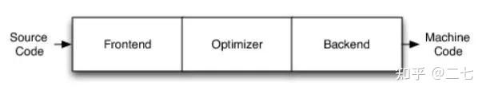

# DSL、IR和即时编译（Just-In Times）

# 名词解释


DSL（Domain-Specific Language，领域特定语言）：是一种旨在特定领域下的上下文的语言。DSL 并不具备很强的普适性，它是仅为某个适用的领域而设计的，但它也足以用于表示这个领域中的问题以及构建对应的解决方案。


IR（Intermediate Representation，中间表示）：是编译器中很重要的一种数据结构。如（PyTorch中存在ONNX，TorchScript【弃用】、FX Tracing）

- ONNX（Open Neural Network Exchange）是一个跨框架的模型交换格式。


LLVM（Low Level Virtual Machine，低级虚拟机，【这个算是历史遗留起名问题了】）：LLVM是一个通用的编译器工具（将代码转为可执行的机器码），可以用来开发新的语言，或者支持新的硬件。


AST（Abstract Syntax Tree，生成语法树）：


# LLVM架构（简单了解）

https://zhuanlan.zhihu.com/p/472813616




LLVM的三段式结构，可以为任何编程语言独立编写前端，或为任意硬件架构独立编写后端：

- Frontend：前端，词法分析、语法分析、语义分析、生成中间代码

- Optimizer：优化器，中间代码优化

- Backend：后端，生成机器码

这里的中间代码一般称为 LLVM IR，不过根据其时机不同，表述方式也有所差异，如中间代码优化过程就是将生成语法树优化为有向无环图（AST-->DAG）的过程。


说明：

- 不同的前端后端使用统一的中间代码LLVM Intermediate Representation (LLVM IR)

- 优化阶段是一个通用的阶段，它针对的是统一的LLVM IR，不论是支持新的编程语言，还是支持新的硬件设备，都不需要对优化阶段做修改（通过 Pass 一系列的优化过程）


# Triton

1. Python 代码 （用户编写的 Triton kernel）

2. 2.`.ttir` （Triton 高级 IR）

3. 3.`.ttgir` （全局内存优化后的 Triton IR）

4. 4.`.llir` （转换为 LLVM IR）

5. 5.`.ptx` （NVIDIA PTX 汇编代码）

6. 6.`.cubin` （GPU 可执行二进制）


## 编译过程

Triton 的 cuda 编译过程如下：

● 将Triton Python代码解析成 AST (抽象语法树)

● 根据 AST 生成 Triton IR 代码

● 将 Triton IR 代码转换成 Triton GPU IR 代码

● 将 Triton GPU IR 代码转换成 LLVM IR 代码

● 使用 LLVM，将 LLVM IR 代码转换成 PTX 代码

● 使用 ptxas，将 PTX 代码转换成 cubin 机器码

将 Triton IR，Triton GPU IR 和 LLVM IR 分别简称为 ttir，ttgir 和 llir。其中，ttir 和 ttgir 是 Triton 项目中自己定义的 中间表示，ttgir 只比 ttir 多了一个 Blocked Layout，描述的是Block对Memory的Access Pattern。llir 则是 LLVM 项目的 中间表示。因此编译时多层IR转换：AST → Triton IR（TTIR）→ TTGIR → LLVM IR → PTX → CUBIN。

在 Triton 编写 GPU 内核时，默认会将上述即时编译的内容保存到 \`~/.triton/cache/\` 目录下，每个目录是一个GPU内核，该目录下生成的文件是 Triton 编译过程中的不同中间或最终产物，每种文件对应不同的编译阶段和用途。

- `__grp__xxxxx_kernel.json`：包含内核的 **工作组（Work Group/Thread Block）配置信息** 。定义了 GPU 线程的组织形式（如线程块大小、网格大小），以及硬件相关的参数（如 SM（Streaming Multiprocessor）数量、GPU 架构版本）。

- `xxxxx_kernel.json`：记录内核的 **编译元数据** ，包括编译选项（如优化级别）、环境信息（如 CUDA 版本、GPU 型号）、性能指标（如指令吞吐量、内存访问模式）等。用于调试和性能分析，帮助开发者了解内核在特定硬件上的行为。

- `.ttir`：Triton 自定义的 高级中间表示（Triton IR） ，类似于 LLVM IR，但针对 Triton 的领域特定语言（DSL）设计。表示 Triton 内核的抽象语法树（AST）和类型信息，用于进一步优化和调试。开发者可以查看此文件确认 Triton DSL 是否正确转换为低级 IR。

- `.ttgir`：Triton 的 全局内存访问优化后的中间表示（Triton Global IR） ，包含内存访问模式（如共享内存、全局内存的使用）和线程协作优化信息。反映 Triton 对内存层次结构（如缓存、寄存器）的优化策略，用于分析内存访问效率。

- `.llir`：转换为 LLVM IR（Low-Level Virtual Machine Intermediate Representation） 的代码。LLVM 是 Triton 后端依赖的编译框架。LLVM IR 是通用编译器中间表示，后续会通过 LLVM 优化并生成 PTX。此文件可用于检查 Triton 到 LLVM 的转换是否正确。

- `.source`：是 Triton 编译器生成的 MLIR（Multi-Level Intermediate Representation）中间代码 ，属于 Triton 自研的领域专用语言（DSL）到 GPU 指令的中间表示。用于描述内核逻辑、内存布局和计算流程，是 Triton 编译器优化和代码生成的关键中间阶段。是后续转换为 PTX 和 CUBIN 的基础。

- `.ptx` ：：Triton 生成的 CUDA PTX（Parallel Thread Execution）代码 ，是 NVIDIA GPU 的中间汇编语言。PTX 是与硬件无关的中间表示（IR），后续会被 NVIDIA 驱动进一步编译为 GPU 可执行的二进制代码（`.cubin`）。开发者可以通过 PTX 分析指令级优化（如寄存器使用、内存访问模式）。

- `.cubin`：经过 NVIDIA 工具（如 `ptxas`）编译后的 GPU 可执行二进制文件 ，包含机器码。直接在特定 GPU 架构（如 SM_80）上运行的代码。不同 GPU 架构需要重新编译生成对应的 `.cubin` 文件。


比如

```SQL
ipython
Python 3.10.12 (main, Feb  4 2025, 14:57:36) [GCC 11.4.0]
Type 'copyright', 'credits' or 'license' for more information
IPython 8.37.0 -- An enhanced Interactive Python. Type '?' for help.

In [1]: import torch
   ...: 
   ...: import triton
   ...: import triton.language as tl
   ...: 
   ...: 
   ...: @triton.jit
   ...: def kernel(X, stride_xm, stride_xn, BLOCK: tl.constexpr):
   ...:     pass
   ...: 
   ...: 
   ...: X = torch.randn(1, device="cuda")
   ...: pgm = kernel[(1, )](X, 1, 1, BLOCK=1024)

In [2]: exit


root@27079f6070f8:~/.triton/cache# ls
5OWTFFIML4HXWFOCJF3ZKABWLHDQ7VCSUIZ2ECBXW6IFDX77MMHA  PJQAOAUEBF4K7G2PTZIJJD55WTLUU6NAJCS4RTYMIQEOPXS6RRAA  WK62YYRZYGMXHAJQKZ2LQW5GQZYJQPHARYBTZXTP7ZRIEJ2CU4DA
root@27079f6070f8:~/.triton/cache# tree .
.
|-- 5OWTFFIML4HXWFOCJF3ZKABWLHDQ7VCSUIZ2ECBXW6IFDX77MMHA
|   |-- __grp__kernel.json
|   |-- kernel.cubin
|   |-- kernel.json
|   |-- kernel.llir
|   |-- kernel.ptx
|   |-- kernel.source
|   |-- kernel.ttgir
|   `-- kernel.ttir
|-- PJQAOAUEBF4K7G2PTZIJJD55WTLUU6NAJCS4RTYMIQEOPXS6RRAA
|   `-- cuda_utils.cpython-310-x86_64-linux-gnu.so
`-- WK62YYRZYGMXHAJQKZ2LQW5GQZYJQPHARYBTZXTP7ZRIEJ2CU4DA
    `-- __triton_launcher.cpython-310-x86_64-linux-gnu.so

3 directories, 10 files

```


查看生成的类型（file）：

```Python
# file *
__grp__flash_attentionv2_kernel.json: JSON data
flash_attentionv2_kernel.cubin:       ELF 64-bit LSB executable, NVIDIA CUDA architecture,, statically linked, not stripped
flash_attentionv2_kernel.json:        JSON data
flash_attentionv2_kernel.llir:        ASCII text, with very long lines (407)
flash_attentionv2_kernel.ptx:         ASCII text
flash_attentionv2_kernel.source:      ASCII text, with very long lines (1152)
flash_attentionv2_kernel.ttgir:       ASCII text, with very long lines (1152)
flash_attentionv2_kernel.ttir:        ASCII text, with very long lines (1152)
```

## 调试方法和工具

https://zhuanlan.zhihu.com/p/2440320343

https://www.aidoczh.com/triton-lang/programming-guide/chapter-3/debugging.html


# TileLang


# DeepGEMM


GEMM（General Matrix Multiplications）即通用矩阵乘法，是将两个矩阵的进行相乘的计算。GEMM 定义为运算C=αAB+βC，其中 A 和 B 作为矩阵输入，α 和 β 作为标量输入，C 作为预先存在的矩阵，被输出覆盖。


普通矩阵乘积 AB 是 α 等于 1 且 β 等于 0 的 GEMM。即：


# PyTorch Dynamo

https://docs.pytorch.org/docs/stable/torch.compiler.html

https://docs.pytorch.org/docs/stable/torch.compiler_dynamo_overview.html


PyTorch Dynamo 是 PyTorch 2.0 引入的动态编译优化工具，其核心目标是将 PyTorch 模型转换为高效的静态计算图，同时保持动态计算的灵活性。


其技术架构如下：

1. **运行时代码分析**

- 字节码拦截 ：通过 Python 的 `PyEval_EvalFrameDefault` 钩子（hook）拦截模型执行时的字节码（bytecode）。

- Tracing 机制 ：在运行时动态追踪模型中的操作，生成 `Torch FX` 中间表示（IR）。

- Shape Guard ：对动态形状（如 batch size、序列长度）的输入张量添加形状约束（shape guards），确保后续编译的安全性。

2. **后端优化**

生成的 FX 图会被传递到后端（如 `TorchInductor`、`NVIDIA Fuser` 等）进行进一步优化：

- TorchInductor ：将 FX 图转换为高效的 CUDA/C++ 内核代码，支持自动融合操作（如 `add + mul`）。

- NVIDIA Fuser ：针对 GPU 的专用操作融合（如 `fused Adam optimizer`）。

3. **缓存与重用**

- Graph Cache ：Dynamo 会缓存编译后的计算图，避免重复编译。

- Recompile 机制 ：当输入形状或逻辑超出缓存图的约束时，触发重新编译（Recompile），但受 `recompile_limit` 限制。


# 参考

https://zhuanlan.zhihu.com/p/26768280077

https://blog.csdn.net/elaine_bao/article/details/131521996

[Triton 问题排查](https://deep-learning.feishu.cn/wiki/ZlVzwx7c8i9y5XkoX9dcO38dnec)

https://zhuanlan.zhihu.com/p/713793026

https://github.com/AdvancedCompiler/

https://zhuanlan.zhihu.com/p/683149941

https://zhuanlan.zhihu.com/p/750277836

https://zhuanlan.zhihu.com/p/684473453
