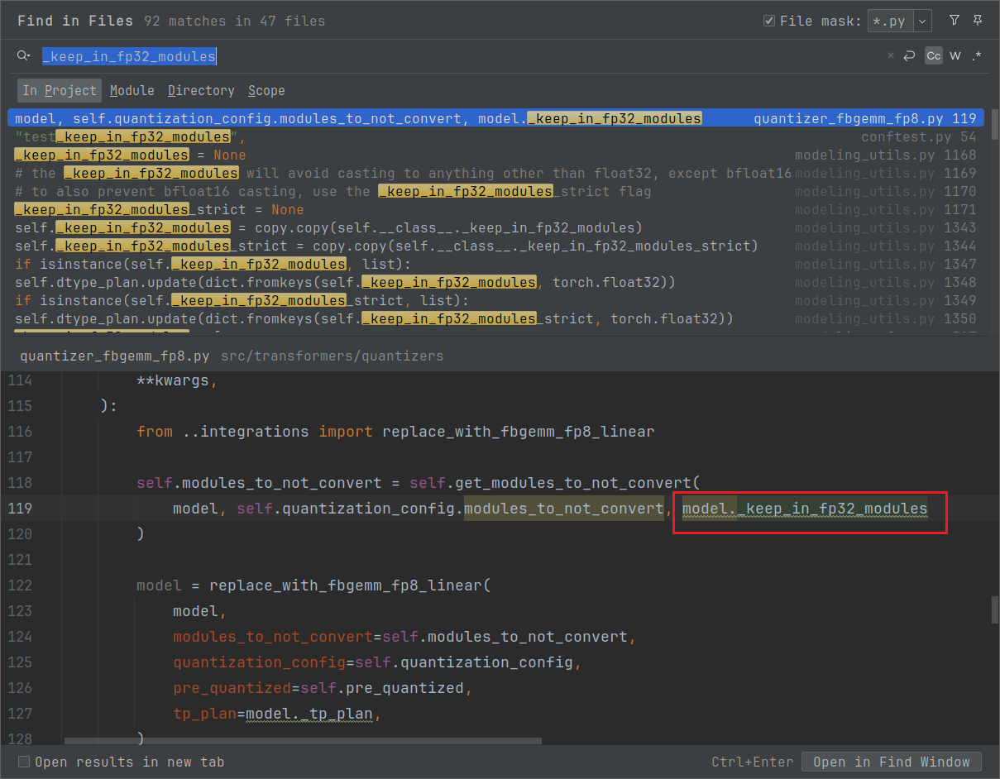

# Huggingface模型源码+适配新模型

# 测试Demo：

```Python
from transformers import AutoModelForCausalLM, AutoTokenizer

MODEL_ID = ""

model = AutoModelForCausalLM.from_pretrained(
    MODEL_ID,
    dtype="auto",
    # device_map="auto",  # HuggingFace accelerate will automatically place layers on different devices.
    # low_cpu_mem_usage=True,
    trust_remote_code=True,
)

tokenizer = AutoTokenizer.from_pretrained(MODEL_ID, trust_remote_code=True)
prompt = "Hey, are you conscious? Can you talk to me?"

inputs = tokenizer(prompt, return_tensors="pt")

# 调用的其实是类 GenerationMixin 中的 generate 方法
generate_ids = model.generate(inputs.input_ids, max_length=30)
# or use
tokenizer.batch_decode(generate_ids, skip_special_tokens=True, clean_up_tokenization_spaces=False)[0]

# ================ look cache ===============
from transformers import DynamicCache

past_key_values = DynamicCache(config=model.config)
# 执行过程相当于一次 prefill 阶段。
outputs = model(**inputs, past_key_values=past_key_values, use_cache=True)
outputs.past_key_values # access cache filled with key/values from generation
```

或者先初始化config，然后初始化模型：

```Python
from transformers import AutoConfig, AutoModel, AutoModelForCausalLM

# Step 1: 加载配置
config = AutoConfig.from_pretrained("/mnt/model/DeepSeek-V3-0324/~~config.json~~")

# 注意
print(config) # ====> 调用的是对象的 config.__repr__() 方法
dir(config)  # ====> 查看 config 对象的属性。

# Step 2: 创建模型（不加载权重） ===> 其实调用的是 PreTrainedModel._from_config() 方法。这个里面没有量化方法。。。
model = AutoModel.from_config(config)

# Step 3: 打印模型结构
print(model)

# 或者输出key 和对应的shape
for name, param in model.named_parameters():
    print(f"{name} :==> {param.shape}")
```


也可以使用pipeline进行测试：（暂时先不考虑，因为这个pipeline算是其中的一个组成部分而已）

```Python
>>> from transformers import pipeline, AutoModelForTokenClassification, AutoTokenizer

>>> # Sentiment analysis pipeline
>>> analyzer = pipeline("sentiment-analysis")

>>> # Question answering pipeline, specifying the checkpoint identifier
>>> oracle = pipeline(
...     "question-answering", model="distilbert/distilbert-base-cased-distilled-squad", tokenizer="google-bert/bert-base-cased"
... )

>>> # Named entity recognition pipeline, passing in a specific model and tokenizer
>>> model = AutoModelForTokenClassification.from_pretrained("dbmdz/bert-large-cased-finetuned-conll03-english")
>>> tokenizer = AutoTokenizer.from_pretrained("google-bert/bert-base-cased")
>>> recognizer = pipeline("ner", model=model, tokenizer=tokenizer)
```


模型适配的入口函数是 `transformers/models/auto/modeling_auto.py` 文件中的：

```Python
class AutoModelForCausalLM(_BaseAutoModelClass):
    _model_mapping = MODEL_FOR_CAUSAL_LM_MAPPING

    # override to give better return typehint
    @classmethod
    def from_pretrained(
        cls: type["AutoModelForCausalLM"],
        pretrained_model_name_or_path: Union[str, os.PathLike[str]],
        *model_args,
        **kwargs,
    ) -> "_BaseModelWithGenerate":
        return super().from_pretrained(pretrained_model_name_or_path, *model_args, **kwargs)

# 注意，这里的方法会更新 from_config 和 from_pretrained
AutoModelForCausalLM = auto_class_update(AutoModelForCausalLM, head_doc="causal language modeling")
```


对于功能代码实现，主要逻辑在于类 PreTrainedModel 类（transformers/modeling_utils.py 文件中）的 from_pretrained 方法：

# 一些内容

在 Transformers 库中，"meta 设备" 是 PyTorch 提供的一种特殊虚拟设备（`torch.device('meta')`），用于零内存初始化模型结构 。它不分配实际内存，仅记录张量的元数据（形状、数据类型等）。


# 如何添加一个新模型

https://camo.githubusercontent.com/6ef8f19800fe858409521ba1e9e21b364fb655669d3d4f7d2e406ecc9fe96f7f/68747470733a2f2f68756767696e67666163652e636f2f64617461736574732f68756767696e67666163652f646f63756d656e746174696f6e2d696d616765732f7265736f6c76652f6d61696e2f7472616e73666f726d6572735f6f766572766965772e706e67


这个版本有点老了，起码对于PreTrainedModel中的generate()方法被重构到了GenerationMixin 中的 generate() 方法中了。

## PreTrainedConfig <---- xxxConfig（configuration_[model_name].py）

主要是定义一些用于推理的属性变量

- `model_type` 属性

- `base_model_tp_plan` 属性

- `base_model_pp_plan` 属性

- `__init__()`方法，用于初始化属性

最核心的函数主要是：

- `from_pretrained()`：

- `save_pretrained()`：


## PreTrainedModel <----xxxPreTrainedModel <----xxxModel（modeling_[model_name].py）

- `_tp_plan`：这个一般会来自于上述的config类中的配置，然后通过Model类中的tp_plan（setter）方法设置该属性

    ```Python
    @tp_plan.setter
    def tp_plan(self, plan: dict[str, str] | None):
        if plan is None:
            self._tp_plan = {}
            return
        if not isinstance(plan, dict):
            raise ValueError("Can only set a dictionary as `tp_plan`")
    
        # Ensure the styles are all valid
        for layer_pattern, parallel_style in plan.items():
            if parallel_style not in ALL_PARALLEL_STYLES:
                raise ValueError(
                    f"Unsupported tensor parallel style '{parallel_style}' for layer '{layer_pattern}'. "
                    f"Supported styles are {list(ALL_PARALLEL_STYLES.keys())}"
                )
    
        # Validate that the layer patterns match existing model structure. We check this by getting all parameter
        # names and seeing if any match the patterns
        model_param_names = [name for name, _ in self.named_parameters()]
        for layer_pattern in plan.keys():
            # Convert pattern to regex (replace * with .*)
            regex_pattern = layer_pattern.replace("*", r"\d+")
            pattern_matched = False
            for param_name in model_param_names:
                if re.match(regex_pattern, param_name):
                    pattern_matched = True
                    break
            if not pattern_matched:
                warnings.warn(
                    f"Layer pattern '{layer_pattern}' does not match any parameters in the model. This rule may not "
                    "be applied during tensor parallelization, or may lead to dimension mismatches"
                )
    
        # Set the plan
        self._tp_plan = plan
    ```

- `_pp_plan`：同理

注意，上述并行属性来自于【现在写在`xxxForCausalLM`类中】：

- 在类中直接赋值该属性，替换原有的None。

- 在模型中的 __init__() 方法中显示调用 `self.post_init()` 方法，将config中对应的 `base_model_tp_plan`、`base_model_pp_plan` 属性赋值给这两个。

- `from_pretrained()` 方法

- `save_pretrained()` 方法

- `init_weights()` 方法


## class xxxForCausalLM( xxxPreTrainedModel, GenerationMixin )


## 注意

这个模型不像 Sglang 一样，在推理的时候能够突然来一个新请求，这个Transformers目前是一开始来多少请求，然后将这些请求组成对应的batch，然后一起推理，所以无需考虑新请求进行拼接的逻辑（也就无需考虑 KV cache 管理相关的逻辑。 ）


## 对于模型的输出，基本都有进行包装

一个模型中，主要有两类：

- xxxModelOutput【WithPast】：

- xxxCausalLMOutput【WithPast】：

基本都会去继承 ModelOutput 类（transformers/utils/generic.py）。

- WithPast 主要是为了区分是否会复用 KVCache。


## 对于KV cache的多次decode使用，主要在 xxxModel 中的forward方法中体现：


通过 `past_key_values` 进行衔接传递。

```Python
class xxxModel(xxxPreTrainedModel):
    # xxxxx

    @check_model_inputs
    @auto_docstring
    def forward(
        self,
        input_ids: Optional[torch.LongTensor] = None,
        attention_mask: Optional[torch.Tensor] = None,
        position_ids: Optional[torch.LongTensor] = None,
        past_key_values: Optional[Cache] = None,
        inputs_embeds: Optional[torch.FloatTensor] = None,
        use_cache: Optional[bool] = None,
        cache_position: Optional[torch.LongTensor] = None,
        **kwargs: Unpack[TransformersKwargs],
    ) -> xxxModelOutputWithPast:
        if (input_ids is None) ^ (inputs_embeds is not None):
            raise ValueError("You must specify exactly one of input_ids or inputs_embeds")
        
        if use_cache and past_key_values is None:
            past_key_values = DynamicCache(config=self.config)
        
        if inputs_embeds is None:
            inputs_embeds = self.embed_tokens(input_ids)
        
        if cache_position is None:
            past_seen_tokens = past_key_values.get_seq_length() if past_key_values is not None else 0
            cache_position = torch.arange(
                past_seen_tokens, past_seen_tokens + inputs_embeds.shape[1], device=inputs_embeds.device
            )
        if position_ids is None:
            position_ids = cache_position.unsqueeze(0)
            
        
        # forward xxxxx
        
        return xxxModelOutputWithPast(  # only diff with Mistral is the output type, we need MoE
            last_hidden_state=hidden_states,
            past_key_values=past_key_values,
        )
```

当然在使用 适配模型文件中的 eager_attention_forward 方法的时候，其实算的还是按照full attention计算逻辑，只不过这里在之前准备了下之前存储在 `past_key_values` 中的 kv cache。


## 对于量化逻辑

在适配新模型的时候，在模型文件中使用的是 torch.nn.Linear 进行适配的。如：

```Python
class xxxMLP(nn.Module):
    def __init__(self, config, intermediate_size=None):
        super().__init__()
        self.config = config
        self.hidden_size = config.hidden_size
        self.intermediate_size = config.intermediate_size if intermediate_size is None else intermediate_size
        self.gate_proj = nn.Linear(self.hidden_size, self.intermediate_size, bias=False)
        self.up_proj = nn.Linear(self.hidden_size, self.intermediate_size, bias=False)
        self.down_proj = nn.Linear(self.intermediate_size, self.hidden_size, bias=False)
        self.act_fn = ACT2FN[config.hidden_act]

    def forward(self, x):
        down_proj = self.down_proj(self.act_fn(self.gate_proj(x)) * self.up_proj(x))
        return down_proj
```

但是在实际使用的时候，会将这个 torch.nn.Linear 直接替换成对应量化的 Linear， 基类是 `HfQuantizer`。

其中，肯定是有一个配套的 Quantization_config 配置文件，以及对应的替换量化 Linear。


初始化模型，【决定模型的类型】：主要是在PreTrainedModel 类中实现的，然后在初始化模型之前，需要初始化对应的config，可以追溯到PreTrainedConfig.from_pretrained() 方法中：

- 入口函数**可以**是（很多地方都会对这个 config 进行判断，如果没有就重新加载）类 _BaseAutoModelClass 中的from_pretrained(...) 方法

    - 调用AutoConfig.from_pretrained() 方法获取 config 对象，并且通过磁盘的配置文件去初始化*quantization_config：*

    需要注意的是：

    - `config = AutoConfig.from_pretrained("model_path") `获取的config对象在 print(config) 是看不到 *quantization_config 内容的，因为它调用的是config.__repr__() 方法*

    - *需要通过 **`config.quantization_config`** 去查看内容
    *

模型相关的入口函数可以追溯到 PreTrainedModel.from_pretrained() 方法中：

- 传入的*quantization_config*【*quantization_config = kwargs.pop("quantization_config", None)*】

- 通过 `get_hf_quantizer(...)` 方法获取对应的 hf_quantizer 量化器

    ```Python
    # 值得注意的是，在 quantization_config 是 ignored_layers，
    # 但是初始化hf_quantizer的时候需要的是 modules_to_not_convert
    hf_quantizer, config, device_map = get_hf_quantizer(
        config, quantization_config, device_map, weights_only, user_agent
    )
    ```

可以对比下 CompressedTensorsConfig 类中的传入，用的是 ignore，但是如果是用DeepSeek 的 [128, 128] 的FP8 Block 量化，用的其实是 ignored_layers 名字。

- 初始化模型（torch.nn.Module），然后调用 hf_quantizer 的 preprocess_model 方法去替换掉对应的 torch.nn.Linear：（这个具体逻辑需要具体去看）

    ```Python
    with ContextManagers(model_init_context):
        # Let's make sure we don't run the init function of buffer modules
        # 初始化的时候会去调用 __init__() ----> post_init() -----> init_weights() -----> _init_weights() 方法
        model = cls(config, *model_args, **model_kwargs)
    
    
        if hf_quantizer is not None:  # replace module with quantized modules (does not touch weights)
            hf_quantizer.preprocess_model(
                model=model,
                dtype=dtype,
                device_map=device_map,
                checkpoint_files=checkpoint_files,
                use_kernels=use_kernels,
            )
    ```

    这里以FP8-Block 量化为例（用的是 `FineGrainedFP8HfQuantizer`，auto配置在transformers/quantizers/auto.py 文件中）：

    ```Python
    
    class HfQuantizer(ABC):
    
        def preprocess_model(self, model: "PreTrainedModel", dtype=None, **kwargs):
            """
            Setting model attributes and/or converting model before weights loading. At this point
            the model should be initialized on the meta device so you can freely manipulate the skeleton
            of the model in order to replace modules in-place. Make sure to override the abstract method `_process_model_before_weight_loading`.
        
            Args:
                model (`~transformers.PreTrainedModel`):
                    The model to quantize
                kwargs (`dict`, *optional*):
                    The keyword arguments that are passed along `_process_model_before_weight_loading`.
            """
            model.is_quantized = True
            model.quantization_method = self.quantization_config.quant_method
            if self.pre_quantized:
                self._convert_model_for_quantization(model)
            self._process_model_before_weight_loading(model, **kwargs)
    
    
    class FineGrainedFP8HfQuantizer(HfQuantizer):
    
        # FineGrainedFP8HfQuantizer 类中的实现
        def _process_model_before_weight_loading(
            self,
            model: "PreTrainedModel",
            **kwargs,
        ):
            from ..integrations.finegrained_fp8 import replace_with_fp8_linear
        
            # 这里一定会返回一个 ['lm_head']
            self.modules_to_not_convert = self.get_modules_to_not_convert(
                model, self.quantization_config.modules_to_not_convert, model._keep_in_fp32_modules
            )
            
        
            model = replace_with_fp8_linear(
                model,
                modules_to_not_convert=self.modules_to_not_convert,
                quantization_config=self.quantization_config,
                pre_quantized=self.pre_quantized,
            )
    ```

- 通过方法 `_load_pretrained_model()` 加载磁盘权重

- 【没看懂在干什么】 在加载完磁盘权重后，会调用一次 `hf_quantizer.postprocess_model()` 方法

    - 这个方法的实现，在一些类里面重写了，但是有些类中方法什么都没干。


### 有一个属性 _keep_in_fp32_modules 

```Python
_keep_in_fp32_modules = None
# the _keep_in_fp32_modules will avoid casting to anything other than float32, except bfloat16
# to also prevent bfloat16 casting,  use the _keep_in_fp32_modules_strict flag
_keep_in_fp32_modules_strict = None
```

在类中覆盖掉：

```Python
_keep_in_fp32_modules = ["post_attention_layernorm", "input_layernorm", "norm"]
```

这个查看gpt-oss 虽然这个名字是保留fp32的modules，但是查看到具体的某个模型的时候，发现其实还是BF16，所以这里可以当做一种作为不量化的字典标记。（因为在判断哪些层跳过quant的时候用到了这个属性。但是看有个地方会区将其update 到对应的float32，需要check一下）




## 并行策略

主要类是transformers/integrations/tensor_parallel.py 文件中的 ParallelInterface 类：这里会去定义各种并行策略所需要的组件。

```Python
class ParallelInterface(GeneralInterface):
    # Class instance object, so that a call to `register` can be reflected into all other files correctly, even if
    # a new instance is created (in order to locally override a given entry)
    _global_mapping = (
        {
            "colwise": ColwiseParallel(),
            "rowwise": RowwiseParallel(),
            "colwise_rep": ColwiseParallelReplicate(),
            "rowwise_rep": RowwiseParallelReplicate(),
            "local_colwise": LocalColwiseParallel(),
            "local_rowwise": LocalRowwiseParallel(),
            "local": IsolatedParallel(),
            "gather": GatherParallel(),
            "local_packed_rowwise": LocalPackedRowwiseParallel(),
            "sequence_parallel": SequenceParallel(),
            "replicate": ReplicateParallel(),
            "grouped_gemm": GroupedGemmParallel(),
            "ep_router": RouterParallel(),
        }
        if is_torch_greater_or_equal("2.5") and _torch_distributed_available
        else {}
    )
```

然后在具体模型的并行策略的制定则是在对应的 configuration 文件中，比如对于 transformers/models/gpt_oss/configuration_gpt_oss.py 中的配置：

```Python
class GptOssConfig(PreTrainedConfig):
    r"""
    This will yield a configuration to that of the BERT
    [google-bert/bert-base-uncased](https://huggingface.co/google-bert/bert-base-uncased) architecture.

    """

    model_type = "gpt_oss"
    default_theta = 150000.0
    base_model_pp_plan = {
        "embed_tokens": (["input_ids"], ["inputs_embeds"]),
        "layers": (["hidden_states", "attention_mask"], ["hidden_states"]),
        "norm": (["hidden_states"], ["hidden_states"]),
    }
    base_model_tp_plan = {
        "layers.*.self_attn.q_proj": "colwise",
        "layers.*.self_attn.k_proj": "colwise",
        "layers.*.self_attn.v_proj": "colwise",
        "layers.*.self_attn.o_proj": "rowwise",
        "layers.*.self_attn.sinks": "local_rowwise",
        "layers.*.mlp.experts": "gather",
        "layers.*.mlp.router": "ep_router",
        "layers.*.mlp.experts.gate_up_proj": "grouped_gemm",
        "layers.*.mlp.experts.gate_up_proj_bias": "grouped_gemm",
        "layers.*.mlp.experts.down_proj": "grouped_gemm",
        "layers.*.mlp.experts.down_proj_bias": "grouped_gemm",
    }
```
