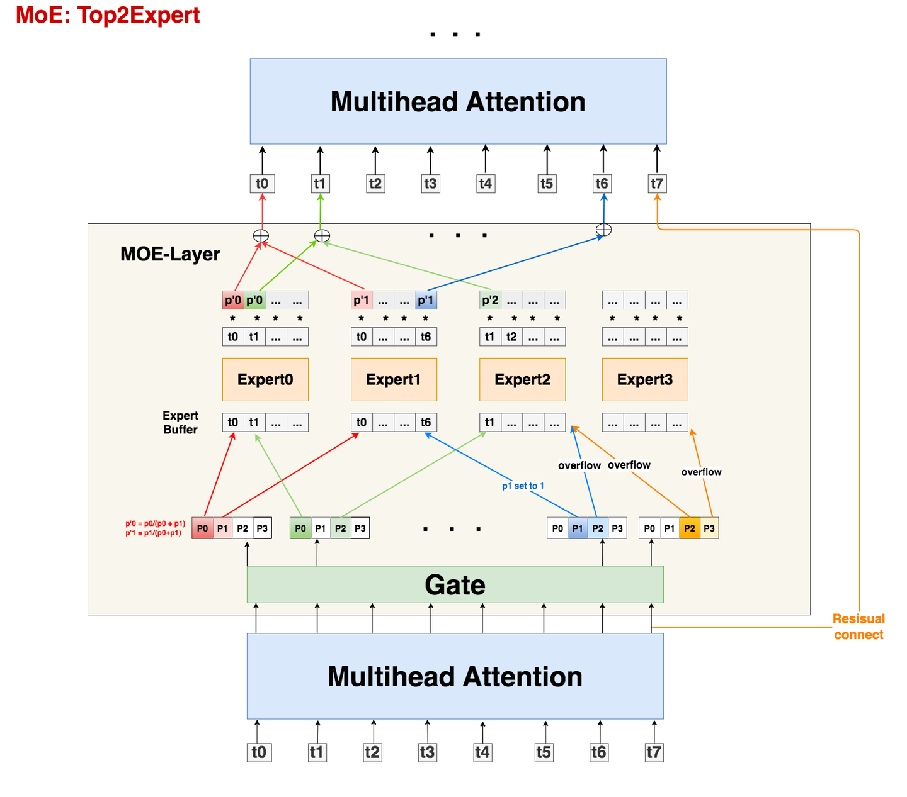

# Megatron学习文档

# 调研

这里主要是针对模型大了以后（100B以上），需要考虑将模型进行切分的训练手段，目前完全开源的训练手段有NVIDIA推出的Megatron，以及微软开发的Deepspeed框架（说是相对于Megatron，存在一定的算力损失；Deepspeed主要是ZeRO1/2/3，如果模型切分，那么就需要使用ZeRO3）。（没开源的包括字节跳动的Megascale，google公司技术报告中只说明了有个集群等等。）


很多开源大语言模型都是在Megatron基础上训练的，包括但不限于：

1. 结合微软Deepspeed的Megatron-Deepspeed：[https://github.com/microsoft/Megatron-DeepSpeed](https://github.com/microsoft/Megatron-DeepSpeed)

2. BigScience：[https://github.com/bigscience-workshop/Megatron-DeepSpeed](https://github.com/bigscience-workshop/Megatron-DeepSpeed)

3. 阿里 Pai-Megatron-Patch：[https://github.com/alibaba/Pai-Megatron-Patch](https://github.com/alibaba/Pai-Megatron-Patch)

4. 阿里开源的Megatron-LLaMA：https://github.com/alibaba/Megatron-LLaMA

# 模型结构（待补充）

大语言模型（LLM）主流是基于Transformer架构的，根据特点主要可以分为三类：仅包含编码器（Encoder-only）、仅包含解码器（Decoder-only）、编码器-解码器（Encoder-Decoder）。但基本都是由Transformer层+FFN层（有时候又叫MLP层，Linear层等等）构成的模型块堆叠而成的。现在模型基本都是以Decoder-only为主，考虑Decoder-Only结构，有:

只考虑Dense的整体结构，不考虑Transformer层，FFN层具体实现，以及归一化，激活函数，Droupout，位置编码等结构。

## Transformer

对于Transformer层，其主要是QKV的计算：

$\frac{softmax(Q \cdot K^T)}{\sqrt{d}} \cdot V$

而随着模型的不断改进，目前QKV并不仅仅是一一对应的，参考论文：《[GQA: Training Generalized Multi-Query Transformer Models from Multi-Head Checkpoints](https://arxiv.org/abs/2305.13245)》


总体说明：

- MHA（Multi-Head Attention）:传统transformer架构中的多头注意力机制，其中的Q, K, V一一对应

- MQA（Multi-Query Attention）：所有的Q公用一对K，V，论文介绍：[Fast Transformer Decoding: One Write-Head is All You Need](https://arxiv.org/abs/1911.02150)

- GQA（Grouped-Query Attention）：对原来的Multi-Head Attention进行分组，每组中的Q公用一对K, V

在模型`llama2-70B`中，`llama3`等系列结构中，采用`MQA`模型结构。注意看Q, K, V的形状，以及查看配置文件`num_attention_heads=64`，可以推测出其`num-query-groups=64/8=8`。通过查看配置文件中`num_key_value_heads=8`进行验证：`num-query-groups=num_attention_heads/num_key_value_heads`。


直接`print(model)`只能看模型的组成部分，无法查看其前向传播连接的状态。具体连接情况还得去看源代码中前向传播（forward函数中）的逻辑。

## FFN（MLP）

对于MLP层，基本都是由线性层构成，但不同模型间也存在差异，这里以GPT（h->4h,4h->h）和Llama结构为例：

## 位置编码，Dropout，激活函数，归一化（待补充）

1. 位置编码有很多，主流模型中最常用的有RoPE和Learnable，位置编码其实就是在计算`transformer`时候，需要考虑到token的位置信息，因此在token之前加入位置相关的编码。除此之外，需要考虑transformer计算时候，一些token应该被隐藏，因此就有掩码mask。

2. Droupout

3. 激活函数：SwiGLU，GeLU，GeGLU等等

4. 归一化：目前主流包括：LayerNorm和RMSNorm

## MoE（参考MoE千卡训练调研）

针对原本Dense结构的单一，考虑将MLP层进行拷贝（也就是专家），然后通过路由将其分配到不同的专家上进行计算。这里以**Gshard模型架构**为例（Gshard提出的框架和思想一直影响至今，后续看到的很多LLM MoE的架构改进，其实都是在Gshard的这一套逻辑上做的迭代，比如loss改造、topK expert的选择，稀疏矩阵计算优化等等），其中top2的结构大致如下：



以上是简单的top2结构，主流模型代表有`Mixtral`系列。而对于后来，出现共享专家的概念（不同论文叫法不同，比如在论文《[**DeepSpeed-MoE: Advancing Mixture-of-Experts Inference and Training to Power Next-Generation AI Scale**](https://arxiv.org/abs/2201.05596)》中被称为**Pyramid-Residual MoE**），具有代表意义的模型有deepspeek_v2, qwen2等等。


而后来论文发现，在共享专家分配token的时候，通讯方面存在挺大的开销，因此，论文《[**Shortcut-connected Expert Parallelism for Accelerating Mixture-of-Experts**](https://arxiv.org/abs/2404.05019)》中提供一种从结构上改变，并且能够对通讯重叠进行优化的思路（scmoe结构）。//todo 待研究

# 模型切分理论（PTD 3D切分理论）

Megatron三篇论文介绍：

- v1: [Megatron-LM: Training Multi-Billion Parameter Language Models Using Model Parallelism](https://arxiv.org/abs/1909.08053)

- v2: [Efficient Large-Scale Language Model Training on GPU Clusters Using Megatron-LM](https://arxiv.org/abs/2104.04473)

- v3: [Reducing Activation Recomputation in Large Transformer Models](https://arxiv.org/abs/2205.05198)

技术分享视频+PPT：[Megatron-LM: Training Multi-Billion Parameter Language Models Using Model Parallelism](https://resources.nvidia.com/gtcd-2020/gtc2020s21496)

[s21496-megatron-lm-training-multi-billion-parameter-language-models-using-model-parallelism.pdf](images/s21496-megatron-lm-training-multi-billion-parameter-language-models-using-model-parallelism.pdf)

PTD并行策略+1B1F技术, 总结：


# 参数相关（部分）

所有功能相关介绍都可以看`Megatron-LM/megatron/training/arguments.py`中定义：

```Bash
parser = _add_network_size_args(parser)  # 网络大小相关参数
parser = _add_regularization_args(parser)  # 正则化参数相关
parser = _add_training_args(parser)  # 启动训练前的一些参数设置
parser = _add_initialization_args(parser)  # 权重初始化和seek初始化参数
parser = _add_learning_rate_args(parser)  # 学习率调整相关设置
parser = _add_checkpointing_args(parser)  # ckpt保存相关，异步保存，分片保存。尤其注意有Mcore格式(新版本)，Megatron格式（旧版本）
parser = _add_mixed_precision_args(parser)  # 混合精度相关参数设置
parser = _add_distributed_args(parser)  # 初始化分布式环境相关参数（也可以表示为训练的初始化环境参数）
parser = _add_validation_args(parser)  # 验证集相关参数
parser = _add_data_args(parser)  # 数据加载相关，比如加载，划分，tokenizer等
parser = _add_autoresume_args(parser)  # 不是很清楚，看介绍是adlr集群自动恢复相关
parser = _add_biencoder_args(parser)  # 与一种Bi-Encoder模型结构相关
parser = _add_vision_args(parser)  # 和视觉相关参数
parser = _add_moe_args(parser)  # MoE相关参数设置
parser = _add_logging_args(parser)  # 添加并设置日志功能参数
parser = _add_straggler_detector_args(parser)  # “掉队者（straggler）检测器”相关的命令行参数，用于处理在多节点环境中可能出现的“慢节点”问题
parser = _add_inference_args(parser)  # 推理相关参数设置
parser = _add_transformer_engine_args(parser)  # transformer相关参数设置
parser = _add_retro_args(parser)  # 与 retro（一种纯自回归解码器语言模型）模型相关（https://arxiv.org/abs/2112.04426）
parser = _add_experimental_args(parser)  # 一些实验性的参数设置（新尝试）
parser = _add_one_logger_args(parser)  # 一个one_logger的日志库参数设置（内部工具，用不了）
```

## 设置PP，TP，通过world_size来计算DP

与建立分布式相关参数有：

1. `--tensor-model-parallel-size`

2. `--pipeline-model-parallel-size`

3. `--expert-model-parallel-size`：专家并行设置，与MoE相关

在分布式环境初始化的时候，首先通过`torch.distributed.init_process_group()`的方式建立节点和节点间的分布式通讯关系，之后自定义编写函数`initialize_model_parallel()`来建立模型内相关的分布式通讯关系：大体逻辑是根据 $DP=\frac{GPU_{总数}}{TP \times PP}$ 计算DP数量（数据并行DP，其实可以等价于模型并行MP）。

说明：

1. 分布式通讯关系基本在`initialize_megatron`函数调用的`_initialize_distributed()`函数下。

2. 这里为了简单（或者说随大流），默认考虑一个`Rank`对应一个`GPU`（因此，一般来说会有`world_size`个`Rank`）。【这里需要注意区别于pytorch启动命令时候的WORLD_SIZE】

3. 这里有个问题：如果某个MP组挂掉了，是否会影响其他组的训练进度以及该情况下的通讯情况如何改变（其数据同步策略自动改变还是通讯节点挂掉，异步/同步模式下一直等待？）。//todo 待测

注意参数：`--use-tp-pp-dp-mapping`，从原本的`tp-dp-pp`配置分配逻辑设置为`tp-pp-dp`分配逻辑。

针对Megatron中建立分布式进程组（模型内相关的分布式通讯关系）逻辑编写一个仿真代码：

[ptd_config.py](images/ptd_config.py)

## 模型结构相关

Megatron-LM代码中的结构主要以GPT-3为主，这个如果要自定义扩展的话，可以参考阿里的`Pai-Megatron-Patch`代码编写。而Megatron-LM中与模型定义的部分参数有：

- `--max-position-embeddings`

- `--num-layers`

- `--hidden-size`

- `--num-attention-heads`

- `--ffn-hidden-size`

### GQA

两个参数：

1. `--group-query-attention`:

2. `--num-query-groups`:

### 位置编码参数

`--max-position-embeddings`

`--position-embedding-type`

选项有：`choices=['learned_absolute', 'rope', 'none']`

- `learned_absolute`：绝对位置编码

- `rope`：旋转位置编码（以绝对位置编码的形式，实现了相对位置编码的效果），其他设置通过以下参数设置：

    - `--rotary-base`

    - `--rotary-percent`

    - `--rotary-interleaved`

    - `--rotary-seq-len-interpolation-factor`

具体介绍可参考：[Transformer位置编码（基础）](https://zhuanlan.zhihu.com/p/631363482)

### Normalization归一化

`--normalization`，其中，`choices=['LayerNorm', 'RMSNorm']`

`--norm-epsilon`：是RMSNorm的一个参数 $\epsilon$

`--apply-layernorm-1p`：调整LayNorm权重分布

`--apply-residual-connection-post-layernorm`

关于Normalization的介绍可参考：https://blog.csdn.net/wxc971231/article/details/139925707

介绍总结：RMSNorm是2019年论文 [Root Mean Square Layer Normalization](https://papers.cool/arxiv/1910.07467)提出来的，解决LayerNorm 运算量大的问题，并且得出**RMSNorm 性能和 LayerNorm 相当，但是可以节省7%到64%的运算。**

代码修改：对于Megatron中代码考虑使用**Pre Norm结构**还是**Post Norm结构**，通过创建模型`model_provider`函数中的`GPTModel`传参`pre_process`和`post_process`来实现。（里面定义了一些`Position embedding`）

### MoE相关参数

参考：https://github.com/NVIDIA/Megatron-LM/tree/main/megatron/core/transformer/moe#readme

1. `--num-experts`：专家个数

2. `--moe-router-topk`:每个token在路由时候选择专家个数

3. `--moe-router-load-balancing-type`：路由平衡策略（负载均衡算法），供选择有：

    1. `sinkhorn`：（z-loss）Sinkhorn(S-BASE):它的核心思想是在目标函数上加入熵正则化项，把复杂边际的线性规划问题转化为平滑可行域上的求解过程。S-BASE中使用的均衡算法。

    2. `aux_loss`（默认）：Aux loss/Load balancing loss，论文GShard和SwitchTransformer中使用的负载均衡损失。

    3. none

    - Auxiliary Loss（辅助损失）是模型训练过程中引入的一个额外的损失项，通常用于改进模型的性能或帮助训练过程更稳定。直接为中间层提供监督信号，减少梯度消失的影响。（在MoE中，主要是Gate MLP层，避免其出现token分发倾斜现象）

    - Z-loss 通过对模型输出的 logits 进行正则化。(语言模型在一定程度上可以看成分类模型，输出下一个token的可能性。因此，Z-loss 的引入可以帮助模型在输出概率分布时保持较高的置信度，避免输出接近均匀分布的结果，看论文介绍，这个对Gate分发倾斜也有拟制作用)

4. `--moe-aux-loss-coeff`

5. `--moe-grouped-gemm`：一种优化手段，将路由考虑为一个大矩阵相乘。使用[GroupedGEMM](https://github.com/fanshiqing/grouped_gemm.git)优化路由Gate计算，开启GroupedGEMM提升多 Experts 时的 GPU 利用率

    查看Megatron-LM更新日志，有说明：

    Megatron-Core MoE开发了GroupedGEMM来解决多Experts变长输入这一问题。当每个Rank有多个专家时，Megatron-Core MoE利用自CUTLASS 2.8引入的Grouped GEMM特性，将多个局部（可能是较小的）GEMM操作合并为单个GroupedGEMM kernel，能够大幅度提高SM利用率和性能。

    同时，Megatron-Core MoE还将部分效率较低的操作替换为优化后的CUDA Kernel，如Sinkhorn、local token permutation/unpermutation等。

6. `--moe-token-dispatcher-type`：token被路由后的dispatcher策略

    1. 对Dropless MoE的支持（不进行Token丢弃）

    2. 对token进行drop，如果不满，则使用padding 来填充容量

    为了缓解这种token到expert负载不均衡(Load Imbalancing)的问题，可以引入了一个辅助损失函数，旨在鼓励给予所有专家相同的重要性。这个损失函数确保所有专家接收到大致相等数量的训练样本，从而平衡了专家之间的选择。另外也可以通过drop tokens的方式得到缓解。首先定义一个expert capacity，即为一个expert被分配到的token的容量。如果分配到一个expert的token数超出了一个固定容量，则多余的tokens会被丢掉。这些被丢掉的tokens不参与和experts的矩阵乘运算，直接通过一个残差连接进入到下一个处理单元。如果一个expert没有被分配到其容量上限内的足够多的tokens，则需要采用padding的方式填充到容量上限。

7. `--moe-expert-capacity-factor`：一个专家因子，对每个专家token分发策略的平衡手段

8. `--moe-token-drop-policy`：路由token的drop策略

## 训练参数

1. `--micro-batch-size`：传统意义上的`batch_size`，一次前向（反向）传播的批数据大小。

2. `--global-batch-size`：一个训练步（iter）迭代的数据批大小。如果不设置，就等于`micro-batch-size * 数据并行`，否则需要设置为`micro-batch-size* 数据并行`的倍数大小。

3. `--seq-length`：每次训练的token数据长度

4. 学习率相关：这个一般都是采用先线性增加，然后使用余弦退火算法的学习率调整，因此常用参数设置如下：

    ```Bash
    --lr 1e-4
    --train-iters 50000
    --lr-decay-iters 32000
    --lr-decay-style cosine
    --min-lr 1.0e-5
    --weight-decay 0.1
    --lr-warmup-iters 500
    ```

在训练过程，是否重新计算中间激活（activation）状态：

1. `--recompute-activations`：在训练过程中重新计算中间的activation状态

2. `--recompute-granularity`：两种选择：

    1. `full`：模型全部都重新计算

    2. `selective`：选择性计算，只重新计算attention的中间状态（）

3. `--recompute-method`

训练过程中，中间状态是否保存，用于后续bwd反向传播重新计算还是用中间状态（一种时间和空间的权衡）。

## 日志相关

目前Megatron-LM中日志保存有三种：

1. `wandb`：安装`wandb`，并登录，之后在启动的时候设置即可

2. `tensorboard`

3. `print`日志：根据分布式环境，判断Rank，然后进行`print`，比如：

    ```Bash
    def print_rank_0(message):
        *"""If distributed is initialized, print only on rank 0."""*
    *    *if torch.distributed.is_initialized():
            if torch.distributed.get_rank() == 0:
                print(message, flush=True)
        else:
            print(message, flush=True)
    ```

4. `one-logger`(一个内部日志收集工具，外部用不了，需要使用`--no-one-logger`，禁用它)

与之相同的参数`--adlr-***`用于集群上启用自动回复的功能也用不了，通过命令`--adlr-autoresume`禁用它，

5. 除此之外，在分布式环境下维护了一个Timers的`global`计时器管理对象，该对象的定义类在Megatron代码中的`/megatron/core/timers.py`文件中。其主要用于记录时间，同时添加了日志输出的操作（扩展）。该对象在使用过程中，会调用`torch.distributed.barrier()`方法，这个方法的调用会导致训练上的等待，从而影响到训练速度。

## 通讯重叠

1. `--overlap-grad-reduce`：分布式优化器中重叠参数的全收集操作

2. `--overlap-param-gather`

3. `--no-overlap-p2p-communication`

内容参考：https://zhuanlan.zhihu.com/p/453295832

这部分不好可视化分析，之前考虑使用NCCL的日志进行分析，但是NCCL只会记录在某时某刻调用了某个通讯原语，日志一多，很难定位到模型层与层之间的通讯。

## other（待补充）


# 环境搭建（Dockerfile）

[Dockerfile](images/Dockerfile)

```Bash
# 构建镜像
docker build -t megatron:base-1.0 -f Dockerfile .

# 启动容器
docker run --gpus all --privileged --ipc=host -it --rm --name megatron-test -v /home/work/tz/megatron:/workspace/ megatron:base-1.0 bash
```

> 注意：进入容器后，需要查看一下ofed驱动是否安装，IB设备是否存在，RMDA技术是否开启（这个主要是宿主主机上的，`470.xx.xx`及以上版本的GPU驱动上`nv_peer_mem`服务组件是否加载）
> 
> ```Bash
> # 查看 ofed 安装后的版本以及相关信息
> ofed_info
> 
> # ib设备查询，这里看看ib是否存在
> ibv_devinfo -v
> 
> # 网络设备查询
> ucx_info -d
> 
> # 宿主主机上查询nvidia_peermem是否加载，可通过modprobe nvidia_peermem加载 nvidia_peermem 模块
> lsmod | grep nvidia_peermem
> ```
> 
> 

进入容器后，如果想使用wandb，配置一下：使用`wandb.login`登录，或者添加环境变量*`WANDB_API_KEY`**，*密钥获取: https://wandb.ai/authorize

```Bash
wandb.login

export *WANDB_API_KEY=*
```

# 数据预处理

首先是数据集，根据：

1. 依次读入所有的预训练语料，对每一个预训练语料的每一个样本进行分词处理并tokenizer，并添加结束符token，例如<eos>。（其实也有添加开始符的<bos>）

2. （optional）将经过分词处理之后的所有预训练语料，拼接成一个整的大语料文件

3. 对预训练语料进行维度变换，最终预训练样本的shape=[语料token总数//max_length, max_length]，max_length是指模型输入token的最大长度

4. 返回最终的训练语料。

对于`tokenizer`的选择，参考`megatron/training/tokenizer/tokenizer.py`中`build_tokenizer()`代码，这里考虑使用Huggingface中的`Mixtral-8x7B-v0.1`中的`tokenizer`。数据集采用[TinyStories](https://huggingface.co/datasets/roneneldan/TinyStories)，命令参考：

```Bash
python /workspace/Megatron-LM/tools/preprocess_data.py \
       --input /workspace/dataset/train_data/TinyStories/train.jsonl \
       --output-prefix tinystories_1k \
       --tokenizer-type HuggingFaceTokenizer \
       --tokenizer-model /workspace/model/Mixtral-8x7B-v0.1 \
       --workers 16
```

处理完成后，会生成`xxx.idx`,`xxx.bin`两个文件，其中的`.bin`文件储存token，`idx`文件储存索引（包括index头、版本号、数据类型、数据大小等信息）。该文件主要与`MMapIndexedDataset`数据集类有关。

# 自定义模型（暂定）

参考阿里[Pai-Megatron-Patch](https://github.com/alibaba/Pai-Megatron-Patch)里面的扩展逻辑，在不破坏Megatron-core的基础上，定义自己的模型结构。但是能用Megatron-Core中的并行策略，优化手段，训练优化器等。（具体没细看）

> 其实就是每个transformer模块和FFN模块参考Megatron-core编写逻辑（要么继承扩展，要么改写），然后在forward函数（前向传播）的时候考虑传播逻辑即可。
> 
> 


# 训练

1. 使用Pretrain初始化Megatron

2. 使用model_provider设置模型，优化器和lr计划设置

3. forward_step：一个item计算逻辑

4. train_valid_test_datasets_provider：提供训练数据集

注意在Megatron-Deepspeed中，与Megatron-LM不同版本，其megatron模块中的代码组织结构是不一样的，除了Megatron外，还有其他优化手段，比如`fused_kernels`，如果异常退出重启训练导致的不执行，可以考虑将该目录下的build删除，重新创建。


# 权重相关

## 分布式检查点

MCore v0.7之后，引入完全并行和异步保存功能，解决了传统 checkpoint 保存方法效率低下的问题。 它还解决了传统格式中不同并行映射的 checkpoint 不兼容的问题。

对于megatron权重，主要保存为分片后的权重，在初始化分布式后，将模型进行切分，more权重保存其树形结构如下：（mp表示model parallel）


## 检查点转换器（目前支持Dense的模型）

Megatron-LM提供的检查点转换器代码好像只支持Dense模型的。

> 对于自定义网络模型，这里有种思路，就是使用Megatron的模型定义+权重加载到GPU上，然后使用pytorch的分布式保存，将权重文件进行保存。（不确定TP+PP模式下是否也可以，因为之前pytorch分布式训练只看过分布式数据并行）
> 
> 

# 优化思路

## 算子优化

### flash-attn算子

参考论文：

1. [FlashAttention: Fast and Memory-Efficient Exact Attention with IO-Awareness](https://arxiv.org/abs/2205.14135)

2. [FlashAttention-2: Faster Attention with Better Parallelism and Work Partitioning](https://arxiv.org/abs/2307.08691)

3. [FlashAttention-3: Fast and Accurate Attention with Asynchrony and Low-precision](https://arxiv.org/abs/2407.08608)

总结：

1. 对于flash-attn，其主要是针对标准transformer中显存占用多，HBM读写次数多问题，提出`Memory-efficient Attention`将显存复杂度从平方降低到线性；通过kernel融合（分块tiling技术）降低HBM读写次数。从而加快transformer的计算。

2. 针对Flash Attention在前向传播过程中，计算峰值达到设备理论最大FLOPs/s的30-50%；反向传播仅达到A100 GPU最大吞吐量的25-35%。调整前向传播和反向传播并行算法减少**非矩阵乘法操作的浮点运算次数**。能够在V1的基础上提升2倍左右

3. 针对Flash-attention2中未利用H100最近硬件中的新功能，导致其在H100 GPU上的利用率仅为35%。因此，针对Hopper架构的GPU，设计通过warp-specialization重叠整体计算和数据移动、交错块状矩阵乘法和softmax操作、利用硬件支持FP8低精度的不一致处理等技术，使得FlashAttention-3，在H100 GPU上实现了1.5-2.0×的加速，FP16达到最高740 TFLOPs/s（75%利用率），FP8接近1.2 PFLOPs/s。

现在基本都用`flash-attn`技术了，使用过程中，先看自己的卡是不是Hopper架构，如果是直接用`flash-attn3`，如果不是，则考虑用`flash-attn2`

### Fused Kernels

Fused Kernels 涉及到 Cuda 编程了，它是将连续的算子操作合并成一个 kernel 来提高计算效率。这样的方式使得可以在单个 kernel 中同时执行多个操作但数据只需加载一次，最大程度的减少了内存访问。（其实falshAttention也是一种访储）


### GeMM算子

GeMM（General Matrix Multiplication，通用矩阵乘）:算法分析可知，朴素的矩阵乘算法的时间复杂度为 $O(n^3)$。随着Strassen 算法开始到2010年的 Coppersmith–Winograd 算法，矩阵乘法的复杂度一直在降低。

参考：https://zhenhuaw.me/blog/2019/gemm-optimization.html


## 混合精度训练

目前主流基本都是混合精度训练，具体内容参考：

### Transformer Engine

针对H100设计的FP8计算的特性，对Pytorch进行拓展，对Transformer中的Kernel进行了重写，包含一系列算子计算。具体内容看[官方文档](https://docs.nvidia.com/deeplearning/transformer-engine/user-guide/index.html)。

注意，并不是单纯为H100设计的，而是一种软件实现FP8计算`transformer`，具体效果可参考[BF16->FP8效果对比](https://mi.feishu.cn/docx/DeRFddgjhojv9LxWPh9ce9R8nyc)


## 优化器优化

阿里，[Meagtron-Llama](https://github.com/alibaba/Megatron-LLaMA.git)中提出的OverlappedDistributedOptimizer？

> 原生Megatron-LM在超大规模训练时，存在分布式优化器通信占比过高的问题。
> 
> 


字节的：来自于论文《[MegaScale: Scaling Large Language Model Training to More Than 10,000 GPUs](https://arxiv.org/abs/2402.15627)》的LAMB优化器：


## 其他（超参训练的一些发现）

其实如果只是单纯的提升TGS，改变`batch_size`的大小，其实也会影响到TGS的改变，（在不改变PTD策略的前提下，修改batch_size大小）

> https://zhuanlan.zhihu.com/p/691837238
> 
> （可以考虑不同的PTD并行策略，然后改变不同的batch_size，这个得多尝试实验才能验证），可以参考实验：https://zhuanlan.zhihu.com/p/682074725
> 
> 
