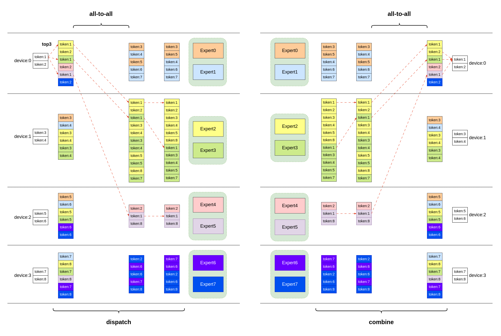
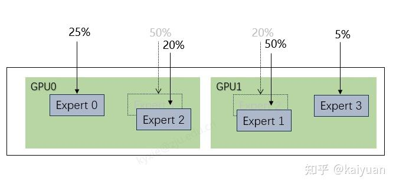
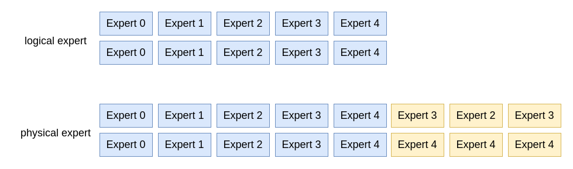
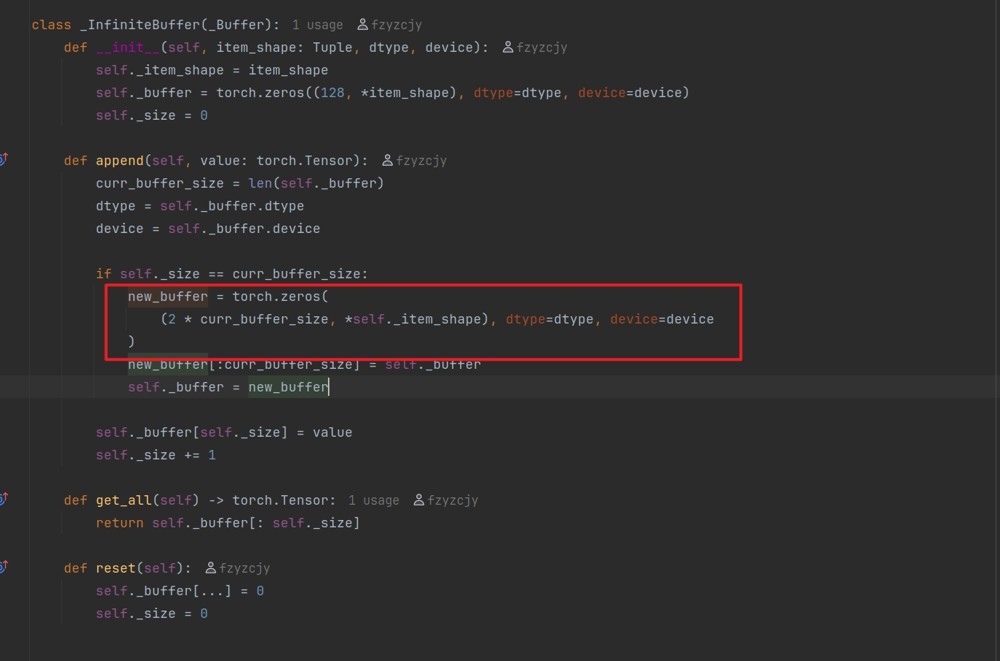

# MoE并行负载均衡之EPLB解析

# 什么是EPLB？

`DeepSeek` 发布的 EPLB（Expert Parallelism Load Balancer）是一种通过专家冗余来解决专家计算负载不均衡问题的方案，开源仓库：https://github.com/deepseek-ai/EPLB.git，其中有四个方法：

```Python
# 贪心思想：每一层中 将n个物品分配到m个包中，每个包恰好有n/m个物品，同时尽可能平衡各个包的总重量。
def balanced_packing(weight: torch.Tensor, num_packs: int) -> Tuple[torch.Tensor, torch.Tensor]:
    """
    Pack n weighted objects to m packs, such that each bin contains exactly n/m objects and the weights of all packs
    are as balanced as possible.

    Parameters:
        weight: [X, n], the weight of each item
        num_packs: number of packs
    
    Returns: 
        pack_index: [X, n], the pack index of each item
        rank_in_pack: [X, n], the rank of the item in the pack
    """
    
# 添加冗余专家的核心逻辑
def replicate_experts(weight: torch.Tensor, num_phy: int) -> Tuple[torch.Tensor, torch.Tensor, torch.Tensor]:

    """
    Replicate `num_log` experts to `num_phy` replicas, such that the maximum load of all replicas is minimized.

    Parameters:
        weight: [X, num_log]
        num_phy: total number of experts after replication
    
    Returns:
        phy2log: [X, num_phy], logical expert id of each physical expert
        rank: [X, num_phy], the replica rank
        logcnt: [X, num_log], number of replicas for each logical expert
    """
    
# 平衡算法的核心逻辑
def rebalance_experts_hierarchical(weight: torch.Tensor, num_physical_experts: int, 
                      num_groups: int, num_nodes: int, num_gpus: int):
    """
    Parameters:
        weight: [num_moe_layers, num_logical_experts]
        num_physical_experts: number of physical experts after replication
        num_groups: number of expert groups
        num_nodes: number of server nodes, where the intra-node network (e.g, NVLink) is faster
        num_gpus: number of GPUs, must be a multiple of `num_nodes`

    Returns: 
        physical_to_logical_map: [num_moe_layers, num_physical_experts]
        logical_to_physical_map: [num_moe_layers, num_logical_experts, X]
        logical_count: [num_moe_layers, num_logical_experts]
    """

# 平衡专家分布的包装，主要是数据处理以及调用rebalance_experts_hierarchical函数
def rebalance_experts(weight: torch.Tensor, num_replicas: int, num_groups: int,
                      num_nodes: int, num_gpus: int) -> Tuple[torch.Tensor, torch.Tensor, torch.Tensor]:
    """
    Entry point for expert-parallelism load balancer.

    Parameters:
        weight: [layers, num_logical_experts], the load statistics for all logical experts
        num_replicas: number of physical experts, must be a multiple of `num_gpus`
        num_groups: number of expert groups
        num_nodes: number of server nodes, where the intra-node network (e.g, NVLink) is faster
        num_gpus: number of GPUs, must be a multiple of `num_nodes`

    Returns: 
        physical_to_logical_map: [layers, num_replicas], the expert index of each replica
        logical_to_physical_map: [layers, num_logical_experts, X], the replica indices for each expert
        expert_count: [layers, num_logical_experts], number of physical replicas for each logical expert
    """
```

## **EP计算的**平衡问题



当数据量多起来之后，all-to-all通讯可能会导致通讯方面也存在瓶颈。


在 `Mixture-of-Experts`(MoE) 架构中，不同专家所接收的输入（tokens）数量存在显著差异，这直接导致了专家计算负载的不均衡。**具体表现在热门专家所在的 GPU 算力被过度占用，而冷门专家所在的 GPU 算力则处于闲置状态**。假设模型中有四个专家，分别部署在两张 GPU 上。其中，GPU0 上分配的专家热度较高，需要处理 75% 的输入数据，而 GPU1 上的专家热度较低，仅需处理 25% 的数据：


针对这一不均衡问题，**解决方案**有：

- **专家重新排列**：根据分配比例重新排序专家，并采用“高低搭配”的策略来平衡负载，使得两个GPU上的计算量变为 45% 和 55% 。该方案能够让流量更加均匀，而且不需要消耗额外的内存，但需要调整全部的专家。



- **冗余专家策略（Redundant Experts Strategy）**：在算力闲置的 GPU 上部署热门**专家的副本**，并将部分输入**分流**到副本上，从而实现负载的均衡。避免了专家的全局调整，但需要消耗额外显存空间。


## EPLB的设计思路

一个动态负载均衡系统可以抽象为：


其中的关键要素：

- 预测器（Predictor）：采集历史数据，根据统计数据预测EP的权重；

- 平衡器（Balancer）：根据EP权重计算EP的理想分布，获得逻辑到物理EP的映射map；

- 执行器（Executer）：输入目标EP的部署形态，调整EP在集群中的部署。

那么负载系统设计所需要考虑的就是，需要存储多少历史数据，采用什么样的负载平衡控制算法。


### `EPLB`代码库中涉及的一些概念

当前`EPLB`代码库针对 MoE（Mixture of Experts）模型实现了一个专家负载均衡调度器，其核心目标是将逻辑专家（logical experts）分配到物理专家（physical experts）上，同时最小化各物理专家的负载差异。其中涉及到几个概念：

- 原有专家（logical experts）

- 专家副本（replications/replica）

- 实际部署的专家（physical experts），

- 专家组（expert groups）：在prefill阶段，使用的是双阶段通讯（节点间IB+节点内nvlink），为了降低节点间的通讯而设计的专家组概念。（不过在sglang中并没有这个使用的体现）

对于专家数量关系有：physical experts = logical experts + replica experts


### `EPLB`代码解析

#### 方法一：balanced_packing

```Python
def balanced_packing(
    weight: torch.Tensor, num_packs: int
) -> Tuple[torch.Tensor, torch.Tensor]:
    """
    将 `n` 个带权重的物品分配到 `m` 个 pack 中，每个 pack 恰好包含 `n/m` 个物品，且所有 pack 的总权重尽可能平衡。

    Parameters:
        weight: [X, n], the weight of each item
        num_packs: number of packs

    Returns:
        pack_index: [X, n], the pack index of each item
        rank_in_pack: [X, n], the rank of the item in the pack
    """
    num_layers, num_groups = weight.shape # 模型层数量，每层专家个数
    assert num_groups % num_packs == 0
    groups_per_pack = num_groups // num_packs # 每个pack中该分配多少个专家
    
    # 特殊情况：给每个 pack 分配一个专家。无需贪心，直接按顺序分配即可
    if groups_per_pack == 1:
        pack_index = torch.arange(
            weight.size(-1), dtype=torch.int64, device=weight.device
        ).expand(weight.shape)
        rank_in_pack = torch.zeros_like(weight, dtype=torch.int64)
        return pack_index, rank_in_pack
    
    # 通用情况处理：
    indices = weight.float().sort(-1, descending=True).indices.cpu()
    pack_index = torch.full_like(weight, fill_value=-1, dtype=torch.int64, device="cpu")
    rank_in_pack = torch.full_like(pack_index, fill_value=-1)
    
    # 逐层（layer）处理，
    for i in range(num_layers):
        # 用于跟踪每个 pack 的实时状态
        pack_weights = [0] * num_packs # 每个 pack 的累积权重
        pack_items = [0] * num_packs # 每个 pack 已分配的物品数
        
        # 遍历当前层按权重降序排序后的物品索引
        for group in indices[i]:
            # **关键逻辑：贪心选择当前负载最小（权重总和最小）且未满的 pack**
            #     - (i for i in range(num_packs) if ...)：过滤已满的pack
            #     - key=pack_weights.__getitem__：选择 pack_weights 中最小的值
            pack = min(
                (i for i in range(num_packs) if pack_items[i] < groups_per_pack),
                key=pack_weights.__getitem__,
            )
            assert pack_items[pack] < groups_per_pack
            
            # 更新分配状态
            pack_index[i, group] = pack
            rank_in_pack[i, group] = pack_items[pack]
            pack_weights[pack] += weight[i, group] # 更新 pack 当前状态的总权重
            pack_items[pack] += 1 # 包内物品+1
    return pack_index, rank_in_pack
```

单测：

```Python
import torch
from typing import Tuple

# 测试输入
weight = torch.tensor([
    [5,7,4,6,3,9,12,4,8,2,6,1]
], dtype=torch.float32)

num_packs = 3

# 执行函数
pack_index, rank_in_pack = balanced_packing(weight, num_packs)

print("最终结果:")
print(f"pack_index = {pack_index}")
print(f"rank_in_pack = {rank_in_pack}")
```


贪心选择过程类似如下：


#### 方法二：replicate_experts

通过给定logical experts，贪心选择 **负载密度**（`weight/logcnt`）最大的专家进行复制，生成对应的 `physical experts`。具体代码如下：

```Python
def replicate_experts(
    weight: torch.Tensor, num_phy: int
) -> Tuple[torch.Tensor, torch.Tensor, torch.Tensor]:
    """
    将 `num_log` 个逻辑专家复制为 `num_phy` 个物理副本，使得所有副本的 最大负载 最小化。

    Parameters:
        weight: [X, num_log]
        num_phy: total number of experts after replication

    Returns:
        phy2log: [X, num_phy], logical expert id of each physical expert
        rank: [X, num_phy], the replica rank
        logcnt: [X, num_log], number of replicas for each logical expert
    """
    n, num_log = weight.shape
    num_redundant = num_phy - num_log  # 冗余专家个数
    assert num_redundant >= 0
    device = weight.device 
    
    # 初始化每层 physical experts 到 logical experts 的索引，（前 num_phy 个直接对应 logical experts）
    phy2log = torch.arange(num_phy, dtype=torch.int64, device=device).repeat(n, 1)
    
    # 
    rank = torch.zeros(n, num_phy, dtype=torch.int64, device=device)
    
    # 每个 logical expert 的副本数量（初始化为1,表示只有一个，和前面 phy2log 相呼应）
    logcnt = torch.ones(n, num_log, dtype=torch.int64, device=device)
    
    # 为了后续使用高级索引进行赋值 而创建的变量
    arangen = torch.arange(n, dtype=torch.int64, device=device)
    
    # 遍历选择需要冗余哪些专家（ 从 0..num_log 是每个专家都存在一份）
    for i in range(num_log, num_phy):
    
        # 核心逻辑，选择当前负载密度 （weight/logcnt）最大的 logical expert 进行冗余
        # 获取需要冗余专家的索引
        redundant_indices = (weight / logcnt).max(dim=-1).indices
        
        phy2log[:, i] = redundant_indices
        rank[:, i] = logcnt[arangen, redundant_indices]
        logcnt[arangen, redundant_indices] += 1
    return phy2log, rank, logcnt
```

返回结果中说明：

- `phy2log[i][j]`表示在模型第 i+1 层中第 j+1 个 `physical experts` 对应 `logical experts` 的编号

- `rank[i][j]`：表示模型第 i+1 层中，第 j+1 个 `physical experts` 中当前专家与前面专家相同有多少个（排名rank）。

- `logcnt[i][j]` 表示当前冗余模式下，第 i +1 层中第  j+1 个`logical experts`在`physical experts`中个数的统计。


有点抽象，可以通过编写测试用例来调试代码：

```Python
import torch
from typing import Tuple

# 测试输入
weight = torch.tensor([
    [4, 1, 12, 20, 5],  # Layer 0 的专家权重
    [2, 3, 1, 6, 20],  # Layer 1 的专家权重
], dtype=torch.float32)

num_log = 5
num_phy = 8

# 执行函数
phy2log, rank, logcnt = replicate_experts(weight, num_phy)

print("最终结果:")
print(f"phy2log = {phy2log}")
print(f"rank = {rank}")
print(f"logcnt = {logcnt}")
```

调试过程如下：

```Python
# ---------------初始化-----------------------------
weight = torch.tensor([
    [4, 1, 12, 20, 5],  # Layer 0 的专家权重
    [2, 3, 1, 6, 20],  # Layer 1 的专家权重
], dtype=torch.float32)

num_log = 5 # 5个 logical experts
num_phy = 8 # 8个 physical experts
num_redundant = 8 - 5 = 3

# ---------------初始化结果张量-----------------------------
# phy2log.shape: [2, 8]，初始时物理副本 0-4 直接映射逻辑专家 0-4
phy2log = torch.arange(8).repeat(2, 1)  # 每层是 [0,1,2,3,4,5,6,7]

# rank.shape: [2, 8]，初始全为 0
rank = torch.zeros((2, 8), dtype=torch.int64)

# logcnt.shape: [2, 5]，初始全为 1
logcnt = torch.ones((2, 5), dtype=torch.int64)

# arangen: [0, 1]，用于索引每一层
arangen = torch.arange(2)

# ---------------复制冗余副本 i = 5 -----------------------------
weight/logcnt = [
    [4/1, 1/1, 12/1, 20/1, 5/1],   # Layer 0: [4, 1, 12, 20, 5]
    [2/1, 3/1, 1/1, 6/1, 20/1]     # Layer 1: [2, 3, 1, 6, 20]
]

# 选择负载密度最高的专家，这里 Layer 0 选专家 3（值为5），Layer 1 选专家 4（值为5）
redundant_indices = (weight / logcnt).max(dim=-1).indices → [3,4]

# 更新张量
phy2log[:, i] = redundant_indices → [3,4]
rank[:, i] = logcnt[arangen, redundant_indices] → [1, 1]


logcnt[arangen, redundant_indices] += 1
# ==> logcnt[0,3] += 1 → 2
# ==> logcnt[1,4] += 1 → 2
[
    [1, 1, 1, 2, 1],  # Layer 0: 专家 3 副本数变为 2
    [1, 1, 1, 1, 2],  # Layer 1: 专家 4 副本数变为 2
]

# ---------------复制冗余副本 i = 6 -----------------------------
weight/logcnt = [
    [4/1, 1/1, 12/1, 20/2, 5/1],   # Layer 0: [4, 1, 12, 10, 5]
    [2/1, 3/1, 1/1, 6/1, 20/2]     # Layer 1: [2, 3, 1, 6, 10]
]

# 选择负载密度最高的专家，这里 Layer 0 选专家 2（值为12），Layer 1 选专家 4（值为10）
redundant_indices = (weight / logcnt).max(dim=-1).indices → [2,4]

# 更新张量
phy2log[:, i] = redundant_indices → [2,4]
rank[:, i] = logcnt[arangen, redundant_indices] → [1, 2]


logcnt[arangen, redundant_indices] += 1
# ==> logcnt[0,2] += 1 → 2
# ==> logcnt[1,4] += 1 → 3
[
    [1, 1, 2, 2, 1],
    [1, 1, 1, 1, 3],
]

# ---------------复制冗余副本 i = 7 -----------------------------
weight/logcnt = [
    [4/1, 1/1, 12/2, 20/2, 5/1],   # Layer 0: [4, 1, 6, 10, 5]
    [2/1, 3/1, 1/1, 6/1, 20/3]     # Layer 1: [2, 3, 1, 6, 6.666]
]

# 选择负载密度最高的专家，这里 Layer 0 选专家 3（值为10），Layer 1 选专家 4（值为6.6667）
redundant_indices = (weight / logcnt).max(dim=-1).indices → [3,4]

# 更新张量
phy2log[:, i] = redundant_indices → [3,4]
rank[:, i] = logcnt[arangen, redundant_indices] → [2, 3]


logcnt[arangen, redundant_indices] += 1
# ==> logcnt[0,3] += 1 → 3
# ==> logcnt[1,4] += 1 → 4
[
    [1, 1, 2, 3, 1],  
    [1, 1, 1, 1, 4],
]
Python
phy2log = tensor([
    [0, 1, 2, 3, 4, 3, 2, 3],
    [0, 1, 2, 3, 4, 4, 4, 4]
])
 
rank = tensor([
    [0, 0, 0, 0, 0, 1, 1, 2],
    [0, 0, 0, 0, 0, 1, 2, 3]
])

logcnt = tensor([
    [1, 1, 2, 3, 1],
    [1, 1, 1, 1, 4]
])
```



结合上述描述来重新看看`phy2log[i][j]`、`rank[i][j]`、`logcnt[i][j]` ：

- `phy2log[0][7]=3`：表示在`physical experts`中，第一层的第8个专家对应的是`logical expert`中的第 4 个，既`Expert 3`。

- `rank[0][7]=2`：表示在`physical experts`中，第一层的第8个专家之前，和本专家（`Expert 3`）相同的有2个。也可以看成是在`physical experts`中对应`logical expert`编号：


- `logcnt[0][3]=3` ：表示在`physical experts`中，第一层使用第4个专家（`Expert 3`）的数量是3个。


#### 方法三：rebalance_experts_hierarchical

该函数用于在**多节点 + 多 GPU**的层次化架构中，将逻辑专家（`num_logical_experts`）复制为物理专家（`num_physical_experts`），并实现负载均衡的映射。具体可参考：

- 首先将 `logical expert` 按照** 组**（group）进行划分，然后按照 每组（group）中 `logical expert`权重和为依据，均衡分配给 Node

- 在每个Node中，根据GPU个数，添加对应的冗余专家（`redundant experts`），生成每个节点上的physical experts。

- 将对应的 `physical experts` 对应上GPU,使其在每个Node的GPU上能够均衡。

为了满足上述算法，在分配之前有一些强判断：`num_logical_experts % num_groups == 0` ，`num_groups % num_nodes == 0`和 `num_physical_experts % num_gpus == 0`

在看sglang调用的时 候，这个group是None,所以在sglang中P/D节点的专家平衡方面按照GPU来均衡的。

```Python
def rebalance_experts_hierarchical(
    weight: torch.Tensor,
    num_physical_experts: int,
    num_groups: int,
    num_nodes: int,
    num_gpus: int,
):
    """
    在多节点 + 多 GPU 架构中实现专家的层次化负载均衡分配。
    
    Parameters:
        weight: [num_moe_layers, num_logical_experts]
        num_physical_experts: number of physical experts after replication
        num_groups: number of expert groups
        num_nodes: number of server nodes, where the intra-node network (e.g, NVLink) is faster
        num_gpus: number of GPUs, must be a multiple of `num_nodes`

    Returns:
        physical_to_logical_map: [num_moe_layers, num_physical_experts]
        logical_to_physical_map: [num_moe_layers, num_logical_experts, X]
        logical_count: [num_moe_layers, num_logical_experts]
    """
    num_layers, num_logical_experts = weight.shape
    assert num_logical_experts % num_groups == 0
    group_size = num_logical_experts // num_groups
    assert num_groups % num_nodes == 0
    groups_per_node = num_groups // num_nodes
    assert num_gpus % num_nodes == 0
    assert num_physical_experts % num_gpus == 0
    phy_experts_per_gpu = num_physical_experts // num_gpus
    
    # 这个函数的作用是计算一个排列张量的逆排列 。在排列的上下文中，逆排列指的是将排列后的索引还原为原始位置的映射关系。
    # 具体来说，如果 perm[i][j] = k，则逆排列 inv[i][k] = j。
    def inverse(perm: torch.Tensor) -> torch.Tensor:
        inv = torch.empty_like(perm)
        inv.scatter_(
            1,
            perm,
            torch.arange(perm.size(1), dtype=torch.int64, device=perm.device).expand(
                perm.shape
            ),
        )
        return inv

    # Step 1: pack groups to nodes
    tokens_per_group = weight.unflatten(-1, (num_groups, group_size)).sum(-1)
    group_pack_index, group_rank_in_pack = balanced_packing(tokens_per_group, num_nodes)
    log2mlog = (
        (
            (group_pack_index * groups_per_node + group_rank_in_pack) * group_size
        ).unsqueeze(-1)
        + torch.arange(group_size, dtype=torch.int64, device=group_pack_index.device)
    ).flatten(-2)
    mlog2log = inverse(log2mlog)

    # Step 2: construct redundant experts within nodes
    # [num_layers * num_nodes, num_logical_experts // num_nodes]
    tokens_per_mlog = weight.gather(-1, mlog2log).view(
        -1, num_logical_experts // num_nodes
    )
    phy2mlog, phyrank, mlogcnt = replicate_experts(
        tokens_per_mlog, num_physical_experts // num_nodes
    )

    # Step 3: pack physical_experts to GPUs
    # [num_layers * num_nodes, num_physical_experts // num_nodes]
    tokens_per_phy = (tokens_per_mlog / mlogcnt).gather(-1, phy2mlog)
    pack_index, rank_in_pack = balanced_packing(tokens_per_phy, num_gpus // num_nodes)
    phy2pphy = pack_index * phy_experts_per_gpu + rank_in_pack
    pphy2phy = inverse(phy2pphy)

    pphy2mlog = phy2mlog.gather(
        -1, pphy2phy
    )  # [num_layers * num_nodes, num_log_per_nodes]
    pphy2mlog = (
        pphy2mlog.view(num_layers, num_nodes, -1)
        + torch.arange(
            0,
            num_logical_experts,
            num_logical_experts // num_nodes,
            device=group_pack_index.device,
        ).view(1, -1, 1)
    ).flatten(-2)
    pphy2log = mlog2log.gather(-1, pphy2mlog)
    pphyrank = phyrank.gather(-1, pphy2phy).view(num_layers, -1)
    logcnt = mlogcnt.view(num_layers, -1).gather(-1, log2mlog)
    return pphy2log, pphyrank, logcnt
```

举例说明：假设，physical experts=12，logical experts=8，可知replica experts=4。同时为了降低节点间的通信（图示中有两个节点），可以设置专家的group=2（其实也可以设置为8）。


步骤1：将专家分为2组（这个按照顺序分配），并找到每组中热度最高的2个：


步骤2：复制每组中热度最高专家副本。


步骤3：然后按照高低搭配加载到GPU上面。


```Python
import torch
from typing import Tuple

# 计算一个置换张量的逆置换 （Inverse Permutation）。其核心目标是满足数学中置换的逆操作特性
# 对于输入 perm 和输出 inv 每行满足 perm[inv[i]] = i
def inverse(perm: torch.Tensor) -> torch.Tensor:
    inv = torch.empty_like(perm)
    inv.scatter_(
        1,
        perm,
        torch.arange(perm.size(1), dtype=torch.int64, device=perm.device).expand(
            perm.shape
        ),
    )
    return inv

# 测试输入
weight  = torch.tensor([
    [10,  6,  8,  0,  1,  2,  4,  3,  5,  7,  9]
], dtype=torch.int64)

inv = inverse(weight)
print(inv) # ==> tensor([[ 3,  4,  5,  7,  6,  8,  1,  9,  2, 10,  0]])
```


#### 方法四：rebalance_experts

主要是函数调用和数据处理，这里根据`enable_hierarchical`来判断用什么策略：

```Python
def rebalance_experts(
    weight: torch.Tensor,
    num_replicas: int,
    num_groups: int,
    num_nodes: int,
    num_gpus: int,
    enable_hierarchical: bool,
) -> Tuple[torch.Tensor, torch.Tensor, torch.Tensor]:
    """
    Entry point for expert-parallelism load balancer.

    Parameters:
        weight: [layers, num_logical_experts], the load statistics for all logical experts
        num_replicas: number of physical experts, must be a multiple of `num_gpus`
        num_groups: number of expert groups
        num_nodes: number of server nodes, where the intra-node network (e.g, NVLink) is faster
        num_gpus: number of GPUs, must be a multiple of `num_nodes`

    Returns:
        physical_to_logical_map: [layers, num_replicas], the expert index of each replica
        logical_to_physical_map: [layers, num_logical_experts, X], the replica indices for each expert
        expert_count: [layers, num_logical_experts], number of physical replicas for each logical expert
    """

    num_layers, num_logical_experts = weight.shape
    weight = weight.float().cpu()
    if enable_hierarchical:
        # use hierarchical load-balance policy
        phy2log, phyrank, logcnt = rebalance_experts_hierarchical(
            weight, num_replicas, num_groups, num_nodes, num_gpus
        )
    else:
        # use global load-balance policy
        phy2log, phyrank, logcnt = rebalance_experts_hierarchical(
            weight, num_replicas, 1, 1, num_gpus
        )
    maxlogcnt = logcnt.max().item()
    log2phy: torch.Tensor = torch.full(
        (num_layers, num_logical_experts, maxlogcnt),
        -1,
        dtype=torch.int64,
        device=logcnt.device,
    )
    log2phy.view(num_layers, -1).scatter_(
        -1,
        phy2log * maxlogcnt + phyrank,
        torch.arange(num_replicas, dtype=torch.int64, device=log2phy.device).expand(
            num_layers, -1
        ),
    )
    return phy2log, log2phy, logcnt
```


### EPLB黑盒测试

存在冗余专家的测试

```Python
import torch

weight = torch.tensor([
    [90, 132, 40, 61, 104, 165, 39, 4, 73, 56, 183, 86],
    [90, 1000000, 40, 61, 104, 165, 39, 4, 73, 56, 183, 86]
])
num_replicas = 16
num_nodes = 2
num_gpus = 8

# 这里模拟的是2各node,每个 node 上是 4 个GPU
physical_to_logical_map, logical_to_all_physical_map, expert_count = rebalance_experts(
    weight,  # tokens_per_expert.sum(dim=0)
    num_replicas,
    1,
    num_nodes,
    num_gpus,
    False
)

print(physical_to_logical_map) # shape : torch.Size([2, 16])
# tensor([[10,  6, 10,  7,  0,  2, 11,  4,  5,  9,  5,  4,  8,  3,  1,  1],
#         [ 1,  3,  1,  9,  1,  2,  1,  6,  1,  7, 10,  8,  5, 11,  4,  0]])

 

print(logical_to_all_physical_map) # shape : print(logical_to_all_physical_map)
tensor([[[ 4, -1, -1, -1, -1],
         [14, 15, -1, -1, -1],
         [ 5, -1, -1, -1, -1],
         [13, -1, -1, -1, -1],
         [11,  7, -1, -1, -1],
         [ 8, 10, -1, -1, -1],
         [ 1, -1, -1, -1, -1],
         [ 3, -1, -1, -1, -1],
         [12, -1, -1, -1, -1],
         [ 9, -1, -1, -1, -1],
         [ 0,  2, -1, -1, -1],
         [ 6, -1, -1, -1, -1]],

        [[15, -1, -1, -1, -1],
         [ 0,  2,  4,  6,  8], # 由最长的映射决定宽度
         [ 5, -1, -1, -1, -1],
         [ 1, -1, -1, -1, -1],
         [14, -1, -1, -1, -1],
         [12, -1, -1, -1, -1],
         [ 7, -1, -1, -1, -1],
         [ 9, -1, -1, -1, -1],
         [11, -1, -1, -1, -1],
         [ 3, -1, -1, -1, -1],
         [10, -1, -1, -1, -1],
         [13, -1, -1, -1, -1]]])


print(expert_count)
# tensor([[1, 2, 1, 1, 2, 2, 1, 1, 1, 1, 2, 1],
#         [1, 5, 1, 1, 1, 1, 1, 1, 1, 1, 1, 1]])

```


# sglang中使用EPLB

- 在推理过程中动态调整eplb，新版本中通过 --enable-eplb 开启

- 获取token分发专家的历史记录

    ```Python
    # 开始记录
    curl -X POST -H 'Content-Type: application/json' 'http://10.83.0.178:9001/start_expert_distribution_record' -d '{}' 
    
    # 执行推理1
    python3 -m sglang.bench_one_batch_server --model-path /home/model/DeepSeek-R1/ --base-url http://10.86.69.186:9001 --batch-size 4000 --input-len 2000 --output-len 100 --skip-warmup
    
    # 将记录的数据dump到磁盘上，保存为.pt文件
    curl -X POST -H 'Content-Type: application/json' 'http://10.83.0.178:9001/dump_expert_distribution_record' -d '{}' 
    ```

    比如获取的一个pt文件如下，其中`tokens_per_expert["logical_count"].shape` 是 `torch.Size([4, 61, 256])`，注意在使用平衡算法之前，会将这个向量`tokens_per_expert["logical_count"].sum(dim=0)`汇总一下。表示**历史专家热度的统计数据**（即历史时间段中，分发到每层每个专家的 `token` 总数）。

    [expert_distribution_recorder_1_decode.pt](images/expert_distribution_recorder_1_decode.pt)


在 ModelRunner 中有代码

```Python
# 初始化ModelRunner
def initialize(self, min_per_gpu_memory: float):
    server_args = self.server_args
    
    set_global_expert_location_metadata(
        compute_initial_expert_location_metadata(server_args, self.model_config)
    )
    
    set_global_expert_distribution_recorder(
        ExpertDistributionRecorder.init_new(
            server_args,
            get_global_expert_location_metadata(),
            rank=self.tp_rank,
        )
    )
    
    # eplb 管理器
    self.eplb_manager = (
        EPLBManager(self)
        if self.server_args.enable_eplb and (not self.is_draft_worker)
        else None
    )
    
    # 专家分布权重更新器
    self.expert_location_updater = ExpertLocationUpdater()


# 前向传播调用入口
def forward(...)-> Tuple[Union[LogitsProcessorOutput, PPProxyTensors], bool]:
    
    # 模型前向传播
    output = self._forward_raw(...)
    
    # 每次前向传播完成后，会通过eplb_manager去判断是否执行了 eplb_rebalance_num_iterations 步，
    # 然后动态调整，调用的基本是后面那个update_expert_location方法
    if self.eplb_manager is not None:
        self.eplb_manager.on_forward_pass_end()

# 这个调用很奇怪，在 EPLBManager 类中的 rebalance中会使用。
def update_expert_location(
    self,
    new_expert_location_metadata: ExpertLocationMetadata,
    update_layer_ids: List[int],
):
    # 使用上述的权重更新器来更新专家权重。
    self.expert_location_updater.update(
        self.model.routed_experts_weights_of_layer,
        new_expert_location_metadata,
        update_layer_ids=update_layer_ids,
        nnodes=self.server_args.nnodes,
        rank=self.tp_rank,
    )     
```


专家通过分布式p2p更新权重的代码在：python/sglang/srt/eplb/expert_location_updater.py 中，


专家分布的历史记录统计的实现参考ExpertDistributionRecorder（抽象类），具体实现类_ExpertDistributionRecorderReal。


除此之外，有采集（累加）器的策略Accumulator：通过`--expert-distribution-recorder-mode`设置，可选项有["stat", "stat_approx", "per_pass", "per_token"]，默认 stat。


在采集（累加）器Accumulator中，用到来用于记录数据的_Buffer类，其中会根据buffer_size去选择调用_InfiniteBuffer（无限buffer）或者_CircularBuffer（循环buffer），而这个buffer_size 是由启动命令 `--expert-distribution-recorder-buffer-size `来设置的

```Python
# 
class _Buffer:
    @staticmethod
    def init_new(item_shape: Tuple, buffer_size: int, dtype, device):
        if buffer_size < 0:
            return _InfiniteBuffer(item_shape, dtype=dtype, device=device)
        else:
            return _CircularBuffer(item_shape, buffer_size, dtype=dtype, device=device)
```


在开启动态eplb过程中，有个oom问题，主要是整个采集器保存的数据太大导致




## ExpertLocationMetadata，对于 logical 和 physical 专家映射信息

```Python
@dataclass
class ExpertLocationMetadata:
    physical_to_logical_map: torch.Tensor  # (layers, num_physical_experts)
    physical_to_logical_map_cpu: torch.Tensor # 这个就是将上述数据保存到CPU上
    logical_to_all_physical_map: torch.Tensor  # (layers, num_logical_experts, X)， 这个X表示最大的logical专家冗余份数
    logical_to_all_physical_map_num_valid: torch.Tensor  # (layers, num_logical_experts) 
    # (layers, num_logical_experts)
    logical_to_rank_dispatch_physical_map: Optional[torch.Tensor]
    
    
    @staticmethod
    def _init_raw(
        server_args: ServerArgs,
        ep_size: int,
        physical_to_logical_map: torch.Tensor,
        logical_to_all_physical_map: torch.Tensor,
    ):
        _, num_physical_experts = physical_to_logical_map.shape
    
        logical_to_all_physical_map_padded = F.pad(
            logical_to_all_physical_map,
            (0, num_physical_experts - logical_to_all_physical_map.shape[-1]),
            value=-1,
        )
    
        logical_to_all_physical_map_num_valid = torch.count_nonzero(
            logical_to_all_physical_map != -1, dim=-1
        )
    
        return ExpertLocationMetadata(
            physical_to_logical_map=physical_to_logical_map,
            physical_to_logical_map_cpu=physical_to_logical_map.cpu(),
            logical_to_all_physical_map=logical_to_all_physical_map_padded,
            logical_to_all_physical_map_num_valid=logical_to_all_physical_map_num_valid,
            logical_to_rank_dispatch_physical_map=(
                compute_logical_to_rank_dispatch_physical_map(
                    logical_to_all_physical_map=logical_to_all_physical_map,
                    num_gpus=ep_size,
                    num_physical_experts=num_physical_experts,
                    # TODO improve when we have real EP rank
                    ep_rank=torch.distributed.get_rank() % ep_size,
                )
                if server_args.ep_dispatch_algorithm == "static"
                else None
            ),
        )
```


## ExpertLocationDispatchInfo，在使用dispatch分发时候需要参考的info

```Python
@dataclass
class ExpertLocationDispatchInfo:
    # 
    ep_dispatch_algorithm: Literal["static", "random"]
    
    # (num_logical_experts,)
    partial_logical_to_rank_dispatch_physical_map: Optional[torch.Tensor]
    
    # (num_logical_experts, X)
    partial_logical_to_all_physical_map: torch.Tensor
    
    # (num_logical_experts,)
    partial_logical_to_all_physical_map_num_valid: torch.Tensor
    num_physical_experts: int

    @classmethod
    def init_new(cls, layer_id: int):
        ep_dispatch_algorithm = global_server_args_dict["ep_dispatch_algorithm"]
        expert_location_metadata = get_global_expert_location_metadata()
        assert expert_location_metadata is not None

        if ep_dispatch_algorithm is None:
            return None

        return cls(
            ep_dispatch_algorithm=ep_dispatch_algorithm,
            partial_logical_to_rank_dispatch_physical_map=(
                expert_location_metadata.logical_to_rank_dispatch_physical_map[
                    layer_id, :
                ]
                if expert_location_metadata.logical_to_rank_dispatch_physical_map
                is not None
                else None
            ),
            partial_logical_to_all_physical_map=expert_location_metadata.logical_to_all_physical_map[
                layer_id, :
            ],
            partial_logical_to_all_physical_map_num_valid=expert_location_metadata.logical_to_all_physical_map_num_valid[
                layer_id, :
            ],
            num_physical_experts=expert_location_metadata.num_physical_experts,
        )
```


# 参考

1. [MoE并行负载均衡：EPLB的深度解析与可视化](https://zhuanlan.zhihu.com/p/29963005584)

