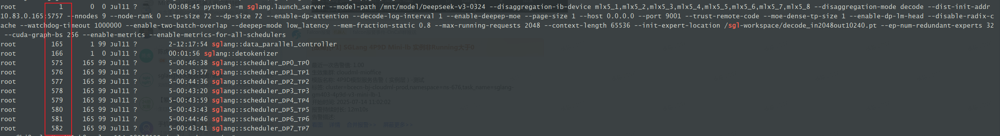

# py-spy工具的使用

注意，为了CPU和GPU同步流，需要设置：

```Bash
# 每次调用完算子后，附加一个synchronize
export CUDA_LAUNCH_BLOCKING=1
```


# 调用栈

```Bash
ps -ef | grep sgl | grep -v grep | awk '{print $2}' | xargs -i py-spy dump -p {}
```

输出显示：

```Bash
Process 1: python3 -m sglang.launch_server --model-path /mnt/model/DeepSeek-V3-0324 --disaggregation-ib-device mlx5_1,mlx5_2,mlx5_3,mlx5_4,mlx5_5,mlx5_6,mlx5_7,mlx5_8 --disaggregation-mode decode --dist-init-addr 10.83.0.165:5757 --nnodes 9 --node-rank 0 --tp-size 72 --dp-size 72 --enable-dp-attention --decode-log-interval 1 --enable-deepep-moe --page-size 1 --host 0.0.0.0 --port 9001 --trust-remote-code --moe-dense-tp-size 1 --enable-dp-lm-head --disable-radix-cache --watchdog-timeout 1000000 --enable-two-batch-overlap --deepep-mode low_latency --mem-fraction-static 0.8 --max-running-requests 2048 --context-length 65536 --init-expert-location /sgl-workspace/decode_in2048out10240.pt --ep-num-redundant-experts 32 --cuda-graph-bs 256 --enable-metrics --enable-metrics-for-all-schedulers
Python v3.12.3 (/usr/bin/python3.12)

Thread 1 (idle): "MainThread"
    run (asyncio/runners.py:118)
    run (asyncio/runners.py:194)
    run (uvicorn/server.py:66)
    run (uvicorn/main.py:580)
    launch_server (http_server.py:791)
    <module> (sglang/launch_server.py:14)
    _run_code (<frozen runpy>:88)
    _run_module_as_main (<frozen runpy>:198)
Thread 99 (idle): "Thread-1 (_read_thread)"
    _recv_msg (torch/_inductor/compile_worker/subproc_pool.py:55)
    _read_thread (torch/_inductor/compile_worker/subproc_pool.py:191)
    run (threading.py:1010)
    _bootstrap_inner (threading.py:1073)
    _bootstrap (threading.py:1030)


Process 165: sglang::data_parallel_controller
Python v3.12.3 (/usr/bin/python3.12)

Thread 165 (active+gil): "MainThread"
    recv_pyobj (zmq/sugar/socket.py:989)
    event_loop (data_parallel_controller.py:273)
    run_data_parallel_controller_process (data_parallel_controller.py:310)
    run (multiprocessing/process.py:108)
    _bootstrap (multiprocessing/process.py:314)
    _main (multiprocessing/spawn.py:135)
    spawn_main (multiprocessing/spawn.py:122)
    <module> (<string>:1)
Thread 371 (idle): "Thread-1 (_read_thread)"
    _recv_msg (torch/_inductor/compile_worker/subproc_pool.py:55)
    _read_thread (torch/_inductor/compile_worker/subproc_pool.py:191)
    run (threading.py:1010)
    _bootstrap_inner (threading.py:1073)
    _bootstrap (threading.py:1030)


Process 166: sglang::detokenizer
Python v3.12.3 (/usr/bin/python3.12)

Thread 166 (idle): "MainThread"
    recv_pyobj (zmq/sugar/socket.py:989)
    event_loop (detokenizer_manager.py:109)
    run_detokenizer_process (detokenizer_manager.py:275)
    run (multiprocessing/process.py:108)
    _bootstrap (multiprocessing/process.py:314)
    _main (multiprocessing/spawn.py:135)
    spawn_main (multiprocessing/spawn.py:122)
    <module> (<string>:1)
Thread 369 (idle): "Thread-1 (_read_thread)"
    _recv_msg (torch/_inductor/compile_worker/subproc_pool.py:55)
    _read_thread (torch/_inductor/compile_worker/subproc_pool.py:191)
    run (threading.py:1010)
    _bootstrap_inner (threading.py:1073)
    _bootstrap (threading.py:1030)
Process 575: sglang::scheduler_DP0_TP0
Python v3.12.3 (/usr/bin/python3.12)

Thread 575 (active): "MainThread"
    synchronize (torch/cuda/streams.py:227)
    resolve_last_batch_result (tp_worker_overlap_thread.py:193)
    process_batch_result_decode (scheduler_output_processor_mixin.py:205)
    process_batch_result (scheduler.py:1634)
    event_loop_overlap_disagg_decode (decode.py:621)
    decorate_context (torch/utils/_contextlib.py:116)
    run_scheduler_process (scheduler.py:2523)
    run (multiprocessing/process.py:108)
    _bootstrap (multiprocessing/process.py:314)
    _main (multiprocessing/spawn.py:135)
    spawn_main (multiprocessing/spawn.py:122)
    <module> (<string>:1)
Thread 1372 (idle): "Thread-1 (_read_thread)"
    _recv_msg (torch/_inductor/compile_worker/subproc_pool.py:55)
    _read_thread (torch/_inductor/compile_worker/subproc_pool.py:191)
    run (threading.py:1010)
    _bootstrap_inner (threading.py:1073)
    _bootstrap (threading.py:1030)
Thread 3912 (idle): "Thread-2"
    wait (threading.py:359)
    wait (threading.py:655)
    run (tqdm/_monitor.py:60)
    _bootstrap_inner (threading.py:1073)
    _bootstrap (threading.py:1030)
Thread 3920 (idle): "Thread-3"
    wait (threading.py:359)
    wait (threading.py:655)
    run (tqdm/_monitor.py:60)
    _bootstrap_inner (threading.py:1073)
    _bootstrap (threading.py:1030)
Thread 13261 (idle): "Thread-4 (forward_thread_func)"
    wait (threading.py:355)
    get (queue.py:171)
    forward_thread_func_ (tp_worker_overlap_thread.py:130)
    decorate_context (torch/utils/_contextlib.py:116)
    forward_thread_func (tp_worker_overlap_thread.py:118)
    run (threading.py:1010)
    _bootstrap_inner (threading.py:1073)
    _bootstrap (threading.py:1030)
Thread 13271 (idle): "Thread-5 (watchdog_thread)"
    watchdog_thread (scheduler.py:1874)
    run (threading.py:1010)
    _bootstrap_inner (threading.py:1073)
    _bootstrap (threading.py:1030)
Thread 13569 (idle): "Thread-6 (decode_thread)"
    recv_multipart (zmq/sugar/socket.py:799)
    decode_thread (mooncake/conn.py:478)
    run (threading.py:1010)
    _bootstrap_inner (threading.py:1073)
    _bootstrap (threading.py:1030)
Thread 13570 (idle): "Thread-7 (heartbeat_checker)"
    heartbeat_checker (mooncake/conn.py:490)
    run (threading.py:1010)
    _bootstrap_inner (threading.py:1073)
    _bootstrap (threading.py:1030)


Process 576: sglang::scheduler_DP1_TP1
Python v3.12.3 (/usr/bin/python3.12)

Thread 576 (active): "MainThread"
    synchronize (torch/cuda/streams.py:227)
    resolve_last_batch_result (tp_worker_overlap_thread.py:193)
    process_batch_result_decode (scheduler_output_processor_mixin.py:205)
    process_batch_result (scheduler.py:1634)
    event_loop_overlap_disagg_decode (decode.py:621)
    decorate_context (torch/utils/_contextlib.py:116)
    run_scheduler_process (scheduler.py:2523)
    run (multiprocessing/process.py:108)
    _bootstrap (multiprocessing/process.py:314)
    _main (multiprocessing/spawn.py:135)
    spawn_main (multiprocessing/spawn.py:122)
    <module> (<string>:1)
Thread 1383 (idle): "Thread-1 (_read_thread)"
    _recv_msg (torch/_inductor/compile_worker/subproc_pool.py:55)
    _read_thread (torch/_inductor/compile_worker/subproc_pool.py:191)
    run (threading.py:1010)
    _bootstrap_inner (threading.py:1073)
    _bootstrap (threading.py:1030)
Thread 3918 (idle): "Thread-2"
    wait (threading.py:359)
    wait (threading.py:655)
    run (tqdm/_monitor.py:60)
    _bootstrap_inner (threading.py:1073)
    _bootstrap (threading.py:1030)
Thread 9939 (idle): "Thread-3"
    wait (threading.py:359)
    wait (threading.py:655)
    run (tqdm/_monitor.py:60)
    _bootstrap_inner (threading.py:1073)
    _bootstrap (threading.py:1030)
Thread 13265 (idle): "Thread-4 (forward_thread_func)"
    wait (threading.py:355)
    get (queue.py:171)
    forward_thread_func_ (tp_worker_overlap_thread.py:130)
    decorate_context (torch/utils/_contextlib.py:116)
    forward_thread_func (tp_worker_overlap_thread.py:118)
    run (threading.py:1010)
    _bootstrap_inner (threading.py:1073)
    _bootstrap (threading.py:1030)
Thread 13272 (idle): "Thread-5 (watchdog_thread)"
    watchdog_thread (scheduler.py:1874)
    run (threading.py:1010)
    _bootstrap_inner (threading.py:1073)
    _bootstrap (threading.py:1030)
Thread 13565 (idle): "Thread-6 (decode_thread)"
    recv_multipart (zmq/sugar/socket.py:799)
    decode_thread (mooncake/conn.py:478)
    run (threading.py:1010)
    _bootstrap_inner (threading.py:1073)
    _bootstrap (threading.py:1030)
Thread 13567 (idle): "Thread-7 (heartbeat_checker)"
    heartbeat_checker (mooncake/conn.py:490)
    run (threading.py:1010)
    _bootstrap_inner (threading.py:1073)
    _bootstrap (threading.py:1030)


Process 577: sglang::scheduler_DP2_TP2
Python v3.12.3 (/usr/bin/python3.12)

Thread 577 (active): "MainThread"
    synchronize (torch/cuda/streams.py:227)
    resolve_last_batch_result (tp_worker_overlap_thread.py:193)
    process_batch_result_decode (scheduler_output_processor_mixin.py:205)
    process_batch_result (scheduler.py:1634)
    event_loop_overlap_disagg_decode (decode.py:621)
    decorate_context (torch/utils/_contextlib.py:116)
    run_scheduler_process (scheduler.py:2523)
    run (multiprocessing/process.py:108)
    _bootstrap (multiprocessing/process.py:314)
    _main (multiprocessing/spawn.py:135)
    spawn_main (multiprocessing/spawn.py:122)
    <module> (<string>:1)
Thread 1376 (idle): "Thread-1 (_read_thread)"
    _recv_msg (torch/_inductor/compile_worker/subproc_pool.py:55)
    _read_thread (torch/_inductor/compile_worker/subproc_pool.py:191)
    run (threading.py:1010)
    _bootstrap_inner (threading.py:1073)
    _bootstrap (threading.py:1030)
Thread 3916 (idle): "Thread-2"
    wait (threading.py:359)
    wait (threading.py:655)
    run (tqdm/_monitor.py:60)
    _bootstrap_inner (threading.py:1073)
    _bootstrap (threading.py:1030)
Thread 9945 (idle): "Thread-3"
    wait (threading.py:359)
    wait (threading.py:655)
    run (tqdm/_monitor.py:60)
    _bootstrap_inner (threading.py:1073)
    _bootstrap (threading.py:1030)
Thread 13259 (idle): "Thread-4 (forward_thread_func)"
    wait (threading.py:355)
    get (queue.py:171)
    forward_thread_func_ (tp_worker_overlap_thread.py:130)
    decorate_context (torch/utils/_contextlib.py:116)
    forward_thread_func (tp_worker_overlap_thread.py:118)
    run (threading.py:1010)
    _bootstrap_inner (threading.py:1073)
    _bootstrap (threading.py:1030)
Thread 13266 (idle): "Thread-5 (watchdog_thread)"
    watchdog_thread (scheduler.py:1874)
    run (threading.py:1010)
    _bootstrap_inner (threading.py:1073)
    _bootstrap (threading.py:1030)
Thread 13557 (idle): "Thread-6 (decode_thread)"
    recv_multipart (zmq/sugar/socket.py:799)
    decode_thread (mooncake/conn.py:478)
    run (threading.py:1010)
    _bootstrap_inner (threading.py:1073)
    _bootstrap (threading.py:1030)
Thread 13558 (idle): "Thread-7 (heartbeat_checker)"
    heartbeat_checker (mooncake/conn.py:490)
    run (threading.py:1010)
    _bootstrap_inner (threading.py:1073)
    _bootstrap (threading.py:1030)


Process 578: sglang::scheduler_DP3_TP3
Python v3.12.3 (/usr/bin/python3.12)

Thread 578 (active): "MainThread"
    synchronize (torch/cuda/streams.py:227)
    resolve_last_batch_result (tp_worker_overlap_thread.py:193)
    process_batch_result_decode (scheduler_output_processor_mixin.py:205)
    process_batch_result (scheduler.py:1634)
    event_loop_overlap_disagg_decode (decode.py:621)
    decorate_context (torch/utils/_contextlib.py:116)
    run_scheduler_process (scheduler.py:2523)
    run (multiprocessing/process.py:108)
    _bootstrap (multiprocessing/process.py:314)
    _main (multiprocessing/spawn.py:135)
    spawn_main (multiprocessing/spawn.py:122)
    <module> (<string>:1)
Thread 1385 (idle): "Thread-1 (_read_thread)"
    _recv_msg (torch/_inductor/compile_worker/subproc_pool.py:55)
    _read_thread (torch/_inductor/compile_worker/subproc_pool.py:191)
    run (threading.py:1010)
    _bootstrap_inner (threading.py:1073)
    _bootstrap (threading.py:1030)
Thread 3914 (idle): "Thread-2"
    wait (threading.py:359)
    wait (threading.py:655)
    run (tqdm/_monitor.py:60)
    _bootstrap_inner (threading.py:1073)
    _bootstrap (threading.py:1030)
Thread 9943 (idle): "Thread-3"
    wait (threading.py:359)
    wait (threading.py:655)
    run (tqdm/_monitor.py:60)
    _bootstrap_inner (threading.py:1073)
    _bootstrap (threading.py:1030)
Thread 13263 (idle): "Thread-4 (forward_thread_func)"
    wait (threading.py:355)
    get (queue.py:171)
    forward_thread_func_ (tp_worker_overlap_thread.py:130)
    decorate_context (torch/utils/_contextlib.py:116)
    forward_thread_func (tp_worker_overlap_thread.py:118)
    run (threading.py:1010)
    _bootstrap_inner (threading.py:1073)
    _bootstrap (threading.py:1030)
Thread 13273 (idle): "Thread-5 (watchdog_thread)"
    watchdog_thread (scheduler.py:1874)
    run (threading.py:1010)
    _bootstrap_inner (threading.py:1073)
    _bootstrap (threading.py:1030)
Thread 13566 (idle): "Thread-6 (decode_thread)"
    recv_multipart (zmq/sugar/socket.py:799)
    decode_thread (mooncake/conn.py:478)
    run (threading.py:1010)
    _bootstrap_inner (threading.py:1073)
    _bootstrap (threading.py:1030)
Thread 13568 (idle): "Thread-7 (heartbeat_checker)"
    heartbeat_checker (mooncake/conn.py:490)
    run (threading.py:1010)
    _bootstrap_inner (threading.py:1073)
    _bootstrap (threading.py:1030)


Process 579: sglang::scheduler_DP4_TP4
Python v3.12.3 (/usr/bin/python3.12)

Thread 579 (active): "MainThread"
    synchronize (torch/cuda/streams.py:227)
    resolve_last_batch_result (tp_worker_overlap_thread.py:193)
    process_batch_result_decode (scheduler_output_processor_mixin.py:205)
    process_batch_result (scheduler.py:1634)
    event_loop_overlap_disagg_decode (decode.py:621)
    decorate_context (torch/utils/_contextlib.py:116)
    run_scheduler_process (scheduler.py:2523)
    run (multiprocessing/process.py:108)
    _bootstrap (multiprocessing/process.py:314)
    _main (multiprocessing/spawn.py:135)
    spawn_main (multiprocessing/spawn.py:122)
    <module> (<string>:1)
Thread 1387 (idle): "Thread-1 (_read_thread)"
    _recv_msg (torch/_inductor/compile_worker/subproc_pool.py:55)
    _read_thread (torch/_inductor/compile_worker/subproc_pool.py:191)
    run (threading.py:1010)
    _bootstrap_inner (threading.py:1073)
    _bootstrap (threading.py:1030)
Thread 3917 (idle): "Thread-2"
    wait (threading.py:359)
    wait (threading.py:655)
    run (tqdm/_monitor.py:60)
    _bootstrap_inner (threading.py:1073)
    _bootstrap (threading.py:1030)
Thread 9913 (idle): "Thread-3"
    wait (threading.py:359)
    wait (threading.py:655)
    run (tqdm/_monitor.py:60)
    _bootstrap_inner (threading.py:1073)
    _bootstrap (threading.py:1030)
Thread 13258 (idle): "Thread-4 (forward_thread_func)"
    wait (threading.py:355)
    get (queue.py:171)
    forward_thread_func_ (tp_worker_overlap_thread.py:130)
    decorate_context (torch/utils/_contextlib.py:116)
    forward_thread_func (tp_worker_overlap_thread.py:118)
    run (threading.py:1010)
    _bootstrap_inner (threading.py:1073)
    _bootstrap (threading.py:1030)
Thread 13267 (idle): "Thread-5 (watchdog_thread)"
    watchdog_thread (scheduler.py:1874)
    run (threading.py:1010)
    _bootstrap_inner (threading.py:1073)
    _bootstrap (threading.py:1030)
Thread 13555 (idle): "Thread-6 (decode_thread)"
    recv_multipart (zmq/sugar/socket.py:799)
    decode_thread (mooncake/conn.py:478)
    run (threading.py:1010)
    _bootstrap_inner (threading.py:1073)
    _bootstrap (threading.py:1030)
Thread 13556 (idle): "Thread-7 (heartbeat_checker)"
    heartbeat_checker (mooncake/conn.py:490)
    run (threading.py:1010)
    _bootstrap_inner (threading.py:1073)
    _bootstrap (threading.py:1030)


Process 580: sglang::scheduler_DP5_TP5
Python v3.12.3 (/usr/bin/python3.12)

Thread 580 (active): "MainThread"
    synchronize (torch/cuda/streams.py:227)
    resolve_last_batch_result (tp_worker_overlap_thread.py:193)
    process_batch_result_decode (scheduler_output_processor_mixin.py:205)
    process_batch_result (scheduler.py:1634)
    event_loop_overlap_disagg_decode (decode.py:621)
    decorate_context (torch/utils/_contextlib.py:116)
    run_scheduler_process (scheduler.py:2523)
    run (multiprocessing/process.py:108)
    _bootstrap (multiprocessing/process.py:314)
    _main (multiprocessing/spawn.py:135)
    spawn_main (multiprocessing/spawn.py:122)
    <module> (<string>:1)
Thread 1233 (idle): "Thread-1 (_read_thread)"
    _recv_msg (torch/_inductor/compile_worker/subproc_pool.py:55)
    _read_thread (torch/_inductor/compile_worker/subproc_pool.py:191)
    run (threading.py:1010)
    _bootstrap_inner (threading.py:1073)
    _bootstrap (threading.py:1030)
Thread 3913 (idle): "Thread-2"
    wait (threading.py:359)
    wait (threading.py:655)
    run (tqdm/_monitor.py:60)
    _bootstrap_inner (threading.py:1073)
    _bootstrap (threading.py:1030)
Thread 9941 (idle): "Thread-3"
    wait (threading.py:359)
    wait (threading.py:655)
    run (tqdm/_monitor.py:60)
    _bootstrap_inner (threading.py:1073)
    _bootstrap (threading.py:1030)
Thread 13264 (idle): "Thread-4 (forward_thread_func)"
    wait (threading.py:355)
    get (queue.py:171)
    forward_thread_func_ (tp_worker_overlap_thread.py:130)
    decorate_context (torch/utils/_contextlib.py:116)
    forward_thread_func (tp_worker_overlap_thread.py:118)
    run (threading.py:1010)
    _bootstrap_inner (threading.py:1073)
    _bootstrap (threading.py:1030)
Thread 13270 (idle): "Thread-5 (watchdog_thread)"
    watchdog_thread (scheduler.py:1874)
    run (threading.py:1010)
    _bootstrap_inner (threading.py:1073)
    _bootstrap (threading.py:1030)
Thread 13561 (idle): "Thread-6 (decode_thread)"
    recv_multipart (zmq/sugar/socket.py:799)
    decode_thread (mooncake/conn.py:478)
    run (threading.py:1010)
    _bootstrap_inner (threading.py:1073)
    _bootstrap (threading.py:1030)
Thread 13562 (idle): "Thread-7 (heartbeat_checker)"
    heartbeat_checker (mooncake/conn.py:490)
    run (threading.py:1010)
    _bootstrap_inner (threading.py:1073)
    _bootstrap (threading.py:1030)


Process 581: sglang::scheduler_DP6_TP6
Python v3.12.3 (/usr/bin/python3.12)

Thread 581 (active): "MainThread"
    synchronize (torch/cuda/streams.py:227)
    resolve_last_batch_result (tp_worker_overlap_thread.py:193)
    process_batch_result_decode (scheduler_output_processor_mixin.py:205)
    process_batch_result (scheduler.py:1634)
    event_loop_overlap_disagg_decode (decode.py:621)
    decorate_context (torch/utils/_contextlib.py:116)
    run_scheduler_process (scheduler.py:2523)
    run (multiprocessing/process.py:108)
    _bootstrap (multiprocessing/process.py:314)
    _main (multiprocessing/spawn.py:135)
    spawn_main (multiprocessing/spawn.py:122)
    <module> (<string>:1)
Thread 1380 (idle): "Thread-1 (_read_thread)"
    _recv_msg (torch/_inductor/compile_worker/subproc_pool.py:55)
    _read_thread (torch/_inductor/compile_worker/subproc_pool.py:191)
    run (threading.py:1010)
    _bootstrap_inner (threading.py:1073)
    _bootstrap (threading.py:1030)
Thread 3915 (idle): "Thread-2"
    wait (threading.py:359)
    wait (threading.py:655)
    run (tqdm/_monitor.py:60)
    _bootstrap_inner (threading.py:1073)
    _bootstrap (threading.py:1030)
Thread 9944 (idle): "Thread-3"
    wait (threading.py:359)
    wait (threading.py:655)
    run (tqdm/_monitor.py:60)
    _bootstrap_inner (threading.py:1073)
    _bootstrap (threading.py:1030)
Thread 13260 (idle): "Thread-4 (forward_thread_func)"
    wait (threading.py:355)
    get (queue.py:171)
    forward_thread_func_ (tp_worker_overlap_thread.py:130)
    decorate_context (torch/utils/_contextlib.py:116)
    forward_thread_func (tp_worker_overlap_thread.py:118)
    run (threading.py:1010)
    _bootstrap_inner (threading.py:1073)
    _bootstrap (threading.py:1030)
Thread 13269 (idle): "Thread-5 (watchdog_thread)"
    watchdog_thread (scheduler.py:1874)
    run (threading.py:1010)
    _bootstrap_inner (threading.py:1073)
    _bootstrap (threading.py:1030)
Thread 13559 (idle): "Thread-6 (decode_thread)"
    recv_multipart (zmq/sugar/socket.py:799)
    decode_thread (mooncake/conn.py:478)
    run (threading.py:1010)
    _bootstrap_inner (threading.py:1073)
    _bootstrap (threading.py:1030)
Thread 13560 (idle): "Thread-7 (heartbeat_checker)"
    heartbeat_checker (mooncake/conn.py:490)
    run (threading.py:1010)
    _bootstrap_inner (threading.py:1073)
    _bootstrap (threading.py:1030)


Process 582: sglang::scheduler_DP7_TP7
Python v3.12.3 (/usr/bin/python3.12)

Thread 582 (active): "MainThread"
    synchronize (torch/cuda/streams.py:227)
    resolve_last_batch_result (tp_worker_overlap_thread.py:193)
    process_batch_result_decode (scheduler_output_processor_mixin.py:205)
    process_batch_result (scheduler.py:1634)
    event_loop_overlap_disagg_decode (decode.py:621)
    decorate_context (torch/utils/_contextlib.py:116)
    run_scheduler_process (scheduler.py:2523)
    run (multiprocessing/process.py:108)
    _bootstrap (multiprocessing/process.py:314)
    _main (multiprocessing/spawn.py:135)
    spawn_main (multiprocessing/spawn.py:122)
    <module> (<string>:1)
Thread 1236 (idle): "Thread-1 (_read_thread)"
    _recv_msg (torch/_inductor/compile_worker/subproc_pool.py:55)
    _read_thread (torch/_inductor/compile_worker/subproc_pool.py:191)
    run (threading.py:1010)
    _bootstrap_inner (threading.py:1073)
    _bootstrap (threading.py:1030)
Thread 3919 (idle): "Thread-2"
    wait (threading.py:359)
    wait (threading.py:655)
    run (tqdm/_monitor.py:60)
    _bootstrap_inner (threading.py:1073)
    _bootstrap (threading.py:1030)
Thread 9926 (idle): "Thread-3"
    wait (threading.py:359)
    wait (threading.py:655)
    run (tqdm/_monitor.py:60)
    _bootstrap_inner (threading.py:1073)
    _bootstrap (threading.py:1030)
Thread 13262 (idle): "Thread-4 (forward_thread_func)"
    wait (threading.py:355)
    get (queue.py:171)
    forward_thread_func_ (tp_worker_overlap_thread.py:130)
    decorate_context (torch/utils/_contextlib.py:116)
    forward_thread_func (tp_worker_overlap_thread.py:118)
    run (threading.py:1010)
    _bootstrap_inner (threading.py:1073)
    _bootstrap (threading.py:1030)
Thread 13268 (idle): "Thread-5 (watchdog_thread)"
    watchdog_thread (scheduler.py:1874)
    run (threading.py:1010)
    _bootstrap_inner (threading.py:1073)
    _bootstrap (threading.py:1030)
Thread 13563 (idle): "Thread-6 (decode_thread)"
    recv_multipart (zmq/sugar/socket.py:799)
    decode_thread (mooncake/conn.py:478)
    run (threading.py:1010)
    _bootstrap_inner (threading.py:1073)
    _bootstrap (threading.py:1030)
Thread 13564 (idle): "Thread-7 (heartbeat_checker)"
    heartbeat_checker (mooncake/conn.py:490)
    run (threading.py:1010)
    _bootstrap_inner (threading.py:1073)
    _bootstrap (threading.py:1030)
```


# py-spy可视化并结合http.server服务查看调用栈

之前抓取看着不明显，因此创建一个空的目录，并且执行：

```Bash
ps -ef | grep sgl | grep -v grep | awk '{print $2}' | xargs -I {} -P 0 py-spy record -p {} -o profile_{}.svg --duration 30
```

说明：

- `ps -ef | grep sgl | grep -v grep | awk '{print $ 2}'`：列出当前系统中所有运行中的进程的详细信息并通过`grep`过滤出包含字符串 `"sgl"` 的进程，并获取提取进程信息中的 `PID`。

- `xargs -I {} -P 0`：将前面的 PID 列表作为参数，逐个传递给 `py-spy` 命令。

    - `-I {}`：指定替换符号为 `{}`，每个输入项会被替换到命令中的 `{}` 位置。

    - `-P 0`：启用无限并行处理（尽可能多地并行执行 `py-spy` 实例）。

- `py-spy record -p {} -o profile_{}.svg --duration 30`:

    - `record`：生成性能分析记录。

    - `-p {}`：指定目标进程的 PID（由前面的 `xargs` 替换）。

    - `-o profile_{}.svg`：输出文件名格式为 `profile_<PID>.svg`。

    - `--duration 30`：持续采样 30 秒。每个火焰图记录30秒内的CPU调用栈（默认10秒）

在输入文件名格式时候可以考虑时间戳，即`profile_{}_ $ (date +%s).svg`


然后在目录中输入命令：

```Bash
python -m http.server 80
```

将生成的火焰图通过静态文件服务器共享的方式，在局域网内的其他设备访问其中的火焰图文件。在浏览器输入对应启动命令机器的ip：




这里火焰图名字以PID的方式保存，需要和`ps -ef|grep sgl`对应的PID结合下看。


此时就可以以火焰图的方式直接看相关的调用栈去分析。


追踪代码去找`resolve_last_batch_result`方法，其中

```Python
copy_done, logits_output, next_token_ids, can_run_cuda_graph = (
    self.output_queue.get()
)

if launch_done is not None:
    launch_done.wait()
copy_done.synchronize()
```

这个好像被停在了`copy_done.synchronize()`这里。
