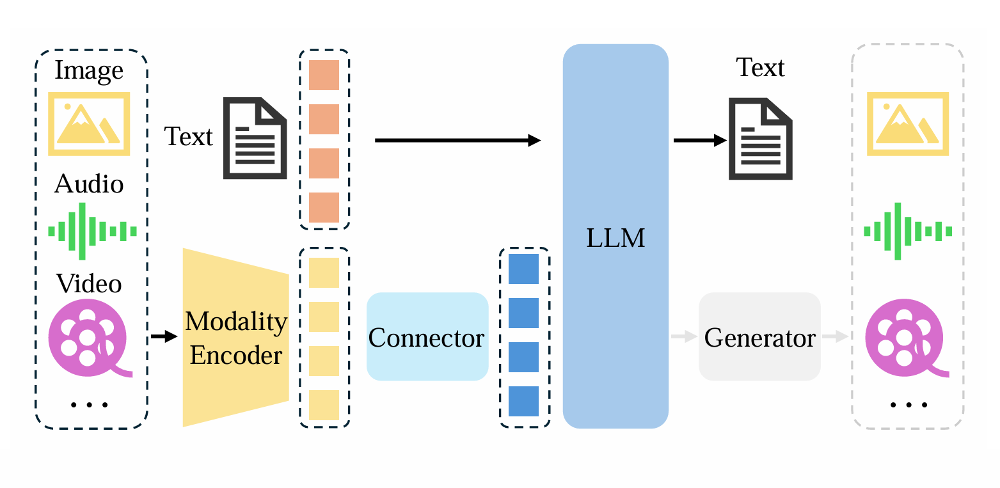
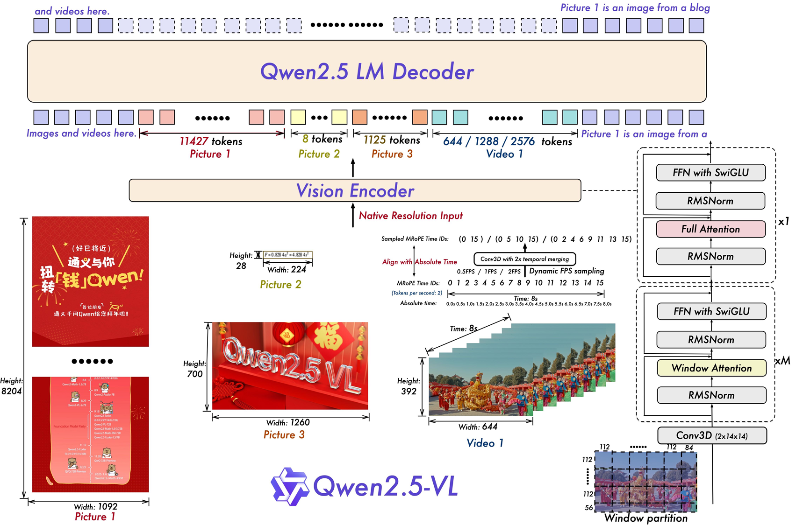
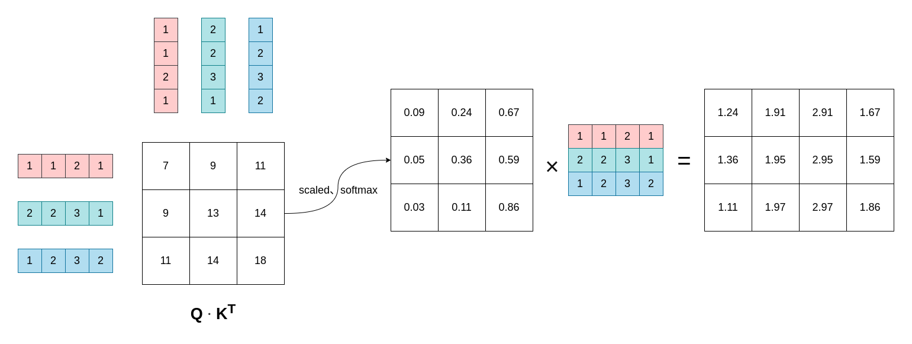
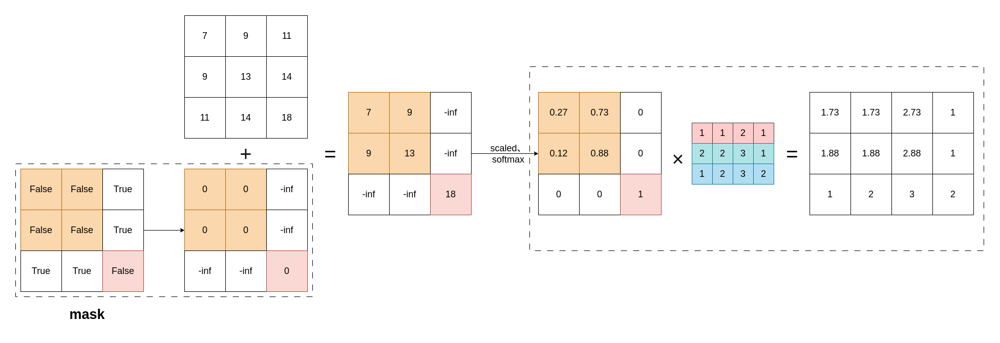
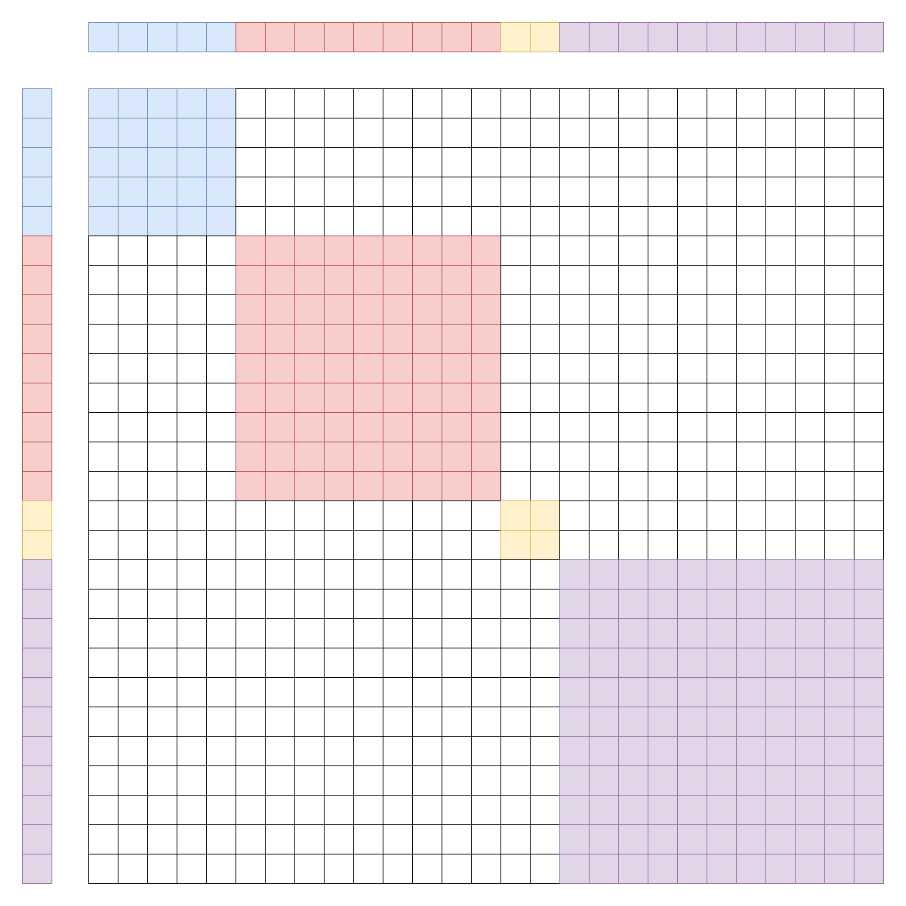
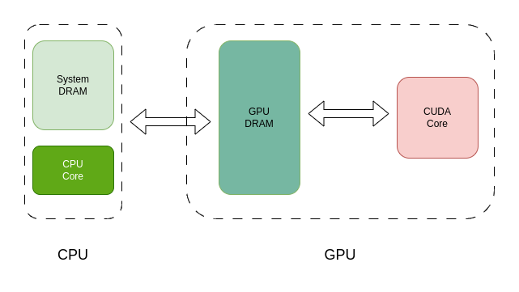
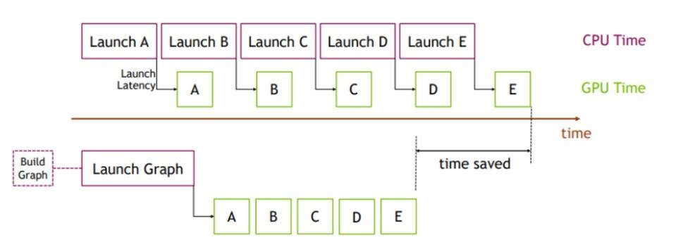

# qwen2.5-vl模型分享内容

论文地址：https://arxiv.org/abs/2502.13923

github：https://github.com/QwenLM/Qwen2.5-VL

官方blog：https://qwenlm.github.io/zh/blog/qwen2.5-vl/

有个sglang代码阅读参考挺不错的：https://github.com/zhaochenyang20/Awesome-ML-SYS-Tutorial/tree/main/sglang/code-walk-through

# 多模态介绍

多模态一篇综述：https://arxiv.org/abs/2306.13549



- **分词+Embedding**：文本分词，把一段文本切分成模型能够处理的token或子词的过程，通常会使用`BPE`或`WordPiece`的分词算法；Embedding将token或子词用映射到多维空间中的向量表示，用以捕捉语义含义。

- **模态编码器（Modality Encoder）**：类似人类的接收和处理光学/声学信号的感官，将图片、音频、视频等特征信息进行提取变成对应空间中的向量表示。

- **特征投影器**（对应图中Connector，直译连接器）：主要作用是**模态对齐**，将模态编码器的特征映射到LLM可理解的表示空间，实现方式包括线性投影`MLP`、`Q-Former`等。

- 模态生成器（Generator）：将LLM主干中的信号标记表示映射为模态生成器可理解的特征，并产生不同模态的输出。

- 大语言模型（LLM）：大语言模型的目的是理解和生成自然语言，通过学习大量的文本数据来预测下一个词或生成与给定文本相关的内容。

其他多模态语言具体结构可以参考下：[千卡并行策略调研](https://mi.feishu.cn/wiki/Cz2BwBGEqi30ZGkPxicczRdence)里面MLLM相关的内容。

# Qwen2.5-VL（与代码结合说明）

**`Qwen2.5-VL`** 是阿里通义千问团队开源的视觉语言模型，具有**3B、7B 和 32B** 等多种不同规模。该模型在多项基准测试中表现出色，尤其在文档和图表理解方面，能够识别常见物体、分析图像中的文本和图表，并具备作为视觉代理的能力。支持视觉理解、长视频处理、结构化输出和设备操作等等。



多模态模型（只输出文本）主要由**视觉编码器（`Vision Encoder`）**、**语言模型（`LM`）**和**多模态融合模块（`Connector`）**三部分构成。`Qwen2.5-VL`并没有很明显的`Connector`划分，仅用一个`MLP`完成特征投影，并归结到`Vision`模块中了。网络结构打印如下：

```Bash
Qwen2_5_VLForConditionalGeneration(
  (visual): Qwen2_5_VisionTransformerPretrainedModel(
    (patch_embed): Qwen2_5_VisionPatchEmbed(
      (proj): Conv3d(3, 1280, kernel_size=(2, 14, 14), stride=(2, 14, 14), bias=False)
    )
    (rotary_pos_emb): Qwen2_5_VisionRotaryEmbedding()
    (blocks): ModuleList(
      (0-31): 32 x Qwen2_5_VLVisionBlock(
        (norm1): Qwen2RMSNorm((1280,), eps=1e-06)
        (norm2): Qwen2RMSNorm((1280,), eps=1e-06)
        (attn): Qwen2_5_VLVisionSdpaAttention(
          (qkv): Linear(in_features=1280, out_features=3840, bias=True)
          (proj): Linear(in_features=1280, out_features=1280, bias=True)
        )
        (mlp): Qwen2_5_VLMLP(
          (gate_proj): Linear(in_features=1280, out_features=3420, bias=True)
          (up_proj): Linear(in_features=1280, out_features=3420, bias=True)
          (down_proj): Linear(in_features=3420, out_features=1280, bias=True)
          (act_fn): SiLU()
        )
      )
    )
    (merger): Qwen2_5_VLPatchMerger(
      (ln_q): Qwen2RMSNorm((1280,), eps=1e-06)
      (mlp): Sequential(
        (0): Linear(in_features=5120, out_features=5120, bias=True)
        (1): GELU(approximate='none')
        (2): Linear(in_features=5120, out_features=3584, bias=True)
      )
    )
  )
  (model): Qwen2_5_VLModel(
    (embed_tokens): Embedding(152064, 3584)
    (layers): ModuleList(
      (0-27): 28 x Qwen2_5_VLDecoderLayer(
        (self_attn): Qwen2_5_VLSdpaAttention(
          (q_proj): Linear(in_features=3584, out_features=3584, bias=True)
          (k_proj): Linear(in_features=3584, out_features=512, bias=True)
          (v_proj): Linear(in_features=3584, out_features=512, bias=True)
          (o_proj): Linear(in_features=3584, out_features=3584, bias=False)
          (rotary_emb): Qwen2_5_VLRotaryEmbedding()
        )
        (mlp): Qwen2MLP(
          (gate_proj): Linear(in_features=3584, out_features=18944, bias=False)
          (up_proj): Linear(in_features=3584, out_features=18944, bias=False)
          (down_proj): Linear(in_features=18944, out_features=3584, bias=False)
          (act_fn): SiLU()
        )
        (input_layernorm): Qwen2RMSNorm((3584,), eps=1e-06)
        (post_attention_layernorm): Qwen2RMSNorm((3584,), eps=1e-06)
      )
    )
    (norm): Qwen2RMSNorm((3584,), eps=1e-06)
    (rotary_emb): Qwen2_5_VLRotaryEmbedding()
  )
  (lm_head): Linear(in_features=3584, out_features=152064, bias=False)
)
```

## 输入信息预处理

在`sglang` 框架中，相关代码逻辑被模块化拆分到多个组件中。为便于理解，这里以 `Hugging Face` 中输入信息预处理作为参考模板，对核心步骤进行整合和说明：

```Bash
from qwen_vl_utils import process_vision_info
from transformers import AutoProcessor, AutoTokenizer

# 读取配置文件信息，使用AutoProcessor加载预训练模型的处理配置，该处理器同时处理文本和视觉数据
processor = AutoProcessor.from_pretrained("Qwen/Qwen2.5-VL-3B-Instruct")

# 定义的一个规范：messages结构遵循视觉语言模型的输入规范，包含角色和混合内容类型
messages = [
    {
        "role": "user",
        "content": [
            {
                "type": "image",
                "image": "https://qianwen-res.oss-cn-beijing.aliyuncs.com/Qwen-VL/assets/demo.jpeg",
            },
            # {"video": video_path, "total_pixels": total_pixels, "min_pixels": min_pixels, "fps": 2.0},
            {"type": "text", "text": "Describe this image."},
        ],
    }
]

# 输入文本被处理成对话模板的样式，其中图片和视频以占位符的形式占用
text = processor.apply_chat_template(
    messages, tokenize=False, add_generation_prompt=True
)
# 将上述messages中的图片信息和视频信息从提取出来，主要有个resize操作
image_inputs, video_inputs = process_vision_info(messages)

# 综合处理文本和视觉输入，生成模型推理所需的完整输入特征
inputs = processor(
    text=[text],
    images=image_inputs,
    videos=video_inputs,
    padding=True,
    return_tensors="pt",
)
```

经过上述处理之后，不同模态的数据会被处理为不同的输入`inputs`表示（这个`inputs`是作为网络模型前向传播的输入）：

```Bash
# 图片
{
    'input_ids': ,  # 唯一标识
    'attention_mask': torch.Tensor,  # attention 掩码
    'pixel_values': torch.Tensor,  # 图像的像素值（切分为patch，并且标准化后的视觉像素特征）
    'image_grid_thw': torch.Tensor   # 图像的空间网格坐标（用于位置编码和窗口注意力）
}

# 视频
{
    'input_ids': ,  # 唯一标识
    'attention_mask': torch.Tensor,  # attention 掩码
    'pixel_values_videos': torch.Tensor,  # 视频的像素值（帧序列的视觉特征）
    'video_grid_thw': torch.Tensor,  # 视频的空间-时间网格坐标
    'second_per_grid_ts':torch.Tensor   # 每个网格对应的时间间隔（用于时序上的位置编码）
}
```


### 以图片为例来说明`sglang`中对应逻辑

1. 代码一

```Bash
text = processor.apply_chat_template(
    messages, tokenize=False, add_generation_prompt=True
)
```

使用 `chat_template.json` 中定义的格式将多轮对话文本整合为统一的输入格式。并在文本中用类似 `<|image_pad|>` 或 `<|video_pad|>` 占位符标记图片或视频的位置。

一张图片的一个例子（`user prompt`）：

`<|im_start|>``user`

`<|vision_start|>``<|image_pad|>``<|vision_end|>``Describe this image.``<|im_end|>`


2. 代码二

```Bash
image_inputs, video_inputs = process_vision_info(messages)
```

读取其中的图片，并且在内部将图片的尺寸调整为**28**的倍数：

- `Qwen-VL`模型结构支持任意尺寸的图片作为输入，但是在后续处理过程中，图片依照 `ViT` 的传统处理方法被划分成一个一个`patch`(配置文件中`patch_size`决定，默认为`14`)

- 为了减少传入`LLM`的`token`数量，网络模型中的`merger`模块会将相邻的 `2*2`个`patch`进行融合（配置文件中`spatial_merge_size`决定，默认为2），融合成一个`token`。

这部分逻辑在`sglang`代码中没有准确的对应关系，但是可以追溯到`python/sglang/srt/managers/image_processor.py`中的`Qwen2_5VLImageProcessor`类中的`process_images_async`方法中。


3. 代码三

```Bash
# 综合处理文本和视觉输入，生成模型推理所需的完整输入特征
inputs = processor(
    text=[text],
    images=image_inputs,
    videos=video_inputs,
    padding=True,
    return_tensors="pt",
)
```

其中主要逻辑对应`sglang`中 `python/sglang/srt/configs/qwen2_5_vl_config.py` 代码中的`Qwen2_5_VLImageProcessor`类中的`_preprocess()`方法：

- 为后续操作方便，将图像数据统一转换为 `numpy array`

- **时间维度扩展**：如果输入是**单帧**图像，则复制 `temporal_patch_size-1` 份（配置文件中默认 `temporal_patch_size=2`），使其变为 `(temporal_patch_size, H, W, C)` 形状。

- **时空分块（`Spatio-Temporal Patch Splitting`）**：按照 `temporal_patch_size=2`（时间块）和 `patch_size=(14,14)`（空间块）切分图像。

- **相邻空间块重排**：根据 `spatial_merge_size=2`（默认值），将**相邻的2×2空间块** 重新排列到相邻空间区域并展平为像素张量，记录时空分块维度信息：通过`pixel_values`记录每个时空块的像素信息，`image_grid_thw` 记录分块维度信息。

此时`pixel_values`是形状为 `(num_patch, 2 * 3* 14* 14)`的像素空间表示，而`image_grid_thw` (`temporal`、`height`、`width`) 记录分块信息，是一个形状为 `(image_num， 3)`的形状。


此时图中对应的表示：

```Bash
# 时空分块维度信息
image_grid_thw =[
        [1, 6, 10]
    ]

# 像素形状表示，一张图片，切分为60个patch的像素表示
pixel_values.shape = (60, 1176) 
```


## 视觉编码器

### 特征提取（3维卷积）

```Python
class Qwen2_5_VisionPatchEmbed(nn.Module):
    def __init__(
        self,
        patch_size: int = 14,
        temporal_patch_size: int = 2,
        in_chans: int = 3,
        embed_dim: int = 1152,
    ) -> None:
        super().__init__()
        self.patch_size = patch_size
        self.temporal_patch_size = temporal_patch_size
        self.embed_dim = embed_dim

        kernel_size = [temporal_patch_size, patch_size, patch_size]
        self.proj = nn.Conv3d(
            in_chans, embed_dim, kernel_size=kernel_size, stride=kernel_size, bias=False
        )

    def forward(self, x: torch.Tensor) -> torch.Tensor:
        L, C = x.shape
        x = x.view(L, -1, self.temporal_patch_size, self.patch_size, self.patch_size)
        x = self.proj(x).view(L, self.embed_dim)
        return x
```

该操作主要是将像素空间表示通过卷积操作提取到相关的特征：

1. 先将原本的`(num_patch, 2 * 3* 14* 14)`的像素空间向量表示还原为`(num_patch, 3，2，14，14)`

2. 通过1280个`(3，2，14，14)`卷积核对每个batch提取1280个特征表示

3. 展平为形状为`(num_patch， 1280)`的向量


### 位置编码（二维旋转位置编码）

位置编码详细细节可以参考：https://zhuanlan.zhihu.com/p/454482273

位置编码是Transformer模型中引入序列位置信息的核心机制。由于Transformer的自注意力机制本身不具备处理序列顺序的能力，位置编码通过将位置信息嵌入到输入特征中，使模型能够感知序列元素的相对或绝对位置。对于`Qwen2.5-vl`模型：

1. 函数为每个空间位置生成行(h)和列(w)的位置索引

2. 对生成的空间索引进行空间重排（之前为了方便merge操作），生成对应关系的`pos_ids`（ 类似图中的`(i,j)`表示），形状为`（num_patch, 2）`

3. 以`pos_ids`查询在旋转向量表对应的旋转向量，然后拼接生成形状为`（num_patch, 40）`位置嵌入向量。（这个40来自于多头注意力机制中的`head_dim=80`，取其一半）


### 窗口注意力机制

引入了窗口注意力机制，且在 ViT 计算中，只有四层是全局注意力层，其余层使用窗口注意力；（全局注意力层由配置文件中`fullatt_block_indexes`决定）


#### 注意力计算逻辑

在开始之前，回顾一下注意力计算逻辑：


注意力计算的核心公式为：

$Attention(Q,K,V)=softmax(\frac{Q \cdot K^T}{\sqrt{d_k}})V$

分步骤来看（多头注意力机制）：

1. 计算注意力分数，形状为 ： `[batch_size, num_heads, seq_len, seq_len]`

    $score(Q, K)=\frac{Q \cdot K^T}{\sqrt{d_k}}$

    

2. 使用 `Softmax` 得到注意力权重

    $Attention(Q, K)=softmax(score(Q, K))=softmax(\frac{Q \cdot K^T}{\sqrt{d_k}})$

    

3. 使用 注意力权重 和 `V`，计算输出输出`output`：

    $output=Attention(Q, K) \cdot V=softmax(\frac{Q \cdot K^T}{\sqrt{d_k}})V$

    

4. 拼接多头输出，并乘以 $W_O$，得到最终输出

    $MultiHeadOutput=Concat(output^1,output^2,... ,output^H)W_O$


简化版过程（无batch，无head，`seq_len=3`,`dim=4`，Q、K、V恒等映射）：




在上述计算注意力权重 $Attention(Q, K)$ 之前，需要注意两点：

1. 计算之前需对Q，K添加之前生成的位置编码

2. 需要通过掩码（mask）来忽略无效或屏蔽不相关的部分，窗口注意力机制就是通过掩码的方式来实现的。


简化版过程（两条无关请求，第一个请求`seq_lens=2`，第二个请求`seq_lens=1`）：



#### 窗口注意力机制的实现

注意，这个生成`mask`过程，存在另一种实现，将多个请求按照最长的`seq_len`添加`padding`然后组成`batch`来计算注意力，这里先不考虑。

在实现过程中，使用`cu_seqlens`生成的掩码（`mask`），这是一个一维向量, 通过**左闭右开**区间表示一个注意力区间，比如当`cu_seqlens=[0,5,14,16,28]`时，计算注意力区域的有4个：`[0,5)`、`[5,14)`、`[14,16)`、`[16,28)`，生成的掩码mask如下（颜色部分为True，其他为False）。



也就是说掩码的生成依靠`cu_seqlens`来实现的，而在`sglang`代码中，`cu_seqlens`的获取以及**窗口空间块逻辑上的重排**实现代码如下：

```Python
def get_window_index(self, grid_thw):
    window_index: list = []
    cu_window_seqlens: list = [0]
    window_index_id = 0
    vit_merger_window_size = (
        self.window_size // self.spatial_merge_size // self.patch_size
    )

    for grid_t, grid_h, grid_w in grid_thw:
        llm_grid_h, llm_grid_w = (
            grid_h // self.spatial_merge_size,
            grid_w // self.spatial_merge_size,
        )
        index = torch.arange(grid_t * llm_grid_h * llm_grid_w).reshape(
            grid_t, llm_grid_h, llm_grid_w
        )
        pad_h = vit_merger_window_size - llm_grid_h % vit_merger_window_size
        pad_w = vit_merger_window_size - llm_grid_w % vit_merger_window_size
        num_windows_h = (llm_grid_h + pad_h) // vit_merger_window_size
        num_windows_w = (llm_grid_w + pad_w) // vit_merger_window_size
        index_padded = F.pad(index, (0, pad_w, 0, pad_h), "constant", -100)
        index_padded = index_padded.reshape(
            grid_t,
            num_windows_h,
            vit_merger_window_size,
            num_windows_w,
            vit_merger_window_size,
        )
        index_padded = index_padded.permute(0, 1, 3, 2, 4).reshape(
            grid_t,
            num_windows_h * num_windows_w,
            vit_merger_window_size,
            vit_merger_window_size,
        )
        seqlens = (index_padded != -100).sum([2, 3]).reshape(-1)
        index_padded = index_padded.reshape(-1)
        index_new = index_padded[index_padded != -100]
        window_index.append(index_new + window_index_id)
        cu_seqlens_tmp = (
            seqlens.cumsum(0) * self.spatial_merge_unit + cu_window_seqlens[-1]
        )
        cu_window_seqlens.extend(cu_seqlens_tmp.tolist())
        window_index_id += (grid_t * llm_grid_h * llm_grid_w).item()
    window_index = torch.cat(window_index, dim=0)

    return window_index, cu_window_seqlens
```

为了方便生成掩码计算窗口注意力机制，这里又对batch的顺序进行了重新排列（该方法中只是逻辑上的重排）：

1. 首先按照相邻`2*2`个`patch`的时空块为一组进行编号

2. 通过`grid_thw`将分块维度`padding`到8的倍数（长宽方向都要），并且将`padding`的时空块块编号设置为-100（这个8的倍数取决于配置文件中窗口的大小：`window_size=112`，`patch_size=14`，所以`112/14=8`）

3. 同一个窗口的时空块（patch）相邻排列，并记录每个窗口的时空块索引信息，保存到`cu_seqlens`中，并且为了将实际特征进行重排，会将相关序号记录在`window_index`中。

在函数返回后根据`window_index`进行**实际的窗口空间块重排**，将对应的patch块重新排列（通过向量高级索引实现的）。


### Patch Merger（Patch 融合）

```Python
class Qwen2_5_VisionPatchMerger(nn.Module):

    def __init__(
        self,
        dim: int,
        context_dim: int,
        spatial_merge_size: int = 2,
        quant_config: Optional[QuantizationConfig] = None,
    ) -> None:
        super().__init__()
        **self.hidden_size = context_dim * (spatial_merge_size**2)**
        self.ln_q = Qwen2RMSNorm(context_dim, eps=1e-6)
        self.mlp = nn.ModuleList(
            [
                ColumnParallelLinear(
                    self.hidden_size,
                    self.hidden_size,
                    bias=True,
                    quant_config=quant_config,
                ),
                nn.GELU(),
                RowParallelLinear(
                    self.hidden_size, dim, bias=True, quant_config=quant_config
                ),
            ]
        )

    def forward(self, x: torch.Tensor) -> torch.Tensor:
        x = self.ln_q(x)
        x = x.view(-1, self.hidden_size)

        mlp_fc1, mlp_act, mlp_fc2 = self.mlp
        x_parallel, _ = mlp_fc1(x)
        x_parallel = mlp_act(x_parallel)
        out, _ = mlp_fc2(x_parallel)
        return out
```

- 通过`view`操作使得每四个token合并到一块（此时的`hidden_size(=5120)`是之前网络结构`hidden_size(=1280)`的四倍。因此按照之前的重组重排，连续四个`patch`是原图片中的相邻`2*2`个`patch`）

- 然后通过`MLP`进行特征融合，输出数量为之前1/4个patch个数的视觉token。


之后会再次重排，将融合后的视觉`token`重新排列成窗口注意力重排之前的顺序。


## 语言模型

与其他语言模型差不多，最大区别就是多了一个**三维位置的绝对时间编码**，即在时间维度上，引入了动态 FPS (每秒帧数)训练和绝对时间编码，将 mRoPE id 直接与时间流速对齐。相比于二维位置编码，就是多了一个时间维度（用**绝对的时间**）表示而已，具体可以参考：https://zhuanlan.zhihu.com/p/454482273


## 梳理汇总

# GPU算子相关

`Application`可以由`C++`（最常用）进行发起的：


- 驱动层API（Driver API）：功能较完整，但是使用复杂。

- 运行时API（CUDA Runtime API）：封装了部分驱动的API，将某些驱动初始化操作隐藏，使用方便。

在`pytorch`中存在几层的调用：

- `python`调用`C++`代码，通过`pybind11`实现

- `C++`调用cuda库使用相关API启动

除此之外，也存在一些开源项目对某些算子的优化包装，如最常见的[cutlass (CUDA Templates for Linear Algebra Subroutines)](https://github.com/NVIDIA/cutlass.git)


由CPU上发起，在GPU上执行的常见CUDA函数名有（调用的是**`CUDA Runtime API`**）：

|函数名称|功能|作用|
|---|---|---|
|`cudaLaunchKernel`|启动核函数|触发GPU执行核函数，传递参数、网格尺寸和块尺寸。|
|`cudaLaunchKernelExC`、<br>`cudaLaunchKernelEx`|扩展版核函数启动（阻塞/非阻塞）|支持更灵活的参数（如流、共享内存等）|
|`cudaMemcpyAsync`|异步内存拷贝|在主机与设备或设备间异步拷贝数据，操作在流中执行。|
|`cudaMalloc`|分配设备内存|在GPU设备上分配内存空间并返回地址。|
|`cudaStreamSynchronize`|流同步|阻塞当前CPU线程，直到指定流中的所有GPU操作完成。|
|`cudaDeviceSynchronize`|全局设备同步|阻塞当前CPU线程，直到所有GPU流中的操作完成。|
|`cudaGraphLaunch`|执行CUDA计算图|启动预先捕获并编译好的计算图，图中操作在GPU上执行。|
|`cudaStreamIsCapturing`|检查流捕获状态|判断流是否处于捕获CUDA计算图（CUDA Graph）的命令状态。|
|`cudaEventRecord`|记录事件|在流中插入事件标记，可用于捕获计算图、时间测量等|

除此之外，还有很多算子，如 `cudaDeviceGetAttribute` (获取设备属性)、`cudaDriverGetVersion`（获取CUDA驱动版本）、`cudaFuncSetAttribute`（设置核函数属性）、通讯`nccl`相关等等。


## 异步调度

https://zhuanlan.zhihu.com/p/462191421


异步调度的本质是：**CPU与GPU可以独立执行各自的任务，无需等待对方完成，从而实现计算与数据传输的并行化**。具体来说：

1. CPU与GPU显存操作的异步性 ：

    - CPU可以通过**异步API**（如`cudaMemcpyAsync`）将数据从系统内存传输到GPU显存，或从显存复制回CPU内存。

    - **传输过程由DMA控制器或GPU硬件自主完成** ，CPU无需等待传输结束即可继续执行其他任务（如计算、数据预处理或I/O操作）。

2. GPU显存与计算单元的异步协作 ：

    - GPU的计算单元（如CUDA Core）在执行计算任务时，可以与**显存的数据预取/加载过程同时进行**。

    - GPU内部的层次化内存（如缓存、共享内存）和多线程调度机制确保计算单元在等待显存数据时，仍能通过切换其他线程或执行预取数据的任务保持高效运行。

3. **CPU与GPU计算任务的并行执行** ：

    - CPU提交计算任务（如Kernel）到GPU后，GPU在后台执行该任务，CPU无需等待GPU完成即可继续执行其他操作 。

    - 通过**流（Stream）机制**，CPU可以同时启动多个任务到不同流中，GPU根据资源情况并行或交错执行这些任务。


从显存的角度来看：



从计算任务派发的角度来看：（参考：[cuda基础之异步启动](https://zhuanlan.zhihu.com/p/667225351)）

CPU只需要提交一个GPU任务即可，无需等待GPU完成，即可继续执行后续任务。但是如果**显式或者隐式**调用同步命令（类似`cudaStreamSynchronize`、`cudaDeviceSynchronize`），cpu就会等待GPU完成计算任务。

`nvidia-smi`命令输出有个关于`Volatile GPU-Util`（GPU利用率）的指标，用于显示过去某一段时间周期内处于计算状态的时间百分比。

- `Utilization` （利用率），指的是 **过去样本期间内某些活动发生的时间百分比。**


## cudaGraph

cuda graph就是为了减少Launch开销：




在`sglangpython/sglang/srt/model_executor/cuda_graph_runner.py`中有关于`cuda graph`和`torch compile`编译优化相关的代码，而对于`cuda graph`的捕获，设计了一个类`CudaGraphRunner`，主要方法：

```Python
class CudaGraphRunner:
    """A CudaGraphRunner runs the forward pass of a model with cuda graph and torch.compile."""
    def __init__(self, model_runner: ModelRunner) # **初始化配置与缓冲区**
    
    # **上下文管理器控制模型捕获模式:在 CUDA Graph 捕获时启用模型的捕获模式（capture_mode=True），捕获结束后恢复原始状态。**
    @contextmanager
    def model_capture_mode(self)
    
    # **判断当前批量是否支持 CUDA Graph**
    def can_run(self, forward_batch: ForwardBatch)
    
    # **批量预捕获 CUDA Graph: 遍历所有 capture_bs，为每个批量大小捕获 CUDA Graph。**
    def capture(self)
    
    # **单个批量的图捕获, 为指定批量 bs 捕获 CUDA Graph，并存储其输出缓冲区。**
    def capture_one_batch_size(self, bs: int, forward: Callable)
    
    # **运行时重放预捕获的 CUDA Graph, 根据当前 forward_batch 选择匹配的预捕获图，并填充输入数据后执行。**
    def replay(self, forward_batch: ForwardBatch)
    
    # **生成推测推理的特殊输入**
    def get_spec_info(self, num_tokens: int)
```

在使用的时候，主要是`python/sglang/srt/model_executor/model_runner.py`中`ModelRunner`类中的`forward`方法逻辑：

```Python
def forward(self, forward_batch: ForwardBatch) -> LogitsProcessorOutput:
    # ：如果模式允许且 cuda graph 已捕捉，调用 CudaGraphRunner.replay 重放图。
    if (
        forward_batch.forward_mode.is_cuda_graph()
        and self.cuda_graph_runner
        and self.cuda_graph_runner.can_run(forward_batch)
    ):
        **return self.cuda_graph_runner.replay(forward_batch)**
    
    # 否则进行判断，看使用哪个前向传播方法
    if forward_batch.forward_mode.is_decode():
        return self.forward_decode(forward_batch)
    elif forward_batch.forward_mode.is_extend():
        return self.forward_extend(forward_batch)
    elif forward_batch.forward_mode.is_idle():
        return self.forward_idle(forward_batch)
    else:
        raise ValueError(f"Invalid forward mode: {forward_batch.forward_mode}")
```

注意，**`CUDA Graph` 的核心要求** ：计算图的结构（包括控制流、张量形状、内存分配等）在捕获（capture）和重放（replay）时必须完全一致。

- **对于语言模型deocde阶段天然适配！！！**


一个明显的使用`cuda graph`和不使用`cuda graph`的对比:**`（59ms-->7ms）`**

|<br>|<br>局部放大：<br>|
|---|---|


## perfetto

这个主要是借助`PyTorch`的`Profiler API`工具，在不修改原始代码的前提下，对正在运行的程序进程进行性能采样。具体来说，需要同时记录CPU的调用栈轨迹和GPU的执行程序（`kernel`）活动数据，并将两者的信息进行关联分析。最终将CPU的调用栈数据以火焰图（`Flame Graph`）的形式可视化，从而**直观展示程序中各函数的调用层级及时间占用情况**。


1. 能够快速理解代码执行轨迹（如执行哪些函数分支）


可以看出在`tokenizer manager`中走的`event_loop_normal`逻辑，其中判断代码逻辑是：

```Python
try:
    scheduler = Scheduler(server_args, port_args, gpu_id, tp_rank, dp_rank)
    pipe_writer.send(
        {
            "status": "ready",
            "max_total_num_tokens": scheduler.max_total_num_tokens,
            "max_req_input_len": scheduler.max_req_input_len,
        }
    )
    if scheduler.enable_overlap:
        scheduler.event_loop_overlap() # 事件循环重叠
    else:
        scheduler.event_loop_normal() # 这个就是不重叠
except Exception:
    traceback = get_exception_traceback()
    logger.error(f"Scheduler hit an exception: {traceback}")
    parent_process.send_signal(signal.SIGQUIT)
```

**事件循环重叠**是指文本`tokenizer`和文本`detokenizer`执行在CPU上，而模型前向传播在GPU上。`qwen2.5-vl`模型如果强制使用`event_loop_normal`会多触发两次`CPU-GPU`内存拷贝：

- 首先从CPU拷贝图片向量数据到GPU进入VIT模型

- VIT生成token后拷贝到CPU上与文本token拼接


2. 在`run_batch`函数执行过程中，ViT模块需要对8个请求进行独立模型推理，而LLM模型则是通过动态批量合并（dynamic batching）实现一次流水线执行。时间耗费在VIT部分很长


3. CPU-GPU隐式同步逻辑：从GPU拷贝到CPU会隐式触发一次同步操作，体现出来就是时间占比很长，需要去同不看GPU上的计算单元


