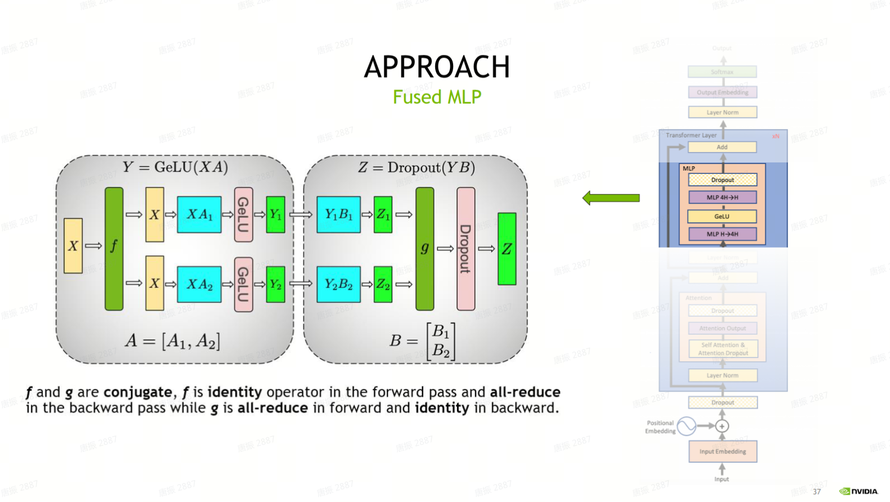

# sglang模型支持过程以及原理

# 如果给了一个网络结构，如何将其适配到`sglang`中

## 模型结构的注册

分析sglang代码发现：在 `python/sglang/srt/models/registry.py` 代码中，这段代码实现了一个模型注册与解析逻辑，主要用于**动态发现、加载和管理不同模型架构**的神经网络模块。

这个单例模型注册实例会将`sglang.srt.models`下面中有`EntryClass`属性的模型结构进行注册。所以如果想要注册新模型，**直接在`python/sglang/srt/models`目录下创建一个模型结构文件，  并且对外暴露`EntryClass`的模型结构名。**

```Python
@dataclass
class _ModelRegistry: **# 这是一个核心管理类，用于维护模型架构名称与对应模型类的映射关系**
    # Keyed by model_arch
    models: Dict[str, Union[Type[nn.Module], str]] = field(default_factory=dict)
    
    # 返回所有已注册的模型架构**名称**集合
    def get_supported_archs(self) -> AbstractSet[str]:
        return self.models.keys()
    
    def _raise_for_unsupported(self, architectures: List[str]):
        ...
    
    # 尝试从注册表中获取指定模型架构的类
    def _try_load_model_cls(self, model_arch: str) -> Optional[Type[nn.Module]]:
        if model_arch not in self.models:
            return None
        return self.models[model_arch]

    
    # 解析模型架构列表，返回第一个成功加载的模型类和对应架构名称
    def resolve_model_cls(
        self,
        architectures: Union[str, List[str]],
    ) -> Tuple[Type[nn.Module], str]:
        architectures = self._normalize_archs(architectures)

        for arch in architectures:
            model_cls = self._try_load_model_cls(arch)
            if model_cls is not None:
                return (model_cls, arch)

        return self._raise_for_unsupported(architectures)


@lru_cache()
def import_model_classes(): # 动态导入指定包中的所有模型模块，并注册模型类
    model_arch_name_to_cls = {}
    package_name = "sglang.srt.models"
    package = importlib.import_module(package_name)
    for _, name, ispkg in pkgutil.iter_modules(package.__path__, package_name + "."):
        if not ispkg:
            try:
                module = importlib.import_module(name)
            except Exception as e:
                logger.warning(f"Ignore import error when loading {name}. " f"{e}")
                continue
            if hasattr(module, "EntryClass"): # 注意，模型定义需要定义 EntryClass
                entry = module.EntryClass
                if isinstance(
                    entry, list
                ):  # To support multiple model classes in one module
                    for tmp in entry:
                        assert (
                            tmp.__name__ not in model_arch_name_to_cls
                        ), f"Duplicated model implementation for {tmp.__name__}"
                        model_arch_name_to_cls[tmp.__name__] = tmp
                else:
                    assert (
                        entry.__name__ not in model_arch_name_to_cls
                    ), f"Duplicated model implementation for {entry.__name__}"
                    model_arch_name_to_cls[entry.__name__] = entry

    return model_arch_name_to_cls


# 全局单例模型注册表，提供模型类解析接口 
ModelRegistry = _ModelRegistry(import_model_classes())
```


## 网络模型结构定义的函数编写

### `__init__()` 方法

主要是模型结构类的`__init__`方法如何编写：初始化模型结构的逻辑代码可以追溯到`python/sglang/srt/model_loader/loader.py`中的`_initialize_model`方法：

其实加载模型用的是model_loader包【python/sglang/srt/model_loader】下面的逻辑：

ModelRunner.__init__() ---> ModelRunner, load_model(self) ---> model_loader.get_model()


```Python
def _initialize_model(
    model_config: ModelConfig,
    load_config: LoadConfig,
) -> nn.Module:
    """Initialize a model with the given configurations."""
    model_class, _ = get_model_architecture(model_config)
    packed_modules_mapping = getattr(model_class, "packed_modules_mapping", {})
    quant_config = _get_quantization_config(
        model_config, load_config, packed_modules_mapping
    )
    return model_class(
        config=model_config.hf_config,
        quant_config=quant_config,
    )
```

主要传入的参数是`config`和`quant_config`，这里查看 `qwen-2.5-vl` 模型的 `__init__()` 方法（所有的`__init__()`方法传入的参数都一样）：

```Python
class Qwen2_5_VLForConditionalGeneration(nn.Module):
    def __init__(
        self,
        config: Qwen2_5_VLConfig,
        quant_config: Optional[QuantizationConfig] = None,
        prefix: str = "",
    ) -> None:
        super().__init__()
        ...

# 对外暴露的模型注册名
EntryClass = [Qwen2_5_VLForConditionalGeneration]
```

- `config`：这个`config`的类型需看`transformer`中是否存在（用的其实就是`HuggingFace`中共的config类，而`PretrainConfig`则是基类），如果不存在，可以直接用`PretrainedConfig`类型（`from transformers import PretrainedConfig`），而且这个`config`一般是读取`huggingface`中的`config.json`并创建的一个配置对象。

- `quant_config`：这个和量化有关，可以直接参考就行。

- `prefix`：这个是用于模型层间的前缀匹配，直接模型“”（空）即可。


### `load_weights()` 方法

除此之外，为了适配加载权重逻辑，需要重写对应的`load_weights`方法，这个逻辑追溯到`python/sglang/srt/model_loader/loader.py`文件中的`DefaultModelLoader`类中的`load_weights_and_postprocess`方法：**通过调用模型对象中的`load_weights` 方法去加载磁盘上的权重**。

```Python
@staticmethod
def load_weights_and_postprocess(model, weights, target_device):
    model.load_weights(weights)

    for _, module in model.named_modules():
        quant_method = getattr(module, "quant_method", None)
        if quant_method is not None:
            # 量化权重相关
            with device_loading_context(module, target_device):
                quant_method.process_weights_after_loading(module)
```

其中，该方法的接口参数是一样的，并且处理逻辑原理都大致相同：

```Python
def load_weights(self, weights: Iterable[Tuple[str, torch.Tensor]]):
    # 获取当前模型结构的名字
    params_dict = dict(self.named_parameters()) 
    # 遍历传入的模型权重，加载到对应的位置
    for name, loaded_weight in weights:
        ... # 这里的逻辑看模型结构定义 和 huggingface中权重名字 来适配 
```


### `forward()` 函数

模型的前向传播调用主要是在`python/sglang/srt/model_executor/model_runner.py`文件中`ModelRunner`类中的`forward`函数（这个实现细节和版本有关，逻辑大体相同，可以深入看下），核心代码于下面相似：

```Python
def forward(self, forward_batch: ForwardBatch) -> LogitsProcessorOutput:
    # ：如果模式允许且 cuda graph 已捕捉，调用 CudaGraphRunner.replay 重放图。
    if (
        forward_batch.forward_mode.is_cuda_graph()
        and self.cuda_graph_runner
        and self.cuda_graph_runner.can_run(forward_batch)
    ):
        return self.cuda_graph_runner.replay(forward_batch)
    
    # 否则进行判断，看使用哪个前向传播方法
    if forward_batch.forward_mode.is_decode():
        return self.forward_decode(forward_batch)
    elif forward_batch.forward_mode.is_extend():
        return self.forward_extend(forward_batch)
    elif forward_batch.forward_mode.is_idle():
        return self.forward_idle(forward_batch)
    else:
        raise ValueError(f"Invalid forward mode: {forward_batch.forward_mode}")
```

这里会根据`forward_mode`类型判断去调取相对应的函数去前向计算（函数里面调模型结构中`forward`逻辑大体是一样），这里参考`forward_decode`逻辑（代码简单，少了很多处理）：

```Python
def forward_decode(
    self, forward_batch: ForwardBatch, pp_proxy_tensors=None
) -> LogitsProcessorOutput:
    self.attn_backend.init_forward_metadata(forward_batch)
    # *FIXME: add pp_proxy_tensors arg to all models*
    kwargs = {}
    if self.support_pp:
        kwargs["pp_proxy_tensors"] = pp_proxy_tensors
    return self.model.forward(
        forward_batch.input_ids, forward_batch.positions, forward_batch, **kwargs
    )
```

传入的参数一般都会有`input_ids`， `positions`，和`forward_batch`（其实在调用的时候`input_ids`和 `positions`也是来自于`forward_batch`）。然后为了更好的适配其他参数，不同模型的`forward`会添加一些默认的其他参数，如：

```Python
def forward(
    self,
    input_ids: torch.Tensor,
    positions: torch.Tensor,
    forward_batch: ForwardBatch,
) -> torch.Tensor:

def forward(
    self,
    input_ids: torch.Tensor,
    positions: torch.Tensor,
    forward_batch: ForwardBatch,
    input_embeds: torch.Tensor = None,
    **kwargs,
) -> torch.Tensor:


def forward(
    self,
    input_ids: torch.Tensor,
    positions: torch.Tensor,
    forward_batch: ForwardBatch,
    **kwargs: Any,
) -> torch.Tensor:


def forward(
    self,
    input_ids: torch.Tensor,
    positions: torch.Tensor,
    forward_batch: ForwardBatch,
    input_embeds: torch.Tensor = None,
    get_embedding: bool = False,
) -> torch.Tensor:
```


### 其他函数（暂时不清楚还需要哪些）


## `sglang`组件的使用

### 模型结构组件

如果要使用sglang来进行推理，那么网络结构的每一层都需要使用`sglang`中的模型结构组件来构建网络模型（在`python/sglang/srt/layers`目录下，包括`Linear`层，`Attention`层的实现组件）。

大部分模型中常用组件有：

- MLP：

    - MergedColumnParallelLinear 和 ColumnParallelLinear

    - RowParallelLinear

- Attention：

    - QKVParallelLinear

    - RowParallelLinear

    - RadixAttention：这个会去调用对应后端的attention的forward计算方式。


以线性层为例，需要自己考虑如何切分（通过使用`ColumnParallelLinear`+`RowParallelLinear`来设计），以GPT2模型为例：

```Python
class GPT2MLP(nn.Module):

    def __init__(
        self,
        intermediate_size: int,
        config: GPT2Config,
        act_layer: Type[nn.Module] = NewGELU,
        quant_config: Optional[QuantizationConfig] = None,
        prefix: str = "",
    ):
        super().__init__()
        hidden_size = config.hidden_size
        self.c_fc = ColumnParallelLinear(
            hidden_size,
            intermediate_size,
            bias=True,
            quant_config=quant_config,
            prefix=add_prefix("c_fc", prefix),
        )
        self.c_proj = RowParallelLinear(
            intermediate_size,
            hidden_size,
            bias=True,
            quant_config=quant_config,
            prefix=add_prefix("c_proj", prefix),
        )
        self.act = act_layer()

    def forward(
        self,
        hidden_states: torch.Tensor,
    ) -> torch.Tensor:
        hidden_states, _ = self.c_fc(hidden_states)
        hidden_states = self.act(hidden_states)
        hidden_states, _ = self.c_proj(hidden_states)
        return hidden_states
```

感觉设计逻辑有点像：




对于attention而言，也是如此：

```Python
class GPT2Attention(nn.Module):

    def __init__(
        self,
        layer_id: int,
        config: GPT2Config,
        quant_config: Optional[QuantizationConfig] = None,
        prefix: str = "",
    ):
        super().__init__()
        self.hidden_size = config.hidden_size
        total_num_heads = config.num_attention_heads
        tensor_model_parallel_world_size = get_tensor_model_parallel_world_size()
        assert total_num_heads % tensor_model_parallel_world_size == 0
        self.num_heads = total_num_heads // tensor_model_parallel_world_size
        self.head_dim = self.hidden_size // total_num_heads
        self.scale = self.head_dim**-0.5

        self.c_attn = QKVParallelLinear(
            self.hidden_size,
            self.head_dim,
            total_num_heads,
            bias=True,
            quant_config=quant_config,
            prefix=add_prefix("c_attn", prefix),
        )
        self.c_proj = RowParallelLinear(
            self.hidden_size,
            self.hidden_size,
            bias=True,
            quant_config=quant_config,
            prefix=add_prefix("c_proj", prefix),
        )
        self.attn = RadixAttention(
            self.num_heads,
            self.head_dim,
            scaling=self.scale,
            num_kv_heads=total_num_heads,
            layer_id=layer_id,
            quant_config=quant_config,
        )

    def forward(
        self,
        hidden_states: torch.Tensor,
        forward_batch: ForwardBatch,
    ) -> torch.Tensor:
        qkv, _ = self.c_attn(hidden_states)
        q, k, v = qkv.chunk(chunks=3, dim=-1)
        attn_output = self.attn(q, k, v, forward_batch)
        attn_output, _ = self.c_proj(attn_output)
        return attn_output
```

设计风格像：


### 分布式环境

追踪代码发现，分布式相关的使用基本在`python/sglang/srt/layers`目录下的模型组件中，但是也有在`python/sglang/srt/models`目录下的使用，如`qwen2.py`、`deepseek_v2.py`等。


`python/sglang/srt/layers`目录下的模型组件中的使用：

```Python
if tp_rank is None:
    tp_rank = get_tensor_model_parallel_rank()
if tp_size is None:
    tp_size = get_tensor_model_parallel_world_size()
```


`deepseek_v2.py`中的使用

```Python
from sglang.srt.layers.dp_attention import (
    get_attention_tp_rank,
    get_attention_tp_size,
    get_local_attention_dp_size,
)

attn_tp_rank = get_attention_tp_rank()
attn_tp_size = get_attention_tp_size()

self.q_proj = ColumnParallelLinear(
    self.hidden_size,
    self.num_heads * self.qk_head_dim,
    bias=False,
    quant_config=quant_config,
    prefix=add_prefix("q_proj", prefix),
    tp_rank=attn_tp_rank,
    tp_size=attn_tp_size,
)
```

这里使用方式感觉差不多。都是**配合已有的模型组件和对应的分布式配置去实现模型的切分**。


### 自定义模型结构组件

主要是linear attention的支持，主要还是在`python/sglang/srt/layers`目录下，其中接口是`python/sglang/srt/layers/attention/base_attn_backend.py`，如果要实现，需要继承这个`AttentionBackend`并重写相对应的前向传播算子调用以及相关KV cache的管理。


其中主要是在forward方法中调用逻辑，会去调用两个抽象接口：

- `forward_decode`：Decode阶段的前向传播调用算子方法

- `forward_extend`：prefill阶段的前向传播调用算子方法

```Python
class AttentionBackend(ABC):
    """The base class of attention backends"""
    def forward_decode(
        self,
        q: torch.Tensor,
        k: torch.Tensor,
        v: torch.Tensor,
        layer: RadixAttention,
        forward_batch: ForwardBatch,
        save_kv_cache: bool = True,
    ):
        """Run a forward for decode."""
        raise NotImplementedError()
    
    def forward_extend(
        self,
        q: torch.Tensor,
        k: torch.Tensor,
        v: torch.Tensor,
        layer: RadixAttention,
        forward_batch: ForwardBatch,
        save_kv_cache: bool = True,
    ):
        """Run a forward for extend."""
        raise NotImplementedError()
```


可以看 `python/sglang/srt/layers/attention/triton_backend.py` 里面的实现，有KVcache相关的管理和使用。而记录 `KV cache` 的和 `ForwardBatch` 类有关。

Kv cache计算相关介绍参考：https://zhuanlan.zhihu.com/p/662498827

sglang适配新backend

- https://aijishu.com/a/1060000000508602

- https://www.cnblogs.com/sunstrikes/p/18891538


# =====sglang之权重加载逻辑===


说到底，其实就是将Hugging Face 中的权重加载到 SGLang 中模型结构中。

为了适配加载权重逻辑，需要重写**模型文件**中对应的`load_weights`方法，这个逻辑追溯到`python/sglang/srt/model_loader/loader.py`文件中的`DefaultModelLoader`类中的`load_weights_and_postprocess`方法：**通过调用模型对象中的`load_weights` 方法去加载磁盘上的权重**。

```Python
@staticmethod
def load_weights_and_postprocess(model, weights, target_device):
    model.load_weights(weights) # 核心，调用的其实是model.py文件中的load_weights方法
    
    for _, module in model.named_modules():
        quant_method = getattr(module, "quant_method", None)
        if quant_method is not None:
            # 量化权重相关
            with device_loading_context(module, target_device):
                quant_method.process_weights_after_loading(module)
```

其中，该方法的接口参数是一样的，并且处理逻辑原理都大致相同：

```Python
def load_weights(self, weights: Iterable[Tuple[str, torch.Tensor]]):
    # 获取当前模型结构的名字
    params_dict = dict(self.named_parameters()) 
    # 遍历传入的模型权重，加载到对应的位置
    for name, loaded_weight in weights:
        ... # 这里的逻辑看模型结构定义 和 huggingface中权重 key 来适配 
```


### 传入的weights是什么？


在 `load_weights` 函数中传入的`weights`参数是一个生成器类型（`Iterable[Tuple[str, torch.Tensor]]`），这个是读取磁盘上的`Hugging Face`权重，并将其赋值给weights，遍历结果如下：（注意，**此时这个权重是在CPU上的**）

```Python
for name, loaded_weight in weights: print(f"{name} --> {loaded_weight.shape} --> {loaded_weight.dtype} --> {loaded_weight.device}")

# 输出结果如下：===>
model.layers.5.block_sparse_moe.experts.2.w1.weight --> torch.Size([9216, 6144]) --> torch.bfloat16 --> cpu
model.layers.5.block_sparse_moe.experts.2.w2.weight --> torch.Size([6144, 9216]) --> torch.bfloat16 --> cpu
model.layers.5.block_sparse_moe.experts.2.w3.weight --> torch.Size([9216, 6144]) --> torch.bfloat16 --> cpu
model.layers.5.block_sparse_moe.experts.3.w1.weight --> torch.Size([9216, 6144]) --> torch.bfloat16 --> cpu
model.layers.5.block_sparse_moe.experts.3.w2.weight --> torch.Size([6144, 9216]) --> torch.bfloat16 --> cpu
model.layers.5.block_sparse_moe.experts.3.w3.weight --> torch.Size([9216, 6144]) --> torch.bfloat16 --> cpu
model.layers.5.block_sparse_moe.experts.4.w1.weight --> torch.Size([9216, 6144]) --> torch.bfloat16 --> cpu
model.layers.5.block_sparse_moe.experts.4.w2.weight --> torch.Size([6144, 9216]) --> torch.bfloat16 --> cpu
model.layers.5.block_sparse_moe.experts.4.w3.weight --> torch.Size([9216, 6144]) --> torch.bfloat16 --> cpu
model.layers.5.block_sparse_moe.experts.5.w1.weight --> torch.Size([9216, 6144]) --> torch.bfloat16 --> cpu
model.layers.5.block_sparse_moe.experts.5.w2.weight --> torch.Size([6144, 9216]) --> torch.bfloat16 --> cpu
model.layers.5.block_sparse_moe.experts.5.w3.weight --> torch.Size([9216, 6144]) --> torch.bfloat16 --> cpu
model.layers.5.block_sparse_moe.experts.6.w1.weight --> torch.Size([9216, 6144]) --> torch.bfloat16 --> cpu
model.layers.5.block_sparse_moe.experts.6.w2.weight --> torch.Size([6144, 9216]) --> torch.bfloat16 --> cpu
model.layers.5.block_sparse_moe.experts.6.w3.weight --> torch.Size([9216, 6144]) --> torch.bfloat16 --> cpu
model.layers.5.block_sparse_moe.experts.7.w1.weight --> torch.Size([9216, 6144]) --> torch.bfloat16 --> cpu
model.layers.5.block_sparse_moe.experts.7.w2.weight --> torch.Size([6144, 9216]) --> torch.bfloat16 --> cpu
model.layers.5.block_sparse_moe.experts.7.w3.weight --> torch.Size([9216, 6144]) --> torch.bfloat16 --> cpu
......
```

注意，

- 这里的 weights 无论并行策略是什么，weights加载的都是整个`Hugging Face`模型的权重，不会切分加载。

- 除此之外，这个weights也没有按照 name 进行排序加载。


### 对于 self.named_parameters() 获取的是什么？


```Python
for name, loaded_weight in params_dict.items(): print(f"{name} --> {loaded_weight.shape} --> {loaded_weight.dtype} --> {loaded_weight.device}")

# 输出结果如下：===>
model.embed_tokens.weight --> torch.Size([200064, 6144]) --> torch.bfloat16 --> cuda:0
model.layers.0.self_attn.qkv_proj.weight --> torch.Size([24576, 6144]) --> torch.bfloat16 --> cuda:0
model.layers.0.self_attn.output_gate.weight --> torch.Size([8192, 6144]) --> torch.bfloat16 --> cuda:0
model.layers.0.self_attn.out_proj.weight --> torch.Size([6144, 8192]) --> torch.bfloat16 --> cuda:0
model.layers.0.self_attn.norm.weight --> torch.Size([8192]) --> torch.bfloat16 --> cuda:0
model.layers.0.block_sparse_moe.gate.weight --> torch.Size([8, 6144]) --> torch.float32 --> cuda:0
model.layers.0.block_sparse_moe.experts.w13_weight --> torch.Size([8, 18432, 6144]) --> torch.bfloat16 --> cuda:0
model.layers.0.block_sparse_moe.experts.w2_weight --> torch.Size([8, 6144, 9216]) --> torch.bfloat16 --> cuda:0
model.layers.0.input_layernorm.weight --> torch.Size([6144]) --> torch.bfloat16 --> cuda:0
model.layers.0.post_attention_layernorm.weight --> torch.Size([6144]) --> torch.bfloat16 --> cuda:0
model.layers.1.self_attn.qkv_proj.weight --> torch.Size([24576, 6144]) --> torch.bfloat16 --> cuda:0
model.layers.1.self_attn.output_gate.weight --> torch.Size([8192, 6144]) --> torch.bfloat16 --> cuda:0
model.layers.1.self_attn.out_proj.weight --> torch.Size([6144, 8192]) --> torch.bfloat16 --> cuda:0
model.layers.1.self_attn.norm.weight --> torch.Size([8192]) --> torch.bfloat16 --> cuda:0
model.layers.1.block_sparse_moe.gate.weight --> torch.Size([8, 6144]) --> torch.float32 --> cuda:0
model.layers.1.block_sparse_moe.experts.w13_weight --> torch.Size([8, 18432, 6144]) --> torch.bfloat16 --> cuda:0
model.layers.1.block_sparse_moe.experts.w2_weight --> torch.Size([8, 6144, 9216]) --> torch.bfloat16 --> cuda:0
model.layers.1.input_layernorm.weight --> torch.Size([6144]) --> torch.bfloat16 --> cuda:0
model.layers.1.post_attention_layernorm.weight --> torch.Size([6144]) --> torch.bfloat16 --> cuda:0
......
```

注意，这里对于`self.named_parameters()`获取的权重会随着不同的并行策略而有所不同，其实也就是获取的某个卡上权重的形状。


## 将weights匹配到sglang中模型结构的权重上

核心逻辑可以简化为：

```Python
param = params_dict[name]
weight_loader = param.weight_loader
weight_loader(param, loaded_weight, shard_id)

param = params_dict[name]
weight_loader = getattr(param, "weight_loader", default_weight_loader)
weight_loader(param, loaded_weight)

```


其实就是需要将传入的 `weights` 中的权重，将其拷贝到 `self.named_parameters()` 权重中。问题就是如何找到对应的权重？以及如何拷贝？


追查代码，拷贝逻辑基本都会回归 `copy_` 方法：

```Python
for name, loaded_weight in params_dict.items(): print(f"{type(name)} --> {type(loaded_weight)} ")
# <class 'str'> --> <class 'torch.nn.parameter.Parameter'> 


for name, loaded_weight in params_dict.items(): print(f"{name} --> {type(loaded_weight)} --> {type(getattr(loaded_weight, 'weight_loader', default_weight_loader))}")

# 其中存在  <class 'method'> 和 <class 'function'>，区别在于function 是独立函数 ，没有与任何对象绑定。 method 是绑定到对象的方法 ，调用时会自动将对象作为第一个参数（通常是 self）传入。
model.layers.0.self_attn.out_proj.weight --> <class 'torch.nn.parameter.Parameter'> --> <class 'method'>
model.layers.0.self_attn.norm.weight --> <class 'torch.nn.parameter.Parameter'> --> <class 'function'>

# 追查代码基本都会回归 copy_ 方法：
param.data.copy_(loaded_weight)
# - param.data：模型参数的底层张量数据（通常是 torch.Tensor）
# - loaded_weight：需要复制进来的张量数据。
# - copy_()：是一个in-place 操作 ，会直接修改 param.data 的内容。
```


## load_weights的整体逻辑


```Python
stacked_params_mapping = [
    # (param_name, shard_name, shard_id)
]

# (param_name, weight_name, expert_id, shard_id)
expert_params_mapping =[...]

params_dict = dict(self.named_parameters())
for name, loaded_weight in weights:
    if [condition]: # 通过condition来对一些权重跳过判断。（pp逻辑，mtp权重，lm_head权重等等） 
        # 如："mtp" in name ， "lm_head.weight" in name 等等
        continue
    
    for param_name, weight_name, shard_id in stacked_params_mapping:
        if ?: 
            continue
        
        ... # 权重对应拷贝
        
        break
    else:
        # ???
    

```

注意：这里的 for 语句结合 continue 以及 break 都还能懂，但是再结合下 else 语句，有点反应不过来，需要注意下。

- `break` 仅跳出当前所在的最内层循环

- 而内层循环的 `break` 与 `else` 对齐，只有在内层循环**未被`break` 提前终止（当内层循环自然结束）**的情况下才会执行 `else` 语句

- `continue` 会跳过当前循环中剩余的代码 ，并直接进入当前循环的下一次迭代 。但**`continue` 不会终止循环**。


```Python
stacked_params_mapping = [3,4,5]

for i in range(10):
    print(f"{i=}")
    if i == 1:
        continue
    
    for j in stacked_params_mapping:
        if not i == j:
            continue
        if j == 3:
            continue

        print(f"执行一：{i=},{j=}")
        break
    else:
        print(f"执行二：{i=},{j=}")           


```


## 量化权重的加载逻辑

### 量化操作

对于语言模型一般会使用 llm-compressor：https://github.com/vllm-project/llm-compressor.git


量化流程参考一个例子（是否需要 `calibration` 校准数据集）：

- 加载模型权重

- 准备 `calibration` 校准数据集

- 定义 recipe 量化策略（一般会制定一些常用的量化 scheme，使用的是compressed_tensors/quantization/quant_scheme.py 文件中的量化策略）


- 执行量化

- 保存权重

保存权重后，除了对weight，以及添加的scale外，会在config.json中添加相关的量化配置文件，这个对于后续 sglang 中初始化以及使用量化权重至关重要。


### sglang初始化和使用量化权重操作


会读取HuggingFace中的config.json然后判断里面的量化配置，其中核心的判断逻辑可以追述到：`python/sglang/srt/model_loader/weight_utils.py`：


```Python
# *TODO(woosuk): Move this to other place.*
def get_quant_config(
    model_config: ModelConfig,
    load_config: LoadConfig,
    packed_modules_mapping: Dict[str, List[str]],
) -> QuantizationConfig:
    quant_cls = get_quantization_config(model_config.quantization)

    # GGUF doesn't have config file
    if model_config.quantization == "gguf":
        return quant_cls.from_config({})

    # Read the quantization config from the HF model config, if available.
    hf_quant_config = getattr(model_config.hf_config, "quantization_config", None)
    # some vision model may keep quantization_config in their text_config
    hf_text_config = getattr(model_config.hf_config, "text_config", None)
    if hf_quant_config is None and hf_text_config is not None:
        hf_quant_config = getattr(hf_text_config, "quantization_config", None)
    if hf_quant_config is None:
        # compressed-tensors uses a compressions_config
        hf_quant_config = getattr(model_config.hf_config, "compression_config", None)
    if hf_quant_config is not None:
        hf_quant_config["packed_modules_mapping"] = packed_modules_mapping
        return quant_cls.from_config(hf_quant_config)

# 其实在上面的逻辑中就判别出来了，如果权重是量化的，根据HuggingFace 中config.json里面的逻辑进行判断，然后找到对应的类
# 先通过 quant_cls 获取已经支持的类的名称，然后再将对应的参数创建对应的对象
# 核心逻辑可以简化为：
#     - quant_cls = get_quantization_config(model_config.quantization)
#     - return quant_cls.from_config(hf_quant_config)


    # In case of bitsandbytes/QLoRA, get quant config from the adapter model.
    if model_config.quantization == "bitsandbytes":
        if (
            not load_config.model_loader_extra_config
            or "qlora_adapter_name_or_path" not in load_config.model_loader_extra_config
        ):
            return quant_cls.from_config({"adapter_name_or_path": ""})
        model_name_or_path = load_config.model_loader_extra_config[
            "qlora_adapter_name_or_path"
        ]

    else:
        model_name_or_path = model_config.model_path
    is_local = os.path.isdir(model_name_or_path)
    if not is_local:
        # Download the config files.
        with get_lock(model_name_or_path, load_config.download_dir):
            hf_folder = snapshot_download(
                model_name_or_path,
                revision=model_config.revision,
                allow_patterns="*.json",
                cache_dir=load_config.download_dir,
                local_files_only=huggingface_hub.constants.HF_HUB_OFFLINE,
                tqdm_class=DisabledTqdm,
            )
    else:
        hf_folder = model_name_or_path

    possible_config_filenames = quant_cls.get_config_filenames()

    # If the quantization config is not found, use the default config.
    if not possible_config_filenames:
        return quant_cls()

    config_files = glob.glob(os.path.join(hf_folder, "*.json"))

    quant_config_files = [
        f for f in config_files if any(f.endswith(x) for x in possible_config_filenames)
    ]
    if len(quant_config_files) == 0:
        raise ValueError(f"Cannot find the config file for {model_config.quantization}")
    if len(quant_config_files) > 1:
        raise ValueError(
            f"Found multiple config files for {model_config.quantization}: "
            f"{quant_config_files}"
        )

    quant_config_file = quant_config_files[0]
    with open(quant_config_file) as f:
        config = json.load(f)

        if model_config.quantization == "bitsandbytes":
            config["adapter_name_or_path"] = model_name_or_path
        elif model_config.quantization == "modelopt":
            if config["producer"]["name"] == "modelopt":
                # (yizhang2077) workaround for nvidia/Llama-4-Maverick-17B-128E-Eagle3
                if config["quantization"]["quant_algo"] is None:
                    if (
                        model_config.hf_config.architectures[0]
                        != "LlamaForCausalLMEagle3"
                    ):
                        raise ValueError(
                            f"Invalid quant_config, quantization method: {model_config.quantization},"
                            f"hf architectures: {model_config.hf_config.architectures[0]}. "
                        )
                    return None
                if "FP4" in config["quantization"]["quant_algo"]:
                    return ModelOptFp4Config.from_config(config)
                else:
                    return quant_cls.from_config(config)
        elif model_config.quantization == "modelopt_fp8":
            if config["producer"]["name"] == "modelopt_fp8":
                return quant_cls.from_config(config)
            else:
                raise ValueError(
                    f"Unsupported quantization config"
                    f" found for {model_config.quantization} in {f}."
                )
        elif model_config.quantization == "w8a8_int8":
            config["packed_modules_mapping"] = packed_modules_mapping

    return quant_cls.from_config(config)
```


然后在初始化sglang模型的时候，有个quant_config配置，这个好像对于当前层是否量化有关，如果直接设置为None，那么该模块的weight就不会去量化，//todo 具体逻辑可以追踪下

> 权重加载 --> quantization根据config.json中的名字，确定如何创建 quant_config对象【这里以 python/sglang/srt/layers/quantization/fp8.py 目录下的 Fp8Config为例，注意config.json中对于传入参数的写法】
> 
> - 重点关注 get_quant_method 方法，其中会涉及到如何初始化对应的 Layer 方法【 python/sglang/srt/layers/linear.py 文件中的 self.quant_method.create_weights... 】
> 
>     - 关于self.quant_method
> 
>         ```Python
>         if quant_config is None:
>             self.quant_method: Optional[QuantizeMethodBase] = UnquantizedLinearMethod()
>         else:
>             self.quant_method = quant_config.get_quant_method(self, prefix=prefix)
>         ```
> 
>     
> 
> 


关于 QuantizeMethodBase 基类：

```Python
class QuantizeMethodBase(ABC):
    """Base class for different quantized methods."""

    @abstractmethod
    def create_weights( # 创建权重，通过PyTorch 中的 register_parameter 方法将将自定义的参数显式绑定到模块
        self, layer: torch.nn.Module, *weight_args, **extra_weight_attrs
    ):
        """Create weights for a layer.

        The weights will be set as attributes of the layer."""
        raise NotImplementedError()
    
    # 这个apply方法会在 python/sglang/srt/layers/linear.py 中的 forward 中调用，所以这里一般会实现对应的前向计算逻辑
    @abstractmethod
    def apply(self, layer: torch.nn.Module, *args, **kwargs) -> torch.Tensor:
        """Apply the weights in layer to the input tensor.

        Expects create_weights to have been called before on the layer."""
        raise NotImplementedError()

    # 这个会在 python/sglang/srt/model_loader/loader.py 中调用
    def process_weights_after_loading(self, layer: nn.Module) -> None:
        """Process the weight after loading.

        This can be used for example, to transpose weights for computation.
        """
        return
```

在 PyTorch 中，`register_parameter` 的作用是将自定义的参数（如权重 `weight`）显式绑定到模块（`layer`）中，使其具备以下功能：

1. **被优化器跟踪** ：注册后，该参数会出现在 `layer.parameters()` 列表中，优化器（如 SGD、Adam）会自动管理其梯度更新。

2. **参与模型保存/加载** ：注册的参数会通过 `state_dict()` 保存到磁盘，并在加载模型时恢复。

3. **自动设备管理** ：当模块移动到 GPU（如 `layer.to("cuda")`）或切换精度（如 `layer.half()`）时，注册的参数也会同步处理。

4. **显式命名** ：参数通过名称（如 `"weight"`）绑定到模块，便于后续访问和调试（如 `layer.weight`）。

### **显式注册 vs 隐式注册**

- 隐式注册 ：直接赋值时（如 `self.weight = weight`），PyTorch 会自动注册 `nn.Parameter` 类型的参数。

- 显式注册 ：当参数未直接赋值给模块属性（例如通过字典、列表管理参数）或需要特殊逻辑时，需手动调用 `register_parameter`。


# Deepep 

日志：

```Python
shared_output = None
print(f"[tz][before dispatch]==>  {hidden_states.shape=} ,{hidden_states.dtype=} "
      f" {topk_idx.shape=}, {topk_idx.dtype=},"
      f" {topk_weights.shape=} , {topk_weights.dtype=}", flush=True)
dispatch_output = experts.dispatch(
    hidden_states, topk_idx, topk_weights, forward_batch
)
from sglang.srt.layers.moe.token_dispatcher import  DeepEPLLOutput

if isinstance(dispatch_output,DeepEPLLOutput):
    print(f"[tz][after dispatch]==>  {type(dispatch_output) = },"
      f" {len(dispatch_output.hidden_states_fp8)=} ,{dispatch_output.hidden_states_fp8[0].shape=}", flush=True)
else:
    print(f"[tz][after dispatch]==>  {type(dispatch_output) = },"
          f" {len(dispatch_output.hidden_states)=} ,{dispatch_output.hidden_states[0].shape=}", flush=True)

combine_overlap_args, down_gemm_overlap_args, meta_overlap_args = (
    _compute_overlap_args(dispatch_output, alt_stream)
)

print(f"[tz]=====================>   {type(experts.w13_weight_fp8)} , {len(experts.w13_weight_fp8)}, {experts.w13_weight_fp8[0].dtype}, {experts.w13_weight_fp8[0].shape}",flush=True)
hidden_states = experts.moe_impl(
    dispatch_output, down_gemm_overlap_args=down_gemm_overlap_args
)


print(f"[tz][after moe_impl]==>  {type(hidden_states)=},{hidden_states.shape=} ,{hidden_states.dtype=} ", flush=True)
```


```Go
[tz][before dispatch]==>  hidden_states.shape=torch.Size([12, 7168]) ,hidden_states.dtype=torch.bfloat16  topk_idx.shape=torch.Size([12, 8]), topk_idx.dtype=torch.int64, topk_weights.shape=torch.Size([12, 8]) , topk_weights.dtype=torch.float32
[tz][before dispatch]==>  hidden_states.shape=torch.Size([12, 7168]) ,hidden_states.dtype=torch.bfloat16  topk_idx.shape=torch.Size([12, 8]), topk_idx.dtype=torch.int64, topk_weights.shape=torch.Size([12, 8]) , topk_weights.dtype=torch.float32
[tz][before dispatch]==>  hidden_states.shape=torch.Size([12, 7168]) ,hidden_states.dtype=torch.bfloat16  topk_idx.shape=torch.Size([12, 8]), topk_idx.dtype=torch.int64, topk_weights.shape=torch.Size([12, 8]) , topk_weights.dtype=torch.float32
[tz][before dispatch]==>  hidden_states.shape=torch.Size([12, 7168]) ,hidden_states.dtype=torch.bfloat16  topk_idx.shape=torch.Size([12, 8]), topk_idx.dtype=torch.int64, topk_weights.shape=torch.Size([12, 8]) , topk_weights.dtype=torch.float32
[tz][before dispatch]==>  hidden_states.shape=torch.Size([12, 7168]) ,hidden_states.dtype=torch.bfloat16  topk_idx.shape=torch.Size([12, 8]), topk_idx.dtype=torch.int64, topk_weights.shape=torch.Size([12, 8]) , topk_weights.dtype=torch.float32
[tz][before dispatch]==>  hidden_states.shape=torch.Size([12, 7168]) ,hidden_states.dtype=torch.bfloat16  topk_idx.shape=torch.Size([12, 8]), topk_idx.dtype=torch.int64, topk_weights.shape=torch.Size([12, 8]) , topk_weights.dtype=torch.float32
[tz][after dispatch]==>  type(dispatch_output) = <class 'sglang.srt.layers.moe.token_dispatcher.deepep.DeepEPLLOutput'>, len(dispatch_output.hidden_states_fp8)=2 ,dispatch_output.hidden_states_fp8[0].shape=torch.Size([32, 1024, 7168])
[tz][after dispatch]==>  type(dispatch_output) = <class 'sglang.srt.layers.moe.token_dispatcher.deepep.DeepEPLLOutput'>, len(dispatch_output.hidden_states_fp8)=2 ,dispatch_output.hidden_states_fp8[0].shape=torch.Size([32, 1024, 7168])
[tz][after dispatch]==>  type(dispatch_output) = <class 'sglang.srt.layers.moe.token_dispatcher.deepep.DeepEPLLOutput'>, len(dispatch_output.hidden_states_fp8)=2 ,dispatch_output.hidden_states_fp8[0].shape=torch.Size([32, 1024, 7168])
[tz][after dispatch]==>  type(dispatch_output) = <class 'sglang.srt.layers.moe.token_dispatcher.deepep.DeepEPLLOutput'>, len(dispatch_output.hidden_states_fp8)=2 ,dispatch_output.hidden_states_fp8[0].shape=torch.Size([32, 1024, 7168])
[tz][after dispatch]==>  type(dispatch_output) = <class 'sglang.srt.layers.moe.token_dispatcher.deepep.DeepEPLLOutput'>, len(dispatch_output.hidden_states_fp8)=2 ,dispatch_output.hidden_states_fp8[0].shape=torch.Size([32, 1024, 7168])
[tz][after dispatch]==>  type(dispatch_output) = <class 'sglang.srt.layers.moe.token_dispatcher.deepep.DeepEPLLOutput'>, len(dispatch_output.hidden_states_fp8)=2 ,dispatch_output.hidden_states_fp8[0].shape=torch.Size([32, 1024, 7168])

[tz]=====================>   <class 'tuple'> , 2, torch.float8_e4m3fn, torch.Size([32, 4096, 7168])
[tz]=====================>   <class 'tuple'> , 2, torch.float8_e4m3fn, torch.Size([32, 4096, 7168])

[tz][after moe_impl]==>  type(hidden_states)=<class 'torch.Tensor'>,hidden_states.shape=torch.Size([32, 1024, 7168]) ,hidden_states.dtype=torch.bfloat16 
[tz][after moe_impl]==>  type(hidden_states)=<class 'torch.Tensor'>,hidden_states.shape=torch.Size([32, 1024, 7168]) ,hidden_states.dtype=torch.bfloat16 
[tz][after moe_impl]==>  type(hidden_states)=<class 'torch.Tensor'>,hidden_states.shape=torch.Size([32, 1024, 7168]) ,hidden_states.dtype=torch.bfloat16 
[tz][after moe_impl]==>  type(hidden_states)=<class 'torch.Tensor'>,hidden_states.shape=torch.Size([32, 1024, 7168]) ,hidden_states.dtype=torch.bfloat16 
[tz][after moe_impl]==>  type(hidden_states)=<class 'torch.Tensor'>,hidden_states.shape=torch.Size([32, 1024, 7168]) ,hidden_states.dtype=torch.bfloat16 
[tz][after moe_impl]==>  type(hidden_states)=<class 'torch.Tensor'>,hidden_states.shape=torch.Size([32, 1024, 7168]) ,hidden_states.dtype=torch.bfloat16 


[tz][before dispatch]==>  hidden_states.shape=torch.Size([1, 7168]) ,hidden_states.dtype=torch.bfloat16  topk_idx.shape=torch.Size([1, 8]), topk_idx.dtype=torch.int64, topk_weights.shape=torch.Size([1, 8]) , topk_weights.dtype=torch.float32
[tz][before dispatch]==>  hidden_states.shape=torch.Size([1, 7168]) ,hidden_states.dtype=torch.bfloat16  topk_idx.shape=torch.Size([1, 8]), topk_idx.dtype=torch.int64, topk_weights.shape=torch.Size([1, 8]) , topk_weights.dtype=torch.float32
[tz][before dispatch]==>  hidden_states.shape=torch.Size([1, 7168]) ,hidden_states.dtype=torch.bfloat16  topk_idx.shape=torch.Size([1, 8]), topk_idx.dtype=torch.int64, topk_weights.shape=torch.Size([1, 8]) , topk_weights.dtype=torch.float32
[tz][before dispatch]==>  hidden_states.shape=torch.Size([1, 7168]) ,hidden_states.dtype=torch.bfloat16  topk_idx.shape=torch.Size([1, 8]), topk_idx.dtype=torch.int64, topk_weights.shape=torch.Size([1, 8]) , topk_weights.dtype=torch.float32
[tz][before dispatch]==>  hidden_states.shape=torch.Size([1, 7168]) ,hidden_states.dtype=torch.bfloat16  topk_idx.shape=torch.Size([1, 8]), topk_idx.dtype=torch.int64, topk_weights.shape=torch.Size([1, 8]) , topk_weights.dtype=torch.float32
[tz][before dispatch]==>  hidden_states.shape=torch.Size([1, 7168]) ,hidden_states.dtype=torch.bfloat16  topk_idx.shape=torch.Size([1, 8]), topk_idx.dtype=torch.int64, topk_weights.shape=torch.Size([1, 8]) , topk_weights.dtype=torch.float32
[tz][before dispatch]==>  hidden_states.shape=torch.Size([1, 7168]) ,hidden_states.dtype=torch.bfloat16  topk_idx.shape=torch.Size([1, 8]), topk_idx.dtype=torch.int64, topk_weights.shape=torch.Size([1, 8]) , topk_weights.dtype=torch.float32
[tz][before dispatch]==>  hidden_states.shape=torch.Size([1, 7168]) ,hidden_states.dtype=torch.bfloat16  topk_idx.shape=torch.Size([1, 8]), topk_idx.dtype=torch.int64, topk_weights.shape=torch.Size([1, 8]) , topk_weights.dtype=torch.float32
[tz][after dispatch]==>  type(dispatch_output) = <class 'sglang.srt.layers.moe.token_dispatcher.deepep.DeepEPNormalOutput'>, len(dispatch_output.hidden_states)=2 ,dispatch_output.hidden_states[0].shape=torch.Size([1, 7168])
[tz][after dispatch]==>  type(dispatch_output) = <class 'sglang.srt.layers.moe.token_dispatcher.deepep.DeepEPNormalOutput'>, len(dispatch_output.hidden_states)=2 ,dispatch_output.hidden_states[0].shape=torch.Size([3, 7168])
[tz][after dispatch]==>  type(dispatch_output) = <class 'sglang.srt.layers.moe.token_dispatcher.deepep.DeepEPNormalOutput'>, len(dispatch_output.hidden_states)=2 ,dispatch_output.hidden_states[0].shape=torch.Size([5, 7168])
[tz][after dispatch]==>  type(dispatch_output) = <class 'sglang.srt.layers.moe.token_dispatcher.deepep.DeepEPNormalOutput'>, len(dispatch_output.hidden_states)=2 ,dispatch_output.hidden_states[0].shape=torch.Size([7, 7168])
[tz][after dispatch]==>  type(dispatch_output) = <class 'sglang.srt.layers.moe.token_dispatcher.deepep.DeepEPNormalOutput'>, len(dispatch_output.hidden_states)=2 ,dispatch_output.hidden_states[0].shape=torch.Size([7, 7168])
[tz][after dispatch]==>  type(dispatch_output) = <class 'sglang.srt.layers.moe.token_dispatcher.deepep.DeepEPNormalOutput'>, len(dispatch_output.hidden_states)=2 ,dispatch_output.hidden_states[0].shape=torch.Size([1, 7168])
[tz][after dispatch]==>  type(dispatch_output) = <class 'sglang.srt.layers.moe.token_dispatcher.deepep.DeepEPNormalOutput'>, len(dispatch_output.hidden_states)=2 ,dispatch_output.hidden_states[0].shape=torch.Size([5, 7168])
[tz][after dispatch]==>  type(dispatch_output) = <class 'sglang.srt.layers.moe.token_dispatcher.deepep.DeepEPNormalOutput'>, len(dispatch_output.hidden_states)=2 ,dispatch_output.hidden_states[0].shape=torch.Size([3, 7168])
[tz][after moe_impl]==>  type(hidden_states)=<class 'torch.Tensor'>,hidden_states.shape=torch.Size([7, 7168]) ,hidden_states.dtype=torch.bfloat16 
[tz][after moe_impl]==>  type(hidden_states)=<class 'torch.Tensor'>,hidden_states.shape=torch.Size([1, 7168]) ,hidden_states.dtype=torch.bfloat16 
[tz][after moe_impl]==>  type(hidden_states)=<class 'torch.Tensor'>,hidden_states.shape=torch.Size([3, 7168]) ,hidden_states.dtype=torch.bfloat16 
[tz][after moe_impl]==>  type(hidden_states)=<class 'torch.Tensor'>,hidden_states.shape=torch.Size([5, 7168]) ,hidden_states.dtype=torch.bfloat16 
[tz][after moe_impl]==>  type(hidden_states)=<class 'torch.Tensor'>,hidden_states.shape=torch.Size([5, 7168]) ,hidden_states.dtype=torch.bfloat16 
[tz][after moe_impl]==>  type(hidden_states)=<class 'torch.Tensor'>,hidden_states.shape=torch.Size([1, 7168]) ,hidden_states.dtype=torch.bfloat16 
[tz][after moe_impl]==>  type(hidden_states)=<class 'torch.Tensor'>,hidden_states.shape=torch.Size([3, 7168]) ,hidden_states.dtype=torch.bfloat16 
[tz][after moe_impl]==>  type(hidden_states)=<class 'torch.Tensor'>,hidden_states.shape=torch.Size([7, 7168]) ,hidden_states.dtype=torch.bfloat16 


Python
[tz][before dispatch]==>  hidden_states.shape=torch.Size([12, 4096]) ,hidden_states.dtype=torch.bfloat16  topk_idx.shape=torch.Size([12, 8]), topk_idx.dtype=torch.int64, topk_weights.shape=torch.Size([12, 8]) , topk_weights.dtype=torch.float32
[tz][before dispatch]==>  hidden_states.shape=torch.Size([12, 4096]) ,hidden_states.dtype=torch.bfloat16  topk_idx.shape=torch.Size([12, 8]), topk_idx.dtype=torch.int64, topk_weights.shape=torch.Size([12, 8]) , topk_weights.dtype=torch.float32

[tz][after dispatch]==>  type(dispatch_output) = <class 'sglang.srt.layers.moe.token_dispatcher.deepep.DeepEPLLOutput'>, len(dispatch_output.hidden_states_fp8)=2 ,dispatch_output.hidden_states_fp8[0].shape=torch.Size([32, 1024, 4096])
[tz][after dispatch]==>  type(dispatch_output) = <class 'sglang.srt.layers.moe.token_dispatcher.deepep.DeepEPLLOutput'>, len(dispatch_output.hidden_states_fp8)=2 ,dispatch_output.hidden_states_fp8[0].shape=torch.Size([32, 1024, 4096])

[tz]=====================>   <class 'tuple'> , 2, torch.bfloat16, torch.Size([32, 4096, 4096])
[tz]=====================>   <class 'tuple'> , 2, torch.bfloat16, torch.Size([32, 4096, 4096])

[2025-11-06 13:55:58 TP7 EP7] Scheduler hit an exception: Traceback (most recent call last):
  File "/sgl-workspace/sglang/python/sglang/srt/model_executor/cuda_graph_runner.py", line 366, in __init__
    self.capture()
  File "/sgl-workspace/sglang/python/sglang/srt/model_executor/cuda_graph_runner.py", line 485, in capture
    ) = self.capture_one_batch_size(bs, forward)
        ^^^^^^^^^^^^^^^^^^^^^^^^^^^^^^^^^^^^^^^^
  File "/sgl-workspace/sglang/python/sglang/srt/model_executor/cuda_graph_runner.py", line 661, in capture_one_batch_size
    run_once()
  File "/sgl-workspace/sglang/python/sglang/srt/model_executor/cuda_graph_runner.py", line 650, in run_once
    logits_output_or_pp_proxy_tensors = forward(
                                        ^^^^^^^^
  File "/usr/local/lib/python3.12/dist-packages/torch/utils/_contextlib.py", line 120, in decorate_context
    return func(*args, **kwargs)
           ^^^^^^^^^^^^^^^^^^^^^
  File "/sgl-workspace/sglang/python/sglang/srt/models/hybrid_swa_compress.py", line 824, in forward
    hidden_states = self.model(
                    ^^^^^^^^^^^
  File "/usr/local/lib/python3.12/dist-packages/torch/nn/modules/module.py", line 1773, in _wrapped_call_impl
    return self._call_impl(*args, **kwargs)
           ^^^^^^^^^^^^^^^^^^^^^^^^^^^^^^^^
  File "/usr/local/lib/python3.12/dist-packages/torch/nn/modules/module.py", line 1784, in _call_impl
    return forward_call(*args, **kwargs)
           ^^^^^^^^^^^^^^^^^^^^^^^^^^^^^
  File "/sgl-workspace/sglang/python/sglang/srt/models/hybrid_swa_compress.py", line 690, in forward
    hidden_states, residual = layer(
                              ^^^^^^
  File "/usr/local/lib/python3.12/dist-packages/torch/nn/modules/module.py", line 1773, in _wrapped_call_impl
    return self._call_impl(*args, **kwargs)
           ^^^^^^^^^^^^^^^^^^^^^^^^^^^^^^^^
  File "/usr/local/lib/python3.12/dist-packages/torch/nn/modules/module.py", line 1784, in _call_impl
    return forward_call(*args, **kwargs)
           ^^^^^^^^^^^^^^^^^^^^^^^^^^^^^
  File "/sgl-workspace/sglang/python/sglang/srt/models/hybrid_swa_compress.py", line 601, in forward
    hidden_states = self.mlp(hidden_states, forward_batch)
                    ^^^^^^^^^^^^^^^^^^^^^^^^^^^^^^^^^^^^^^
  File "/usr/local/lib/python3.12/dist-packages/torch/nn/modules/module.py", line 1773, in _wrapped_call_impl
    return self._call_impl(*args, **kwargs)
           ^^^^^^^^^^^^^^^^^^^^^^^^^^^^^^^^
  File "/usr/local/lib/python3.12/dist-packages/torch/nn/modules/module.py", line 1784, in _call_impl
    return forward_call(*args, **kwargs)
           ^^^^^^^^^^^^^^^^^^^^^^^^^^^^^
  File "/sgl-workspace/sglang/python/sglang/srt/models/hybrid_swa_compress.py", line 292, in forward
    return self.forward_deepep(hidden_states, forward_batch)
           ^^^^^^^^^^^^^^^^^^^^^^^^^^^^^^^^^^^^^^^^^^^^^^^^^
  File "/sgl-workspace/sglang/python/sglang/srt/models/hybrid_swa_compress.py", line 335, in forward_deepep
    final_hidden_states, sbo_shared_output = single_batch_overlap.execute_sbo(
                                             ^^^^^^^^^^^^^^^^^^^^^^^^^^^^^^^^^
  File "/sgl-workspace/sglang/python/sglang/srt/single_batch_overlap.py", line 88, in execute_sbo
    hidden_states = experts.moe_impl(
                    ^^^^^^^^^^^^^^^^^
  File "/sgl-workspace/sglang/python/sglang/srt/layers/moe/ep_moe/layer.py", line 229, in moe_impl
    return self.forward_deepgemm_masked(dispatch_output)
           ^^^^^^^^^^^^^^^^^^^^^^^^^^^^^^^^^^^^^^^^^^^^^
  File "/sgl-workspace/sglang/python/sglang/srt/layers/moe/ep_moe/layer.py", line 475, in forward_deepgemm_masked
    deep_gemm_wrapper.grouped_gemm_nt_f8f8bf16_masked(
  File "/sgl-workspace/sglang/python/sglang/srt/layers/quantization/deep_gemm_wrapper/entrypoint.py", line 43, in grouped_gemm_nt_f8f8bf16_masked
    deep_gemm.fp8_m_grouped_gemm_nt_masked(
  File "/usr/local/lib/python3.12/dist-packages/deep_gemm/__init__.py", line 50, in _fn
    return func(*args, **kwargs)
           ^^^^^^^^^^^^^^^^^^^^^
  File "/usr/local/lib/python3.12/dist-packages/torch/_ops.py", line 1243, in __call__
    return self._op(*args, **kwargs)
           ^^^^^^^^^^^^^^^^^^^^^^^^^
RuntimeError: Assertion error (/sgl-kernel/build/_deps/repo-deepgemm-src/csrc/apis/gemm.hpp:201): b.first.scalar_type() == torch::kFloat8_e4m3fn


SQL
params_dict.keys()=dict_keys(['model.embed_tokens.weight', 'model.layers.0.self_attn.qkv_proj.weight', 'model.layers.0.self_attn.o_proj.weight', 'model.layers.0.mlp.gate_up_proj.weight', 'model.layers.0.mlp.down_proj.weight', 'model.layers.0.input_layernorm.weight', 'model.layers.0.post_attention_layernorm.weight', 'model.layers.1.self_attn.attention_sink_bias', 'model.layers.1.self_attn.qkv_proj.weight', 'model.layers.1.self_attn.o_proj.weight', 'model.layers.1.mlp.gate.weight', 'model.layers.1.mlp.gate.e_score_correction_bias', 'model.layers.1.mlp.experts.w13_weight', 'model.layers.1.mlp.experts.w2_weight', 'model.layers.1.input_layernorm.weight', 'model.layers.1.post_attention_layernorm.weight', 'model.layers.2.self_attn.attention_sink_bias', 'model.layers.2.self_attn.qkv_proj.weight', 'model.layers.2.self_attn.o_proj.weight', 'model.layers.2.mlp.gate.weight', 'model.layers.2.mlp.gate.e_score_correction_bias', 'model.layers.2.mlp.experts.w13_weight', 'model.layers.2.mlp.experts.w2_weight', 'model.layers.2.input_layernorm.weight', 'model.layers.2.post_attention_layernorm.weight', 'model.layers.3.self_attn.attention_sink_bias', 'model.layers.3.self_attn.qkv_proj.weight', 'model.layers.3.self_attn.o_proj.weight', 'model.layers.3.mlp.gate.weight', 'model.layers.3.mlp.gate.e_score_correction_bias', 'model.layers.3.mlp.experts.w13_weight', 'model.layers.3.mlp.experts.w2_weight', 'model.layers.3.input_layernorm.weight', 'model.layers.3.post_attention_layernorm.weight', 'model.layers.4.self_attn.attention_sink_bias', 'model.layers.4.self_attn.qkv_proj.weight', 'model.layers.4.self_attn.o_proj.weight', 'model.layers.4.mlp.gate.weight', 'model.layers.4.mlp.gate.e_score_correction_bias', 'model.layers.4.mlp.experts.w13_weight', 'model.layers.4.mlp.experts.w2_weight', 'model.layers.4.input_layernorm.weight', 'model.layers.4.post_attention_layernorm.weight', 'model.layers.5.self_attn.qkv_proj.weight', 'model.layers.5.self_attn.o_proj.weight', 'model.layers.5.mlp.gate.weight', 'model.layers.5.mlp.gate.e_score_correction_bias', 'model.layers.5.mlp.experts.w13_weight', 'model.layers.5.mlp.experts.w2_weight', 'model.layers.5.input_layernorm.weight', 'model.layers.5.post_attention_layernorm.weight', 'model.norm.weight', 'lm_head.weight'])
```
