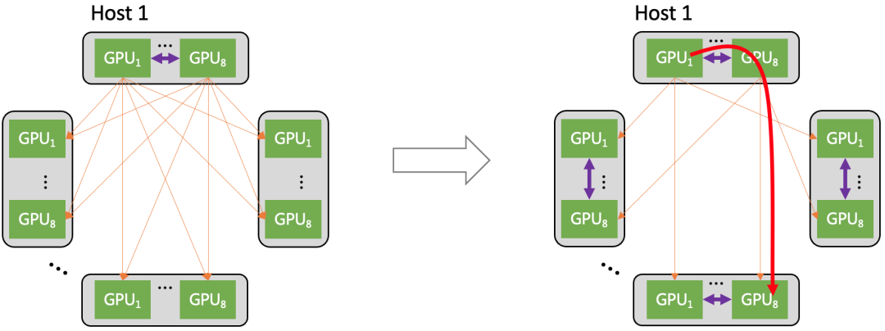

# 千卡并行策略调研

目标：从**【语言模型】LLM、【多模态】MLLM、【MoE】**三个部分探索千卡并行（基座模型训练）策略调研。主要对于其中的预训练过程中可能存在的问题以及相关解决方案进行调研（大厂实践、论文、技术报告）。调研需要全面、有条理，为接下来的千卡并行提供决策依据，少走弯路。

# 一、【语言模型】LLM @刘安岐

## 1.1 Facebook/Meta：OPT-175B

OPT: Open Pre-trained Transformer Language Models（https://arxiv.org/pdf/2205.01068）是一整套基于Transformer Decoder 的大语言模型，对 GPT-3 最大 175B 的模型做了一个复刻版。OPT-175B 的性能做到了和 GPT-3 相当，但是只需要 1/7 carbon footprint 的训练代价。OPT 团队甚至还发布了训练日志 (logbook)，详细说明了他们在什么时间段做了什么？为什么这么做？以及做出决策的背景。

### 1.1.1 硬件故障

**问题：**OPT 大模型使用了 992 块 80GB 的 A100 GPU 作训练。在训练 OPT-175B 模型时。硬件故障导致至少 35 次手动重启和100多台主机的循环。在手动重启期间，暂停训练运行，排查问题，然后加载上一个 Checkpoint 的参数继续训练。考虑到退出的主机数量和手动重启的数量之间的差异，我们估计由于硬件故障而导致的自动重启次数将超过70次。

**采取方案**：试错重复

### 1.1.2 参数

**问题**：损失差异

**采取方案**：当损失发散时，发现降低学习率并从较早的检查点重新开始可以让工作恢复并继续训练。作者首先降低学习率，然后加载更早的 Checkpoint 的参数重启训练。在训练的早期，作者还注意到将梯度裁剪从 1.0 降低到 0.3 有助于训练的稳定性。

### 1.1.3 训练策略选择

**问题**：损失差异

**采取方案**：实验性的更换训练策略，包括：切换到vanilla sgd（优化很快停滞，作者又回到了adamw）；重置动态损失标量（有助于恢复一些但不是全部的偏差）；并切换到较新版本的Megatron（这降低了激活规范的压力，提高了吞吐量）。

## 1.2 字节：MegaScale

MegaScale（https://arxiv.org/pdf/2402.15627）是一个用于在超过 10,000 个 GPU 的规模上训练大型语言模型 (LLM) 的生产系统。在12,288个GPU上训练一个175B LLM模型时，MegaScale实现了55.2%的模型FLOPs利用率（MFU），与Megatron-LM相比，MFU提高了1.34倍。

### 1.2.1 训练效率

**问题**：如何实现大规模的高训练效率

**采取方案**：并行transformer块、滑动窗口注意力机制（SWA）

**问题**：大规模高效训练经常受到批量大小限制的阻碍

**采取方案**：LAMB优化器（ layerwise adaptive large batch optimizer）。LAMB优化器已被证明可以在不影响准确性的情况下将bert的训练批量大小扩展到 64k。

### 1.2.2 3D并行性

**问题**：减少迭代时间

**采取方案**：数据并行、流水线并行、张量/序列并行（tensor/sequence）

- 数据并行：

初始的全聚集操作在每次迭代开始时预先获取，使其与数据加载操作重叠，有效地将通信时间减少了 $1/(2*vpp_{size})$。还首先启动高优先级通信，以最大限度地增加重叠。通信运算符的优先级由取决于通信结果的相应计算运算符的顺序决定。

- 流水线并行：

流水线并行特性是点对点发送/接收通信。MegaScale使用图2中提到的交错1f1b调度方法。作者解耦了send和receive，它们通常是一起实现的，并且可能会被较慢的一个阻塞。通过打破这种依赖关系，使send操作与计算重叠，如图4的左半部分所示。冷却阶段可以被视为预热阶段的逆过程，允许反向应用相同的技术。对于稳定阶段，正向和反向计算都与相邻的通信操作无关。以反向为例，如图4的右部分所示，其先前的接收用于下一个正向计算，而发送用于前一阶段的反向计算。因此，发送和接收操作可以异步启动，与计算重叠。

- 张量/序列并行：

张量并行性通常用于计算密集型操作中的权重划分，而LayerNorm和Dropout等操作则沿着序列维度进行划分，以节省gpu内存。这需要 *all-gather*和*reduce-scatter*操作，以便在GPUs上进行输入收集和输出再分配。图3a显示了并行transformer块架构中的这种通信模式。这两个通信运算符处于关键路径。为了消除这种开销，作者选择融合*all-gather*，并减少FFN路径上平行线性的散射（图3b）。由于FFN路径上的GEMM内核较大，因此可以更好地隐藏通信。作者将GEMM内核分解为小块，并通过通信流水线执行（图3c）。该策略同样适用于反向传播。

### 1.2.3 高效运算

**问题**：减少启动多内核相关的开销，优化内存访问模式

**采取方案**：数据流水线（数据预处理和加载）

- 异步数据预处理：当 GPU 工作站在每个训练步骤结束时同步梯度时，后续步骤的数据预处理就可以开始，隐藏了预处理开销。

- 消除冗余数据加载器：采用了一种基于双层树的方法，在每台机器上使用一个专用的数据加载器，将训练数据读入一块共享内存。随后，每个 GPU 工作站负责将必要的数据复制到自己的 GPU 内存中。消除冗余读取，提高数据传输效率。

### 1.2.4 容错

**问题**：软硬件故障

**采取方案**：引入稳健的训练框架（Robust Training Workflow）

如图5所示，在收到提交的训练任务后，驱动程序进程与自定义Kubernetes进行交互，以分配计算资源并为每个执行器启动相应的pod。一个执行器管理一个节点。一旦执行器完成了一系列初始化任务，它就会在每个GPU上创建训练过程，并创建一个健壮的训练守护进程，定期向驱动程序发送heartbeat。这些heartbeat封装了各种形式的信息，以实现实时异常检测和发出预警。当驱动进程检测到特定训练过程中的异常状态，或者在预定义的时间窗口内未能从执行器接收到heartbeat时，它会触发故障恢复过程。驱动程序将暂停所有进程正在进行的培训任务，并命令他们运行一系列自检诊断。诊断测试涵盖了大多数常见的硬软件故障。一旦识别出有问题的节点，驱动程序就会将要阻止的节点的ip地址以及在其上运行的pod的信息提交给Kubernetes，Kubernetes会驱逐有故障的节点，并用通过诊断测试的等量健康节点来补充集群。MegaScale还提供了一个用户界面，允许手动驱逐节点，特别是对于那些通过*训练故障排除*中的手动分析识别的节点。恢复过程完成后，驱动程序从最新检查点恢复训练。

heartbeat心跳检测：

- 包括执行器的基本信息，如ip地址、pod名称和硬件信息等。

- 报告了训练过程的当前状态，使驱动程序能够及时检测到任何明显的异常。

- 包括训练过程的stdout/stderr日志。

- 包括RDMA流量指标，作为网络利用率和效率的指标。

监控系统：

- 开发了精度达到毫秒级的监控系统，采用不同级别的监测来跟踪各种指标。

- 秒级监控通常用于评估整体健康状况，并排除常见配置对训练的影响。例如，ECN/PFC/QoS配置、链路摆动或任何其他NICs问题。

- 毫秒级监控用于确定网络是否拥塞，以及数据并行性和管道并行性的数据传输速度是否已达到其物理极限。

诊断测试（Diagnostic Tests）：

- 主机内网络测试（Intra-host network tests）：诊断主机内网络潜在瓶颈，判断RNICs是否满足硬件速度规范以及底层路由配置是否正确配置

    - 环回测试测量从所有RDMA NICs（RNICs）到各种主机内端点（包括内存节点和GPU）的环回带宽，从而能够根据端到端带宽结果推断出PICe配置中链路特定的带宽退化和不规则性

    - RNIC-to-RNIC测试检查同一主机上不同RNIC之间的链接和带宽性能

- NCCL-tests：在单个节点内的gpu之间进行了全交换（*all-to-all*）测试，以观察带宽是否与预期的基准一致。主机内通信测试通过，每个节点还将在同一ToR开关下与相邻机器进行全规约（*all-reduce*）测试，以评估节点间gpu通信

### 1.2.5 Fast Checkpointing与自愈

**问题**：检查点加载模型权重和优化器状态，确保最新检查点尽可能接近故障发生时的训练进度状态

**采取方案**：两阶段方法

- 第一阶段：每个GPU worker将其片上状态写入主机内存，然后继续训练过程。

- 第二阶段：后台进程接管，将状态从主机内存异步传输到分布式文件系统（hdfs）进行集中维护。

将操作分为两个阶段的解耦允许GPU worker在转储状态后几乎立即恢复训练，而将更耗时的写入hdf的过程卸载到一个单独的非阻塞过程中。

**问题**：瓶颈是HDFS的带宽，尤其当每个GPU worker都需要读取其相应的状态分区时

**采取方案**：提出了一种优化的数据检索策略，指定组中的单个worker从HDFS读取共享状态分区，从而线性地减少负载。然后，此worker将状态分区广播给共享相同数据的所有其他GPU worker。

### 1.2.6 训练故障排除

**问题**：概率性硬件异常

**采取方案**：基于cuda事件监视器的性能诊断、3D并行训练可视化

基于cuda事件监视器的性能诊断：基于cuda事件方法对事件进行计时，该工具提供两种可视化模式

- 使用热图从不同维度显示机器之间的时间消耗差异，如图7所示。收集跨设备的计算阶段（正向和反向）的延迟数据，并对各步骤的延迟进行平均，使用热图对聚合数据进行可视化。

- 从不同的分布式视图（数据并行性、流水线并行性、张量并行性）以跟踪格式在机器上显示事件时间线。通过将不同排名的跟踪跨度聚合到一个单一的时间线上，获得一个全面的视角，揭示了data parallel ranks之间的整体执行顺序、pipeline bubbles和同步特征。图8显示了分布式跟踪器如何可视化流水线并行性的实际执行。

3D并行训练可视化：让每个GPU worker在通信超时时记录自己正在进行的事件。这些日志用于基于3D并行设置中的逻辑拓扑构建数据依赖关系的可视化表示。

- 当选择一个特定的GPU worker时，它会显示它在逻辑拓扑中的位置、数据流的方向以及它所涉及的不同通信操作。在发生错误时，该工具可以直接访问worker的错误消息。

- 当有缺陷的GPU在执行NCCL通信操作时可能会导致阻塞。这种阻塞会挂起整个机器，导致其他依赖节点级联超时，最终导致整个训练过程瘫痪。利用了三维并行训练可视化工具，具有故障GPU的节点被挂起，不会记录任何此类信息。通过检查可视化中的日志和数据流，可以很容易地确定这些有问题的节点。

## 1.3 阿里：HPN

针对大规模LLM训练的新型数据中心网络HPN（https://ennanzhai.github.io/pub/sigcomm24-hpn.pdf），1个segment支持1024+64GPUs，1个pod支持15360GPUs，全量支持245760GPUs。

### 1.3.1 LLM训练对数据中心网络设计的挑战

**问题1**：流量模式

LLM训练的流量模式与普通云计算在以下方面有所不同：(1) 低熵和(2) 突发流量。

LLM训练生成很少，但周期性突发的流量导致网络的低熵和高利用率。突发流量可以直接达到网卡容量。突发的高流量意味着LLM训练需要极高的网络带宽。因此，需要确保用于LLM训练的网络能够提供足够的物理带宽以应对突发流量，避免数据包丢失。此外，流量的同步性表明LLM训练对长尾延迟特别敏感。任何长尾流都会阻碍整个集合通信操作的完成，使所有并行组暂停。

**问题2**：对故障的更高敏感性，特别是单点故障

LLM训练是一个同步过程，所有GPU协同完成一系列迭代，任何GPU中的异常都可能延迟或崩溃整个训练过程。这意味着LLM训练对故障比传统云计算更为敏感。作者发现，对LLM训练影响最大的故障是机架顶部交换机（ToR）相关的单点故障，这可能影响大量的GPU。此外，LLM训练中的故障成本很高。作者的生产统计数据显示，LLM训练中的故障成本是普通云计算故障成本的20倍。

### 1.3.2 HPN概述

HPN包括前端网络和后端网络。后端网络主要支持训练过程中的流量，而前端网络则承载其他流量（如管理、推理和存储的流量）。对于LLM训练，主要关注HPN的后端网络。

前端网络是每台主机一个单独网卡的两个端口连接分别连接到前端两个ToR交换机。将存储流量与训练隔离开来，并兼容支持模型推理。

后端训练网络架构：

- **服务器内**:GPU通过NVlink互联，每台主机配备了9个NIC，每个NIC具有2×200Gbps。这九个NIC中的一个（即图7中的NIC0）连接到前端网络，而其余八个NIC连接到后端网络，在LLM训练期间承载流量。这八个NIC中的每一个都服务于一个专用GPU，每个NIC两个端口。

- **Tier 1 Segment**（即服务器和ToR交换机连接层）：每个GPU对应的NIC两个端口分别连接到不同的ToR交换机。每个Segment包含16个ToR交换机136个服务器超1000个GPU。

- **Tier 2 Pod**（将多个Segment层连接到一起）：1个Pod包含15个Segment，约15k个GPU。1个Pod被划分为两个Plane，防止ECMP流量冲突。

- **Core层**(将多个Pod连接到一起):支持8*15K GPU卡的集群。

### 1.3.3 **Segment层**

- 容错

    - 每个GPU对应的NIC两个端口分别连接到不同的ToR交换机。每个NIC的两个端口分别连接到不同的ToR，形成双ToR设计。

    - 容错能力提升

- 通信优化

    - 充分利用51.2Tbps单芯片，1k多GPU卡通信，只经过一个交换机。

    - 每个ToR交换机保留了8个备用的下行端口。作者利用这些端口连接备用主机，以便在主机端故障（包括CPU、内存、GPU、PCIe、NVLINK和NIC）发生时快速更换主机。

- Rail优化网络

    - 同一Rail中的NIC通过同一组双ToR交换机连接。不同Rail中的NIC可以通过主机内部和主机间的组合转发进行通信。

    - 大幅减少了转发延迟，显著减少了通过聚合层的流量，降低了网络负载不均衡的可能性。

### 1.3.4 Pod层

- 克服负载失衡

    - 双平面：消除Pod中的哈希极化。如图12b所示，在双平面中，每个双ToR设置中的ToR交换机被分类为两个独立的组。通过这种设计，一旦流量进入ToR中的一个上行链路，其在Pod内的转发路径就完全确定了。因此，在Pod中消除了哈希极化。

    - 优化路径选择：HPN在集体通信库中有效地获取精确的不交叉等路径，并在其上平衡负载。

- 双平面设计带来了另一个重要的好处：它将ToR与汇聚之间的链路连接数量减半，使得汇聚交换机能够在同一Pod中支持更多的段。因此，Tier2网络的规模扩大了一倍。

**HPN中的关键机制**：

## 1.4 Meta：Llama3

### 1.4.1 Llama 3 405B预训练中断分析

Llama 3 405B预训练期间54天内意外中断的根本原因分类。约**78%**的意外中断归因于已确认或疑似的硬件问题。

### 1.4.2 训练基础设施

- **Compute计算：**Llama 3 405B使用Meta的Grand Teton AI服务器平台，在高达16K H100 GPU上训练，每个GPU以700W TDP和80GB HBM3运行。每台服务器配备8个GPU和2个CPU。在服务器内，八个GPU通过NVLink连接。训练作业使用Meta的全球规模训练调度器MAST进行调度。

- **Storage存储**：Llama 3预训练构建存储结构使用了Meta的通用分布式文件系统Tectonic。

    - 挑战：支持在短时间内使存储结构饱和的高突发性检查点写入

    - 检查点保存每个GPU的模型状态，每个GPU从1 MB到4 GB不等，用于恢复和调试

- **Network网络**：Llama 3 405B使用基于Arista 7800和Minipack2开放计算项目4 OCP机架交换机的融合以太网（RoCE）结构上的RDMA。Llama 3系列中的较小型号使用Nvidia Quantum2 Infiniband fabric进行训练。RoCE和Infiniband集群都利用了GPU之间的400 Gbps互连。

    - **网络拓扑**：基于RoCE的AI集群由24K GPUs组成，通过三层Clos网络连接。在底层，每个机架承载16个GPU，这些GPU分布在两台服务器之间，并通过一个Minipack2机架顶部（ToR）交换机连接。在中间层，192个这样的机架通过集群交换机连接，形成一个由3072个GPU组成的吊舱，具有完全平分带宽，确保没有超额订阅。在顶层，同一数据中心内的八个这样的Pod通过聚合交换机连接，形成一个24K GPU的集群。

    - **负载均衡**：①集体库在两个GPU之间创建了16个网络流，减少了每个流的流量，并为负载平衡提供了更多的流。②增强型ECMP（E-ECMP）协议通过对数据包RoCE报头中的其他字段进行哈希运算，有效地平衡了不同网络路径上的这16个流。

    - **拥堵控制**：使用深度缓冲开关来适应由集体通信模式引起的瞬态拥塞和缓冲，这有助于限制服务器速度慢造成的持续拥塞和网络背压的影响。通过E-ECMP实现更好的负载平衡可以显著降低拥塞的可能性。

构建了**24K GPU**集群

### 1.4.3 大规模 GPU 集群 RoCE 网络

用于分布式 AI 训练的 RoCE 网络，各种网络组件的设计：

- 网络拓扑：为了支持几代 AI 硬件平台的快速演进，将基于 GPU 的训练分离到自己的后向网络中。

- 路由：训练工作负载本身就会导致负载不均衡和流量突发，因此作者部署了多次迭代的路由方案，以实现接近最优的流量分布。

- 传输：解释了最初如何尝试使用 DCQCN 运行拥塞管理，不过后来放弃了 DCQCN，转而利用集合通信库来管理拥塞。

- 运维：作者分享了大规模 AI 网络运维的经验，包括开发的工具和故障排查示例。

**网络拓扑**：

为分布式培训建立了一个专用的后端网络，使模型能够独立于数据中心网络的其他部分进行演进、运行和扩展。

- The separation：

    - 训练集群依赖于两个独立的网络：前端（FE）网络用于数据摄取、检查点和日志记录等任务，后端（BE）网络用于训练，如下图所示。

    - FE 的网络层次包括机架交换机 (RSW)、结构交换机 (FSW) 以及更高的层次，其中包含存储仓库，为 GPU 提供训练工作负载所需的输入数据。

    - 后端结构采用 RoCEv2 协议，将 RDMA 服务封装为 UDP 数据包，以便在网络上传输。以无阻塞架构连接所有 RDMA 网卡，在集群中的任意两个 GPU 之间提供高带宽、低延迟和无损传输。

- AI Zone：

    - 作者为AI racks设计了两级 Clos 拓扑，称为AI Zone。作为叶交换机的机架培训交换机（RTSW）使用铜质 DAC 电缆为机架内的 GPU 提供扩展连接。由模块化集群训练交换机（CTSW）组成的脊柱层为集群中的所有机架提供扩展连接。CTSW 在机箱端口上静态划分了深度缓冲区。RTSW 通过单模光纤和 400G 可插拔收发器连接到 CTSW。

    - 作者设计了一个聚合器训练交换机（ATSW）层，用于连接数据中心大楼中的 CTSW，从而将 RoCE 领域扩展到单个 AI Zone之外。

    - 为了缓解cross-AI Zone traffic的性能瓶颈，作者增强了训练任务调度程序，以便在将训练节点划分到 AI Zones时找到 “minimum cut”，减少cross-AI Zone traffic，从而缩短集体完成时间。调度程序通过学习 GPU 服务器在逻辑拓扑中的位置来推荐等级分配。

**路由**：

compute power 和 network topology 结构的扩展导致了如何有效平衡和路由海量训练流量的问题。AI训练工作负载有几个具有挑战性的特点：

- Low entropy: 与传统的数据中心工作负载相比，AI工作负载的流量数量和多样性要小得多，流量模式通常是重复的、可预测的。

- Burstiness:在时间维度上，流量通常以毫秒为时间粒度，表现出 “on and of”'的性质。

- Elephant flows: 每次突发时，每个流量的强度都可能达到网卡的线路速率。

- 队列对扩展（Queue pair scaling）

    - 为了通过集合库中的队列对 （QP） 扩展软件功能来增加分层集合的流数，作者将交换机配置为执行增强型 ECMP （E-ECMP），以使用交换机 ASIC 的 UDF 功能对 RoCE 数据包的目标 QP 字段进行额外哈希处理。

    - 与没有 QP 扩展的基线 ECMP 相比， E-ECMP 和 QP 扩展显示 AllReduce 集合的性能提高了 40%。

    - 以循环方式将每条消息发布到不同的队列，通过增加分层集合（如 AllReduce）的网络流，增强 ECMP 可扩展性。

**拥塞控制**：

- 接收器驱动的流量准入（Receiver-driven traffic admission）

    - 作者设计了集体库和 RoCE 传输，以强制执行接收器驱动的流量准入以获得更好的性能。

    - 生产训练集群中的 GPU 到 GPU 通信架构主要通过 NCCL 集合库使用两阶段复制和接收器发起的通信。每个 GPU 的高带宽内存 （HBM） 都维护了多个通道，用于分块集体消息的并行传输。

    - 发送方 GPU 线程首先将数据从计算缓冲区复制到可用的通道缓冲区。发送方 CPU 代理线程收到接收方发送的 CTS 报文后，才能发出 RDMA 写入请求，该报文包含了 size 和内存信息。

    - 然后，接收器的 GPU 线程将通道缓冲区内容复制到目标计算缓冲区。

    - 最后，两侧的 CPU 代理线程回收通道缓冲区，一旦通道缓冲区准备就绪，接收方 CPU 代理就会发送另一个 CTS 数据包。

    - 有效地利用此机制作为接收器驱动的流量准入，以限制网络上的动态流量，尤其是在拥塞开始累积时。

    - 但是，设置正确配置具有挑战性：

        - 由于具有并发计算操作的 GPU 线程上的资源争用，通道数受到限制;

        - 与 Infiniband 相比，设置通道缓冲区大小需要在拥塞传播和带宽利用率不足之间取得更谨慎的平衡，因为 RoCE 的流控制更粗粒度，并且终端主机可能很慢。

    - 采取了两个步骤来提高性能：

        - 实验性地确定了各种训练作业大小和集体类型的通道数量和通道缓冲区大小的正确参数设置。

        - 在交换机上为 CTS 数据包实施了高优先级排队，以加快通知速度并缓解潜在的带宽不足。

# 二、【多模态】MLLM @唐振

为研究多模态训练与计算需求（千卡）的关系，调研多模态网络训练可分为两类：

1. **基座模型权重+视觉编码器（目前主流）**：参考PaLM-E的调研过程，与之训练过程类似的有：基座模型Qwen-7B，视觉编码器使用Openclip ViT-bigG的多模态模型Qwen-VL；基座模型InternLM2-20B，视觉编码器采用InternViT-6B的多模态模型InternVL；基座模型MiniCPM-2.4B，结合SigLIP-SoViT-400m/14的多模态模型MiniCPM-V等。

2. **从零开始训练**：主要调研谷歌公司的GeMini和Meta公司的Chameleon多模态模型。谷歌使用TPUv5e和TPUv4搭建的数据中心进行训练，而Meta则是拥有两代万卡GPU集群。

## 2.1 PaLM-E

### 2.1.1 什么是PaLM-E

PaLM-E，全称Pathways Language Model with Embodied，是一种多模态视觉语言模型，PaLM-E的基座模型选择是谷歌发布的预训练模型 PaLM，然后接上机器人，也就是具身（Embodied）。它的强大之处在于，能利用视觉数据来增强其语言处理能力。PaLM-E是一个仅有解码器的LLM，在给定前缀（prefix）或提示（prompt）下，能够以自回归方式生成文本补全。其训练数据为包含视觉、连续状态估计和文本输入编码的多模式语句。

论文中的模型大小有（基座模型+视觉转换模型）：

- 8B LLM + 4BViT = PaLM-E-12B

- 62B LLM + 22B ViT = PaLM-E-84B

- 540B LLM + 22B ViT = PaLM-E-562B

PaLM-E不仅能够引导机器人执行复杂任务，还可以生成图像描述文本。它展现了前所未有的灵活性与适应能力，特别是在提升人机交互方面具有重要意义。更值得注意的是，研究人员通过在多个机器人和视觉语言任务的不同组合上进行训练，证明了几种从视觉语言转移到具身决策的方法。这使得机器人在规划任务时能够更加高效地使用数据。

### 2.1.2 架构

PaLM-E模型的基座选择的是谷歌发布的预训练模型 PaLM，该模型是 Decoder 模型。模型 PaLM-E 的输入有三种类型：文本、图像、连续状态（来自于机器人的各种传感器的观测结果）。在输入模型时文本、图像、连续状态这三部分的顺序是不固定的，有可能交替出现。

输入：

- 文本数据：文本token

- 图像数据：ViT编码，或ViT+TL，或者OSRT（针对网格划分导致对象划分错误而提出的一种方式）等

- 传感器模态的连续状态输入：和文本输入类似，但是在映射内部向量空间时候，有差异。

TokenLearner简介：由于图像类数据维度是2维的，如果直接使用像素点进行编码的话一张512*512的图片编码之后形成的token序列就变得非常长，而transformer架构对长序列的运算速度非常慢。针对这个问题，Google提出了TokenLearner方法，该方法能够自适应的学习输入图片或视频中的重要区域，然后主要对这些重要区域进行tokenize，以达到只需要少量的token就足以表征所有的视觉特征的目的。

输出：

- 文本数据：文本token

- 传感器模态的连续输出：为现实世界中的顺序决策做出更为基础的推断（其实属于文本数据的一种）

### 2.1.3 训练的基础设施（千卡训练基座模型PaLM）

由于多模态PaLM-E的基座模型是谷歌发布的预训练模型 PaLM，而PaLM的训练和评估代码库是基于JAX和T5X，并且所有模型都在TPU v4 Pods上进行训练。**PaLM 540B在两个通过数据中心网络（DCN）连接的TPU v4 Pod上训练（每个Pod中使用3072个TPU v4芯片，连接到768台主机上），使用模型和数据并行的组合，将训练有效的扩展到6144个芯片**。每个TPU v4 Pod都包含一个完整的模型参数副本，每个权重张量使用12路模型并行和256路完全分片的数据并行分割在3072个芯片上。在前向传递过程中，权重全部聚集在数据平行轴上，每层保存一个完全分片的激活张量。在反向传递过程中，其余的激活被重新物质化，因为与其他重新计算的选择相比，在更大的批次规模下，这将导致更高的训练吞吐量。

使用Pathways系统执行**双向的pod级数据并行化**：具体而言，一个Python client将一半的训练批次分配给每个pod，每个pod执行前向和反向计算，使用标准的pod内数据和模型并行计算梯度。然后，pod与远程pod传输梯度（在其一半的批次上计算），最后，每个pod累积本地和远程梯度，并行应用参数更新，以获得下一个时间步长的位数相同的参数。

**跨Pod梯度传输网络传输问题**：双向Pod级数据并行只需要在两个pod的相应主机之间进行1:1的传输，通过谷歌数据中心网络连接的，由于在每个核心完成梯度计算后才开始传输，这导致了一个非常突发性的工作负载，所有的主机在同一时间通过数据中心-网络链接传输他们的梯度。特别是，每对主机在每个训练步骤中交换大约1.3GB的梯度，相当于所有主机的总爆发量为81Tbps。其**解决思路**是：通过对PathWays网络堆栈的精心设计，使DCN链路得到最佳利用。（比如，为了减轻拥堵的影响，梯度传输的数据被分解成较小的块，并通过多个较小的流在一组不同的DCN链路上进行路由。）

最终，在训练期间，相对于单个Pod的吞吐量，实现了约1.95倍的训练吞吐量提升。

### 2.1.4 训练的过程（千卡训练基座模型PaLM）

1. **训练过程出现不稳定现象**：训练过程中虽然使用了梯度修剪，但是还是出现大约20次损失出现峰值现象，而且这些尖峰发生在非常不规则的时间间隔内。作者实验后表示：尖峰的出现只是由于特定的数据批次与特定的模型参数状态的结合所导致的，因此通过修改批次数据顺序，得以解决。

2. **训练效率**：使用MFU作为评价指标，PaLM 540B的MFU在没有self-attention的情况下为45.7%，在有self-attention的情况下为46.2%。

## 2.2 Gemini

### 2.2.1 什么是Gemini

Gemini是由谷歌开发的一系列高效能多模态模型。这些模型通过联合训练，覆盖了图像、音频、视频和文本数据。Gemini1.0具有三种不同规模：Ultra、Pro和Nano，分别针对不同的任务复杂度和应用需求设计。

- Ultra：可以在各种高度复杂的任务中提供SOTA性能，包括推理和多模态任务。它还可以在TPU加速器上有效地进行大规模服务；

- Pro：是谷歌在成本和延迟方面进行性能优化的模型，可在各种任务中提供良好的性能，并表现出强大的推理性能和广泛的多模态能力；

- Nano：谷歌最高效的模型，专为在设备上运行而设计。谷歌训练了两个版本的 Nano，参数分别为 1.8B (Nano-1) 和 3.25B (Nano-2)，分别针对低内存和高内存设备，采用 4 位量化进行部署，并提供一流的性能。

这些模型在一系列内外部基准测试中展现了出色的性能，覆盖了语言、编程、推理和多模态任务。Gemini除了在大规模语言建模方面取得显著成果外，还在图像理解、音频处理、视频理解等领域的表现也非常出色。此外，Gemini的发展还得益于序列模型、基于神经网络的深度学习和机器学习分布式系统等领域的长期研究。

### 2.2.2 架构

Gemini模型的架构基于Transformer解码器，并通过架构和模型优化的改进，使其能够在大规模上进行稳定训练并优化在谷歌张量处理单元上的推理性能。这些模型能够处理高达32k的上下文长度，并且采用了多查询注意力等。Gemini模型被训练以处理与各种音频和视觉输入交织的文本输入，例如自然图像、图表、截图、PDF和视频，并能产生文本和图像输出。

输入：

- 文字数据：文本token

- 音频信号：USM模型作为提取器，能够直接处理16kHz的音频信号

- 图像数据：论文中未介绍，现存包含VIT中Patch输入或者Object Centric Representations或者Object Scene Representation Transformer (OSRT)等

- 视频数据：将视频作为一系列的帧序列，并将其作为图像序列处理为可变的输入分辨率数据（就是每一帧作为一个图像，然后考虑patch）

输出：

- 文字数据

- 图像数据

### 2.2.3 训练的基础设施（千卡训练）

谷歌使用 TPUv5e 和 TPUv4 训练 Gemini 模型，具体取决于模型的大小和配置。尤其对于大型的Gemini Ultra模型，谷歌使用了跨多个数据中心的大量 TPUv4 加速器，这在规模上超越了之前的PaLM-2模型，规模显著增加，带来了新的基础设施挑战。

针对大规模TPU集群，谷歌做了以下优化：

1. **硬件故障**方面，这种规模的集群扩展，大规模硬件加速器中的机器故障是一个很普遍的现象（很容易坏）。TPUv4加速器被部署在包含4096个芯片的“SuperPod”中，每个芯片连接到一个专用光开关，可以在大约 10 秒内将 4x4x4 芯片cube动态重新配置为任意 3D 环面拓扑。对于 Gemini Ultra，谷歌为每个超级容器保留少量cube，以实现热备用和滚动维护。

2. **通讯策略**：谷歌主要通过高速芯片间互连进行通信，但为了处理Gemini Ultra的大规模数据和计算需求，谷歌使用其集群内和集群间网络在多个数据中心中组合 SuperPod。好处：支持高速的芯片间通信，适应了同步训练范式（能在SuperPods内部利用模型并行性，，在SuperPods之间实现数据并行性）

3. Jax和Pathways采用了“单一控制器”编程模型，**允许开发者通过单一Python进程管理整个训练过程，显著简化了AI开发流程**。此外，论文中还提到了XLA编译器中的GSPMD分区器和MegaScale XLA编译器的应用。GSPMD分区器负责划分训练过程中的计算任务，而MegaScale XLA编译器则确保集群操作与计算过程的高度重叠，并减少了训练步骤时间的波动。

4. 针对**传统的保存周期性权重检查点**在大规模训练环境中效率较低的问题，Gemini采用了冗余的内存中**模型状态副本**策略，以便在发生硬件故障时能够迅速恢复。该操作**使得最大规模训练作业的整体吞吐量从85%增加到97%**。

5. Gemini在大规模训练中遇到**静默数据腐败（Silent Data Corruption，SDC）**事件，虽然SDC事件罕见，但由于项目的大规模性，这些事件对训练的影响变得频繁。Gemini项目采用了包括利用确定性重放技术隔离错误计算，以及在闲置和热备用机器上部署主动SDC扫描器等措施，加上完全确定性的基础设施，使团队能够在开发过程中迅速识别并解决根本原因，从而**确保了训练的稳定性**。

SDC通常是由于硬件上的微小电流波动导致计算错误，如计算失误导致出现1+1=3的现象。随着芯片变得更加先进和紧凑，这一问题变得更加突出。虽然大多数由制造缺陷引起的错误会被供应商筛选出来，但仍有部分错误可能不被硬件错误检测系统发现，因此需要依赖于检测软件来预防和解决这些问题。

## 2.3 Chameleon

### 2.3.1 什么是Chameleon

Chameleon 是由 Meta 的 FAIR 团队开发的一款新型早期融合、基于令牌的混合模态模型家族。该模型能够理解和生成任意顺序的图像和文本。Chameleon 从初始阶段就采用统一架构，通过端到端的方式在所有模态的交错混合数据上进行训练，即图像、文本和代码。这种统一的方法使用完全基于令牌的表示方式，通过将图像量化为离散的令牌，类似于文本中的单词，使得可以应用相同的变换器架构来处理图像和文本令牌序列，无需单独的图像/文本编码器或特定领域的解码器。

### 2.3.2 架构

Chameleon 的架构类似LLaMa-2，并且继续使用 RMSNorm进行归一化，使用 SwiGLU激活函数以及旋转位置嵌入（RoPE）。

输入：

- 文本数据：训练了一个新的 BPE 分词器

- 图像数据：基于Gafni等人开发了一个新的图像分词器，能将 512×512 像素的图像编码成来自大小为 8192 的码本的 1024 个离散令牌。

输出：

- 文本数据

- 图像数据：通过解码器对输出的image词向量进行解码

### 2.3.3 训练的基础设施

Chameleon训练过程使用的是Meta公司的Research Super Cluster (**RSC**)：

关于Meta公司的GPU集群，现阶段存在的有两代集群版本。**算力方面**，集群内都是使用Meta公司开发的开放GPU硬件平台`Grand Teton`。具体如下：

- 第一代GPU集群，即RSC集群，由1.6w个A100 GPU组成。

- 第二代GPU集群，由2.4w（具体数目是24576）个H100 GPU组成。其中，Meta公司自研了大部分硬件，软件以及网络fabric。

**网络方面**：

在**网络方面**，两个集群使用不同的网络方案，但都是400Gbps的接入速度，能够运行大型生成式AI任务，并且到目前为止，未遇到网络瓶颈：

- 第一代方案：400Gbps RoCE+自研交换机。

- 第二代方案：400Gbps InfiniBand（使用 NVIDIA Quantum2 InfiniBand fabric）。

基于 RoCE 网络，曾经使用过的网络结构包括2014年的[fabric](https://engineering.fb.com/2014/11/14/production-engineering/introducing-data-center-fabric-the-next-generation-facebook-data-center-network/)，2019年的[第一代 Minipack](https://engineering.fb.com/2019/03/14/data-center-engineering/f16-minipack/)，而现阶段使用的交换机类型是：

- 置顶交换机（`TOR`）[Wedge400](https://engineering.fb.com/2021/11/09/data-center-engineering/ocp-summit-2021/) / [Arista 7800](https://www.arista.com/assets/data/pdf/Datasheets/7800R3-Data-Sheet.pdf) 

- 模块化交换机 [Minipack2](https://engineering.fb.com/2021/11/09/data-center-engineering/ocp-summit-2021/)。

使用RoCE网络进行节点间通信传输，训练集群依赖两个独立的网络:**前端网络(FE)用于数据摄取、检查点和日志记录等任务，后端网络(BE)用于模型训练**。训练机架连接到数据中心网络的FE和BE。

- 前端网络：FE包括机架交换机(RSW)、结构交换机(FSW)等，其中包含存储仓库，为 GPU 提供训练工作负载所需的输入数据。

- 后端网络：BE是一个专门的结构，它以无阻塞的架构连接所有 RDMA 网卡，无论它们的物理位置如何，在集群中的任意两个 GPU 之间提供高带宽、低延迟和无损传输。

对于后端网络BE，采用**两级Clos拓扑结构**（图中的AI Zone，以LLaMA3训练来说，其单个AI Zone有3072个GPU）+**DC-Scale和拓扑感知调度**：

- 为机器节点（绿色节点）服务的交换机RTSW，与GPU机器间使用DCA电缆连接

- 骨干层由模块化集群训练交换机（CTSW）组成。RTSW通过单模光纤和400G可插拔收发器连接到CTSW。

- 单个AI Zone可能无法满足LLM需求，因此在此基础上设计了聚合器训练交换机层（ATSW），能够将多个AI Zone间进行互连。并且使用ECMP来平衡网络流量等操作优化AI Zone之间的通讯。

网络**路由方面**：针对LLM训练任务中几个挑战性的特征：

1. **低熵**：与传统的数据中心相比，AI的流量模式通常是重复的和可预测的

2. **突发性**：在时间上，流量通常在毫秒的时间粒度上，表现出"开和关"的特性

3. **大象流**：对于每次流量的爆发，其流量强度能够达到NIC的线路速率。

RoCE在路由方面考虑使用**中心化流量工程（Tfaffic Engineering，TE）**控制器来解决这些问题，TE 控制器根据实时工作负载和拓扑动态优化路由。并提出未来解决路由问题的一种Flowlet Switching解决思路。

网络**拥塞控制方面**，针对负载均衡效率低下而导致的持续拥塞问题，通过集合通信库的接收端驱动流量准入解决：为了缓解 400G 及更高速度的拥塞，设计了集合通信库和 RoCE 传输，强制以接收端驱动流量准入，以实现更好的性能。如下图所示，生产环境中使用的 GPU-to-GPU 通信架构主要是 NCCL，其使用两阶段复制和接收端发起通信。每个 GPU 的 HBM 维护多个 Channel，用于并行传输分块消息。

1. 发送端 GPU 线程首先将数据从计算缓冲区复制到可用 Channel 缓冲区。

2. 发送端 CPU proxy 线程只有在接收到接收端的 CTS（clear-to-send） 数据包后，才能发送 RDMA 写入请求，该数据包包含大小和内存信息。

3. 接收端的 GPU 线程然后将 Channel 缓冲区的内容复制到对应的 Compute 缓冲区。

4. 最后，双方 CPU proxy 线程回收 Channel 缓冲区，接收端 CPU proxy 线程在 Channel 缓冲区准备好后发送另一个 CTS 数据包。

除此之外，作者对 RTSW 使用具有共享和浅缓冲区架构的交换机，CTSW 使用具有深缓冲区架构的交换机。利用每个 Port 的大缓冲区有助于吸收任何短暂的拥塞，并确保 Port 能应对背压（back pressure），从而减少 Port 之间的 HoL 阻塞。

**存储方面：**

1. 对于GPU集群训练数据存储以及checkpoints的存储设计使用**FUSE + Tectonic**方案：上层是一个Meta公司自研的Linux用户空间文件系统FUSE，底层是Meta针对闪存（Flash media）自研的一款名为Tectonic的分布式存储方案。该方案**使得数千个 GPU 能同步保存和加载checkpoints，同时还提供了EB级存储系统所需的灵活性和吞吐量**。

2. Meta公司与Hammerspace合作开发了一个**并行网络文件系统**（Parallel NFS），它能使工程师对数千个 GPU 进行交互式调试。

3. **存储硬件上**使用大容量 SSD + 定制每个机柜的服务器数量。由于Tectonic分布式系统和并行网络文件系统都是基于 [YV3 Sierra Point server platform](https://www.opencompute.org/documents/e1s-expansion-2ou-1s-server-design-specification-pdf)，因此考虑使用最高容量的`E1.S SSD`。

Tectonic集群由四大模块组成，分别是：

1. 元数据服务Metadata Store，Metadata store 将所有 filesystem 的 metadata 细粒度分区以简化操作、提升扩展性。不同 layer 的 metadata 逻辑上是分开的，各自再 hash 分区。

2. 数据服务Chunk Store：ChunkStore负责存储Block的每个分片，Chunk Store 是面向 chunk 的分布式对象存储，chunk组成block，block再组成文件。Chunk Store在结构上是平坦的，可线性扩容。并且不感知上层block或者文件语义，与metadata解耦。

3. 大量微服务组成的Background Services：负责维护不同 layer 间的一致性、修复数据丢失、平衡节点间的数据分布、处理 rack 空间满等问题，以及生成 filesystem 的各种统计信息。

4. 客户端Client Library：可以直接与 metadata server 和 chunk store 通信，以 chunk 为粒度读写数据，这也是 Tectonic 支持的最小粒度。将Metadata Store中的目录、文件、Block和ChunkStore中的Chunk串联起来，对外提供文件系统的语义。

Tectonic文件系统的所有元数据都通过Metadata Store维护，Metadata Store是一个可真正意义上水平扩展的元数据服务，文件系统的元数据被分为了三层：

- Name layer：主要存储目录和目录元素之间的映射关系。

- File layer：主要存储文件和Block之间的映射关系。

- Block layer：主要存储Block和chunk之间的映射关系。

这三层元数据都以K-V的形式存储到key-value store中，这个key-value store是一个理论上可以无限扩展的分布式kv系统。Tectonic使用了ZippyDB作为Metadata Store之下的key-value store。

**其他**：

除此之外，Meta公司在**集群方面的优化**有：

1. 改进`job scheduler`，使其具备网络拓扑感知能力，使得延迟降低+转发到更上层网络（交换机）的流量减少。

2. 结合Nvidia的 NCCL，优化了网络路由策略，以实现最优的网络利用率。

3. 与训练框架和模型团队密切合作，不断改进基础设施。例如：

    1. 支持 NVIDIA H100 GPU 的新数据类型 FP8，对训练性能大有帮助；

    2. 并行技术优化；

    3. 存储优化；

4. 意识到**可调试性**（debuggability）是大规模训练的主要挑战之一。 在大规模情况下，定位到哪个 GPU 卡顿导致的整个训练作业变慢是很困难的。 为此，Meta正在构建 desync debug 或分布式 flight recorder 之类的工具，跟踪分布式训练的过程，以更快识别问题。

5. 继续开发基础 AI 框架 `PyTorch`，使其能支持数万甚至数十万 GPU 进行训练。 

**Meta公司未来规划：预计到 2024 年底，Meta AI 基础设施建设将拥有 35w 张 H100 GPU。**

# 三、【MoE】 @唐振

目前MoE模型的**训练过程中**，大多数厂商选择的是基于已有模型进行训练，像 Mistral AI 的 Mixtral 系列模型、千问的 MoE 模型 Qwen1.5-MoE-A2.7B、面壁智能的 MiniCPM-MoE-8x2B 等。从论文来看，幻方发布的DeepSeek 选择的是从头开始训练，然而GPU个数未知，并且使用了一种自研的HAI-LLM的训练框架。除此之外，幻方拥有1w个英伟达A100芯片（不确定是不是训练DeepSeek的）。因此，MoE千卡并行主要考虑从以下几个层面进行调研：

1. MoE介绍和几个有代表性的MoE发展历程介绍

2. 目前最新的MoE网络模型介绍

3. 目前能够训练MoE的平台建设

## 3.1 MoE的介绍和发展（Transformer时代的一些经典MoE）

MoE（Mixture of Experts，混合专家模型）是一种基于门控机制的稀疏模型结构的神经网络，通过将模型分解成多个 "专家"(Experts) 来提高模型的效率和性能。每个专家专注于处理输入数据的不同部分，模型通过一个路由器模块来决定哪些专家应被激活。现阶段MoE主要由两种类型的网络组成:**(1)专家网络和(2)门控网络。**

1. 专家网络:专家网络是专有模型，每个模型都经过训练，在数据的一个子集中表现出色。MoE的理念是拥有多名优势互补的专家，确保对问题空间的全面覆盖。

2. 门控网络:**门控网络，或者叫路由网络，是MOE中最复杂的部分，因为它涉及到控制输入到那个专家模型，所以门控网络也有很多个设计方案。**门控网络根据专家的输出与当前输入的相关性动态调整其权重，确保定制响应。

MoE架构的最大优势在于横向地拓展模型。MoE架构可以在目前已经非常巨大的模型上继续增加模型参数量，使模型的能力继续得到增强，同时，在推理时，可以通过Router只路由到其中的少部分Experts上，显著降低推理成本。而MoE面临的最大问题在于训练困难，训练的时候需要极力避免所有请求都被导向一两个Experts，导致其他Experts不被充分训练。

### 3.1.1 **MoE基础发展**

最开始，论文《Adaptive mixtures of local experts》提出使用多个模型（即专家，expert）去学习，使用一个门控网络（Gating Network）来决定每个数据应该被哪个模型去训练，这样可以减轻不同类型样本之间的干扰。

在2010年到2015年之间，两个独立研究领域研究成果：**将 MoE 嵌入到多层网络中的某一层**+**基于输入 token 动态激活或停用网络组件**的方法为后续MoE发展做出贡献。

2017年，《OUTRAGEOUSLY LARGE NEURAL NETWORKS: THE SPARSELY-GATED MIXTURE-OF-EXPERTS LAYER》论述了**Sparsely-Gated（不是所有expert都会起作用，而是极少数的expert会被使用来进行推理。）+token-level（一个句子中不同的token使用不同的专家）**。此外，论文中提出一种带噪声TopK门控（Noisy Top-K Gating）机制和软约束方法平衡专家利用率。当时，将该MoE层应用于137B 的 LSTM，在保持极高规模的同时实现了快速的推理速度。在牺牲极少的计算效率的情况下，把模型规模提升1000多倍。属于是真正意义上将MoE应用到超大参数规模模型之上。

### 3.1.2 GShard：MoE在Transformer模型中的首次应用

论文地址：[GShard: Scaling Giant Models with Conditional Computation and Automatic Sharding](https://arxiv.org/abs/2006.16668)

2021年，谷歌公司的《GSHARD: SCALING GIANT MODELS WITH CONDI TIONAL COMPUTATION AND AUTOMATIC SHARDING》提出的使用 GShard 实现 MoE 跨设备分片的方法。据论文所说，其是第一个将 MoE 的思想拓展到 Transformer 上的工作。具体做法是**在Transformer编码器和解码器中的每个 FFN 层替换为使用 Top-2 门控的 MoE 层。**这种架构对于大规模计算非常有效：当扩展到多个设备时，MoE 层在不同设备间共享，而其他所有层则在每个设备上复制。下图展示了 MoE 层是如何在多个设备上进行分片的。GShard MoE 层中的专家网络（experts）被分布在不同的设备上。每个专家网络负责处理一部分输入数据，并且每个 token 根据门控机制的输出被分配到一个或两个专家网络中。这样，整个 MoE 层的计算被分散到了多个设备上，每个设备负责处理一部分计算任务。

实现MoE 跨设备分片的**关键技术是模型并行化（model parallelism）和数据并行化（data parallelism）的结合**。除此之外，为了保持负载平衡和训练效率，GShard在 Sparsely-Gated MoE中辅助loss基础上提出**随机路由+专家容量**的变化。除此之外还有其他设计：

- **随机路由**：在 Top-2 设置中，GShard 始终选择排名最高的专家，但第二个专家是根据其权重比例随机选择的。

- **专家容量**：设定一个阈值，定义一个专家能处理多少 token。如果两个专家的容量都达到上限，token 就会溢出，并通过残差连接传递到下一层，或在某些情况下被完全丢弃。专家容量是 MoE 中最重要的概念之一。为什么需要专家容量呢？因为所有张量的形状在编译时是静态确定的，我们无法提前知道多少 token 会分配给每个专家，因此需要一个固定的容量因子，强制每个expert处理的tokens数量在一定范围内。

- **Auxiliary loss**：也是为了缓解“赢者通吃”问题。

- **Local group dispatching**：通过把一个batch内所有的tokens分组，来实现并行化计算。

在推理过程中，只有部分专家被激活。同时，有些计算过程是共享的。因此**可以使用相当于 12B Dense 模型的计算资源来运行一个包含 8 个专家的 47B 模型。**如果采用 Top-2 门控，模型会使用高达 14B 的参数。但是，由于自注意力操作 (专家间共享) 的存在，实际上模型运行时使用的参数数量是 12B。

**GShard 引入了专家并行化（expert parallelism），可根据专家能力的负载平衡限制来调度切分后的局部 token，从而实现并行的门控和专家计算。该范式已经成为促进 MoE 模型高效扩展的基础策略。**

### 3.1.3 Switch Transformers：尽可能将Transformer模型的参数量做大

论文地址：[Switch Transformers: Scaling to Trillion Parameter Models with Simple and Efficient Sparsity](https://arxiv.org/abs/2101.03961)

2022年，谷歌为了**缓解MoE复杂性、通信成本以及训练和微调过程的不稳定性等问题**，在论文《Switch Transformers: Scaling to Trillion Parameter Models  with Simple and E cient Sparsity》提出Switch Transformer，在Huggingface上发布了1.6万亿参数的MoE网络，拥有2048个专家。**以T5模型作为模版，将T5模型中的feed forward network（FFN）更换成MoE架构，并简化了MoE的routing算法**，将模型的参数量大幅度提升，最高甚至达到1571B。论文中提到的涉及原则是**尽可能地把 Transformer 模型的参数量做大！**虽然模型权重很大，但是通过Sparse routing的改进，每轮迭代只会触发部分Expert的计算，而每个token也只会路由给一个Expert，所以对算力的需求并没有随着参数量的增加而大幅增长，使得这个模型更加容易训练。

一些设计：

1. **Switch Routing**：Switch Transformer 的门控网络每次只路由到1个expert。这样简化了MoE路由算法，路由计算减少了，每个专家的批量可以减少，设计了直观的改进模型，降低了通信和计算成本。

2. Switch Transformers 也对**专家容量**这个概念进行了研究：作者建议的容量是将批次中的令牌数量均匀分配到各个专家，即促使每个expert拿到近似均匀分布的样本，如果使用大于 1 的容量因子，为令牌分配不完全平衡时提供了一个缓冲。增加容量因子会导致更高的设备间通信成本，因此这是一个需要考虑的权衡。特别值得注意的是，Switch Transformers 在低容量因子 (例如 1 至 1.25) 下表现出色。

3. 为了促使每个expert拿到近似均匀分布的样本，引入负载均衡损失**Load Balancing Loss**

4. 使用数据并行，模型并行以及**专家并行（EP）**来高效训练。

除此之外，根据经验提出的一些训练技巧：

1. **Selective precision**：在大型稀疏模型中使用随机精度，当专家和门控网络都使用 `bfloat16` 精度训练时，出现了不稳定的训练现象。这种不稳定性特别是由路由计算引起的，因为路由涉及指数函数等操作，这些操作对精度要求较高。因此，为了保持计算的稳定性和精确性，保持更高的精度是重要的。为了减轻不稳定性，路由过程也使用了全精度。

2. 使用更小的参数初始化来保证稳定性

3. **Dropout 正则化**：对Switch Tranformer这种大型稀疏模型做正则，在**非专家层使用较小的 Dropout 率**可以缓解过拟合。

4. No-Token-Left-Behind机制：反复地把第一次路由的所有溢出的token重新进行路由

### 3.1.4 ST-MoE

论文地址：[ST-MoE: Designing Stable and Transferable Sparse Expert Models](https://arxiv.org/abs/2202.08906)

2022年2月，Google Brain团队延续其Switch Transformer的工作，设计了ST-MoE（Stable and Transferable）模型，主要的**目的是为了解决训练过程中的不稳定性以及微调过程中的质量不确定性**，其主要贡献如下：

1. MoE模型训练过程中存在不稳定的问题探究，在一些训练过程中（某些随机种子），模型的Loss会在中途飙升导致训练失败。MoE模型虽然在pre-train上表现良好（语言模型的perplexity能超越稠密模型），但是在一些fine-tune的具体任务上表现不佳，与其pre-train上的优异表现不匹配。

2. 文章提出了一种新的loss，**router z-loss**。该损失函数在保持了模型性能的同时显著提升了训练的稳定性。这种损失机制通过惩罚门控网络输入的较大 `logits` 来起作用，目的是促使数值的绝对大小保持较小，这样可以有效减少计算中的舍入误差。

3. 对影响 MoE 模型训练质量-稳定性 trade-off 的一些稳定性技术做了大规模的研究。设计 Pareto Efficient 的稀疏模型的架构、路由和模型设计的原则：

    1. 推荐使用 top-2 routing，Capacity Factor设置为1.25。

    2. 在评测过程中可以改变 Capacity Factor，以适应新的内存/计算要求。

    3. 在每个稀疏层之前或之后使用 Dense FFN 可以提高模型质量。

4. 跨专家层跟踪 token 路由决策的定性分析。

5. 一个 269B 稀疏模型（**S**table**T**ransferable**M**ixture-**o**f-**E**xperts 或 ST-MoE-32B），它在各种自然语言基准测试中实现了最先进的性能。

但是有个问题，在ST-MoE中，模型是Encoder-Decoder架构，用masked words prediction进行训练，并在Google TPU上部署；现在可能更多是Decoder-only架构，纯自回归任务训练，并在N卡上跑。其中的一些经验总结可能不太合适。

### 3.1.5 Tutel：自适应并行性切换的MoE训练系统

Tutel论文地址：[Tutel: Adaptive Mixture-of-Experts at Scale](https://arxiv.org/abs/2206.03382)

以往的MoE 分布式训练系统往往采用静态执行方式（Tensor 的 Shape 在执行中不能改变），**导致经 Token 路由之后可能存在 Token 丢弃或者 Padding 无效计算的问题，导致计算效率比较低**。在论文《Tutel: Adaptive Mixture-of-Experts at Scal》中，提出了 Tutel，**是一种针对 MoE 的高度可扩展堆栈设计和实现的训练系统，其具备动态自适应并行和流水并行（PS：非流水线并行）机制，可以在每次迭代过程中动态切换并行策略，而不产生任何额外的切换开销**。Tutel 中作者设计了一个统一布局来分发 MoE 模型参数和输入数据，并利用其实现可切换并行性和动态流水并行，而无需引入**数学不等价**操作或者** Tensor 迁移开销**，可以在运行时以**零成本实现自适应并行/流水并行优化**。基于这一关键设计，Tutel 实现了各种 MoE 加速技术，包括 Flexible All-to-All、二维分层（2DH）All-to-All，以及快速编码、解码等。综合所有技术。论文表示**Tutel 可以高效地运行基于Swin Transformer V2 构建的SwinV2-MoE**。

**技术细节**：

- **自适应并行性切换**：Tutel能够根据输入数据的特征动态地调整数据并行（DP）、模型并行（MP）和专家并行（EP）的组合方式，以最小化训练时间和计算成本。文中，作者通过分析所有并行方法的复杂性，以将它们缩小到最小子集（作者**只考虑最重要的通信复杂性，所有 GPU 都执行相同的计算，计算复杂度相同，通信复杂性直接决定了一种并行方法相比其他方法的效率**）

- **并行策略优化**：通过实验和理论分析，Tutel能够找到不同输入数据分布下的最优并行策略组合。由于调整并行策略涉及parameter和activation的全局通信，代价很大，因此**通过Adaptive pipelining做到不产生任何额外的切换开销地动态切换并行策略**。其在Static Pipelining的基础上，调优Pipeline切分个数和All-to-all算法以达到让通信开销显著减低的目的。最后，通过遍历在特定模型下，不同expert capacity下各种参数的性能，根据该参数来选择最佳的Parallelism+Pipelining。

- **实验结果**：Tutel在多个大规模MoE模型训练任务上展示了显著的性能提升和训练效率。

### 3.1.6 MegaBlocks：打破动态路由限制的MoE架构

MegaBlocks论文地址：[MegaBlocks: Efficient Sparse Training with Mixture-of-Experts](https://arxiv.org/abs/2211.15841)

github： https://github.com/databricks/megablocks

MegaBlocks是斯坦福大学、微软及谷歌联合发布的在 GPU 上高效训练 MoE 的系统。论文针对MoE 的 Router 负载不均衡会导致需要删除 Token 或者 Padding 填充问题，采用**块稀疏操作对 MoE 计算进行了重新调整，并开发了新的块稀疏 GPU Kernel，以高效处理 MoE 中存在的动态性。MegaBlocks 主要针对的是单个GPU上包含多个专家的场景**。MegaBlocks通过魔改矩阵乘法BLAS和NCCL all-to-all通信机制，解决了MoE架构中的动态路由限制问题。它允许在每次迭代中灵活调整专家容量和并行策略。

**技术细节**：

- **矩阵乘法优化**：MegaBlocks对矩阵乘法进行了优化，以减少计算过程中的冗余和重复计算。

- **通信机制优化**：通过改进NCCL all-to-all通信机制，MegaBlocks实现了更高效的数据传输和并行计算。

- **实验结果**：MegaBlocks在多个大规模MoE模型训练任务上取得了更好的训练效率和模型性能。

## 3.2 最新的MoE模型介绍（2024）

### 3.2.1 Mixtral 8x7B（2024）

论文: https://arxiv.org/abs/2401.04088

官方博客: https://mistral.ai/news/mixtral-of-experts/

github：https://github.com/mistralai/mistral-inference

Mixtral-8x7B是在Mistral 7B模型结构上，引入MoE结构。相对于Llama模型，Mixtral 8x7B模型将FFN替换为MoE FFN。Mixtral 8x7B 是一种仅包含解码器的，一种具有开放权重的高质量稀疏专家模型 （SMoE） 混合的模型，**每层由 8 个前馈块（即专家）组成**。对于每个 token，在每一层，路由器网络都会选择两名专家来处理当前状态并组合他们的输出。尽管每个 token 只看到两个专家，但所选的专家在每个时间步上都可能不同。因此，每个 token 可以访问 47B 参数，但在推理过程中仅使用 13B 激活参数。Mixtral-8x7B-32K MoE模型主要由32个相同的MoE transformer block组成。MoE transformer block与普通的transformer block的最大差别在于其FFN层替换为了**MoE FFN**层。

图片地址：https://github.com/open-compass/MixtralKit/blob/main/README_zh-CN.md

### 3.2.2 OpenMoE（2024）

论文地址：[OpenMoE: An Early Effort on Open Mixture-of-Experts Language Models](https://arxiv.org/abs/2402.01739)

github地址：[GitHub - XueFuzhao/OpenMoE:](https://github.com/XueFuzhao/OpenMoE)

Open-MoE构建一系列完全开源且可重现的仅解码器 MoE LLM，参数范围从 650M 到 34B，训练的tokens多达 1T 以上。基于 MoE 的 LLM 可以提供比密集 LLM 更有利的成本效益权衡，凸显了未来 LLM 开发的潜在有效性。其中，OpenMoE模型包括：

- OpenMoE-Base/16E：用于调试的0.65B小模型参数，16E表示每个MoE层有16位专家。

- OpenMoE-8B/32E：共8B参数，每个token激活约2B参数。32个专家

- OpenMoE-8B/32E-Chat：

- OpenMoE-34B/32E：共34B参数，每个token激活6B参数。

论文中的OpenMoE 的**训练设置**大致如下，其模型性能在同等开销下可以取得显著优秀的效果：

- 数据集：使用了公开文本数据RedPajama和代码数据Stack Dedup的混合。

- **Tokenizer：使用了umT5**，相比LLaMA的Tokenizer，能更好的支持各国语言。

- 训练目标：在 PrefixLM（下一词预测）的基础上，增加了UL2中 SpanCorruption 的训练目标，即重建被随机遮挡的 token。

- 模型架构：在 ST-MoE 基础上的 Decoder-only 架构，路由选择两个专家。OpenMoE-34B/32E 中，每四层 Transformer 层后会插入一个 MoE 层。应用了负载均衡损失和 Z-Loss。

- 其它设计：参考LLaMA使用了RoPE，SwiGLU和2k的上下文长度。

除此之外，在论文中深入分析OpenMoE 模型中的路由机制，并阐述了三个有趣的路由（Routing）现象：

1. **与上下文无关的专业化（Context-Independent Specialization）**：MoE 倾向于简单地根据相似的 token 级语义对 token 进行聚类，这意味着无论上下文如何，某个 token 更有可能被路由到某个专家；

2. **早期路由学习（Early Routing Learning）**：token ID 路由专业化在预训练的早期就已建立，并且基本保持不变，因此 token 在整个训练过程中始终由相同的专家处理；

3. **序列尾部丢弃现象显著（Drop-towards-the-End）**：由于每个专家都有固定的最大容量，如果专家已经达到容量上限，则序列中较晚出现的 token 面临更高的被丢弃风险。这个问题在指令调整数据集中更为严重。与预训练数据相比，这些数据集通常表现出领域差距，这意味着在早期预训练期间建立和巩固的平衡 token 分配策略在指令调整场景中可能不那么有效。这令人担忧，因为指令数据在将 LLM 部署到实际应用中起着重要作用。

### 3.2.3 阿里的Qwen1.5-32B模型（2024）

官方博客: https://qwenlm.github.io/zh/blog/qwen-moe/
github: https://github.com/QwenLM/Qwen2
huggingface 权重: https://huggingface.co/Qwen/Qwen1.5-MoE-A2.7B-Chat

- **架构重点：** 类似于 DeepSeek-MoE，Qwen1.5-MoE 也尝试了 Finegrained experts，整个模型总共设计了 64 个 expert；而后在 routing 机制种也尝试了Shared Expert Isolation ：采用了4个总是被激活的共享expert和每次只激活其中4个的60个routing expert。

- **训练：**官方博客种表示：从零开始训练MoE模型可能效率低下，且难以提升至预期的最优性能水平。因此，Qwen1.5-MoE 首先利用已有的Qwen-1.8B，将其改造为Q wen1.5-MoE-A2.7B。此外，在初始化阶段引入随机性可以显著加快收敛速度，并在整个预训练过程中带来更好的整体性能表现。

- **模型推理：**模型在推理时，总的激活参数为 2.7B。

### 3.2.4 DeepSeek-V2（2024）

论文：https://arxiv.org/pdf/2405.04434

github: https://github.com/deepseek-ai/DeepSeek-V2

幻方发布的DeepSeek-V2模型，DeepSeek-V2 文中推出了 DeepSeek-V2-Lite 与 DeepSeek-V2 一小一大 2个版本。DeepSeek-V2 整个模型有 236B 参数，其中推理激活参数为 21B。

推理速度上：DeepSeek V2 首先对模型进行了 KV Cache 量化，将参数转换为了 FP8。在单机 8卡 H800 的节点上部署 DeepSeek-V2，可以达到约 50K tokens/秒 的吞吐量

模型特点：

- 针对注意力，设计了 **MLA（Multi-head Latent Attention）**，它利用低秩键值联合压缩来消除推理时键值缓存的瓶颈，从而支持高效的推理。

- 对于前馈网络 （FFN），采用了 **DeepSeekMoE** 架构，这是一种高性能的 MoE 架构，能够以更低的成本训练更强大的模型。

以下展示了2个shared experts，160个routed experts（每次激活六个）

### 3.2.5 最新开源OLMoE（2024）

论文地址：[OLMoE: Open Mixture-of-Experts Language Models](https://arxiv.org/abs/2409.02060)

github地址：[GitHub - allenai/OLMoE: OLMoE: Open Mixture-of-Experts Language Models](https://github.com/allenai/OLMoE)

OLMoE是一个Encode-Only架构，由多个transformer层组成。密集模型中的前馈网络（FFN）被MoE模块替代，MoE模块由多个较小的FFN模块（称为专家）组成，每个输入标记只激活其中的一个子集。

关键设计：

- 专家粒度：使用64个小专家，每层激活8个。

- 路由算法：采用无dropout的标记选择路由。

- 辅助损失：使用负载平衡损失（LLB）和路由器z损失（LRZ）来优化模型的训练。

在**预训练过程中**，使用多种下游任务进行评估，包括MMLU、ARC-C、BoolQ等。适应训练过程中，使用指令调优（SFT）和偏好调优（DPO）来提升模型性能。训练过程中，OLMOE-1B-7B从头开始训练，在训练的退火阶段，先重新打乱整个数据集，然后线性衰减学习率至0。使用AdamW优化器，混合精度训练，初始化为截断正态分布，学习率设置为5.0E-4，训练5T标记。适应训练过程中，SFT使用BF16全局批量大小为128，DPO使用RMSProp优化器，批量大小为32。

## 3.3 训练MoE平台介绍

### 3.3.1 腾讯混元Turbo训练平台

混元Turbo采用了全新的异构MoE结构，通过较多的专家数和较小激活量设计，在模型整体参数量依然保持万亿级规模前提下，通过整体算法升级和训练推理框架加速的端对端优化，模型效果相比上代混元Pro有较大提升。腾讯混元大模型全面建立在腾讯全面自研的Angel机器学习平台和强大的算力基础设施之上。介绍如下：

**机器学习框架方面**：

Angle架构：

1. **Parameter Server层**：提供通用的`参数服务器`服务，负责模型的分布存储，通讯同步和协调计算，并通过PSAgent提供`PS Service`

2. **Worker层**： 基于Angel自身模型设计的分布式运行节点，自动读取并划分数据，局部训练出模型增量，通过`PS Client`和`PS Server`通信，完成模型训练和预测。一个Worker包含一个或者多个Task，Task是Angel计算单元，这样设计的原因是可以让Task共享Worker的许多公共资源。

3. **Model层**： 这是一层虚拟抽象层，并非真实存在的物理层。关于Model的Push和Pull，各种异步控制，模型分区路由，自定义函数……是连通Worker和PSServer的桥梁。

除此外， 在图中未显示的比较重要的类：

- **Client**：Angel任务运行的发起者

- **Master**：Angel任务运行的守护者

**网络方面，**算力集群的网络底座使用**星脉网络通信：**

在**网络硬件**方面，星脉网络自研白盒交换机，这是一种软硬件解耦的开放网络设备，采用四层解耦体系，包括接入、转发、路由、管控系统；腾讯云还自研了网络操作系统，包括网络OS与网管平台，构建了互联底座，实现自动化部署和配置。**在软件方面，腾讯云自研的TiTa网络协议，能够实时监测并调整网络拥塞，**TiTa网络协议能够提升40%的带宽负载，还能提供低延时无损网络，实现高负载下的0丢包，使集群通信效率达90%以上。

星脉网络在极致高性能上，**采用1.6T超带宽接入、多轨道聚合流量网络架构、异构网络自适应通信优化技术、定制加速通信库，构建了1.6T ETH RDMA网络，在通信性能上有大幅度提升**。在高可用保障上，通过**全自动化部署配置核查**，覆盖服务器NUMA、PCIE、NVSwitch、NCCL、网卡、交换机数百个配置项，并通过实时Service Telemetry技术监控业务系统运行效率，保障大规模集群部署，实现性能实时监控与故障告警。具体来说：

星脉网络主要特点有：采用无阻塞Fat-Tree拓扑，单集群规模支持2K GPU，超EFLOPS（FP16）的集群算力；可灵活扩展网络规模，最大支持32K GPU计算集群；计算网络平面配备8张RoCE网卡，提供1.6Tbps的超高带宽接入，为AI大模型训练这种带宽敏感的计算业务带来10倍以上的通信性能提升。

**多轨道流量聚合架构**：将不同服务器上位于相同位置的网卡，都归属于同一ToR switch；不同位置的网卡，归属于不同的ToR switch。由于每个服务器有8张计算平面网卡，这样整个计算网络平面从物理上划分为8个独立并行的轨道平面。在多轨道网络架构中，AI训练产生的通信需求（AllReduce、All-to-All等）可以用多个轨道并行传输加速，并且大部分流量都聚合在轨道内传输（只经过一级ToR switch），小部分流量才会跨轨道传输（需要经过二级switch），大幅减轻了大规模下的网络通信压力。

**异构网络自适应通信**：在大规模训练集群架构中，GPU之间的通信实际上由**机间网络（网卡+交换机）与机内网络（NVLink/NVSwitch网络、PCIe总线网络）**构成，星脉网络将机间、机内两种网络同时利用起来，达成异构网络之间的联合通信优化，使大规模All-to-All通信在业务典型message size下的传输性能得以提升。

**定制加速通信库：**腾讯高性能集合通信库TCCL（Tencent Collective Communication Library）定制适配星脉网络硬件平台，使得在AllReduce/AllGather/ReduceScatter等常用通信模式下带来性能上的加速。

**自动化验收测试**，其中包含软件和硬件的测试：

1. 端网基础环境校验：通过端网状态数据以及周边建设系统的信息采集，在硬件上判断PCIe，光模块，连线等是否正确。

2. RDMA基础测试：通过运行Perftest，并进行数据采集分析，判断网卡性能是否达到预期。

3. 通讯库性能测试：通过运行NCCL/TCCL test，并进行数据采集分析，判断集合通信性能是否达到预期。

4. 模型和可靠性测试：运行典型模型训练，判断业务模型性能是否达到预期；通过设计端侧故障模拟、网络内故障模拟以及交换机配置错误等三类故障来判断业务可用性是否达到预期。

### 3.3.2 阿里MoE训练平台

在阿里云PAI灵骏分布式集群上运行的基于Megatron的MoE训练工具能够训练Mixtral8*7B模型，该工具由三部分组成：

1. PAI平台：DSW是为AI开发者量身定制的云端机器学习交互式开发IDE，DLC则提供灵活、稳定、易用和极致性能的多机多卡深度学习训练环境。

2. PAI-Megatron-Patch：各类开源大模型和Megatron训练加速引擎之间的“桥梁”，为用户提供用Megatron训练开源大模型的易用性以及LLM算法场景定制化的灵活性。（[GitHub - alibaba/Pai-Megatron-Patch: The official repo of Pai-Megatron-Patch for LLM \& VLM large sca](https://github.com/alibaba/Pai-Megatron-Patch.git)）

3. NVIDIA Megatron-Core：（[GitHub - NVIDIA/Megatron-LM: Ongoing research training transformer models at scale](https://github.com/NVIDIA/Megatron-LM)）

阿里云PAI灵骏分布式集群介绍如下：

- 基础资源层（计算资源\&基础设施）：

    - 基础设施包括CPU、GPU、高速RDMA网络以及容器服务ACK等。

    - 计算资源包括云原生资源（灵骏计算资源和通用计算资源）和大数据引擎资源（MaxCompute和Flink）。

- 平台工具层（灵骏智算服务\&人工智能框架）：

    - 人工智能框架：包括Alink、TensorFlow、PyTorch、Megatron、DeepSpeed及RLHF等智能框架，用于执行分布式计算任务。

    - 优化与加速框架：包括DatasetAcc数据集加速、TorchAcc训练加速、EPL并行训练框架、Blade推理加速、AIMaster自动容错训练以及EasyCkpt秒级异步训练快照等。

    - 按照机器学习全流程，PAI分别提供了数据准备、模型开发与训练以及模型部署阶段的产品：

        1. 数据准备：PAI提供了标注服务，支持在多种场景下进行数据标注和数据集管理。

        2. 模型开发与训练：PAI提供了可视化建模（Designer）、交互式建模（DSW）、分布式训练（DLC）以及特征平台（FeatureStore），满足不同的建模需求。

        3. 模型部署：PAI提供了模型在线服务（EAS），帮助您快速地将模型部署为服务。

- 应用层（模型服务）：支持模型服务包括ModelScope魔搭社区、PAI-DashScope、第三方MaaS平台和百炼。

- 业务层（场景化解决方案）：PAI应用于自动驾驶、科研智算、金融风控、智能推荐等各个领域。阿里巴巴集团内部的搜索系统、推荐系统及金融服务系统等，均依赖于PAI进行数据挖掘。
